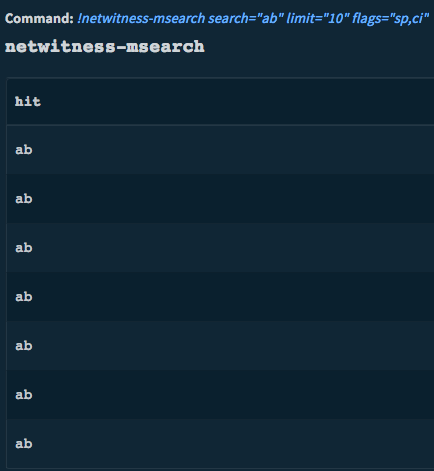
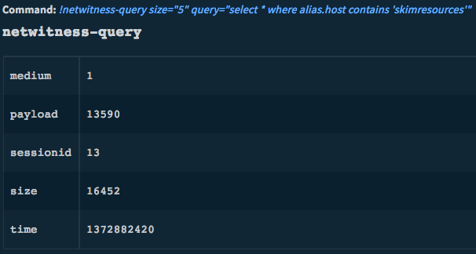
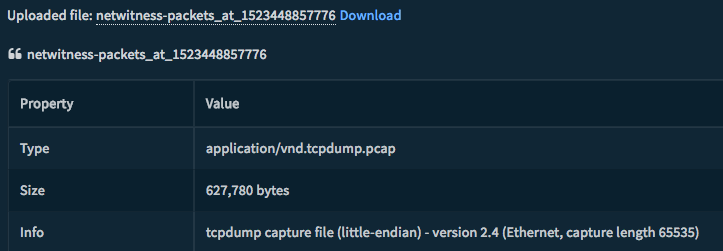
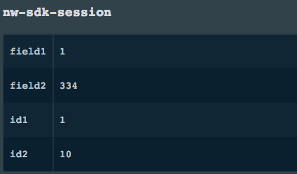
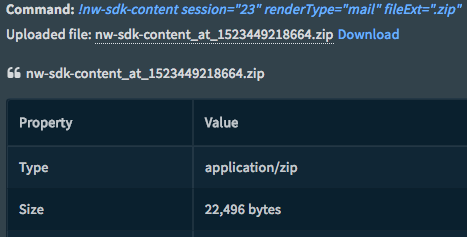
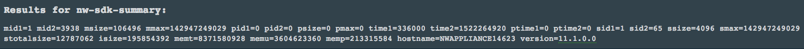
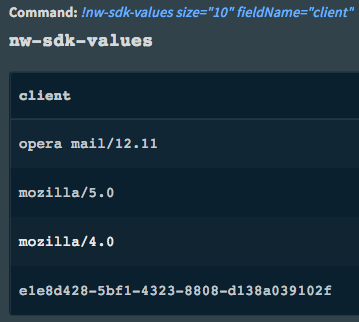
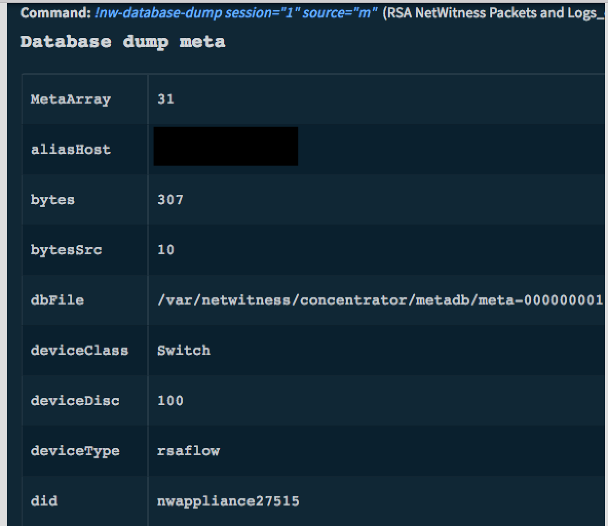

<!-- HTML_DOC -->
<h2>Overview</h2>

Use the RSA NetWitness Logs and Packets integration to collect and analyze network data.

This API enables additional low-level functionality for managing various system components accessible on Cortex XSOAR. Each command has several options that analyze and query NetWitness P&amp;L packets, sessions, and logs. You can use the results as tasks in playbooks for automated analysis, or view them in the War Room.

This integration was integrated and tested with NetWitness v11.1.0.0.

<h2>Use Cases</h2>
<ul>
<li>Collect network data in real time for analysis.</li>
<li>Dump information for backup and duplication.</li>
</ul>

<h2>Prerequisites</h2>

Verify that you satisfy these requirements in RSA.

<ul>
<li>Obtain RSA NetWitness credentials.</li>
<li>Enable the RESTful API that ships with RSA Security Analytics.
<ul>
<li>Configure <code>rest/config/enabled</code> to on. This is the default.</li>
<li>The default port for communication is the default port + 100 (for example, 50105 for a Concentrator). You can change the port by setting the <code>/rest/config/port</code> parameter. SSL is controlled by the setting in <code>/sys/config/ssl</code>.</li>
</ul>
</li>
</ul>

<h2>Configure RSA NetWitness Logs and Packets on Cortex XSOAR</h2>
<ol>
<li>Navigate to <strong>Settings </strong>&gt; <strong>Integrations </strong>&gt; <strong>Servers &amp; Services.</strong>
</li>
<li>Search for RSA NetWitness Packets and Logs.</li>
<li>Click <strong>Add instance</strong> to create and configure a new integration. 
<ul>
<li>
<strong>Name</strong>: a textual name for the integration instance.</li>
<li>
<strong>Appliance IP</strong>/<strong>Hostname</strong>
</li>
<li>
<strong>Appliance Port:</strong> Logs(50102), Packets(50104), Concentrator (50105), Broker (50103)</li>
<li>
<strong>Credentials:</strong> NetWitness user credentials</li>
<li>
<strong>Secure (over HTTPS)</strong> - wheter to send requests over SSL</li>
<li><strong>Use system proxy settings</strong></li>
<li><strong>Expiration time</strong></li>
</ul>
</li>
<li>Click <strong>Test</strong> to validate the URLs, token, and connection.</li>
</ol>

<h2>Commands</h2>

You can execute these commands from the Cortex XSOAR CLI, as part of an automation, or in a playbook. After you successfully execute a command, a DBot message appears in the War Room with the command details.

<ol>
<li><a href="#h_43812108861529412371473">Search pattern matches: netwitness-msearch</a></li>
<li><a href="#h_481137833691529412381792">Search: netwitness-search</a></li>
<li><a href="#h_6679255791291529412390790">Query: netwitness-query</a></li>
<li><a href="#h_5067498991901529412399986">Stream packets: netwitness-packets</a></li>
<li><a href="#h_8700184822501529412408968">Get meta ID range: nw-sdk-session</a></li>
<li><a href="#h_5257788533091529412417936">Get packet content: nw-sdk-content</a></li>
<li><a href="#h_1272381413671529412427675">Get summary: nw-sdk-summary</a></li>
<li><a href="#h_6082900294241529412438868">Get value count: nw-sdk-values</a></li>
<li><a href="#h_2458732204801529412449371">Dump information: nw-database-dump</a></li>
</ol>

<h3 id="h_43812108861529412371473">Search pattern matches</h3>

Search for pattern matches in multiple sessions or packets.

<h5>Base Command</h5>

<code>netwitness-msearch</code>

<h5>Input</h5>
<table style="height: 156px; width: 750px;" border="6" cellpadding="2">
<tbody>
<tr>
<td style="width: 97px;"><strong>Parameter</strong></td>
<td style="width: 61px;"><strong>Type</strong></td>
<td style="width: 508px;"><strong>Description</strong></td>
</tr>
<tr>
<td style="width: 97px;">sessions</td>
<td style="width: 61px;">string</td>
<td style="width: 508px;">Search within these session ID ranges</td>
</tr>
<tr>
<td style="width: 97px;">packets</td>
<td style="width: 61px;">string</td>
<td style="width: 508px;">Search within these packet ID ranges</td>
</tr>
<tr>
<td style="width: 97px;">search</td>
<td style="width: 61px;">string</td>
<td style="width: 508px;">

String to search for. Can be a simple string or a query. For regular expressions, change the word “keyword” to “regex”.

Example: "select hit, pretext, posttext where keyword=’netwitness’ sp ci ds". sp = Search Packets ci = Case Insensitive ds = Decode Sessions (for example, convert email attachments before searching)

</td>
</tr>
<tr>
<td style="width: 97px;">where</td>
<td style="width: 61px;">string</td>
<td style="width: 508px;">

Filter criteria for which sessions to search

</td>
</tr>
<tr>
<td style="width: 97px;">limit</td>
<td style="width: 61px;">uint64</td>
<td style="width: 508px;">Maximum number of sessions to search in this instance</td>
</tr>
<tr>
<td style="width: 97px;">flags</td>
<td style="width: 61px;">string</td>
<td style="width: 508px;">

Comma-separated list of one or more flag values.

Example: regex, sp, sm, si, ci, pre, post, ds

</td>
</tr>
<tr>
<td style="width: 97px;">concentratorIP</td>
<td style="width: 61px;">integer</td>
<td style="width: 508px;">

Use the instance that is mapped to this concentrator IP

</td>
</tr>
<tr>
<td style="width: 97px;">concentratorPort</td>
<td style="width: 61px;">integer</td>
<td style="width: 508px;">

Port to use with concentratorIP. 50105 (SSL/NON-SSL) for concentrator, 50103 (SSL/NON-SSL) for broker.

</td>
</tr>
<tr>
<td style="width: 97px;">useSSL</td>
<td style="width: 61px;">boolean</td>
<td style="width: 508px;">

Send request in HTTPS instead of HTTP. By default the parameter is set to True but if your appliance is not configured to use SSL you can change it here.

</td>
</tr>
</tbody>
</table>

 

<h5>Context Data</h5>
<table style="height: 43px; width: 750px;" border="6" cellpadding="2">
<tbody>
<tr>
<td style="width: 282px;"><strong>Path</strong></td>
<td style="width: 394px;"><strong>Description</strong></td>
</tr>
<tr>
<td style="width: 282px;">NetWitness.SearchHits.hit</td>
<td style="width: 394px;">All matching search results in NetWitness</td>
</tr>
</tbody>
</table>

 

<h5>Command Example</h5>

<code>!netwitness-msearch search="ab" limit="10" flags="sp,ci"</code>

<h5>Raw Output</h5>
<pre>[  
   {  
      "flags":1074200578,
      "results":{  
         "fields":[  
            {  
               "count":0,
               "flags":0,
               "format":65,
               "group":1,
               "id1":1,
               "id2":1,
               "type":"hit",
               "value":"ab"
            }
         ],
         "id1":1,
         "id2":1
      }
   },
   {  
      "flags":1074200578,
      "results":{  
         "fields":[  
            {  
               "count":0,
               "flags":0,
               "format":65,
               "group":2,
               "id1":2,
               "id2":2,
               "type":"hit",
               "value":"ab"
            }
         ],
         "id1":2,
         "id2":2
      }
   },
   {  
      "flags":1074200578,
      "results":{  
         "fields":[  
            {  
               "count":0,
               "flags":0,
               "format":65,
               "group":10,
               "id1":10,
               "id2":10,
               "type":"hit",
               "value":"ab"
            }
         ],
         "id1":1,
         "id2":1
      }
   },
   {  
      "flags":1074200578,
      "results":{  
         "fields":[  
            {  
               "count":0,
               "flags":0,
               "format":65,
               "group":3,
               "id1":3,
               "id2":3,
               "type":"hit",
               "value":"ab"
            }
         ],
         "id1":3,
         "id2":3
      }
   },
   {  
      "flags":1074200578,
      "results":{  
         "fields":[  
            {  
               "count":0,
               "flags":0,
               "format":65,
               "group":4,
               "id1":4,
               "id2":4,
               "type":"hit",
               "value":"ab"
            }
         ],
         "id1":4,
         "id2":4
      }
   },
   {  
      "flags":1074200578,
      "results":{  
         "fields":[  
            {  
               "count":0,
               "flags":0,
               "format":65,
               "group":7,
               "id1":7,
               "id2":7,
               "type":"hit",
               "value":"ab"
            }
         ],
         "id1":7,
         "id2":7
      }
   },
   {  
      "flags":1074200578,
      "results":{  
         "fields":[  
            {  
               "count":0,
               "flags":0,
               "format":65,
               "group":8,
               "id1":8,
               "id2":8,
               "type":"hit",
               "value":"ab"
            }
         ],
         "id1":8,
         "id2":8
      }
   },
   {  
      "flags":1074200577,
      "results":{  
         "fields":[  

         ],
         "id1":11,
         "id2":10
      }
   }
]
</pre>
<h5>War Room Output</h5>

<h3 id="h_481137833691529412381792">Search</h3>

Deprecated. See <a href="#h_43812108861529412371473">Search Pattern Matches.</a>

<h5>Base Command</h5>

<code>netwitness-search</code>

<h5>Input</h5>
<table style="height: 156px; width: 750px;" border="6" cellpadding="2">
<tbody>
<tr>
<td style="width: 97px;"><strong>Parameter</strong></td>
<td style="width: 61px;"><strong>Type</strong></td>
<td style="width: 448px;"><strong>Description</strong></td>
</tr>
<tr>
<td style="width: 97px;">sessions</td>
<td style="width: 61px;">string</td>
<td style="width: 448px;">Search within these session ID ranges</td>
</tr>
<tr>
<td style="width: 97px;">size</td>
<td style="width: 61px;">

uint32

</td>
<td style="width: 448px;">

Maximum number of entries to return (range: 1-1677721)

</td>
</tr>
<tr>
<td style="width: 97px;">search</td>
<td style="width: 61px;">string</td>
<td style="width: 448px;">

String to search for

</td>
</tr>
<tr>
<td style="width: 97px;">concentratorIP</td>
<td style="width: 61px;">string</td>
<td style="width: 448px;">

Use the instance that is mapped to this concentrator IP

</td>
</tr>
<tr>
<td style="width: 97px;">concentratorPort</td>
<td style="width: 61px;">uint32 </td>
<td style="width: 448px;">

Port to use with concentratorIP. 50105 (SSL/NON-SSL) for concentrator, 50103 (SSL/NON-SSL) for broker.

</td>
</tr>
<tr>
<td style="width: 97px;">useSSL</td>
<td style="width: 61px;">boolean</td>
<td style="width: 508px;">

Send request in HTTPS instead of HTTP. By default the parameter is set to True but if your appliance is not configured to use SSL you can change it here.

</td>
</tr>
</tbody>
</table>

 

<h5>Context Data</h5>
<table style="height: 43px; width: 750px;" border="6" cellpadding="2">
<tbody>
<tr>
<td style="width: 281px;"><strong>Path</strong></td>
<td style="width: 395px;"><strong>Description</strong></td>
</tr>
<tr>
<td style="width: 281px;">NetWitness.SearchHits</td>
<td style="width: 395px;">All matching search results in NetWitness</td>
</tr>
</tbody>
</table>

 

<h3 id="h_6679255791291529412390790">Query</h3>

Performs a query against the meta database.

<h5>Base Command</h5>

<code>netwitness-query</code>

<h5>Input</h5>
<table style="height: 156px; width: 750px;" border="6" cellpadding="2">
<tbody>
<tr>
<td style="width: 97px;"><strong>Parameter</strong></td>
<td style="width: 61px;"><strong>Type</strong></td>
<td style="width: 448px;"><strong>Description</strong></td>
</tr>
<tr>
<td style="width: 97px;">id1</td>
<td style="width: 61px;">uint64</td>
<td style="width: 448px;">

First Meta ID (to run the query from most recent to oldest meta, make id1 larger than id2)

</td>
</tr>
<tr>
<td style="width: 97px;">id2</td>
<td style="width: 61px;">uint64</td>
<td style="width: 448px;">

Final Meta ID

</td>
</tr>
<tr>
<td style="width: 97px;">size</td>
<td style="width: 61px;">uint32</td>
<td style="width: 448px;">

Maximum number of entries to return

Default: All results

</td>
</tr>
<tr>
<td style="width: 97px;">query</td>
<td style="width: 61px;">string</td>
<td style="width: 448px;">

Query string to use

</td>
</tr>
<tr>
<td style="width: 97px;">flags</td>
<td style="width: 61px;">string</td>
<td style="width: 448px;">

Flags to use for query. Can be a number (bitwise mask) or comma-separated values like query-log

</td>
</tr>
<tr>
<td style="width: 97px;">threshold</td>
<td style="width: 61px;">uint64</td>
<td style="width: 448px;">

Stops processing results after the threshold is reached (useful with select aggregate functions)

Default: No threshold

</td>
</tr>
<tr>
<td style="width: 97px;">lastHours</td>
<td style="width: 61px;">uint64</td>
<td style="width: 448px;">

Filter for date and time

</td>
</tr>
<tr>
<td style="width: 97px;">lastMinutes</td>
<td style="width: 61px;">uint64</td>
<td style="width: 448px;">

Filter by last minute

</td>
</tr>
<tr>
<td style="width: 97px;">concentratorIP</td>
<td style="width: 61px;">string</td>
<td style="width: 448px;">

Use the instance that is mapped to this concentrator address

</td>
</tr>
<tr>
<td style="width: 97px;">concentratorPort</td>
<td style="width: 61px;">uint32 </td>
<td style="width: 448px;">

Port to use with concentratorIP. 50105 (SSL/NON-SSL) for concentrator, 50103 (SSL/NON-SSL) for broker.

</td>
</tr>
<tr>
<td style="width: 97px;">useSSL</td>
<td style="width: 61px;">boolean</td>
<td style="width: 508px;">

Send request in HTTPS instead of HTTP. By default the parameter is set to True but if your appliance is not configured to use SSL you can change it here.

</td>
</tr>
</tbody>
</table>

 

<h5>Context Data</h5>
<table style="height: 43px; width: 750px;" border="6" cellpadding="2">
<tbody>
<tr>
<td style="width: 231px;"><strong>Path</strong></td>
<td style="width: 445px;"><strong>Description</strong></td>
</tr>
<tr>
<td style="width: 231px;">NetWitness.Events.ipSrc</td>
<td style="width: 445px;">Source IP</td>
</tr>
<tr>
<td style="width: 231px;">NetWitness.Events.aliasIp</td>
<td style="width: 445px;">Destination IP</td>
</tr>
<tr>
<td style="width: 231px;">NetWitness.Events.aliasHost</td>
<td style="width: 445px;">Hostname or FQDN</td>
</tr>
<tr>
<td style="width: 231px;">NetWitness.Events.ipDst</td>
<td style="width: 445px;">IP Destination of event</td>
</tr>
<tr>
<td style="width: 231px;">NetWitness.Events.userSrc</td>
<td style="width: 445px;">Source user</td>
</tr>
<tr>
<td style="width: 231px;">NetWitness.Events.userDst</td>
<td style="width: 445px;">Destination user</td>
</tr>
<tr>
<td style="width: 231px;">NetWitness.Events.username</td>
<td style="width: 445px;">Includes any available username metadata (source and destination) as defined by the user. This is an optional field which only appears if configured by the end user.</td>
</tr>
<tr>
<td style="width: 231px;">NetWitness.Events.service</td>
<td style="width: 445px;">The service that created the session (if available)</td>
</tr>
<tr>
<td style="width: 231px;">NetWitness.Events.sessionid</td>
<td style="width: 445px;">The NW Specific field that contains an NW specific ‘serial number’ of the Session - allows a user to specify a session to retrieve from a Concentrator</td>
</tr>
<tr>
<td style="width: 231px;">NetWitness.Events.deviceType</td>
<td style="width: 445px;">System type that generated a log message (for example, SQUID, Windows, rhlinux)</td>
</tr>
<tr>
<td style="width: 231px;">NetWitness.Events.direction</td>
<td style="width: 445px;">Traffic flow direction (for example, inbound/outbound)</td>
</tr>
<tr>
<td style="width: 231px;">NetWitness.Events.did</td>
<td style="width: 445px;">Specific decoder a session was captured on</td>
</tr>
<tr>
<td style="width: 231px;">NetWitness.Events.ioc</td>
<td style="width: 445px;">Endpoint specific metadata that describes malware on an endpoint</td>
</tr>
</tbody>
</table>

Command Example

<code>!netwitness-query size="5" query="select*where alias.host contains 'skimresources'"</code>

<h5>Raw Output</h5>
<pre>{  
   "flags":1074200577,
   "results":{  
      "fields":[  
         {  
            "count":0,
            "flags":0,
            "format":8,
            "group":13,
            "id1":504,
            "id2":504,
            "type":"sessionid",
            "value":"13"
         },
         {  
            "count":0,
            "flags":0,
            "format":32,
            "group":13,
            "id1":505,
            "id2":505,
            "type":"time",
            "value":1372882420
         },
         {  
            "count":0,
            "flags":0,
            "format":6,
            "group":13,
            "id1":506,
            "id2":506,
            "type":"size",
            "value":"16452"
         },
         {  
            "count":0,
            "flags":0,
            "format":6,
            "group":13,
            "id1":507,
            "id2":507,
            "type":"payload",
            "value":"13590"
         },
         {  
            "count":0,
            "flags":0,
            "format":2,
            "group":13,
            "id1":508,
            "id2":508,
            "type":"medium",
            "value":"1"
         }
      ],
      "id1":509,
      "id2":3938
   }
}
</pre>
<h5>War Room Output</h5>

 

<strong>More Query Command Examples:</strong>

<code>!netwitness-query size="5" query="select*where device.class contains 'Anti Virus'"</code>  <code>!netwitness-query size="5" query="select*where sessionid=1831740465537" </code>   

<h3 id="h_5067498991901529412399986">Stream packets</h3>

Streams packets back based on the input parameters provided.

<h5>Base Command</h5>

<code>netwitness-packets</code>

<h5>Input</h5>
<table style="height: 156px; width: 750px;" border="6" cellpadding="2">
<tbody>
<tr>
<td style="width: 97px;"><strong>Parameter</strong></td>
<td style="width: 61px;"><strong>Type</strong></td>
<td style="width: 448px;"><strong>Description</strong></td>
</tr>
<tr>
<td style="width: 97px;">op</td>
<td style="width: 61px;">string</td>
<td style="width: 448px;">

The operation to perform (start, cancel, processed)

{enum-one:start|cancel|processed}

</td>
</tr>
<tr>
<td style="width: 97px;">sessions</td>
<td style="width: 61px;">string</td>
<td style="width: 448px;">

A comma-separated list of session IDs or session ID ranges (#-#) whose packets will be streamed back

</td>
</tr>
<tr>
<td style="width: 97px;">packets</td>
<td style="width: 61px;">string</td>
<td style="width: 448px;">

A comma-separated list of packet IDs or session IDs (#&amp;#) which will be streamed back

</td>
</tr>
<tr>
<td style="width: 97px;">where</td>
<td style="width: 61px;">string</td>
<td style="width: 448px;">

The sessions to stream back

</td>
</tr>
<tr>
<td style="width: 97px;">time1</td>
<td style="width: 61px;">date-time</td>
<td style="width: 448px;">

Starting time (UTC) for when matching packets are streamed back ("2010-Apr-20 09:00:00")

</td>
</tr>
<tr>
<td style="width: 97px;">time2</td>
<td style="width: 61px;">date-time</td>
<td style="width: 448px;">

Ending time (UTC) for when matching packets are streamed back ("2010-Apr-20 10:00:00")

</td>
</tr>
<tr>
<td style="width: 97px;">flags</td>
<td style="width: 61px;">uint32</td>
<td style="width: 448px;">Additional flags as defined by the NwPackets SDK function</td>
</tr>
<tr>
<td style="width: 97px;">concentratorIP</td>
<td style="width: 61px;">string</td>
<td style="width: 448px;">Use the instance that is mapped to this concentrator address</td>
</tr>
<tr>
<td style="width: 97px;">concentratorPort</td>
<td style="width: 61px;">uint32</td>
<td style="width: 448px;">

Port to use with concentratorIP. 50105 (SSL/NON-SSL) for concentrator, 50103 (SSL/NON-SSL) for broker.

</td>
</tr>
<tr>
<td style="width: 97px;">useSSL</td>
<td style="width: 61px;">boolean</td>
<td style="width: 508px;">

Send request in HTTPS instead of HTTP. By default the parameter is set to True but if your appliance is not configured to use SSL you can change it here.

</td>
</tr>
<tr>
<td style="width: 97px;">render</td>
<td style="width: 61px;">string </td>
<td style="width: 448px;">

Render type

Examples: pcap, logs, logs (csv), logs (xml), or logs (json)

</td>
</tr>
<tr>
<td style="width: 97px;">renderToContext</td>
<td style="width: 61px;">boolean </td>
<td style="width: 448px;">

If renderToContext is set to True and the render type is set to logs (json), the command will not create a file with the output. It will output to the context data.

</td>
</tr>
</tbody>
</table>

 

<h5>Context Data</h5>

There is no context data for this command.

<h5>Command Example</h5>

<code>!netwitness-packets sessions="1,2,3,4,5"</code>

<h5>Raw Output</h5>

There is no raw output for this command.

<h5>War Room Output</h5>

<h3 id="h_8700184822501529412408968">Get meta ID range</h3>

Returns the meta ID range for the session range.

<h5>Basic Command</h5>

<code>nw-sdk-session</code>

<h5>Input</h5>
<table style="height: 156px; width: 750px;" border="6" cellpadding="2">
<tbody>
<tr>
<td style="width: 97px;"><strong>Parameter</strong></td>
<td style="width: 97px;"><strong>Type</strong></td>
<td style="width: 448px;"><strong>Description</strong></td>
</tr>
<tr>
<td style="width: 97px;">id1</td>
<td style="width: 97px;">uint64</td>
<td style="width: 448px;">

Starting session ID

</td>
</tr>
<tr>
<td style="width: 97px;">id2</td>
<td style="width: 97px;">uint64</td>
<td style="width: 448px;">

Ending session ID

</td>
</tr>
<tr>
<td style="width: 97px;">concentratorIP</td>
<td style="width: 97px;">string</td>
<td style="width: 448px;">

Use the instance that is mapped to this concentrator IP

</td>
</tr>
<tr>
<td style="width: 97px;">concentratorPort</td>
<td style="width: 97px;">uint32</td>
<td style="width: 448px;">

Port to use with concentratorIP. 50105 (SSL/NON-SSL) for concentrator, 50103 (SSL/NON-SSL) for broker.

</td>
</tr>
<tr>
<td style="width: 97px;">useSSL</td>
<td style="width: 61px;">boolean</td>
<td style="width: 508px;">

Send request in HTTPS instead of HTTP. By default the parameter is set to True but if your appliance is not configured to use SSL you can change it here.

</td>
</tr>
</tbody>
</table>

 

<h5>Context Data</h5>

There is no context data for this command.

<h5>Command Example</h5>

<code>!nw-sdk-session id1=1 id2=10</code>

<h5>Raw Output</h5>
<pre>{  
   "flags":1073938433,
   "params":{  
      "field1":"1",
      "field2":"334",
      "id1":"1",
      "id2":"10"
   }
}
</pre>
<h5>War Room Output</h5>

<h3 id="h_5257788533091529412417936">Get packet content</h3>

Returns the packet content for a session.

<h5>Base Command</h5>

<code>nw-sdk-content</code>

<h5>Input</h5>
<table style="height: 156px; width: 750px;" border="6" cellpadding="2">
<tbody>
<tr>
<td style="width: 138px;"><strong>Parameter</strong></td>
<td style="width: 63.5px;"><strong>Type</strong></td>
<td style="width: 436.5px;"><strong>Description</strong></td>
</tr>
<tr>
<td style="width: 138px;">concentratorIP</td>
<td style="width: 63.5px;">string</td>
<td style="width: 436.5px;">

Use the instance that is mapped to this concentrator IP

</td>
</tr>
<tr>
<td style="width: 138px;">concentratorPort</td>
<td style="width: 63.5px;">uint32</td>
<td style="width: 436.5px;">

Port to use with concentratorIP. 50105 (SSL/NON-SSL) for concentrator, 50103 (SSL/NON-SSL) for broker.

</td>
</tr>
<tr>
<td style="width: 97px;">useSSL</td>
<td style="width: 61px;">boolean</td>
<td style="width: 508px;">

Send request in HTTPS instead of HTTP. By default the parameter is set to True but if your appliance is not configured to use SSL you can change it here.

</td>
</tr>
<tr>
<td style="width: 138px;">session</td>
<td style="width: 63.5px;">uint64</td>
<td style="width: 436.5px;">

Session ID to return.

</td>
</tr>
<tr>
<td style="width: 138px;">renderType</td>
<td style="width: 63.5px;">string</td>
<td style="width: 436.5px;">

Render type for content (defined in NwSDK.h)

OR

One of the following render types:

text, hex, packets, web, mail, raw, rtp, voip, meta, im, files or pcap

</td>
</tr>
<tr>
<td style="width: 138px;">maxSize</td>
<td style="width: 63.5px;">uint64</td>
<td style="width: 436.5px;">

Maximum size of the session returned (bytes). Zero is unlimited.

Default is zero.

</td>
</tr>
<tr>
<td style="width: 138px;">base64</td>
<td style="width: 63.5px;">binary</td>
<td style="width: 436.5px;">

If 1, encode the multipart/mixed response as base64

Default is binary

</td>
</tr>
<tr>
<td style="width: 138px;">flags</td>
<td style="width: 63.5px;">string</td>
<td style="width: 436.5px;">

Flags for content rendering, see the SDK header file NwContent flags parameter for more info (Optional)

</td>
</tr>
<tr>
<td style="width: 138px;">includeFileTypes</td>
<td style="width: 63.5px;">string</td>
<td style="width: 436.5px;">

Semicolon-separated list of file extensions to extract

Example: .ext1;.ext2

</td>
</tr>
<tr>
<td style="width: 138px;">excludeFileTypes</td>
<td style="width: 63.5px;">string</td>
<td style="width: 436.5px;">

Semicolon-separated list of file extensions to exclude

Example: .ext1;.ext2

</td>
</tr>
<tr>
<td style="width: 138px;">renameFileTypes</td>
<td style="width: 63.5px;">string</td>
<td style="width: 436.5px;">

Renames certain files from one or more extensions to another

Example: renameFileTypes=.download|.octet-stream|.program|.exe;.jpeg|.jpg

</td>
</tr>
<tr>
<td style="width: 138px;">fileExt</td>
<td style="width: 63.5px;">string</td>
<td style="width: 436.5px;">

Extension of the saved file

</td>
</tr>
<tr>
<td style="width: 138px;">where</td>
<td style="width: 63.5px;">string</td>
<td style="width: 436.5px;">

The sessions to stream back

</td>
</tr>
<tr>
<td style="width: 138px;">subdirFileTypes</td>
<td style="width: 63.5px;">string</td>
<td style="width: 436.5px;">

Groups files into the specified directory

Example: documents=.doc;.xls;.pdf; images=.png;.gif;.jpg;.jpeg;

</td>
</tr>
<tr>
<td style="width: 138px;">maxDirSize</td>
<td style="width: 63.5px;">uint32</td>
<td style="width: 436.5px;">

Deletes oldest files, when this value is exceeded by top-level directory

</td>
</tr>
<tr>
<td style="width: 138px;">renderFlags</td>
<td style="width: 63.5px;">uint32</td>
<td style="width: 436.5px;">

Bitwise mask to control options, (see NwContentFlags in NwSDK.h)

(Optional)

</td>
</tr>
</tbody>
</table>

 

<h5>Context Data</h5>

There is no context data for this command.

<h5>Command Example</h5>

<code>!nw-sdk-content session="23" renderType="mail" fileExt=".zip"</code>

<h5>Raw Output</h5>

There is no raw output for this command.

<h5>War Room Output</h5>

<h3 id="h_1272381413671529412427675">Get summary</h3>

Returns summary information from the databases.

<h5>Base Command</h5>

<code>nw-sdk-summary</code>

<h5>Input</h5>
<table style="height: 156px; width: 750px;" border="6" cellpadding="2">
<tbody>
<tr>
<td style="width: 97px;"><strong>Parameter</strong></td>
<td style="width: 61px;"><strong>Type</strong></td>
<td style="width: 448px;"><strong>Description</strong></td>
</tr>
<tr>
<td style="width: 97px;">flags</td>
<td style="width: 61px;">string</td>
<td style="width: 448px;">

SDK flags - can be a number (bitwise mask) or comma-separated values like default or ignore-cache.

</td>
</tr>
<tr>
<td style="width: 97px;">concentratorIP</td>
<td style="width: 61px;"> string</td>
<td style="width: 448px;">

Use the instance that is mapped to this concentrator IP

</td>
</tr>
<tr>
<td style="width: 97px;">concentratorPort</td>
<td style="width: 61px;">uint32 </td>
<td style="width: 448px;">

Port to use with concentratorIP. 50105 (SSL/NON-SSL) for concentrator, 50103 (SSL/NON-SSL) for broker.

</td>
</tr>
<tr>
<td style="width: 97px;">useSSL</td>
<td style="width: 61px;">boolean</td>
<td style="width: 508px;">

Send request in HTTPS instead of HTTP. By default the parameter is set to True but if your appliance is not configured to use SSL you can change it here.

</td>
</tr>
</tbody>
</table>

 

<h5>Context Data</h5>

There is no context data for this command.

<h5>Command Example</h5>

<code>!nw-sdk-summary</code>

<h5>Raw Output</h5>
<pre>{  
   "flags":1073872897,
   "string":"mid1=1 mid2=3938 msize=106496 mmax=142947249029 pid1=0 pid2=0 psize=0 pmax=0 time1=336000 time2=1522264920 ptime1=0 ptime2=0 sid1=1 sid2=65 ssize=4096 smax=142947249029 stotalsize=12787062 isize=195854392 memt=8371580928 memu=3604697088 memp=213417984 hostname=NWAPPLIANCE14623 version=11.1.0.0"
}
</pre>
<h5>War Room Output</h5>

<h3 id="h_6082900294241529412438868">Get value count</h3>

Performs a value count query and returns the matching values in a report.

<h5>Basic Command</h5>

<code>nw-sdk-values</code>

<h5>Input</h5>
<table style="height: 156px; width: 750px;" border="6" cellpadding="2">
<tbody>
<tr>
<td style="width: 97px;"><strong>Parameter</strong></td>
<td style="width: 61px;"><strong>Type</strong></td>
<td style="width: 455px;"><strong>Description</strong></td>
</tr>
<tr>
<td style="width: 97px;">id1</td>
<td style="width: 61px;">uint64</td>
<td style="width: 455px;">

Starting meta ID

</td>
</tr>
<tr>
<td style="width: 97px;">id2</td>
<td style="width: 61px;">uint64</td>
<td style="width: 455px;">

Ending meta ID

</td>
</tr>
<tr>
<td style="width: 97px;">size</td>
<td style="width: 61px;">uint32</td>
<td style="width: 455px;">

Max number of entries to return

{range:1 to 1677721}

</td>
</tr>
<tr>
<td style="width: 97px;">flags</td>
<td style="width: 61px;">string</td>
<td style="width: 455px;">

The flags to use for values. Can be a number (bitwise mask) or comma-separated values (for example, sessions, size, packets, aggregate, sort-total, sort-value, order-ascending, order-descending, ignore-cache, clear-cache, query-log or database-scan)

</td>
</tr>
<tr>
<td style="width: 97px;">threshold</td>
<td style="width: 61px;">uint64</td>
<td style="width: 455px;">

Query optimization to stop processing large session counts

</td>
</tr>
<tr>
<td style="width: 97px;">fieldName</td>
<td style="width: 61px;"> </td>
<td style="width: 455px;">

Field to retrieve values for

</td>
</tr>
<tr>
<td style="width: 97px;">where</td>
<td style="width: 61px;">string</td>
<td style="width: 455px;">

Filter criteria for the values

</td>
</tr>
<tr>
<td style="width: 97px;">aggregateFunction</td>
<td style="width: 61px;">string</td>
<td style="width: 455px;">

The meta field to aggregate in the aggregateFunction

</td>
</tr>
<tr>
<td style="width: 97px;">min</td>
<td style="width: 61px;">string</td>
<td style="width: 455px;">

Limits the returned values to values higher than this

</td>
</tr>
<tr>
<td style="width: 97px;">max</td>
<td style="width: 61px;">string</td>
<td style="width: 455px;">

Limits the returned values to values lower than this

</td>
</tr>
<tr>
<td style="width: 97px;">concentratorIP</td>
<td style="width: 61px;">string</td>
<td style="width: 455px;">

Use the instance that is mapped to this concentrator IP

</td>
</tr>
<tr>
<td style="width: 97px;">concentratorPort</td>
<td style="width: 61px;">uint32 </td>
<td style="width: 455px;">

Port to use with concentratorIP. 50105 (SSL/NON-SSL) for concentrator, 50103 (SSL/NON-SSL) for broker.

</td>
</tr>
<tr>
<td style="width: 97px;">useSSL</td>
<td style="width: 61px;">boolean</td>
<td style="width: 508px;">

Send request in HTTPS instead of HTTP. By default the parameter is set to True but if your appliance is not configured to use SSL you can change it here.

</td>
</tr>
</tbody>
</table>

 

<h5>Context Data</h5>
<table style="height: 43px; width: 750px;" border="6" cellpadding="2">
<tbody>
<tr>
<td style="width: 253px;"><strong>Path</strong></td>
<td style="width: 423px;"><strong>Description</strong></td>
</tr>
<tr>
<td style="width: 253px;">NetWitness.Values.ipSrc</td>
<td style="width: 423px;">Source IP</td>
</tr>
<tr>
<td style="width: 253px;">NetWitness.Values.aliasIp</td>
<td style="width: 423px;">Destination IP</td>
</tr>
<tr>
<td style="width: 253px;">NetWitness.Values.aliasHost</td>
<td style="width: 423px;">Hostname or FQDN</td>
</tr>
<tr>
<td style="width: 253px;">NetWitness.Values.ipDst</td>
<td style="width: 423px;">IP Destination of the event</td>
</tr>
<tr>
<td style="width: 253px;">NetWitness.Values.userSrc</td>
<td style="width: 423px;">Source user</td>
</tr>
<tr>
<td style="width: 253px;">NetWitness.Values.userDst</td>
<td style="width: 423px;">Destination user</td>
</tr>
<tr>
<td style="width: 253px;">NetWitness.Values.username</td>
<td style="width: 423px;">Includes any available username meta – both source and destination – as defined by the user. This is an optional field, which only appears if configured by the end user.</td>
</tr>
<tr>
<td style="width: 253px;">NetWitness.Values.service</td>
<td style="width: 423px;">The service that created the session (if available)</td>
</tr>
<tr>
<td style="width: 253px;">NetWitness.Values.sessionid</td>
<td style="width: 423px;">The NW Specific field that contains an NW specific ‘serial number’ of the session. Allows a user to specify a session to retrieve from a Concentrator</td>
</tr>
<tr>
<td style="width: 253px;">NetWitness.Values.deviceType</td>
<td style="width: 423px;">The type of system that generated a log message (ex. SQUID / Windows / rhlinux)</td>
</tr>
<tr>
<td style="width: 253px;">NetWitness.Values.direction</td>
<td style="width: 423px;">Traffic flow direction (for example, inbound/outbound)</td>
</tr>
<tr>
<td style="width: 253px;">NetWitness.Values.did</td>
<td style="width: 423px;">Specific decoder a session was captured on</td>
</tr>
<tr>
<td style="width: 253px;">NetWitness.Values.ioc</td>
<td style="width: 423px;">Endpoint specific meta which describes malware on an endpoint</td>
</tr>
</tbody>
</table>

 

<h5>Command Example</h5>

<code>!nw-sdk-values size="10" fieldName="client"</code>

<h5>Raw Output</h5>
<pre>{  
   "flags":1074200577,
   "results":{  
      "fields":[  
         {  
            "count":1,
            "flags":0,
            "format":65,
            "group":0,
            "id1":25,
            "id2":25,
            "type":"client",
            "value":"opera mail/12.11"
         },
         {  
            "count":5,
            "flags":0,
            "format":65,
            "group":0,
            "id1":13,
            "id2":63,
            "type":"client",
            "value":"mozilla/5.0"
         },
         {  
            "count":31,
            "flags":0,
            "format":65,
            "group":0,
            "id1":14,
            "id2":61,
            "type":"client",
            "value":"mozilla/4.0"
         },
         {  
            "count":2,
            "flags":0,
            "format":65,
            "group":0,
            "id1":5,
            "id2":6,
            "type":"client",
            "value":"e1e8d428-5bf1-4323-8808-d138a039102f"
         }
      ],
      "id1":0,
      "id2":0
   }
}
</pre>
<h5>War Room Output</h5>

<h3 id="h_2458732204801529412449371">Dump information</h3>

Dumps information out of the database in nwd formatted files.

<h5>Base Command</h5>

<code>nw-database-dump</code>

<h5>Input</h5>
<table style="height: 156px; width: 750px;" border="6" cellpadding="2">
<tbody>
<tr>
<td style="width: 97px;"><strong>Parameter</strong></td>
<td style="width: 61px;"><strong>Type</strong></td>
<td style="width: 448px;"><strong>Description</strong></td>
</tr>
<tr>
<td style="width: 97px;">session</td>
<td style="width: 61px;">uint64</td>
<td style="width: 448px;">

ID of the session to dump

</td>
</tr>
<tr>
<td style="width: 97px;">type</td>
<td style="width: 61px;">string</td>
<td style="width: 448px;">

Dump type

{enum-one:db|nwd}

</td>
</tr>
<tr>
<td style="width: 97px;">source</td>
<td style="width: 61px;">string</td>
<td style="width: 448px;">

Types of data to dump

Default is all data

{enum-any:s|m|p}

</td>
</tr>
<tr>
<td style="width: 97px;">verbose</td>
<td style="width: 61px;">boolean</td>
<td style="width: 448px;">

Default is false

If true - dumps more information

</td>
</tr>
<tr>
<td style="width: 97px;">file</td>
<td style="width: 61px;">string</td>
<td style="width: 448px;">

Filename to use for NWD type

Default: <em>sessionid</em>.nwd

</td>
</tr>
<tr>
<td style="width: 97px;">concentratorIP</td>
<td style="width: 61px;">string</td>
<td style="width: 448px;">

Use the instance that is mapped to this concentrator IP

</td>
</tr>
<tr>
<td style="width: 97px;">concentratorPort</td>
<td style="width: 61px;">uint32 </td>
<td style="width: 448px;">

Port to use with concentratorIP. 50105 (SSL/NON-SSL) for concentrator, 50103 (SSL/NON-SSL) for broker.

</td>
</tr>
<tr>
<td style="width: 97px;">useSSL</td>
<td style="width: 61px;">boolean</td>
<td style="width: 508px;">

Send request in HTTPS instead of HTTP. By default the parameter is set to True but if your appliance is not configured to use SSL you can change it here.

</td>
</tr>
</tbody>
</table>
<h5> </h5>
<h5>Context Data</h5>

There is no context data for this command.

<h5>Command Example</h5>

<code>!nw-database-dump session="1" source="m"</code>

<h5>Raw Output</h5>
<pre>{  
   "flags":1074003969,
   "params":[  
      {  
         "MetaArray":"31",
         "dbFile":"/var/netwitness/concentrator/metadb/meta-000000001.nwmdb"
      },
      {  
         "meta.id":"1",
         "session":"1",
         "type":"sessionid",
         "value":"1"
      },
      {  
         "meta.id":"2",
         "session":"1",
         "type":"time",
         "value":"2018-Mar-27 16:05:59"
      },
      {  
         "meta.id":"3",
         "session":"1",
         "type":"size",
         "value":"1468"
      },
      {  
         "meta.id":"4",
         "session":"1",
         "type":"medium",
         "value":"32"
      },
      {  
         "meta.id":"5",
         "session":"1",
         "type":"device.type",
         "value":"rsaflow"
      },
      {  
         "meta.id":"6",
         "session":"1",
         "type":"device.class",
         "value":"Switch"
      },
      {  
         "meta.id":"7",
         "session":"1",
         "type":"alias.host",
         "value":"xxx.xxx.x.xxx"
      },
      {  
         "meta.id":"8",
         "session":"1",
         "type":"version",
         "value":"9"
      },
      {  
         "meta.id":"9",
         "session":"1",
         "type":"event.type",
         "value":"flowdata"
      },
      {  
         "meta.id":"10",
         "session":"1",
         "type":"event.desc",
         "value":"flowdata"
      },
      {  
         "meta.id":"11",
         "session":"1",
         "type":"ip.src",
         "value":"xxx.xxx.x.xxx"
      },
      {  
         "meta.id":"12",
         "session":"1",
         "type":"netname",
         "value":"private src"
      },
      {  
         "meta.id":"13",
         "session":"1",
         "type":"ip.dst",
         "value":"xxx.xxx.x.xxx"
      },
      {  
         "meta.id":"14",
         "session":"1",
         "type":"netname",
         "value":"other dst"
      },
      {  
         "meta.id":"15",
         "session":"1",
         "type":"direction",
         "value":"outbound"
      },
      {  
         "meta.id":"16",
         "session":"1",
         "type":"ip.proto",
         "value":"6"
      },
      {  
         "meta.id":"17",
         "session":"1",
         "type":"ip.dstport",
         "value":"80"
      },
      {  
         "meta.id":"18",
         "session":"1",
         "type":"tcp.flags",
         "value":"24"
      },
      {  
         "meta.id":"19",
         "session":"1",
         "type":"bytes.src",
         "value":"10"
      },
      {  
         "meta.id":"20",
         "session":"1",
         "type":"eth.src",
         "value":"xxx.xxx.x.xxx"
      },
      {  
         "meta.id":"21",
         "session":"1",
         "type":"eth.dst",
         "value":"xxx.xxx.x.xxx"
      },
      {  
         "meta.id":"22",
         "session":"1",
         "type":"event.name",
         "value":"flowdata"
      },
      {  
         "meta.id":"23",
         "session":"1",
         "type":"direction",
         "value":"inbound"
      },
      {  
         "meta.id":"24",
         "session":"1",
         "type":"event.time",
         "value":"2006-Sep-07 02:42:10"
      },
      {  
         "meta.id":"25",
         "session":"1",
         "type":"bytes",
         "value":"307"
      },
      {  
         "meta.id":"26",
         "session":"1",
         "type":"msg.id",
         "value":"rsaflow"
      },
      {  
         "meta.id":"27",
         "session":"1",
         "type":"event.cat.name",
         "value":"Other.Default"
      },
      {  
         "meta.id":"28",
         "session":"1",
         "type":"device.disc",
         "value":"100"
      },
      {  
         "meta.id":"29",
         "session":"1",
         "type":"sourcefile",
         "value":"drivebyDL_1-1.log"
      },
      {  
         "meta.id":"30",
         "session":"1",
         "type":"did",
         "value":"nwappliance27515"
      },
      {  
         "meta.id":"31",
         "session":"1",
         "type":"rid",
         "value":"1"
      }
   ]
}
</pre>
<h5>War Room Output</h5>

<h2>Error Responses</h2>
<table style="height: 156px; width: 750px;" border="6" cellpadding="2">
<tbody>
<tr>
<td style="width: 155px;"><strong>Error</strong></td>
<td style="width: 390px;"><strong>What to do</strong></td>
</tr>
<tr>
<td style="width: 155px;">No response generated from commands</td>
<td style="width: 390px;">

Make sure the appliance's IP or port are correct.

</td>
</tr>
<tr>
<td style="width: 155px;">401 Unauthorized</td>
<td style="width: 390px;">

Make sure the NetWitness user credentials are correct.

</td>
</tr>
<tr>
<td style="width: 155px;">400 Bad Request</td>
<td style="width: 390px;">

Make sure the command was sent to the right appliance, and that a compatible argument is attached

</td>
</tr>
<tr>
<td style="width: 155px;">404 Not Found</td>
<td style="width: 390px;">

Make sure the appliance supports the executed command

</td>
</tr>
</tbody>
</table>

 

<h2>Troubleshooting</h2>

When executing the <code>!netwitness-query</code> command and you want to use the <code>sessionid</code> RSA NetWitness meta key as part of the query that is passed to the <code>query</code> argument, please note that for any given session that Decoders, Concentrators, and Brokers appliances all maintain Session IDs which may be different. You can read more about using Session IDs <a href="https://community.rsa.com/docs/DOC-67073">here</a>.

