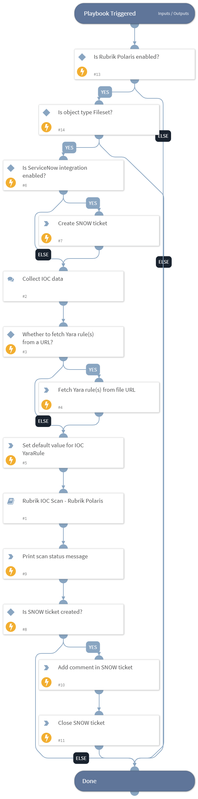

This playbook performs IOC Scan on fileset object. It also creates tickets on ServiceNow using "ServiceNow v2" integration.
Supported integrations:
- RubrikPolaris
- ServiceNow v2

## Dependencies
This playbook uses the following sub-playbooks, integrations, and scripts.

### Sub-playbooks
* Rubrik IOC Scan - Rubrik Polaris

### Integrations
* RubrikPolaris
* ServiceNow v2

### Scripts
* Set
* Print
* http

### Commands
* servicenow-add-comment
* servicenow-update-ticket
* servicenow-create-ticket

## Playbook Inputs
---

| **Name** | **Description** | **Default Value** | **Required** |
| --- | --- | --- | --- |
| ClusterId | Cluster ID of the incident. | incident.rubrikcdmclusterid | Required |
| ObjectId | Object ID of the incident. | incident.rubrikpolarisfid | Required |

## Playbook Outputs
---
There are no outputs for this playbook.

## Playbook Image
---
