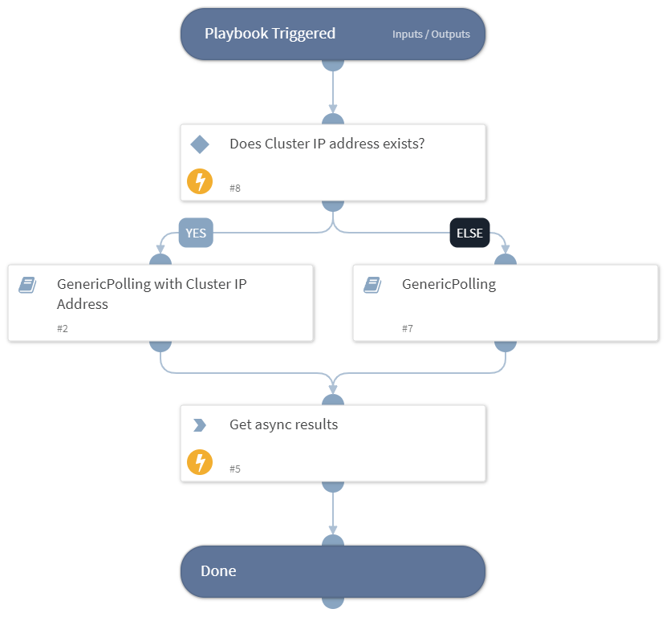

Poll async result for any asynchronous request made to rubrik.

## Dependencies
This playbook uses the following sub-playbooks, integrations, and scripts.

### Sub-playbooks
* GenericPolling

### Integrations
* RubrikPolaris

### Scripts
This playbook does not use any scripts.

### Commands
* rubrik-gps-async-result

## Playbook Inputs
---

| **Name** | **Description** | **Default Value** | **Required** |
| --- | --- | --- | --- |
| ClusterId | Cluster ID of the object. |  | Required |
| RequestId | ID of the asynchronous request. |  | Required |
| PollingInterval | Frequency with which the polling command will run \(minutes\). | 5 | Optional |
| PollingTimeout | Amount of time to poll before declaring a timeout and resuming the playbook \(in minutes\). | 720 | Optional |

## Playbook Outputs
---

| **Path** | **Description** | **Type** |
| --- | --- | --- |
| RubrikPolaris.GPSAsyncResult | Response of async result. | unknown |

## Playbook Image
---
