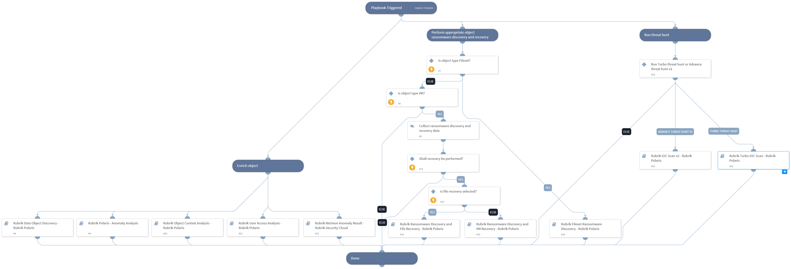

This playbook will investigate an anomaly incident ingested by the integration "RubrikPolaris", enrich its data, and perform a remediation according to the incident's object type.

## Dependencies
This playbook uses the following sub-playbooks, integrations, and scripts.

### Sub-playbooks
* Rubrik Polaris - Anomaly Analysis
* Rubrik Ransomware Discovery and VM Recovery - Rubrik Polaris
* Rubrik Data Object Discovery - Rubrik Polaris
* Rubrik Fileset Ransomware Discovery
* Rubrik Ransomware Discovery and File Recovery - Rubrik Polaris

### Integrations
* RubrikPolaris

### Scripts
This playbook does not use any scripts.

### Commands
This playbook does not use any commands.

## Playbook Inputs
---
There are no inputs for this playbook.

## Playbook Outputs
---
There are no outputs for this playbook.

## Playbook Image
---
