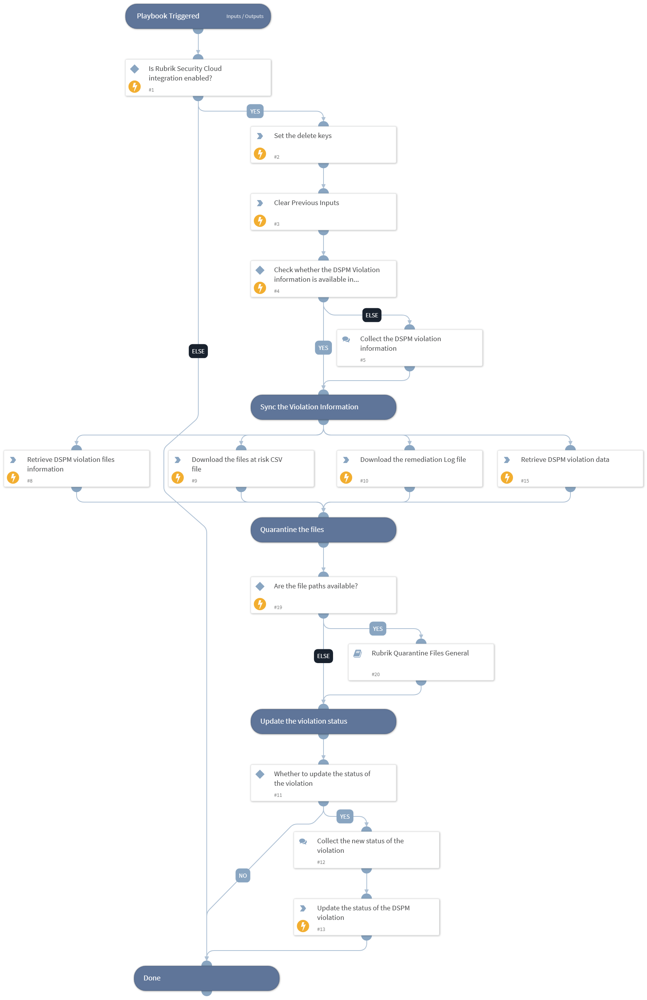

This playbook remediates DSPM violations by retrieving violation details and affected file information, downloading the affected file details and remediation logs as CSV files, quarantining the affected files and updating the violation status.

## Dependencies

This playbook uses the following sub-playbooks, integrations, and scripts.

### Sub-playbooks

* Rubrik Quarantine Files General

### Integrations

This playbook does not use any integrations.

### Scripts

* DeleteContext
* RubrikPullDSPMViolationFileInformation
* RubrikPullDSPMViolationInformation
* Set

### Commands

* rubrik-data-security-violation-csv-download
* rubrik-data-security-violation-log-download
* rubrik-data-security-violation-status-update

## Playbook Inputs

---

| **Name** | **Description** | **Default Value** | **Required** |
| --- | --- | --- | --- |
| violation_id | The ID of the DSPM violation.  Note: Users can get the violation ID by executing the "rubrik-data-security-violation-list" command. | incident.rubrikviolationid | Optional |
| object_id | The object ID.  Note: Users can retrieve the object ID by executing the "rubrik-polaris-objects-list" command. | incident.rubrikpolarisobjectid | Optional |
| snapshot_id | The snapshot ID.  Note: Users can retrieve the snapshot ID by executing the "rubrik-polaris-object-snapshot-list" command. | incident.rubriksnapshotid | Optional |
| object_name | The object Name.  Note: If not specified playbook will retrieve it using the "rubrik-data-security-violation-get" command. | incident.rubrikpolarisobjectname | Optional |
| limit | Number of results to retrieve in the response. The maximum allowed size is 1000. | 1000 | Optional |
| quarantine_folder_id | The ID of the quarantine folder where the affected files will be moved. |  | Optional |

## Playbook Outputs

---
There are no outputs for this playbook.

## Playbook Image

---

