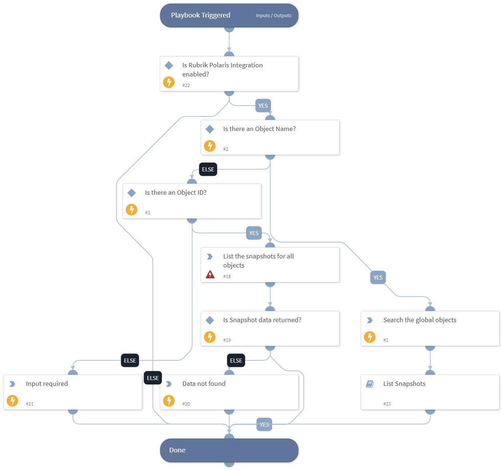

Data discovery of the object available in the incident.

## Dependencies
This playbook uses the following sub-playbooks, integrations, and scripts.

### Sub-playbooks
This playbook does not use any sub-playbooks.

### Integrations
- RubrikPolaris

### Scripts
* PrintErrorEntry
* Print

### Commands
* rubrik-polaris-object-snapshot-list
* rubrik-polaris-object-search

## Playbook Inputs
---

| **Name** | **Description** | **Default Value** | **Required** |
| --- | --- | --- | --- |
| object_name | Name of the object to discover. | incident.rubrikpolarisobjectname | Optional |
| object_id | ID of the object to discover. | incident.rubrikpolarisfid | Optional |

## Playbook Outputs
---
There are no outputs for this playbook.

## Playbook Image
---

