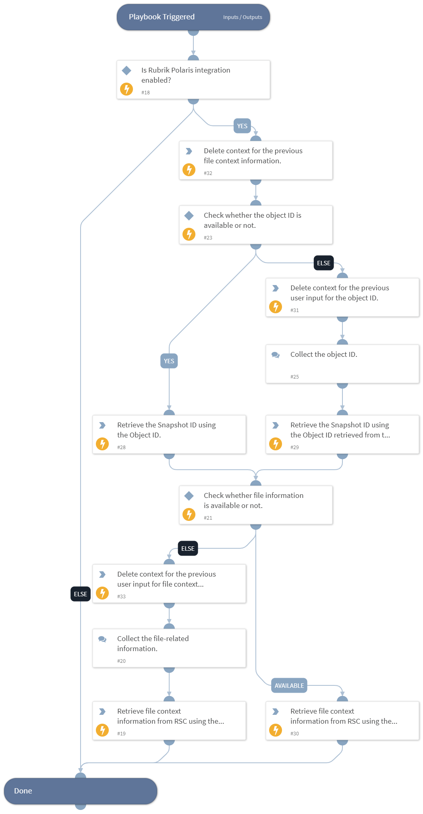

This playbook fetches file context information for the provided file, folder, or file share name and the object ID to get the policy hits.

## Dependencies

This playbook uses the following sub-playbooks, integrations, and scripts.

### Sub-playbooks

This playbook does not use any sub-playbooks.

### Integrations

- RubrikPolaris

### Scripts

* DeleteContext

### Commands

* rubrik-polaris-object-snapshot-list
* rubrik-sonar-file-context-list

## Playbook Inputs

---

| **Name** | **Description** | **Default Value** | **Required** |
| --- | --- | --- | --- |
| object_id | The Object ID or the Snappable ID. Default can be received from incident if present.  Note: Users can get the list of the object IDs by executing the "rubrik-polaris-object-list" command. | incident.rubrikpolarisfid | Optional |
| file_name | Specify the name of the file, folder, or file share object. |  | Optional |
| file_path | Specify the standard folder/directory path to filter with. |  | Optional |
| user_id | Specify the user ID to filter with.  Note: Users can get the list of the user IDs by executing the "rubrik-sonar-user-access-list" command. |  | Optional |
| limit | Number of results to retrieve in the response. The maximum allowed size is 1000. | 50 | Optional |

## Playbook Outputs

---

| **Path** | **Description** | **Type** |
| --- | --- | --- |
| RubrikPolaris.FileContext.nativePath | The native path of the file. | string |
| RubrikPolaris.FileContext.stdPath | The standardized path of the file. | string |
| RubrikPolaris.FileContext.filename | The filename. | string |
| RubrikPolaris.FileContext.mode | The file mode. | string |
| RubrikPolaris.FileContext.size | The file size in bytes. | number |
| RubrikPolaris.FileContext.lastAccessTime | The last access time of the file in milliseconds since the epoch. | number |
| RubrikPolaris.FileContext.lastModifiedTime | The last modified time of the file in milliseconds since the epoch. | number |
| RubrikPolaris.FileContext.directory | The value of Directory. | string |
| RubrikPolaris.FileContext.numDescendantFiles | The number of descendant files of the file. | number |
| RubrikPolaris.FileContext.numDescendantErrorFiles | The number of descendant files of the file that could not be processed. | number |
| RubrikPolaris.FileContext.numDescendantSkippedExtFiles | The number of descendant files of the file that were skipped because of their file extension. | number |
| RubrikPolaris.FileContext.numDescendantSkippedSizeFiles | The number of descendant files of the file that were skipped because of their file size. | number |
| RubrikPolaris.FileContext.errorCode | The error code, if any, for the file. | string |
| RubrikPolaris.FileContext.hits.totalHits | The total number of hits for the file. | number |
| RubrikPolaris.FileContext.hits.violations | The number of violations for the file. | number |
| RubrikPolaris.FileContext.hits.violationsDelta | The change in the number of violations for the file since the last scan. | number |
| RubrikPolaris.FileContext.hits.totalHitsDelta | The change in the total number of hits for the file since the last scan. | number |
| RubrikPolaris.FileContext.hits.__typename | The type of the hits field. | string |
| RubrikPolaris.FileContext.filesWithHits.totalHits | The total number of files with hits. | number |
| RubrikPolaris.FileContext.filesWithHits.violations | The number of files with violations. | number |
| RubrikPolaris.FileContext.filesWithHits.__typename | The type of the files with hits field. | string |
| RubrikPolaris.FileContext.openAccessFilesWithHits.totalHits | The total number of open access files with hits. | number |
| RubrikPolaris.FileContext.openAccessFilesWithHits.violations | The number of open access files with violations. | number |
| RubrikPolaris.FileContext.openAccessFilesWithHits.__typename | The type of the open access files with hits field. | string |
| RubrikPolaris.FileContext.staleFilesWithHits.totalHits | The total number of stale files with hits. | number |
| RubrikPolaris.FileContext.staleFilesWithHits.violations | The number of stale files with violations. | number |
| RubrikPolaris.FileContext.staleFilesWithHits.__typename | The type of the stale files with hits field. | string |
| RubrikPolaris.FileContext.analyzerGroupResults.analyzerGroup.groupType | The type of the analyzer group. | string |
| RubrikPolaris.FileContext.analyzerGroupResults.analyzerGroup.id | The ID of the analyzer group. | string |
| RubrikPolaris.FileContext.analyzerGroupResults.analyzerGroup.name | The name of the analyzer group. | string |
| RubrikPolaris.FileContext.analyzerGroupResults.analyzerGroup.__typename | The type of the analyzer group field. | string |
| RubrikPolaris.FileContext.analyzerGroupResults.analyzerResults.hits.totalHits | The total number of hits for the analyzer results. | number |
| RubrikPolaris.FileContext.analyzerGroupResults.analyzerResults.hits.violations | The number of violations for the analyzer results. | number |
| RubrikPolaris.FileContext.analyzerGroupResults.analyzerResults.hits.__typename | The type of the hits field. | string |
| RubrikPolaris.FileContext.analyzerGroupResults.analyzerResults.analyzer.id | The ID of the analyzer. | string |
| RubrikPolaris.FileContext.analyzerGroupResults.analyzerResults.analyzer.name | The name of the analyzer. | string |
| RubrikPolaris.FileContext.analyzerGroupResults.analyzerResults.analyzer.analyzerType | The type of the analyzer. | string |
| RubrikPolaris.FileContext.analyzerGroupResults.analyzerResults.analyzer.__typename | The type of the analyzer field. | string |
| RubrikPolaris.FileContext.analyzerGroupResults.analyzerResults.__typename | The type of the analyzer results field. | string |
| RubrikPolaris.FileContext.analyzerGroupResults.hits.totalHits | The total number of hits for the analyzer group results. | number |
| RubrikPolaris.FileContext.analyzerGroupResults.hits.violations | The number of violations for the analyzer group results. | number |
| RubrikPolaris.FileContext.analyzerGroupResults.hits.violationsDelta | The change in the number of violations for the analyzer group results since the last scan. | number |
| RubrikPolaris.FileContext.analyzerGroupResults.hits.totalHitsDelta | The change in the total number of hits for the analyzer group results since the last scan. | number |
| RubrikPolaris.FileContext.analyzerGroupResults.hits.__typename | The type of the hits field. | string |
| RubrikPolaris.FileContext.analyzerGroupResults.__typename | The type of the analyzer group results field. | string |
| RubrikPolaris.FileContext.sensitiveFiles.highRiskFileCount.totalCount | The total number of high-risk files for the policy object. | number |
| RubrikPolaris.FileContext.sensitiveFiles.highRiskFileCount.violatedCount | The number of high-risk files for the policy object that violates policies. | number |
| RubrikPolaris.FileContext.sensitiveFiles.highRiskFileCount.__typename | The type of the high-risk file count field. | string |
| RubrikPolaris.FileContext.sensitiveFiles.mediumRiskFileCount.totalCount | Total number of medium-risk files for the policy object. | number |
| RubrikPolaris.FileContext.sensitiveFiles.mediumRiskFileCount.violatedCount | The number of medium-risk files for the policy object that violates policies. | number |
| RubrikPolaris.FileContext.sensitiveFiles.mediumRiskFileCount.__typename | The type of the medium risk file count field. | string |
| RubrikPolaris.FileContext.sensitiveFiles.lowRiskFileCount.totalCount | Total number of low-risk files for the policy object. | number |
| RubrikPolaris.FileContext.sensitiveFiles.lowRiskFileCount.violatedCount | The number of low-risk files for the policy object that violates policies. | number |
| RubrikPolaris.FileContext.sensitiveFiles.lowRiskFileCount.__typename | The type of the low-risk file count field. | string |
| RubrikPolaris.FileContext.sensitiveFiles.__typename | The type of the sensitive files field. | string |
| RubrikPolaris.FileContext.openAccessType | The open access type for the file. | string |
| RubrikPolaris.FileContext.stalenessType | The staleness type for the file. | string |
| RubrikPolaris.FileContext.numActivities | The number of activities for the file. | number |
| RubrikPolaris.FileContext.numActivitiesDelta | The change in the number of activities for the file since the last time it was checked. | number |
| RubrikPolaris.FileContext.__typename | The type of the file context field. | string |
| RubrikPolaris.PageToken.FileContext.name | Name of the command. | string |
| RubrikPolaris.PageToken.FileContext.endCursor | The end cursor for the current page. | string |
| RubrikPolaris.PageToken.FileContext.hasNextPage | Whether the result has the next page or not. | boolean |

## Playbook Image

---

