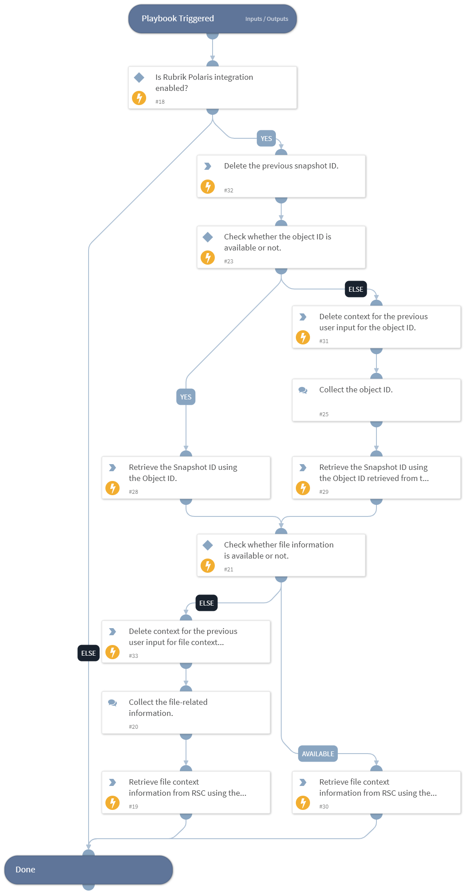

This playbook fetches file context information for the provided file/folder/fileshare name and the object ID to get the policy hits.

## Dependencies

This playbook uses the following sub-playbooks, integrations, and scripts.

### Sub-playbooks

This playbook does not use any sub-playbooks.

### Integrations

- RubrikPolaris

### Scripts

* DeleteContext

### Commands

* rubrik-polaris-object-snapshot-list
* rubrik-sonar-file-context-list

## Playbook Inputs

---

| **Name** | **Description** | **Default Value** | **Required** |
| --- | --- | --- | --- |
| object_id | The Object ID or the Snappable ID. Default can be received from incident if present.  Note: Users can get the list of the object IDs by executing the "rubrik-polaris-object-list" command. | incident.rubrikpolarisfid | Optional |
| file_name | Specify the name of the file, folder, or file share object. |  | Optional |
| file_path | Specify the standard folder/directory path to filter with. |  | Optional |
| user_id | Specify the user ID to filter with.  Note: Users can get the list of the user IDs by executing the "rubrik-sonar-user-access-list" command. |  | Optional |
| limit | Number of results to retrieve in the response. The maximum allowed size is 1000. | 50 | Optional |

## Playbook Outputs

---
There are no outputs for this playbook.

## Playbook Image

---

