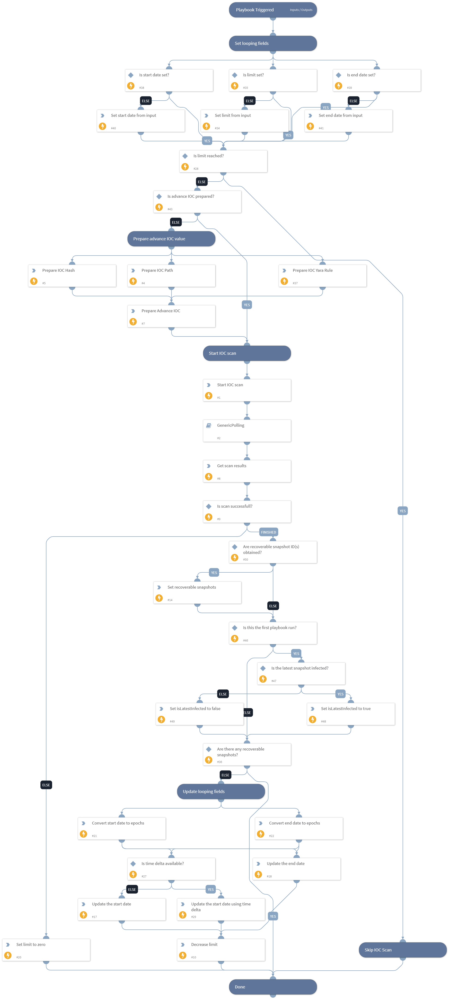

This playbook starts an IOC Scan with the provided IOC values. It can be looped until recoverable snapshots are obtained or the limit to loop is reached.

## Dependencies
This playbook uses the following sub-playbooks, integrations, and scripts.

### Sub-playbooks
* GenericPolling

### Integrations
* RubrikPolaris

### Scripts
* Set

### Commands
* rubrik-radar-ioc-scan-results
* rubrik-radar-ioc-scan

## Playbook Inputs
---

| **Name** | **Description** | **Default Value** | **Required** |
| --- | --- | --- | --- |
| ClusterId | Cluster ID of the object. |  | Required |
| ObjectId | ID of the object. |  | Required |
| StartDate | Start Date for IOC Scan.  Formats accepted: 2 minutes, 2 hours, 2 days, 2 weeks, 2 months, 2 years, yyyy-mm-dd, yyyy-mm-ddTHH:MM:SSZ, etc.  Examples of more supported values can be found at https://dateparser.readthedocs.io/en/latest/\#relative-dates. | 7 days ago | Required |
| EndDate | End Date for IOC Scan.  Formats accepted: 2 minutes, 2 hours, 2 days, 2 weeks, 2 months, 2 years, yyyy-mm-dd, yyyy-mm-ddTHH:MM:SSZ, etc.  Examples of more supported values can be found at https://dateparser.readthedocs.io/en/latest/\#relative-dates. | now | Required |
| IOCPath | Path of IOC to scan. Supports comma separated multiple values.   Note: Do not provide quoted values. |  | Optional |
| IOCHash | Hash of IOC to scan. Supports comma separated multiple values.   Note: Do not provide quoted values. |  | Optional |
| IOCYaraRule | Yara Rule\(s\) for IOC scan.   Note: Do not provide quoted values. |  | Optional |
| PollingInterval | Frequency that the IOC scan command will run \(minutes\). | 5 | Optional |
| PollingTimeout | Amount of time to poll before declaring a timeout and resuming the playbook \(in minutes\). | 720 | Optional |
| TimeDelta | Provide the time delta to move backward while looping to find out the recoverable snapshot. If not provided, it defaults to the time difference between provided start date, and end date. |  | Optional |
| PathsToInclude | Paths to include in the scan. Supports comma separated values.  Format accepted: path_to_include_1, path_to_include_2 |  | Optional |
| PathsToExclude | Paths to exclude from the scan. Supports comma separated values.  Format accepted: path_to_exclude_1, path_to_exclude_2 |  | Optional |
| PathsToExempt | Paths to exempt from exclusion. Supports comma separated values.  Format accepted: path_to_exempt_1, path_to_exempt_2 |  | Optional |
| Limit | The maximum number of times to run IOC scans to find recoverable snapshot. | 1 | Required |
| RequestedHashType | The type of the hash values of the matched files to be blocked, if enabled. |  | Optional |
| ScanName | Name of the scan. Default value is "PAXSOAR-1.1.0". |  | Optional |
| MaxFileSize | Maximum size of the file in bytes that will be included in the scan. The maximum allowed size is 15000000 bytes. | 5000000 | Optional |

## Playbook Outputs
---

| **Path** | **Description** | **Type** |
| --- | --- | --- |
| RubrikPolaris.RecoverableSnapshot.id | ID of the snapshot that can be recovered. | unknown |
| RubrikPolaris.RadarIOCScan | The results of the IOC scan. | unknown |
| RubrikPolaris.RecoverableSnapshot.isLatestInfected | Boolean value to indicate whether the newest snapshot is infected or not. | unknown |

## Playbook Image
---
