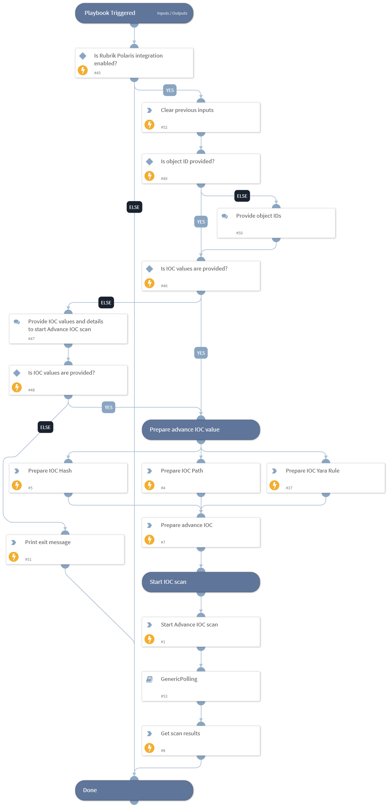

This playbook starts an advance IOC Scan with the provided IOC values and shows the results upon completion.

## Dependencies

This playbook uses the following sub-playbooks, integrations, and scripts.

### Sub-playbooks

* GenericPolling

### Integrations

This playbook does not use any integrations.

### Scripts

* DeleteContext
* Set
* Print

### Commands

* rubrik-advance-ioc-scan
* rubrik-ioc-scan-results-v2

## Playbook Inputs

---

| **Name** | **Description** | **Default Value** | **Required** |
| --- | --- | --- | --- |
| object_ids | The Object ID of the system on which to perform the scan. Supports comma separated values.  Note: Users can get the list of object IDs by executing the "rubrik-polaris-objects-list" command. | incident.rubrikpolarisobjectid | Required |
| start_date | Filter the snapshots from the provided date. Any snapshots taken before the provided date-time will be excluded.  Formats accepted: 2 minutes, 2 hours, 2 days, 2 weeks, 2 months, 2 years, yyyy-mm-dd, yyyy-mm-ddTHH:MM:SSZ, etc. | 7 days | Optional |
| end_date | Filter the snapshots until the provided date. Any snapshots taken after the provided date-time will be excluded.  Formats accepted: 2 minutes, 2 hours, 2 days, 2 weeks, 2 months, 2 years, yyyy-mm-dd, yyyy-mm-ddTHH:MM:SSZ, etc. | now | Optional |
| ioc_path | Path of IOC to scan. Supports comma separated multiple values.   Note: Do not provide quoted values. Provide the values in proper JSON format \(Example: C:\\\\Users\\\\Malware_Executible.ps1\). |  | Optional |
| ioc_hash | Hash of IOC to scan. Supports comma separated multiple values.   Note: Do not provide quoted values. |  | Optional |
| ioc_yara_rule | Yara Rule\(s\) for IOC scan.   Note: Do not provide quoted values. Provide the values in proper JSON format. |  | Optional |
| polling_interval | Frequency that the IOC scan command will run \(minutes\). | 5 | Optional |
| polling_timeout | Amount of time to poll before declaring a timeout and resuming the playbook \(in minutes\). | 720 | Optional |
| paths_to_include | Paths to include in the scan. Supports comma separated values.  Note: Do not provide quoted values.  Format accepted: path_to_include_1, path_to_include_2. |  | Optional |
| paths_to_exclude | Paths to exclude from the scan. Supports comma separated values.  Note: Do not provide quoted values.  Format accepted: path_to_exclude_1, path_to_exclude_2. |  | Optional |
| paths_to_exempt | Paths to exempt from exclusion. Supports comma separated values.  Note: Do not provide quoted values.  Format accepted: path_to_exempt_1, path_to_exempt_2. |  | Optional |
| scan_name | Name of the new advanced threat hunt scan. | PAXSOAR-1.6.0 | Optional |
| max_file_size | Maximum size of the file in bytes that will be included in the scan. The maximum allowed size is 15000000 bytes. | 5000000 | Optional |
| min_file_size | Minimum size of the file in bytes that will be included in the scan. The maximum allowed size is 15000000 bytes. | 1 | Optional |
| max_matches_per_snapshot | Maximum number of IOC matches allowed per snapshot. |  | Optional |
| max_snapshots_per_object | Maximum number of snapshots to scan per object. |  | Optional |

## Playbook Outputs

---

| **Path** | **Description** | **Type** |
| --- | --- | --- |
| RubrikPolaris.IOCScan | The results of the IOC scan. | unknown |

## Playbook Image

---

