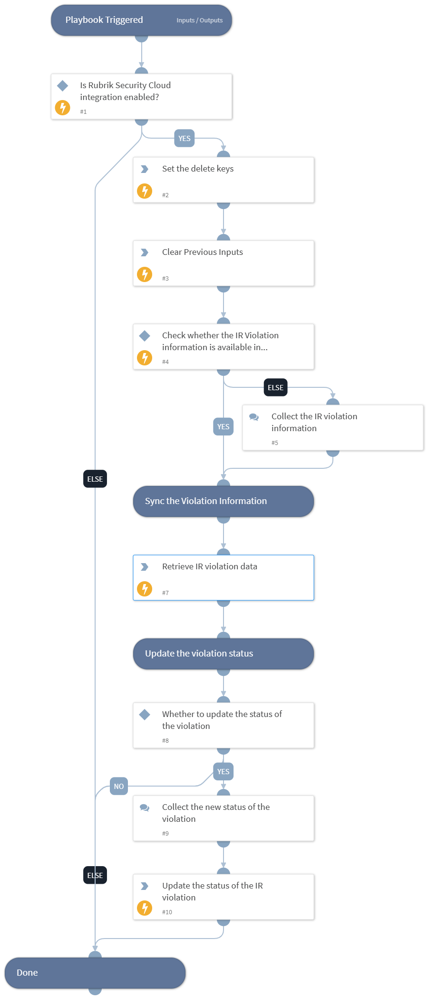

This playbook remediates Identity Resilience (IR) violations by retrieving the latest violation details and updating the violation status.

## Dependencies

This playbook uses the following sub-playbooks, integrations, and scripts.

### Sub-playbooks

This playbook does not use any sub-playbooks.

### Integrations

This playbook does not use any integrations.

### Scripts

* DeleteContext
* RubrikPullIRViolationInformation
* Set

### Commands

* rubrik-identity-resilience-violation-status-update

## Playbook Inputs

---

| **Name** | **Description** | **Default Value** | **Required** |
| --- | --- | --- | --- |
| violation_id | The ID of the IR violation.  Note: Users can get the violation ID by executing the "rubrik-identity-resilience-violation-list" command. | incident.rubrikviolationid | Optional |
| policy_type | The policy type of the violation.  Note: Users can get the policy type by executing the "rubrik-identity-resilience-violation-list" command.  Possible values are: IDENTITY, IDP, IDENTITY_EVENT, CROWDSTRIKE, MICROSOFT_DEFENDER | incident.policytype | Optional |

## Playbook Outputs

---
There are no outputs for this playbook.

## Playbook Image

---

