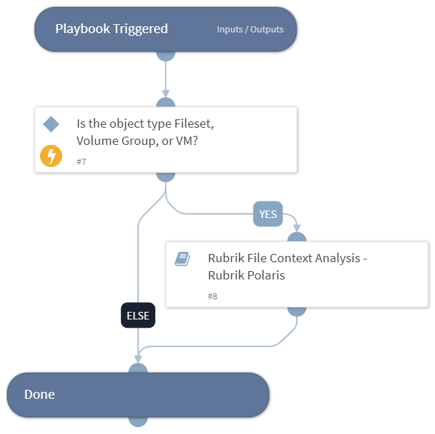

This playbook will investigate based on the object type from the Rubrik Anomaly incident to retrieve the policy hits of the files related to the object.

## Dependencies

This playbook uses the following sub-playbooks, integrations, and scripts.

### Sub-playbooks

* Rubrik File Context Analysis - Rubrik Polaris

### Integrations

* RubrikPolaris

### Scripts

This playbook does not use any scripts.

### Commands

This playbook does not use any commands.

## Playbook Inputs

---

| **Name** | **Description** | **Default Value** | **Required** |
| --- | --- | --- | --- |
| object_id | The Object ID or the Snappable ID. Default can be received from incident if present. | incident.rubrikpolarisfid | Optional |
| object_type | The Object type. Default can be received from incident if present. | incident.rubrikpolarisobjecttype | Optional |

## Playbook Outputs

---
There are no outputs for this playbook.

## Playbook Image

---

