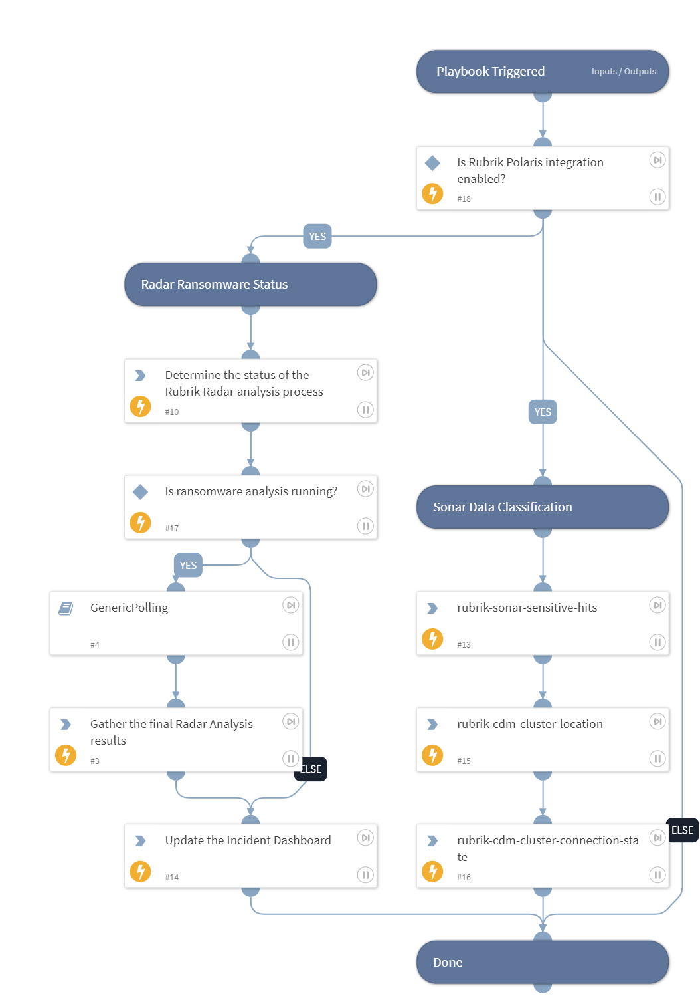

Monitor the progress of a Rubrik Radar anomaly event and use Rubrik Sonar to check for data classification hits.

## Dependencies
This playbook uses the following sub-playbooks, integrations, and scripts.

### Sub-playbooks
* GenericPolling

### Integrations
* RubrikPolaris

### Scripts
This playbook does not use any scripts.

### Commands
* rubrik-event-list
* rubrik-sonar-sensitive-hits
* rubrik-cdm-cluster-connection-state
* rubrik-cdm-cluster-location
* setIncident

## Playbook Inputs
---
There are no inputs for this playbook.

## Playbook Outputs
---
There are no outputs for this playbook.

## Playbook Image
---
