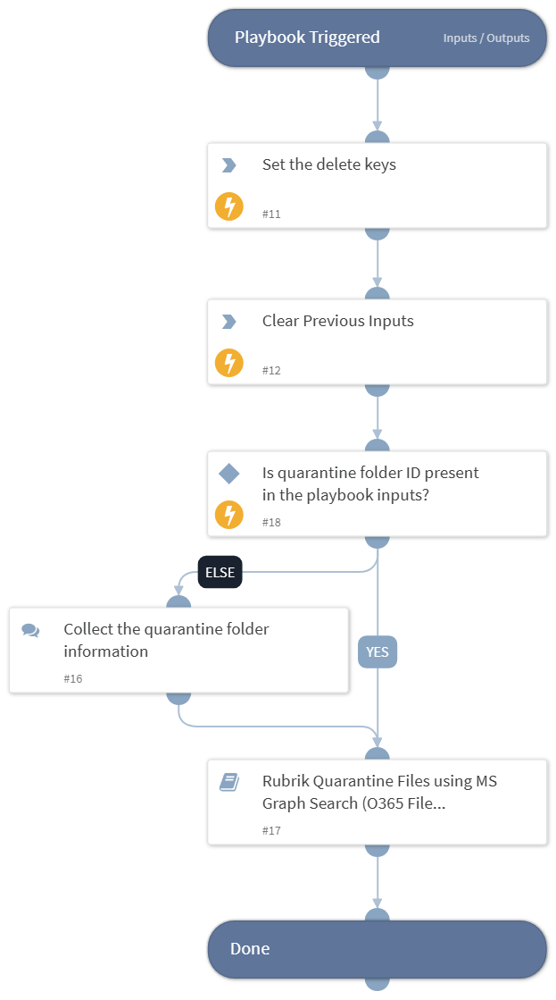

This playbook quarantines files using the Microsoft Graph Search (O365 File Management) integration.

## Dependencies

This playbook uses the following sub-playbooks, integrations, and scripts.

### Sub-playbooks

* Rubrik Quarantine Files using MS Graph Search

### Integrations

This playbook does not use any integrations.

### Scripts

* DeleteContext
* Set

### Commands

This playbook does not use any commands.

## Playbook Inputs

---

| **Name** | **Description** | **Default Value** | **Required** |
| --- | --- | --- | --- |
| file_information | The file information to quarantine. |  | Optional |
| quarantine_folder_id | The ID of the quarantine folder where the file will be moved. |  | Optional |

## Playbook Outputs

---
There are no outputs for this playbook.

## Playbook Image

---

