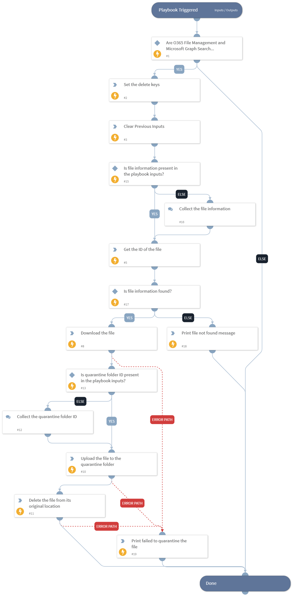

This playbook quarantines files using the Microsoft Graph Search (O365 File Management) integration by downloading them, uploading them to a quarantine folder and deleting them from their original location.

## Dependencies

This playbook uses the following sub-playbooks, integrations, and scripts.

### Sub-playbooks

This playbook does not use any sub-playbooks.

### Integrations

This playbook does not use any integrations.

### Scripts

* DeleteContext
* Print
* Set

### Commands

* msgraph-delete-file
* msgraph-download-file
* msgraph-search-content
* msgraph-upload-new-file

## Playbook Inputs

---

| **Name** | **Description** | **Default Value** | **Required** |
| --- | --- | --- | --- |
| file_path | The file path of the file to quarantine in OneDrive/SharePoint. |  | Optional |
| file_name | The name of the file to quarantine. |  | Optional |
| quarantine_folder_id | The ID of the quarantine folder where the file will be uploaded. |  | Optional |

## Playbook Outputs

---
There are no outputs for this playbook.

## Playbook Image

---

