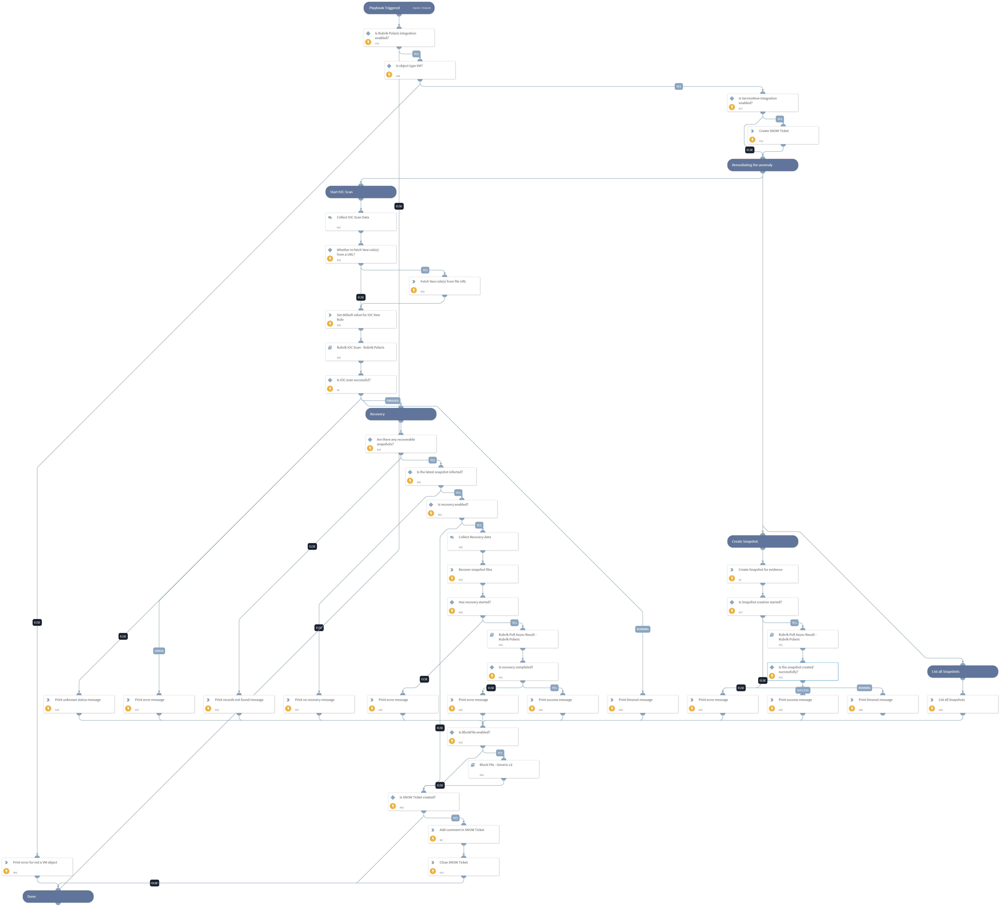

This playbook performs an IOC Scan based on the provided inputs, search the recoverable snapshot and performs recovery on the searched recoverable snapshot. This playbook also creates tickets on ServiceNow using "ServiceNow v2" integration. 
Supported integrations: 
- RubrikPolaris
- ServiceNow v2

## Dependencies
This playbook uses the following sub-playbooks, integrations, and scripts.

### Sub-playbooks
* Rubrik IOC Scan - Rubrik Polaris
* Rubrik Poll Async Result - Rubrik Polaris
* Block File - Generic v2

### Integrations
* RubrikPolaris
* ServiceNow v2

### Scripts
* http
* PrintErrorEntry
* Print
* Set

### Commands
* servicenow-update-ticket
* rubrik-gps-vm-recover-files
* rubrik-polaris-vm-object-snapshot-list
* servicenow-add-comment
* rubrik-gps-vm-snapshot-create
* servicenow-create-ticket

## Playbook Inputs
---

| **Name** | **Description** | **Default Value** | **Required** |
| --- | --- | --- | --- |
| ObjectId | Object ID of the incident. | incident.rubrikpolarisfid | Required |
| ClusterId | Cluster ID of the incident. | incident.rubrikcdmclusterid | Required |

## Playbook Outputs
---
There are no outputs for this playbook.

## Playbook Image
---
