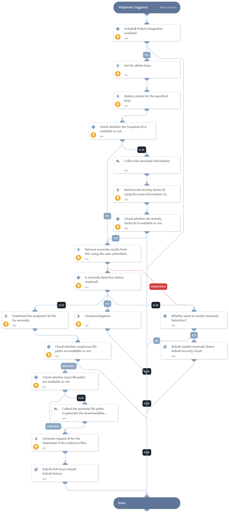

This playbook retrieves the list of anomaly files for the provided snapshot ID (or activity series ID) and generates the downloadable links for the file path(s).

## Dependencies

This playbook uses the following sub-playbooks, integrations, and scripts.

### Sub-playbooks

* Rubrik Poll Async Result - Rubrik Polaris

### Integrations

* RubrikPolaris

### Scripts

* DeleteContext
* Set

### Commands

* rubrik-gps-snapshot-files-download
* rubrik-radar-suspicious-file-list
* rubrik-event-list
* rubrik-radar-anomaly-csv-analysis

## Playbook Inputs

---

| **Name** | **Description** | **Default Value** | **Required** |
| --- | --- | --- | --- |
| file_paths | The absolute path of the file\(s\) for which a downloadable link needs to be generated. |  | Optional |
| snapshot_id | The snapshot ID for which to retrieve the anomaly results. Default can be received from incident \(activity series ID\) if present.  Note: Users can get the list of the snapshot IDs by executing the "rubrik-polaris-object-snapshot-list" command. For the Activity Series ID, the users can execute the "rubrik-event-list" command with the "activity_type" argument set to "ANOMALY". | incident.rubrikpolarisactivityseriesid | Optional |
| download_csv_file | If set to True, the playbook downloads the anomaly analysis csv file directly on XSOAR server. | True | Optional |

## Playbook Outputs

---

| **Path** | **Description** | **Type** |
| --- | --- | --- |
| RubrikPolaris.SuspiciousFile.id | The anomaly result ID. | string |
| RubrikPolaris.SuspiciousFile.snapshotFid | The snapshot ID. | string |
| RubrikPolaris.SuspiciousFile.cluster.id | The cluster ID. | string |
| RubrikPolaris.SuspiciousFile.cluster.defaultAddress | The default address of the cluster. | string |
| RubrikPolaris.SuspiciousFile.cluster.systemStatusAffectedNodes.ipAddress | The IP address of the affected node. | string |
| RubrikPolaris.SuspiciousFile.cluster.name | The cluster name. | string |
| RubrikPolaris.SuspiciousFile.cluster.version | The cluster version. | string |
| RubrikPolaris.SuspiciousFile.cluster.status | The cluster status. | string |
| RubrikPolaris.SuspiciousFile.cluster.__typename | The type name of the cluster response. | string |
| RubrikPolaris.SuspiciousFile.cdmId | The snapshot CDM ID. | string |
| RubrikPolaris.SuspiciousFile.managedId | The managed object ID. | string |
| RubrikPolaris.SuspiciousFile.anomalyProbability | The probability of the anomaly. | number |
| RubrikPolaris.SuspiciousFile.workloadId | The workload ID. | string |
| RubrikPolaris.SuspiciousFile.location | The location of the anomaly. | string |
| RubrikPolaris.SuspiciousFile.isAnomaly | Indicates if the file is an anomaly. | boolean |
| RubrikPolaris.SuspiciousFile.objectType | The object type. | string |
| RubrikPolaris.SuspiciousFile.snappableNew.objectType | The object type of the snapshot. | string |
| RubrikPolaris.SuspiciousFile.severity | The severity of the anomaly. | string |
| RubrikPolaris.SuspiciousFile.detectionTime | The detection time of the anomaly. | date |
| RubrikPolaris.SuspiciousFile.snapshotDate | The snapshot date of the anomaly. | date |
| RubrikPolaris.SuspiciousFile.encryption | The encryption standard of the anomaly. | string |
| RubrikPolaris.SuspiciousFile.anomalyInfo.strainAnalysisInfo.strainId | The ID of the Ransomware Strain. | string |
| RubrikPolaris.SuspiciousFile.anomalyInfo.strainAnalysisInfo.totalAffectedFiles | The total number of affected files. | number |
| RubrikPolaris.SuspiciousFile.anomalyInfo.strainAnalysisInfo.totalRansomwareNotes | The total number of ransomware notes. | number |
| RubrikPolaris.SuspiciousFile.anomalyInfo.strainAnalysisInfo.sampleAffectedFilesInfo.filePath | The path of the affected file. | string |
| RubrikPolaris.SuspiciousFile.anomalyInfo.strainAnalysisInfo.sampleAffectedFilesInfo.lastModified | The last modified time of the affected file. | date |
| RubrikPolaris.SuspiciousFile.anomalyInfo.strainAnalysisInfo.sampleAffectedFilesInfo.fileSizeBytes | The size of the affected file in bytes. | number |
| RubrikPolaris.SuspiciousFile.anomalyInfo.strainAnalysisInfo.sampleAffectedFilesInfo.__typename | The type name of the affected file response. | string |
| RubrikPolaris.SuspiciousFile.anomalyInfo.strainAnalysisInfo.sampleRansomwareNoteFilesInfo.filePath | The path of the ransomware note file. | string |
| RubrikPolaris.SuspiciousFile.anomalyInfo.strainAnalysisInfo.sampleRansomwareNoteFilesInfo.lastModified | The last modified time of the ransomware note file. | date |
| RubrikPolaris.SuspiciousFile.anomalyInfo.strainAnalysisInfo.sampleRansomwareNoteFilesInfo.fileSizeBytes | The size of the ransomware note file in bytes. | number |
| RubrikPolaris.SuspiciousFile.anomalyInfo.strainAnalysisInfo.sampleRansomwareNoteFilesInfo.__typename | The type name of the ransomware note file response. | string |
| RubrikPolaris.SuspiciousFile.anomalyInfo.strainAnalysisInfo.__typename | The type name of the strain analysis response. | string |
| RubrikPolaris.SuspiciousFile.anomalyInfo.__typename | The type name of the anomaly response. | string |
| RubrikPolaris.SuspiciousFile.__typename | The type name of the suspicious file response. | string |

## Playbook Image

---

