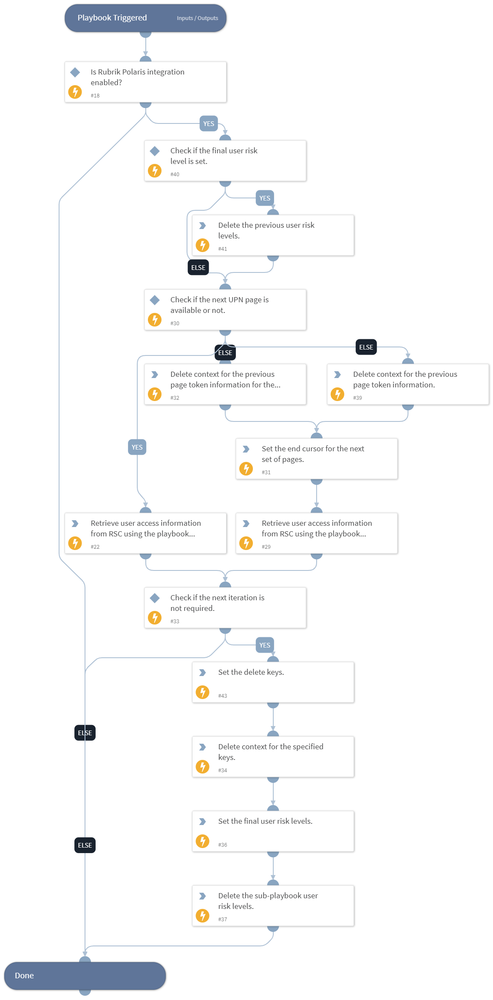

This playbook retrieves User Intelligence information for the provided username or email, which includes the user's risk level and the types of analyzer hits.

## Dependencies

This playbook uses the following sub-playbooks, integrations, and scripts.

### Sub-playbooks

This playbook does not use any sub-playbooks.

### Integrations

* RubrikPolaris.

### Scripts

* DeleteContext
* SetAndHandleEmpty

### Commands

* rubrik-sonar-user-access-list

## Playbook Inputs

---

| **Name** | **Description** | **Default Value** | **Required** |
| --- | --- | --- | --- |
| user_name | The name of the user to search for. |  | Optional |
| user_email | The email or the UPN of the user to search for. |  | Optional |
| search_time_period | Specify the search time period to look for user access. | 7 days | Optional |
| risk_levels | The comma-separated list of risk levels.  Supported values are: UNKNOWN_RISK, HIGH_RISK, MEDIUM_RISK, LOW_RISK, NO_RISK.  Note: For any other values, whether the obtained result is filtered or not, is not confirmed. | HIGH_RISK | Optional |

## Playbook Outputs

---

| **Path** | **Description** | **Type** |
| --- | --- | --- |
| RubrikPolaris.UserAccess.principalId | The ID of the user. | string |
| RubrikPolaris.UserAccess.fullName | The full name of the user. | string |
| RubrikPolaris.UserAccess.upn | The user principal name. | string |
| RubrikPolaris.UserAccess.riskLevel | The risk level of the user. | string |
| RubrikPolaris.UserAccess.sensitiveFiles.highRiskFileCount.totalCount | The total number of high-risk files. | number |
| RubrikPolaris.UserAccess.sensitiveFiles.highRiskFileCount.violatedCount | The number of high-risk files that violate policies. | number |
| RubrikPolaris.UserAccess.sensitiveFiles.highRiskFileCount.__typename | The high-risk file count field type. | string |
| RubrikPolaris.UserAccess.sensitiveFiles.mediumRiskFileCount.totalCount | Total number of medium-risk files. | number |
| RubrikPolaris.UserAccess.sensitiveFiles.mediumRiskFileCount.violatedCount | The number of medium-risk files that violate policies. | number |
| RubrikPolaris.UserAccess.sensitiveFiles.mediumRiskFileCount.__typename | The type of the medium risk file count field. | string |
| RubrikPolaris.UserAccess.sensitiveFiles.lowRiskFileCount.totalCount | The total number of low-risk files. | number |
| RubrikPolaris.UserAccess.sensitiveFiles.lowRiskFileCount.violatedCount | The number of low-risk files that violate policies. | number |
| RubrikPolaris.UserAccess.sensitiveFiles.lowRiskFileCount.__typename | The type of the low-risk file count field. | string |
| RubrikPolaris.UserAccess.sensitiveFiles.__typename | The type of the sensitive files field. | string |
| RubrikPolaris.UserAccess.totalSensitiveHits.totalHits | The total number of sensitive hits. | number |
| RubrikPolaris.UserAccess.totalSensitiveHits.violatedHits | The number of sensitive hits that violate policies. | number |
| RubrikPolaris.UserAccess.totalSensitiveHits.__typename | The type of the total sensitive hits field. | string |
| RubrikPolaris.UserAccess.sensitiveObjectCount.totalCount | The total number of sensitive objects. | number |
| RubrikPolaris.UserAccess.sensitiveObjectCount.violatedCount | The Number of sensitive objects that violate policies. | number |
| RubrikPolaris.UserAccess.sensitiveObjectCount.__typename | The type of the sensitive object count field. | string |
| RubrikPolaris.UserAccess.numDescendants | The number of descendant users associated with this user. | number |
| RubrikPolaris.UserAccess.domainName | The domain name associated with this user. | string |
| RubrikPolaris.UserAccess.__typename | The type of the User Access field. | string |
| RubrikPolaris.PageToken.UserAccess.name | Name of the command. | string |
| RubrikPolaris.PageToken.UserAccess.startCursor | The start cursor for the current page. | string |
| RubrikPolaris.PageToken.UserAccess.endCursor | The end cursor for the current page. | string |
| RubrikPolaris.PageToken.UserAccess.hasNextPage | Whether the result has the next page or not. | boolean |
| RubrikPolaris.PageToken.UserAccess.hasPreviousPage | Whether the result has the previous page or not. | boolean |
| RubrikPolaris.PageToken.UserAccess.next_upn_page_number | The next UPN page number. | string |
| RubrikPolaris.PageToken.UserAccess.has_next_upn_page | Whether the result has the next UPN page or not. | boolean |
| user_risk_levels | List of user risk levels retrieved by the command. | unknown |

## Playbook Image

---

