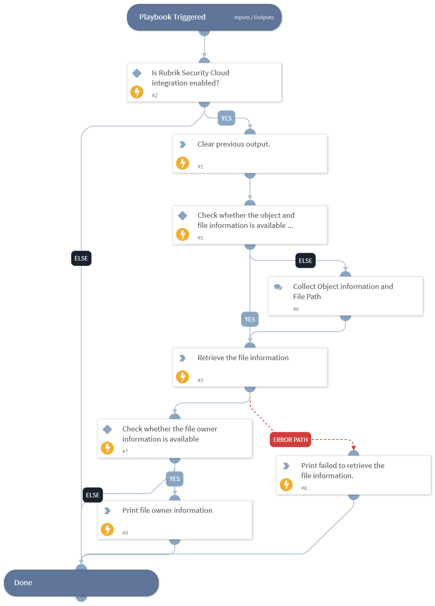

This playbook retrieves detailed information for a file.

## Dependencies

This playbook uses the following sub-playbooks, integrations, and scripts.

### Sub-playbooks

This playbook does not use any sub-playbooks.

### Integrations

This playbook does not use any integrations.

### Scripts

* DeleteContext
* Print

### Commands

* rubrik-sensitive-data-object-file-get

## Playbook Inputs

---

| **Name** | **Description** | **Default Value** | **Required** |
| --- | --- | --- | --- |
| object_id | The object ID.  Note: Users can retrieve the object ID by executing the "rubrik-polaris-objects-list" command. | incident.rubrikpolarisobjectid | Optional |
| snapshot_id | The snapshot ID.  Note: Users can retrieve the snapshot ID by executing the "rubrik-polaris-object-snapshot-list" command. | incident.rubriksnapshotid | Optional |
| file_path | The full path of the file for which to retrieve information. |  | Optional |
| resolve_sids | Whether to resolve SIDs to display names in the file response. | True | Optional |

## Playbook Outputs

---
There are no outputs for this playbook.

## Playbook Image

---

