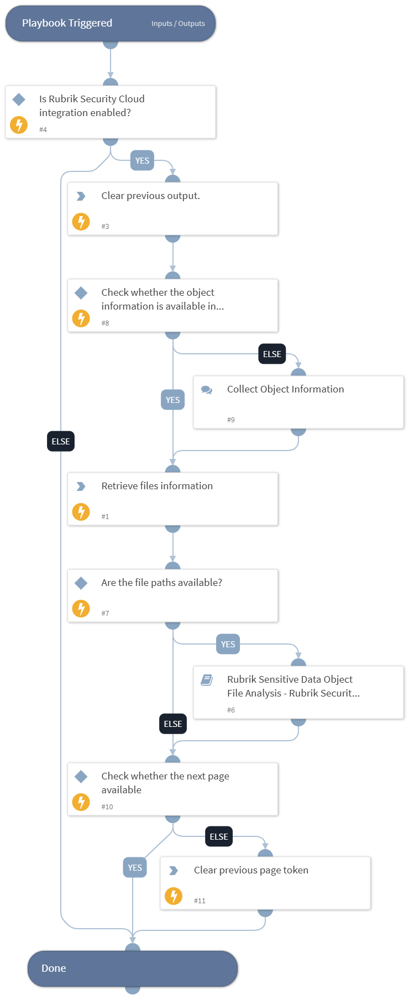

This playbook retrieves the list of files for the sensitive data object.

## Dependencies

This playbook uses the following sub-playbooks, integrations, and scripts.

### Sub-playbooks

* Rubrik Sensitive Data Object File Analysis - Rubrik Security Cloud

### Integrations

This playbook does not use any integrations.

### Scripts

* DeleteContext

### Commands

* rubrik-sonar-file-context-list

## Playbook Inputs

---

| **Name** | **Description** | **Default Value** | **Required** |
| --- | --- | --- | --- |
| object_id | The object ID.  Note: Users can retrieve the object ID by executing the "rubrik-polaris-objects-list" command. | incident.rubrikpolarisobjectid | Optional |
| snapshot_id | The snapshot ID.  Note: Users can retrieve the snapshot ID by executing the "rubrik-polaris-object-snapshot-list" command. | incident.rubriksnapshotid | Optional |
| limit | Number of results to retrieve in the response. The maximum allowed size is 1000. | 100 | Optional |

## Playbook Outputs

---
There are no outputs for this playbook.

## Playbook Image

---

