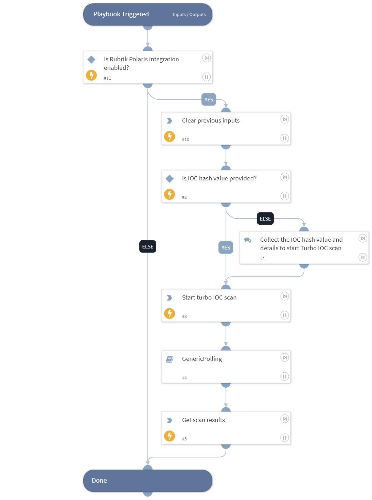

This playbook starts a Turbo IOC scan with the specified IOC values and shows the results upon completion.

## Dependencies

This playbook uses the following sub-playbooks, integrations, and scripts.

### Sub-playbooks

* GenericPolling

### Integrations

This playbook does not use any integrations.

### Scripts

* DeleteContext

### Commands

* rubrik-turbo-ioc-scan
* rubrik-ioc-scan-results-v2

## Playbook Inputs

---

| **Name** | **Description** | **Default Value** | **Required** |
| --- | --- | --- | --- |
| ioc | The value of the indicator to scan for. Supports comma separated values.  Note: Users can retrieve the Md5, SHA1 or SHA256 by executing the "rubrik-threat-monitoring-matched-file-get" command. |  | Optional |
| scan_name | Name of the new turbo threat hunt scan. | PAXSOAR-1.6.0 | Optional |
| cluster_id | The ID of the cluster on which to perform a scan. If not provided, all the clusters will be scanned.  Note: Users can retrieve the list of the cluster IDs by executing the "rubrik-gps-cluster-list" command. |  | Optional |
| start_time | Filter the snapshots from the provided date. Any snapshots taken before the provided date-time will be excluded.  Formats accepted: 2 minutes, 2 hours, 2 days, 2 weeks, 2 months, 2 years, yyyy-mm-dd, yyyy-mm-ddTHH:MM:SSZ, etc. |  | Optional |
| end_time | Filter the snapshots until the provided date. Any snapshots taken after the provided date-time will be excluded.  Formats accepted: 2 minutes, 2 hours, 2 days, 2 weeks, 2 months, 2 years, yyyy-mm-dd, yyyy-mm-ddTHH:MM:SSZ, etc. |  | Optional |
| max_snapshots_per_object | Maximum number of snapshots to scan per object. |  | Optional |
| polling_interval | Frequency that the IOC scan command will run (minutes). | 2 | Optional |
| polling_timeout | Amount of time to poll before declaring a timeout and resuming the playbook (in minutes). | 60 | Optional |

## Playbook Outputs

---

| **Path** | **Description** | **Type** |
| --- | --- | --- |
| RubrikPolaris.IOCScan | Result of the Turbo IOC scan. | unknown |

## Playbook Image

---

