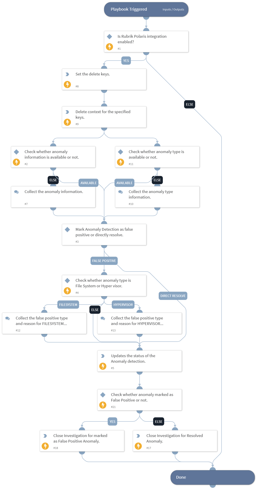

This playbook updates status of the Anomaly Detection snapshot for the provided anomaly ID (or activity series ID) and workload ID (or Object ID).

## Dependencies

This playbook uses the following sub-playbooks, integrations, and scripts.

### Sub-playbooks

This playbook does not use any sub-playbooks.

### Integrations

This playbook does not use any integrations.

### Scripts

* DeleteContext
* SetAndHandleEmpty

### Commands

* rubrik-radar-anomaly-status-update
* closeInvestigation

## Playbook Inputs

---

| **Name** | **Description** | **Default Value** | **Required** |
| --- | --- | --- | --- |
| anomaly_type | The type of the anomaly.  Note: For Anomaly Type, users can execute the "rubrik-radar-suspicious-file-list" command. |  | Optional |
| anomaly_id | The ID of the Anomaly or Activity Series ID.  Note: For Activity Series ID, users can execute the "rubrik-event-list" command with the "activity_type" argument set to "ANOMALY". | incident.rubrikpolarisactivityseriesid | Optional |
| workload_id | The workload ID \(Snappable ID\).  Note: Users can execute the "rubrik-event-list" command with the "activity_type" argument set to "ANOMALY" and get the value of "fid" from the context. | incident.rubrikpolarisobjectid | Optional |

## Playbook Outputs

---
There are no outputs for this playbook.

## Playbook Image

---

