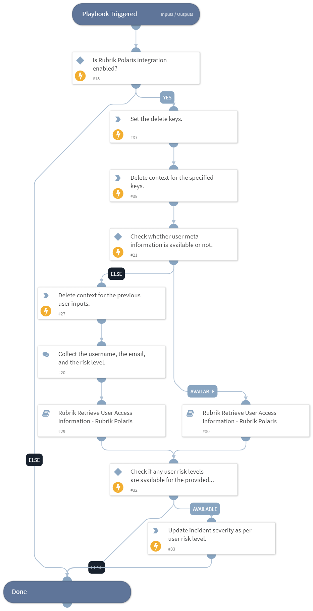

This playbook fetches User Intelligence information for the provided username or email, and then increases the incident severity based on the user risk levels.

## Dependencies

This playbook uses the following sub-playbooks, integrations, and scripts.

### Sub-playbooks

* Rubrik Retrieve User Access Information - Rubrik Polaris

### Integrations

* RubrikPolaris

### Scripts

* DeleteContext
* RubrikSonarSetIncidentSeverityUsingUserRiskLevel

### Commands

This playbook does not use any commands.

## Playbook Inputs

---

| **Name** | **Description** | **Default Value** | **Required** |
| --- | --- | --- | --- |
| user_name | The name of the user to search for. |  | Optional |
| user_email | The email or the UPN of the user to search for. |  | Optional |
| search_time_period | Specify the search time period to look for user access. | 7 days | Optional |
| risk_levels | The comma-separated list of risk levels.  Supported values are: UNKNOWN_RISK, HIGH_RISK, MEDIUM_RISK, LOW_RISK, NO_RISK.  Note: For any other values, whether the obtained result is filtered or not, is not confirmed. | HIGH_RISK | Optional |

## Playbook Outputs

---
There are no outputs for this playbook.

## Playbook Image

---

