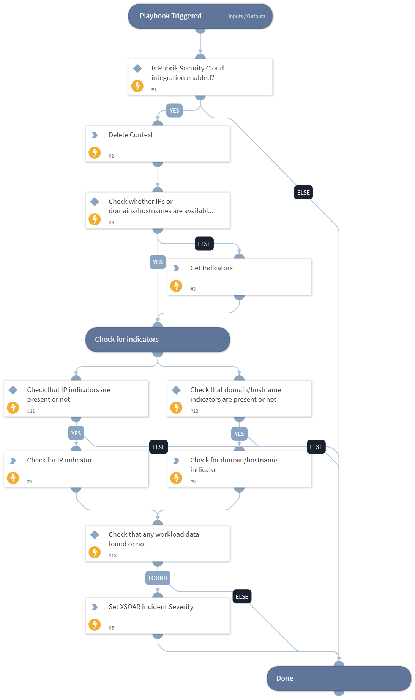

This playbook fetches workload information for the provided IPs or domains, and then increases the XSOAR incident severity based on the workload risk levels and threat information.

## Dependencies

This playbook uses the following sub-playbooks, integrations, and scripts.

### Sub-playbooks

This playbook does not use any sub-playbooks.

### Integrations

* RubrikPolaris

### Scripts

* RubrikSetIncidentSeverityUsingWorkLoadRiskLevel
* DeleteContext

### Commands

* domain
* ip
* findIndicators

## Playbook Inputs

---

| **Name** | **Description** | **Default Value** | **Required** |
| --- | --- | --- | --- |
| increase_severity_by | Specify the level in number by which to increase the XSOAR incident severity. Only applicable if match found for the malicious threat hunt or for the malicious threat monitoring of workload.  Note: The value can range from 1 to 4.  Example: If the current XSOAR incident severity is 1 \(Low\) and the playbook is set to increase the severity by 2, the XSOAR incident severity will be set to 3 \(high\). | 1 | Optional |
| ip_addresses | The optional comma-separated list of IP address\(es\) for which to use workload information to increase the XSOAR incident severity. |  | Optional |
| domains | The optional comma-separated list of domain\(s\) for which to use workload information to increase the XSOAR incident severity. |  | Optional |

## Playbook Outputs

---
There are no outputs for this playbook.

## Playbook Image

---

