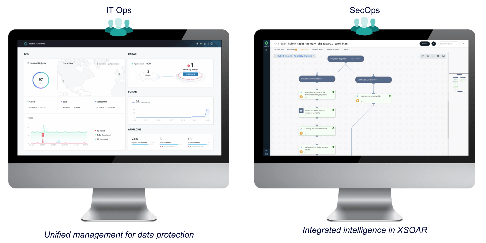

With the prevalence of ransomware in today’s environment, it’s no longer a question of if you'll be infected but when. Thick walls are no longer enough. When attacks due occur, your choices are to on average pay [$847,344](https://www.paloaltonetworks.com/content/dam/pan/en_US/assets/pdf/reports/Unit_42/unit42-ransomware-threat-report-2021.pdf?utm_source=marketo&utm_medium=email&utm_campaign=2021-03-19%2006:55:07-Global-DA-EN-21-03-05-7014u000001ZIEtAAO-P3-Cortex-unit-42-ransomware-threat-report) or be down on average for 7+ days. The Rubrik Polaris data firewall allows you to change that conversation by offering:

* An immutable file system that ensures backups cannot be [deleted or modified](https://www.google.com/search?hl=en&q=ransomware%20delete%20backup)
* The ability to identify anomalies, data classification and assess impact
* Initiate 1-click granular file recoveries

These unique features allow you to move beyond simple backup and recovery into protection from the point of data.

## What does this pack do?

When responding to real world threats -- not theory real world --  you have to quickly build context and then push changes to begin remediation process. You can’t do that without a platform of automation.

So as much time as well spend on our UI/UX, we recognize how important it is to take the information we gather and have it available in Cortex XSOAR where you live on a day in and day out basis. And then more importantly start correlating that data into a more holistic threat picture.

When Rubrik [Polaris Radar](https://www.rubrik.com/en/products/polaris-overview/polaris-radar) detects a new anomaly event, a Cortex XSOAR incident will automatically be created for the event. Once created, the incident will also utilize the [Rubrik Sonar](https://www.rubrik.com/en/solutions/sonar-data-governance) capabilities to determine if any sensitive data was potentially exposed to data exfiltration.

