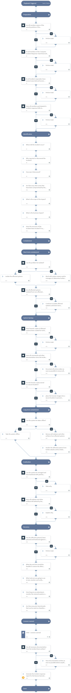

Follows the "Incident Handler's Checklist" described in the SANS Institute ‘[Incident Handler’s Handbook](https://www.sans.org/reading-room/whitepapers/incident/incident-handlers-handbook-33901)’ by Patrick Kral.

***Disclaimer: This playbook does not ensure compliance to SANS regulations.

## Dependencies
This playbook uses the following sub-playbooks, integrations, and scripts.

### Sub-playbooks
* SANS - Lessons Learned

### Integrations
This playbook does not use any integrations.

### Scripts
* GenerateInvestigationSummaryReport

### Commands
This playbook does not use any commands.

## Playbook Inputs
---

| **Name** | **Description** | **Required** |
| --- | --- | --- |
| DataCollection | The data collection task to use to answer lessons learned questions based on SANS. Specify "True" to automatically send the communication task, and "False" to prevent it. |Optional |
| Email | The email address to which to send the questions. | Optional |

## Playbook Outputs
---
There are no outputs for this playbook.
## Playbook Image
---

