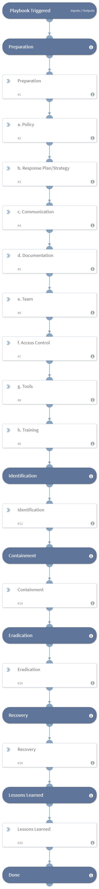

Contains the phases for handling an incident as they are described in the SANS Institute ‘[Incident Handler's Handbook](https://www.sans.org/reading-room/whitepapers/incident/incident-handlers-handbook-33901)’ by Patrick Kral.

***Disclaimer: This playbook does not ensure compliance to SANS regulations.

## Dependencies
This playbook uses the following sub-playbooks, integrations, and scripts.

### Sub-playbooks
This playbook does not use any sub-playbooks.

### Integrations
This playbook does not use any integrations.

### Scripts
This playbook does not use any scripts.

### Commands
This playbook does not use any commands.

## Playbook Inputs
---
There are no inputs for this playbook.

## Playbook Outputs
---
There are no outputs for this playbook.

## Playbook Image
---

## Playbook Demo Video
<video controls>
    <source src="https://github.com/demisto/content-assets/raw/7982404664dc68c2035b7c701d093ec026628802/Assets/SANS/SANS-Demo.mp4"
            type="video/mp4"/>
    Sorry, your browser doesn't support embedded videos. You can download the video at: https://github.com/demisto/content-assets/blob/7982404664dc68c2035b7c701d093ec026628802/Assets/SANS/SANS-Demo.mp4
</video>