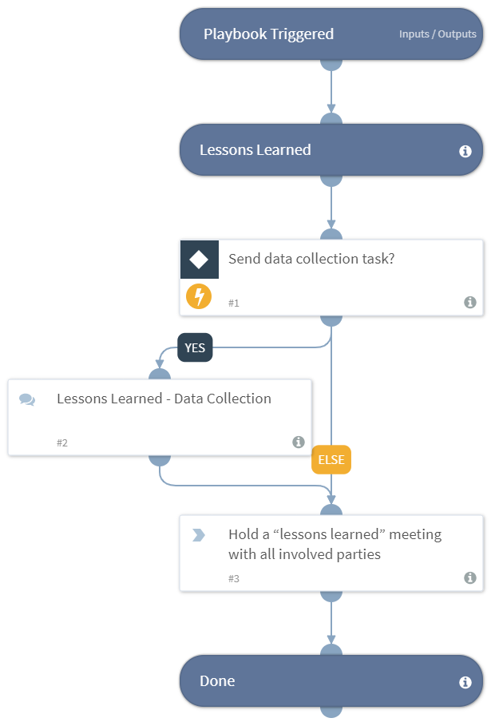

Assists in post-processing an incident and facilitates the lessons learned stage, as presented by SANS Institute ‘[Incident Handler’s Handbook](https://www.sans.org/reading-room/whitepapers/incident/incident-handlers-handbook-33901)’ by Patrick Kral.

***Disclaimer: This playbook does not ensure compliance to SANS regulations.

## Dependencies
This playbook uses the following sub-playbooks, integrations, and scripts.

### Sub-playbooks
This playbook does not use any sub-playbooks.

### Integrations
This playbook does not use any integrations.

### Scripts
This playbook does not use any scripts.

### Commands
This playbook does not use any commands.

## Playbook Inputs
---

| **Name** | **Description** | **Required** |
| --- | --- | --- | 
| DataCollection | Uses a data collection task to answer lessons learned questions based on SANS. Specify "True" to automatically send the communication task, and "False"  to prevent it. | Optional |
| Email | The email address to which to send the questions. | Optional |

## Playbook Outputs
---

| **Path** | **Description** | **Type** |
| --- | --- | --- |
| SANS - Lessons Learned.Answers.0 | The time the problem was first detected and by whom. | longText |
| SANS - Lessons Learned.Answers.1 | The scope of the incident. | longText |
| SANS - Lessons Learned.Answers.2 | The way the incident was contained and eradicated. | longText |
| SANS - Lessons Learned.Answers.3 | The work performed during recovery. | longText |
| SANS - Lessons Learned.Answers.4 | The areas where the CIRT teams were effective. | longText |
| SANS - Lessons Learned.Answers.5 | The areas that need improvement. | longText |
| SANS - Lessons Learned.Answers.6 | Share ideas and information in order to improve team effectiveness in future incidents. | longText |
| SANS - Lessons Learned.Answers.name | The answered username or email address. | unknown |

## Playbook Image
---

