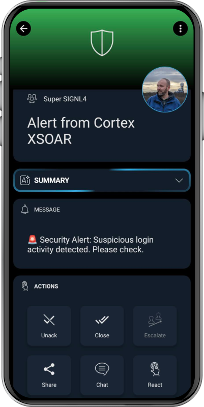

SIGNL4 offers critical alerting, incident response and service dispatching for operating critical infrastructure. It alerts you persistently via app push, SMS text, voice calls, and email including tracking, escalation, on-call duty scheduling and collaboration.

## Configure SIGNL4 on Cortex XSOAR

1. Navigate to **Settings** > **Integrations** > **Servers & Services**.
2. Search for SIGNL4.
3. Click **Add instance** to create and configure a new integration instance.

    | **Parameter** | **Description** | **Required** |
    | --- | --- | --- |
    | SIGNL4 team or integration secret |  | True |
    | Use system proxy settings |  | False |

4. Click **Test** to validate the URLs, token, and connection.

## Commands

You can execute these commands from the Cortex XSOAR CLI, as part of an automation, or in a playbook.
After you successfully execute a command, a SIGNL4 alert is either triggered or closed.

### signl4_alert

***
Sends a mobile alert to a SIGNL4 team.

#### Base Command

`signl4_alert`

#### Input

| **Argument Name** | **Description** | **Required** |
| --- | --- | --- |
| title | The title of the SIGNL4 alert. | Required | 
| message | The message of the SIGNL4 alert. | Required | 
| s4_external_id | The external ID is used to reference the alert in order to close it later. | 
| s4_service | The SIGNL4 category to use for this alert. | Optional | 
| s4_location | Transmit location information ('latitude, longitude') with your event and display a map in the mobile app. | Optional | 
|  s4_alerting_scenario | If this event triggers an, allows to control how SIGNL4 notifies the team. single_ack: Only one person needs to acknowledge this alert. multi_ack: The alert must be confirmed by the number of people who are on duty at the time this alert is created. emergency: All people in the team are notified regardless of their duty status and must acknowledge the alert, which is also assigned to the built-in emergency category. | Optional | 
| s4_filtering | Specify a boolean value of true or false to apply event filtering for this event, or not. If set to true, the event will only trigger a notification to the team, if it contains at least one keyword from one of your services and system categories (i.e. it is whitelisted). | Optional | 

#### Context Output

| **Path** | **Type** | **Description** |
| --- | --- | --- |
| SIGNL4.AlertCreated.eventId | String | SIGNL4 event ID. | 

#### Command example
```!signl4-alert name="Test Alert"```
#### Context Example
```json
{
    "title": "Alert from Cortex XSOAR",
    "message": "Hello world.",
    "s4_external_id": "id1234"
}
```

#### Human Readable Output

SIGNL4 alert created
```json

{
        "s4_external_id": "id1234"
}
```

### signl4_close

***
Close a SIGNL4 alert.

#### Base Command

`signl4_close_alert `

#### Input

| **Argument Name** | **Description** | **Required** |
| --- | --- | --- |
| s4_external_id | The external ID is used to reference the open alert which shall be closed. | 

#### Context Output

| **Path** | **Type** | **Description** |
| --- | --- | --- |
| SIGNL4.AlertClosed.eventId | String | SIGNL4 event ID. | 

#### Command example
```!signl4_close_alert name="Close Alert"```
#### Context Example
```json
{
        "s4_external_id": "id1234"
}
```

#### Human Readable Output

SIGNL4 alert closed
```json

{
        "s4_external_id": "id1234"
}
```

This is how a SIGNL4 might look like in the mobile app:


