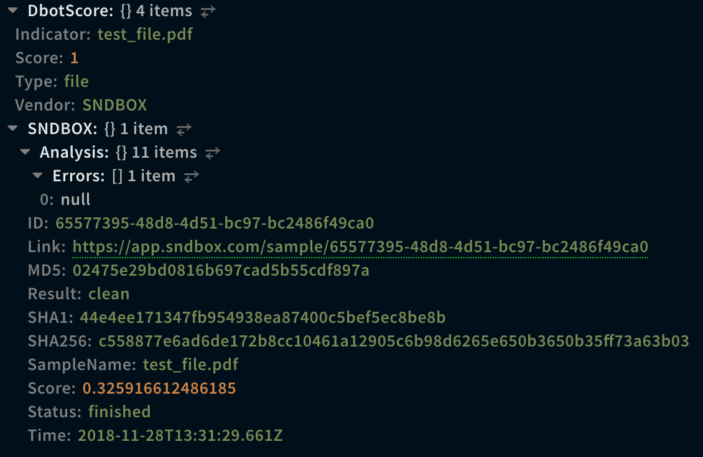
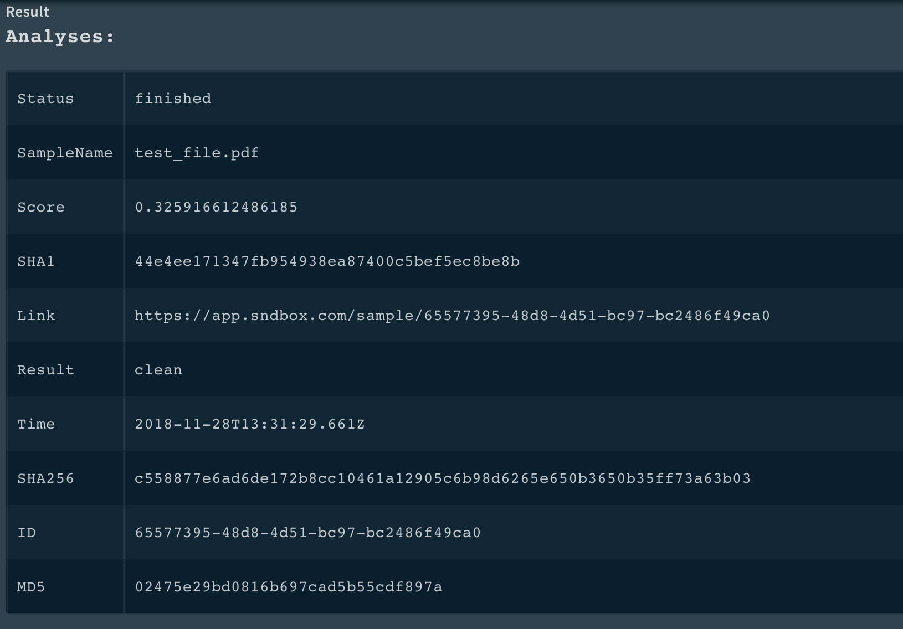
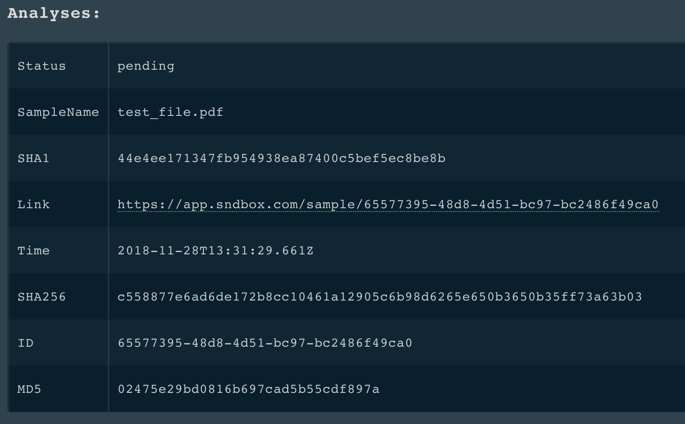
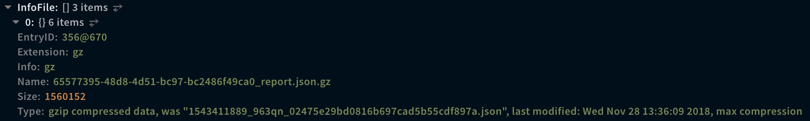
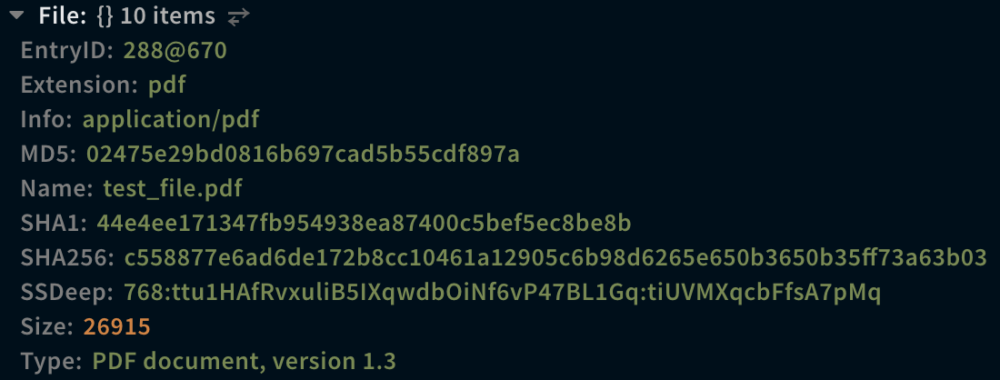

<!-- HTML_DOC -->
<h2> </h2>

Use the SNDBOX integration to detect and analyze potentially malicious files.

<h2>SNDBOX Playbook</h2>
<ul>
<li>Detonate File - SNDBOX</li>
</ul>
<h2>Use Cases</h2>
<ul>
<li>Sample a file.</li>
<li>Get information on an old analysis.</li>
</ul>
<h2>Supported File Types</h2>

SNDBOX supports the following file types:

<ul>
<li>
<strong>Microsoft (2003 and earlier):</strong> doc, dot, xls, csv, xlt, xlm, ppt, pot, pps</li>
<li>
<strong>Microsoft (2007 and later):</strong> docx, docm, dotx, dotm, dotm, xlsx, xlsm, xltx, xltm, xlsb, xla, xlam, iqy, pptx, pptm, potx, ppsx, xml</li>
<li>
<strong>Other:</strong> pe32, rtf, pdf, vbs, vbe, ps1, js, lnk, html, bat</li>
</ul>
<h2>Configure SNDBOX on Cortex XSOAR</h2>
<ol>
<li>Navigate to <strong>Settings</strong> &gt; <strong>Integrations</strong> &gt; <strong>Servers &amp; Services</strong>.</li>
<li>Search for SNDBOX.</li>
<li>Click <strong>Add instance</strong> to create and configure a new integration instance. 
<ul>
<li>
<strong>Name</strong>: a textual name for the integration instance.</li>
<li><strong>Use Public API Key. (By approving SNDBOX public API you are accepting SNDBOX TOS @ https://app.sndbox.com/tos). Public submissions are shared with the community</strong></li>
<li><strong>Private API Key</strong></li>
<li><strong>Use system proxy settings</strong></li>
<li><strong>Trust any certificate (not secure)</strong></li>
<li><strong>Max. Polling Time (in seconds):</strong></li>
<li><strong>Verbose (show log in case of error)</strong></li>
</ul>
</li>
<li>Click <strong>Test</strong> to validate the URLs, token, and connection.</li>
</ol>
<h2>Commands</h2>

You can execute these commands from the Cortex XSOAR CLI, as part of an automation, or in a playbook. After you successfully execute a command, a DBot message appears in the War Room with the command details.

<ol>
<li><a href="#h_807880410631544531950786">Check SNDBOX status: sndbox-is-online</a></li>
<li><a href="#h_6555639421231544531955045">Get information for an analysis: sndbox-analysis-info</a></li>
<li><a href="#h_2304130541861544531959006">Submit a sample for analysis: sndbox-analysis-submit-sample</a></li>
<li><a href="#h_5502284292481544531962948">Download a report resource: sndbox-download-report</a></li>
<li><a href="#h_3020137963091544531966873">(Deprecated) Detonate a report: sndbox-detonate-file</a></li>
<li><a href="#h_8143433413691544531970764">Download a file sample of an analysis: sndbox-download-sample</a></li>
</ol>
<h3 id="h_807880410631544531950786">1. Check SNDBOX status</h3>

Checks if SNDBOX is online or in maintenance mode.

<h5>Base Command</h5>

<code>sndbox-is-online</code>

<h5>Input</h5>

There is no input for this command. 

<h5>Context Output</h5>

There is no context output for this command.

<h3 id="h_6555639421231544531955045">2. Get information for an analysis</h3>

Show information about an analysis.

<h5>Base Command</h5>

<code>sndbox-analysis-info</code>

<h5>Input</h5>
<table style="width: 748px;" border="2" cellpadding="6">
<thead>
<tr>
<th style="width: 163px;"><strong>Argument Name</strong></th>
<th style="width: 449px;"><strong>Description</strong></th>
<th style="width: 96px;"><strong>Required</strong></th>
</tr>
</thead>
<tbody>
<tr>
<td style="width: 163px;">analysis_id</td>
<td style="width: 449px;">Analysis IDs, supports CSV arrays</td>
<td style="width: 96px;">Required</td>
</tr>
</tbody>
</table>
<h5> </h5>
<h5>Context Output</h5>
<table style="width: 748px;" border="2" cellpadding="6">
<thead>
<tr>
<th style="width: 287px;"><strong>Path</strong></th>
<th style="width: 91px;"><strong>Type</strong></th>
<th style="width: 330px;"><strong>Description</strong></th>
</tr>
</thead>
<tbody>
<tr>
<td style="width: 287px;">SNDBOX.Analysis.ID</td>
<td style="width: 91px;">string</td>
<td style="width: 330px;">Analysis ID</td>
</tr>
<tr>
<td style="width: 287px;">SNDBOX.Analysis.SampleName</td>
<td style="width: 91px;">string</td>
<td style="width: 330px;">Sample data</td>
</tr>
<tr>
<td style="width: 287px;">SNDBOX.Analysis.Status</td>
<td style="width: 91px;">string</td>
<td style="width: 330px;">Analysis status</td>
</tr>
<tr>
<td style="width: 287px;">SNDBOX.Analysis.Time</td>
<td style="width: 91px;">date</td>
<td style="width: 330px;">Submitted time</td>
</tr>
<tr>
<td style="width: 287px;">SNDBOX.Analysis.Score</td>
<td style="width: 91px;">float</td>
<td style="width: 330px;">Analysis score</td>
</tr>
<tr>
<td style="width: 287px;">SNDBOX.Analysis.Result</td>
<td style="width: 91px;">string</td>
<td style="width: 330px;">Analysis results</td>
</tr>
<tr>
<td style="width: 287px;">SNDBOX.Analysis.Errors</td>
<td style="width: 91px;">unknown</td>
<td style="width: 330px;">Raised errors during sampling</td>
</tr>
<tr>
<td style="width: 287px;">SNDBOX.Analysis.Link</td>
<td style="width: 91px;">string</td>
<td style="width: 330px;">Analysis link</td>
</tr>
<tr>
<td style="width: 287px;">SNDBOX.Analysis.MD5</td>
<td style="width: 91px;">string</td>
<td style="width: 330px;">MD5 of analysis sample</td>
</tr>
<tr>
<td style="width: 287px;">SNDBOX.Analysis.SHA1</td>
<td style="width: 91px;">string</td>
<td style="width: 330px;">SHA-1 of analysis sample</td>
</tr>
<tr>
<td style="width: 287px;">SNDBOX.Analysis.SHA256</td>
<td style="width: 91px;">string</td>
<td style="width: 330px;">SHA-256 of analysis sample</td>
</tr>
<tr>
<td style="width: 287px;">DBotScore.Vendor</td>
<td style="width: 91px;">string</td>
<td style="width: 330px;">Vendor name: SNDBOX</td>
</tr>
<tr>
<td style="width: 287px;">DBotScore.Indicator</td>
<td style="width: 91px;">unknown</td>
<td style="width: 330px;">The name of the sample file</td>
</tr>
<tr>
<td style="width: 287px;">DBotScore.Type</td>
<td style="width: 91px;">string</td>
<td style="width: 330px;">File type</td>
</tr>
<tr>
<td style="width: 287px;">DBotScore.Score</td>
<td style="width: 91px;">number</td>
<td style="width: 330px;">The actual score</td>
</tr>
<tr>
<td style="width: 287px;">DBotScore.Malicious.Vendor</td>
<td style="width: 91px;">string</td>
<td style="width: 330px;">Vendor name: SNDBOX</td>
</tr>
<tr>
<td style="width: 287px;">DBotScore.Malicious.Detections</td>
<td style="width: 91px;">string</td>
<td style="width: 330px;">The sub-analysis detection statuses</td>
</tr>
<tr>
<td style="width: 287px;">DBotScore.Malicious.SHA1</td>
<td style="width: 91px;">string</td>
<td style="width: 330px;">SHA-1 of the file</td>
</tr>
</tbody>
</table>
<h5> </h5>
<h5>Command Example</h5>
<pre><code>!sndbox-analysis-info analysis_id="65577395-48d8-4d51-bc97-bc2486f49ca0"</code></pre>
<h5>Context Example</h5>

<h5>Human Readable Output</h5>

<h3 id="h_2304130541861544531959006">3. Submit a sample for analysis</h3>

Submit a sample for analysis.

<h5>Base Command</h5>

<code>sndbox-analysis-submit-sample</code>

<h5>Input</h5>
<table style="width: 750px;" border="2" cellpadding="6">
<thead>
<tr>
<th><strong>Argument Name</strong></th>
<th><strong>Description</strong></th>
<th><strong>Required</strong></th>
</tr>
</thead>
<tbody>
<tr>
<td>file_id</td>
<td>War Room entry of a file, e.g., 3245@4</td>
<td>Optional</td>
</tr>
<tr>
<td>should_wait</td>
<td>Should the command poll for the result of the analysis</td>
<td>Optional</td>
</tr>
</tbody>
</table>
<h5> </h5>
<h5>Context Output</h5>
<table style="width: 746px;" border="2" cellpadding="6">
<thead>
<tr>
<th style="width: 265px;"><strong>Path</strong></th>
<th style="width: 76px;"><strong>Type</strong></th>
<th style="width: 367px;"><strong>Description</strong></th>
</tr>
</thead>
<tbody>
<tr>
<td style="width: 265px;">SNDBOX.Analysis.ID</td>
<td style="width: 76px;">string</td>
<td style="width: 367px;">Analysis ID</td>
</tr>
<tr>
<td style="width: 265px;">SNDBOX.Analysis.SampleName</td>
<td style="width: 76px;">string</td>
<td style="width: 367px;">Sample data, (file name or URL)</td>
</tr>
<tr>
<td style="width: 265px;">SNDBOX.Analysis.Status</td>
<td style="width: 76px;">string</td>
<td style="width: 367px;">Analysis status</td>
</tr>
<tr>
<td style="width: 265px;">SNDBOX.Analysis.Time</td>
<td style="width: 76px;">date</td>
<td style="width: 367px;">Submitted time</td>
</tr>
<tr>
<td style="width: 265px;">SNDBOX.Analysis.Result</td>
<td style="width: 76px;">string</td>
<td style="width: 367px;">Analysis results</td>
</tr>
<tr>
<td style="width: 265px;">SNDBOX.Analysis.Errors</td>
<td style="width: 76px;">unknown</td>
<td style="width: 367px;">Raised errors during sampling</td>
</tr>
<tr>
<td style="width: 265px;">SNDBOX.Analysis.Link</td>
<td style="width: 76px;">string</td>
<td style="width: 367px;">Analysis Link</td>
</tr>
<tr>
<td style="width: 265px;">SNDBOX.Analysis.MD5</td>
<td style="width: 76px;">string</td>
<td style="width: 367px;">MD5 of analysis sample</td>
</tr>
<tr>
<td style="width: 265px;">SNDBOX.Analysis.SHA1</td>
<td style="width: 76px;">string</td>
<td style="width: 367px;">SHA-1 of analysis sample</td>
</tr>
<tr>
<td style="width: 265px;">SNDBOX.Analysis.SHA256</td>
<td style="width: 76px;">string</td>
<td style="width: 367px;">SHA-256 of analysis sample</td>
</tr>
<tr>
<td style="width: 265px;">DBotScore.Vendor</td>
<td style="width: 76px;">string</td>
<td style="width: 367px;">Vendor name: SNDBOX</td>
</tr>
<tr>
<td style="width: 265px;">DBotScore.Indicator</td>
<td style="width: 76px;">unknown</td>
<td style="width: 367px;">The name of the sample file or URL</td>
</tr>
<tr>
<td style="width: 265px;">DBotScore.Type</td>
<td style="width: 76px;">string</td>
<td style="width: 367px;">'url' for url samples, otherwise 'file'</td>
</tr>
<tr>
<td style="width: 265px;">DBotScore.Score</td>
<td style="width: 76px;">number</td>
<td style="width: 367px;">The actual score</td>
</tr>
<tr>
<td style="width: 265px;">DBotScore.Malicious.Vendor</td>
<td style="width: 76px;">string</td>
<td style="width: 367px;">Vendor name: SNDBOX</td>
</tr>
<tr>
<td style="width: 265px;">DBotScore.Malicious.SHA1</td>
<td style="width: 76px;">string</td>
<td style="width: 367px;">SHA-1 of the file</td>
</tr>
</tbody>
</table>
<h5> </h5>
<h5>Command Example</h5>
<pre><code>!sndbox-analysis-submit-sample file_id="288@670"</code></pre>
<h5>Context Example</h5>

<h5>Human Readable Output</h5>

<h3 id="h_5502284292481544531962948">4. Download a report resource</h3>

Download a resource belonging to a report. This can be the full report, dropped binaries, etc.

<h5>Base Command</h5>

<code>sndbox-download-report</code>

<h5>Input</h5>
<table style="width: 746px;" border="2" cellpadding="6">
<thead>
<tr>
<th style="width: 160px;"><strong>Argument Name</strong></th>
<th style="width: 453px;"><strong>Description</strong></th>
<th style="width: 95px;"><strong>Required</strong></th>
</tr>
</thead>
<tbody>
<tr>
<td style="width: 160px;">analysis_id</td>
<td style="width: 453px;">Analysis ID</td>
<td style="width: 95px;">Required</td>
</tr>
<tr>
<td style="width: 160px;">type</td>
<td style="width: 453px;">The resource type to download. Default is JSON.</td>
<td style="width: 95px;">Optional</td>
</tr>
</tbody>
</table>
<h5> </h5>
<h5>Context Output</h5>
<table style="width: 748px;" border="2" cellpadding="6">
<thead>
<tr>
<th style="width: 231px;"><strong>Path</strong></th>
<th style="width: 114px;"><strong>Type</strong></th>
<th style="width: 363px;"><strong>Description</strong></th>
</tr>
</thead>
<tbody>
<tr>
<td style="width: 231px;">InfoFile.Name</td>
<td style="width: 114px;">string</td>
<td style="width: 363px;">File name</td>
</tr>
<tr>
<td style="width: 231px;">InfoFile.EntryID</td>
<td style="width: 114px;">string</td>
<td style="width: 363px;">The EntryID of the report</td>
</tr>
<tr>
<td style="width: 231px;">InfoFile.Size</td>
<td style="width: 114px;">number</td>
<td style="width: 363px;">File size</td>
</tr>
<tr>
<td style="width: 231px;">InfoFile.Type</td>
<td style="width: 114px;">string</td>
<td style="width: 363px;">File type, e.g., "PE"</td>
</tr>
<tr>
<td style="width: 231px;">InfoFile.Info</td>
<td style="width: 114px;">string</td>
<td style="width: 363px;">Basic information of the file</td>
</tr>
<tr>
<td style="width: 231px;">InfoFile.Extension</td>
<td style="width: 114px;">string</td>
<td style="width: 363px;">File extension</td>
</tr>
</tbody>
</table>
<h5> </h5>
<h5>Command Example</h5>
<pre><code>!sndbox-download-report analysis_id=65577395-48d8-4d51-bc97-bc2486f49ca0 type=json</code></pre>
<h5>Context Example</h5>

<h5>Human Readable Output</h5>

<h3 id="h_3020137963091544531966873">5. (Deprecated) Detonate a file</h3>

Submit a sample for detonation. This command is deprecated.

<h5>Base Command</h5>

<code>sndbox-detonate-file</code>

<h5>Input</h5>
<table style="width: 748px;" border="2" cellpadding="6">
<thead>
<tr>
<th style="width: 165px;"><strong>Argument Name</strong></th>
<th style="width: 447px;"><strong>Description</strong></th>
<th style="width: 96px;"><strong>Required</strong></th>
</tr>
</thead>
<tbody>
<tr>
<td style="width: 165px;">file_id</td>
<td style="width: 447px;">War Room entry of a file, e.g., 3245@4</td>
<td style="width: 96px;">Optional</td>
</tr>
</tbody>
</table>
<h5> </h5>
<h5>Context Output</h5>
<table style="width: 750px;" border="2" cellpadding="6">
<thead>
<tr>
<th><strong>Path</strong></th>
<th><strong>Type</strong></th>
<th><strong>Description</strong></th>
</tr>
</thead>
<tbody>
<tr>
<td>SNDBOX.Analysis.ID</td>
<td>string</td>
<td>Analysis ID</td>
</tr>
<tr>
<td>SNDBOX.Analysis.SampleName</td>
<td>string</td>
<td>Sample data (file name or URL)</td>
</tr>
<tr>
<td>SNDBOX.Analysis.Status</td>
<td>string</td>
<td>Analysis status</td>
</tr>
<tr>
<td>SNDBOX.Analysis.Time</td>
<td>date</td>
<td>Submitted time</td>
</tr>
<tr>
<td>SNDBOX.Analysis.Result</td>
<td>string</td>
<td>Analysis results</td>
</tr>
<tr>
<td>SNDBOX.Analysis.Errors</td>
<td>unknown</td>
<td>Raised errors during sampling</td>
</tr>
<tr>
<td>SNDBOX.Analysis.Link</td>
<td>string</td>
<td>Analysis link</td>
</tr>
<tr>
<td>SNDBOX.Analysis.MD5</td>
<td>string</td>
<td>MD5 of analysis sample</td>
</tr>
<tr>
<td>SNDBOX.Analysis.SHA1</td>
<td>string</td>
<td>SHA-1 of analysis sample</td>
</tr>
<tr>
<td>SNDBOX.Analysis.SHA256</td>
<td>string</td>
<td>SHA-256 of analysis sample</td>
</tr>
<tr>
<td>DBotScore.Vendor</td>
<td>string</td>
<td>Vendor name: SNDBOX</td>
</tr>
<tr>
<td>DBotScore.Indicator</td>
<td>unknown</td>
<td>The name of the sample file or URL</td>
</tr>
<tr>
<td>DBotScore.Type</td>
<td>string</td>
<td>File</td>
</tr>
<tr>
<td>DBotScore.Score</td>
<td>number</td>
<td>The actual score</td>
</tr>
<tr>
<td>DBotScore.Malicious.Vendor</td>
<td>string</td>
<td>Vendor name: SNDBOX</td>
</tr>
<tr>
<td>DBotScore.Malicious.Detections</td>
<td>string</td>
<td>The sub-analysis detection statuses</td>
</tr>
<tr>
<td>DBotScore.Malicious.SHA1</td>
<td>string</td>
<td>SHA-1 of the file</td>
</tr>
</tbody>
</table>
<h5> </h5>
<h5> </h5>
<h3 id="h_8143433413691544531970764">6. Download the sample file of an analysis</h3>

Download the sample file of an analysis. For security reasons, the file extension will be .dontrun.

<h5>Base Command</h5>

<code>sndbox-download-sample</code>

<h5>Input</h5>
<table style="width: 748px;" border="2" cellpadding="6">
<thead>
<tr>
<th style="width: 301px;"><strong>Argument Name</strong></th>
<th style="width: 227px;"><strong>Description</strong></th>
<th style="width: 180px;"><strong>Required</strong></th>
</tr>
</thead>
<tbody>
<tr>
<td style="width: 301px;">analysis_id</td>
<td style="width: 227px;">Analysis ID</td>
<td style="width: 180px;">Required</td>
</tr>
</tbody>
</table>
<h5> </h5>
<h5>Context Output</h5>
<table style="width: 748px;" border="2" cellpadding="6">
<thead>
<tr>
<th style="width: 186px;"><strong>Path</strong></th>
<th style="width: 121px;"><strong>Type</strong></th>
<th style="width: 401px;"><strong>Description</strong></th>
</tr>
</thead>
<tbody>
<tr>
<td style="width: 186px;">File.Size</td>
<td style="width: 121px;">number</td>
<td style="width: 401px;">File size</td>
</tr>
<tr>
<td style="width: 186px;">File.SHA1</td>
<td style="width: 121px;">string</td>
<td style="width: 401px;">SHA-1 hash of the file</td>
</tr>
<tr>
<td style="width: 186px;">File.SHA256</td>
<td style="width: 121px;">string</td>
<td style="width: 401px;">SHA-256 hash of the file</td>
</tr>
<tr>
<td style="width: 186px;">File.Name</td>
<td style="width: 121px;">string</td>
<td style="width: 401px;">The sample name</td>
</tr>
<tr>
<td style="width: 186px;">File.SSDeep</td>
<td style="width: 121px;">string</td>
<td style="width: 401px;">SSDeep hash of the file</td>
</tr>
<tr>
<td style="width: 186px;">File.EntryID</td>
<td style="width: 121px;">string</td>
<td style="width: 401px;">War Room entry ID of the file</td>
</tr>
<tr>
<td style="width: 186px;">File.Info</td>
<td style="width: 121px;">string</td>
<td style="width: 401px;">Basic information of the file</td>
</tr>
<tr>
<td style="width: 186px;">File.Type</td>
<td style="width: 121px;">string</td>
<td style="width: 401px;">File type, e.g., "PE"</td>
</tr>
<tr>
<td style="width: 186px;">File MD5</td>
<td style="width: 121px;">string</td>
<td style="width: 401px;">MD5 hash of the file</td>
</tr>
<tr>
<td style="width: 186px;">File.Extension</td>
<td style="width: 121px;">string</td>
<td style="width: 401px;">File extension</td>
</tr>
</tbody>
</table>
<h5> </h5>
<h5>Command Example</h5>
<pre><code>!sndbox-download-sample analysis_id=65577395-48d8-4d51-bc97-bc2486f49ca0</code></pre>
<h5>Context Example</h5>

