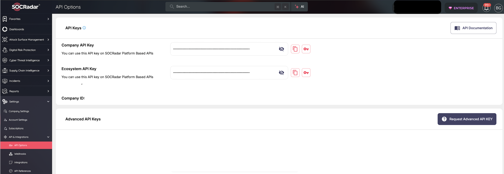

Fetches SOCRadar incidents with desired parameters so that relevant actions over the incidents can be taken by using Cortex XSOAR.
This integration was integrated and tested with version 1.0 of SOCRadarIncidents.

## Configure SOCRadarIncidents on Cortex XSOAR

1. Navigate to **Settings** > **Integrations** > **Servers & Services**.
2. Search for SOCRadarIncidents.
3. Click **Add instance** to create and configure a new integration instance.

    | **Parameter** | **Description** | **Required** |
    | --- | --- | --- |
    | API Key | The API Key to use for connection to SOCRadar. | True |
    | proxy | Whether to use XSOAR’s system proxy settings to connect to the API. | False |
    | insecure | Trust any certificate (not secure). | False |
    | isFetch | Enable fetch incidents. | False |
    | first_fetch | Date or relative timestamp to start fetching incidents from. | False |
    | socradar_company_id | Company ID in SOCRadar to fetch incidents. | True |
    | severity | Severity level\(s\) of incidents to fetch. Leave blank to fetch all. | False |
    | max_fetch | Maximum number of incidents to fetch in each integration execution interval. (Limited to max 50) | False |
    | resolution_status | Resolution Status of Incidents to Fetch. (All, Resolved, Not Resolved) | False |
    | fp_status | False Positive Status of Incidents to Fetch. (All, FP, Not FP) | False |
    | incident_main_type | Main Type of Incidents to Fetch. | False |
    | incident_sub_type | Sub Type of Incidents to Fetch. | False |

4. Click **Test** to validate API key and connection to SOCRadar.

### How to obtain SOCRadar Incident API key?

Every company has a unique API key in SOCRadar platform. This API key can be used to benefit from
various API endpoints that SOCRadar provides. 

You can obtain your company's API key from your company's settings page by navigating to the 
`API Options` tab. Besides, API key can be regenerated by using `Actions` button under the API 
keys panel.

 

For further information about the SOCRadar API keys please see [SOCRadar API](https://platform.socradar.com/docs/api/intro/) documentation.

## Commands
You can execute these commands from the Cortex XSOAR CLI, as part of an automation, or in a playbook.
After you successfully execute a command, a DBot message appears in the War Room with the command details.

1. socradar-mark-incident-fp
2. socradar-mark-incident-resolved
### socradar-mark-incident-fp
***
Marks incident as false positive in SOCRadar platform.


#### Base Command

`socradar-mark-incident-fp`
#### Input

| **Argument Name** | **Description** | **Required** |
| --- | --- | --- |
| socradar_incident_id | SOCRadar Incident ID to be marked as false positive. | Required | 
| comments | Comments about false positive action over the incident. | Optional | 


#### Context Output

There is no context output for this command.

#### Command Example
```!socradar-mark-incident-fp socradar_incident_id="29051453" comments="Example comment on FP action." ```

#### Context Example
```
{
    "data": null,
    "is_success": true,
    "message": "False positive action has been successfully taken. Affected incident IDs: 29051453",
    "response_code": 200
}
```

#### Human Readable Output

SOCRadar API Response: False positive action has been successfully taken. Affected incident IDs: 29051453

### socradar-mark-incident-resolved
***
Marks incident as resolved in SOCRadar platform.


#### Base Command

`socradar-mark-incident-resolved`
#### Input

| **Argument Name** | **Description** | **Required** |
| --- | --- | --- |
| socradar_incident_id | SOCRadar Incident ID to be marked as resolved. | Required | 
| comments | Comments about resolved action over the incident. | Optional | 


#### Context Output

There is no context output for this command.

#### Command Example
```!socradar-mark-incident-resolved socradar_incident_id="29051453" comments="Example comment on resolve action." ```

#### Context Example
```
{
    "data": null,
    "is_success": true,
    "message": "Incident has been successfully resolved. Affected incident IDs: 29051453",
    "response_code": 200
}
```

#### Human Readable Output

SOCRadar API Response: Incident has been successfully resolved. Affected incident IDs: 29051453


