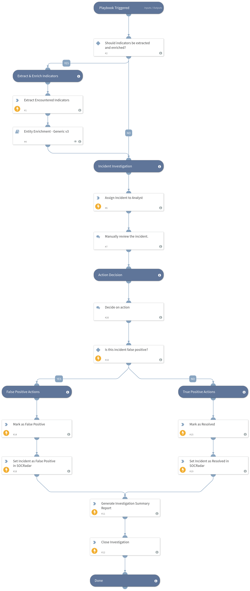

Performs indicator extraction and enrichment from the incident content, calculates the severity level, assigns the incident to a particular analyst, notifies SOCRadar platform for the incident response (to mark it as false positive or resolved) and generates investigation summary report just before closing the investigation in the end. This playbook is executed for the SOCRadar Generic incident type.

## Dependencies
This playbook uses the following sub-playbooks, integrations, and scripts.

### Sub-playbooks
* Entity Enrichment - Generic v3

### Integrations
* SOCRadarIncidents

### Scripts
* GenerateInvestigationSummaryReport
* AssignAnalystToIncident

### Commands
* closeInvestigation
* extractIndicators
* socradar-mark-incident-fp
* socradar-mark-incident-resolved
* setIncident

## Playbook Inputs

---
There are no inputs for this playbook.

## Playbook Outputs

---
There are no outputs for this playbook.

## Playbook Image

---
