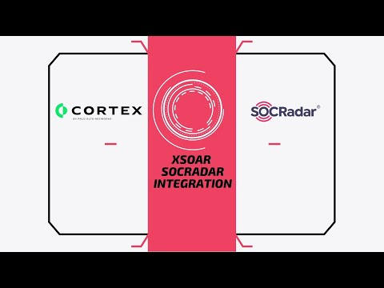

SOCRadar is a cloud-based external threat intelligence and digital risk protection platform. The platform has the automated capability of monitoring and processing data collected from internet (surface, deep and dark web sources), then turning this data into security intelligence as incidents and threat intelligence feeds (domain, IP, hash) to improve the existing detection/protection appliances of the customers.
## What does this pack do?
This pack allows you to integrate SOCRadar incidents with XSOAR. Automated integration fetches and populates incidents into XSOAR from SOCRadar platform along with all the details of the incident and leads XSOAR analyst to take relevant actions over the incidents such as:

- Marking the incident as false positive.
- Resolve the incident.
- Adding notes for the incident.

In short, you can perform the actions that an analyst would need to do on SOCRadar platform while responding an incident.

In addition to the incident management, this pack also provides an integration with SOCRadar ThreatFusion module which can be used to enrich indicators by obtaining enhanced information and reputation via SOCRadar. Supported indicator types for the SOCRadar reputation query are as follow:

- IPv4
- IPv6
- Domain
- File SHA-1
- File MD5

## How to use it?
You just need to install the pack and configure the SOCRadar integration instances in XSOAR. For the configuration phase you will need an active API key which can be obtained in the SOCRadar platform. For any further support and questions please feel free to contact with us via **operation@socradar.io**

### Demo Video
