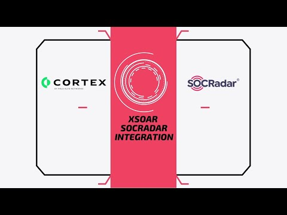

# SOCRadar Pack

SOCRadar is a cloud-based external threat intelligence and digital risk protection platform. The platform has the automated capability of monitoring and processing data collected from internet (surface, deep and dark web sources), then turning this data into security intelligence as incidents and threat intelligence feeds (domain, IP, hash) to improve the existing detection/protection appliances of the customers.

## What does this pack do?

### SOCRadar Incidents

This pack allows you to integrate SOCRadar incidents with XSOAR. Automated integration fetches and populates incidents into XSOAR from SOCRadar platform along with all the details of the incident and leads XSOAR analyst to take relevant actions over the incidents such as:

- Marking the incident as false positive.
- Resolve the incident.
- Adding notes for the incident.

### SOCRadar Incidents v4

This pack allows you to integrate SOCRadar incidents with XSOAR. Automated integration fetches and populates incidents into XSOAR from SOCRadar platform along with all the details of the incident and leads XSOAR analyst to take relevant actions over the incidents such as:

- Marking the incident as false positive.
- Resolve the incident.
- Adding notes for the incident.
- Add assignee
- Add comment
- Change status with related findings

In short, you can perform the actions that an analyst would need to do on SOCRadar platform while responding an incident.

In addition to the incident management, this pack also provides integrations with SOCRadar's threat intelligence capabilities:

### SOCRadar ThreatFusion

Enrich indicators by obtaining enhanced information and reputation via SOCRadar. Supported indicator types for the SOCRadar reputation query are as follow:

- IPv4
- IPv6
- Domain
- File SHA-1
- File MD5

### SOCRadar Rapid Reputation

Fast reputation checking for IPs, domains, URLs, and file hashes with bulk support:

- **Speed**: Sub-second response times for rapid triage
- **Bulk Operations**: Check up to 100 indicators at once with automatic rate limiting (1 req/sec)
- **Auto Detection**: Automatically identifies indicator types (IP, domain, URL, hash)
- **DBot Integration**: Full integration with XSOAR's scoring system
- **Whitelisting**: Built-in support for whitelisted entities
- **Threat Sources**: Aggregates data from multiple threat intelligence feeds

**Commands:**

- `!ip`, `!domain`, `!url`, `!file` - Check reputation for specific indicator types
- `!socradar-reputation` - Generic command with manual type specification
- `!socradar-bulk-check` - Bulk check mixed list of indicators with auto-detection

**Use Cases:**

- Fast incident triage and IOC screening
- Bulk validation of threat intelligence feeds
- Automated playbook integration for rapid reputation checks
- Daily security monitoring

### SOCRadar IoC Enrichment

Deep threat intelligence enrichment with comprehensive context:

- **Signal Strength**: 5 levels (Very Strong, Strong, Moderate, Slightly Noisy, Noisy)
- **Confidence Levels**: Cross-source validation (Very High, High, Medium, Low)
- **Activity Labels**: Track indicator activity over 1/7/30/90 day periods
- **Categorization**: 11 service categories (CDN, Cloud, Malware, ThreatActor, Tor, VPN, etc.)
- **Attribution**: Threat actor associations and campaign tracking
- **Premium Feeds**: Integration with SOCRadar premium threat feeds
- **Relations**: Related entities (up to 10 relations per indicator)
- **Historical Data**: Last 10 events with detailed feed information
- **Target Intelligence**: Industries and countries targeted
- **AI Insights**: Optional AI-generated threat analysis (disabled by default for performance)

**Commands:**

- `!ip`, `!domain`, `!url`, `!file` - Enrich specific indicator types with full threat intelligence
- `!socradar-ioc-enrichment` - Generic command with automatic type detection

**Use Cases:**

- Deep investigation of suspicious indicators
- Threat attribution and campaign analysis
- Understanding attacker infrastructure and tactics
- Incident context enrichment

### SOCRadar Threat Feed

Collection-based IoC feed integration for automated indicator ingestion:

- **Collection Management**: Use custom feed collections from SOCRadar platform via UUIDs
- **Multiple Collections**: Support for multiple collection UUIDs simultaneously
- **Incremental Feed**: Only fetches new or modified indicators
- **Auto Type Detection**: Automatically identifies IP, domain, URL, and hash indicators
- **Geolocation Data**: Full IP geolocation (ASN, CIDR, Country, City, Lat/Long, Timezone)
- **Feed Metadata**: Maintainer information, confidence scores, first/last seen dates
- **TLP Support**: Traffic Light Protocol color assignment
- **Custom Tags**: Add custom tags to ingested indicators
- **Scheduled Fetch**: Configurable fetch interval for automated ingestion

**Commands:**

- `!socradar-get-indicators` - Manually retrieve indicators from collections
- `!socradar-reset-fetch-indicators` - Reset fetch history

**Configuration:**

1. Log in to SOCRadar platform
2. Navigate to **Threat Intelligence > Feeds** section
3. Create custom collections or use existing ones
4. Copy collection UUID(s) from collection detail page
5. Enter UUID(s) in integration configuration
6. Configure fetch interval and limits
7. Set TLP color and custom tags

**Use Cases:**

- Automated threat intelligence feed ingestion
- Custom collection-based IOC management
- Integration with XSOAR's indicator lifecycle
- Scheduled threat intelligence updates

## Prerequisites & Licensing

Depending on the integrations you intend to use, different licensing and activation steps apply:

### 1. Standard API Licensing

The following integrations are included with standard API licensing and require a standard SOCRadar API Key (obtainable from the SOCRadar platform via **Settings → API Options / Keys**):

- SOCRadar Incidents
- SOCRadar Incidents v4
- SOCRadar Threat Feed

### 2. Advanced Intelligence API (Add-on or Standalone)

SOCRadar Rapid Reputation and SOCRadar IoC Enrichment operate using the Advanced Intelligence API, which is optimized for high-volume, deep context, and fast reputation queries.

- **Licensing Model:** The features of these modules are licensed separately from the standard SOCRadar platform package. To use these integrations, your API key must be explicitly activated with "Rapid Reputation" and/or "IoC Enrichment" privileges.
- **Standalone Purchase:** This service can be added to your existing SOCRadar subscription, or it can be purchased as a standalone key completely independent of a platform membership.
- **Purchase & Activation:** For API authorization, pricing information, or to purchase a new standalone key, please contact our support team at support@socradar.io.

### 3. Multi-Tenant Usage

To use Multi-tenant Incident API, the Multi-tenant Incidents API must be enabled. You must contact the MSSP Enablement Team to activate this specific API for your account. To activate, please contact our support team at **support@socradar.io**.

## Support

For Cortex XSOAR support, contact **xsoar@socradar.io** or visit <https://socradar.io>

### Demo Video

