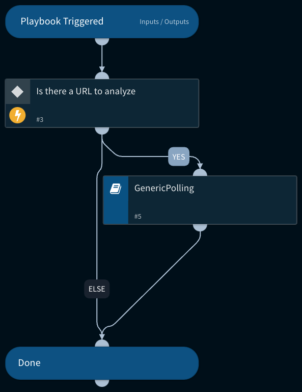

Analyze a host or URL using the SSL Labs integration. 

## Dependencies

This playbook uses the following sub-playbooks, integrations, and scripts.

### Sub-playbooks

* GenericPolling

### Integrations

This playbook does not use any integrations.

### Scripts

This playbook does not use any scripts.

### Commands

This playbook does not use any commands.

## Playbook Inputs

---

| **Name** | **Description** | **Default Value** | **Required** |
| --- | --- | --- | --- |
| URL | The URL object of the URL to be analyzed. | URL | Optional |

## Playbook Outputs

---
There are no outputs for this playbook.

## Playbook Image

---

