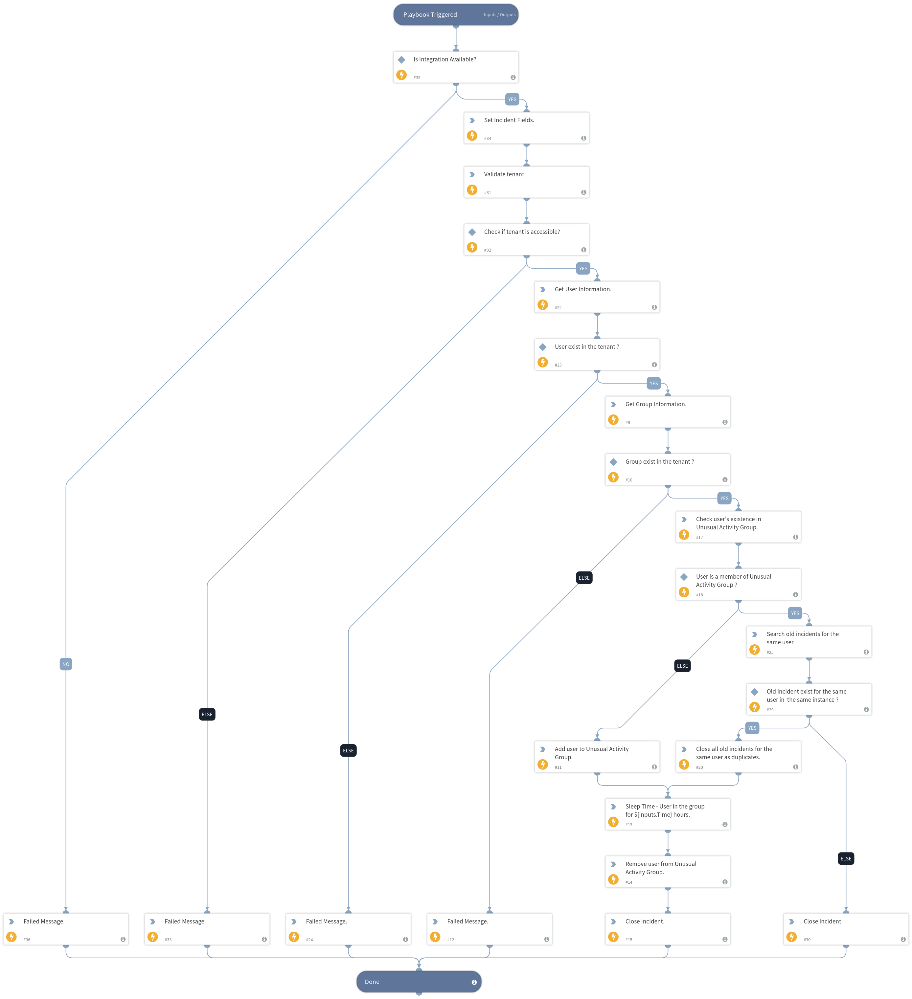

This playbook adds the user to a group that was created to identify unusual activity. SafeNet Trusted Access policies can be configured to take this into account and provide stronger protection when handling access events from users who are members of the group. The user is added to this group for a configurable period of time.

## Dependencies
This playbook uses the following sub-playbooks, integrations, and scripts.

### Sub-playbooks
This playbook does not use any sub-playbooks.

### Integrations
* SafeNetTrustedAccess

### Scripts
* IsIntegrationAvailable
* PrintErrorEntry
* Print
* SearchIncidentsV2
* Sleep

### Commands
* sta-remove-user-group
* closeInvestigation
* sta-validate-tenant
* sta-get-group-info
* sta-get-user-info
* setIncident
* sta-add-user-group
* sta-user-exist-group

## Playbook Inputs
---

| **Name** | **Description** | **Default Value** | **Required** |
| --- | --- | --- | --- |
| UserName | Username of the user. | ${incident.safenettrustedaccessusername} | Required |
| UnusualActivityGroup | Name of the Unusual Activity Group. | ${lists.sta_unusual_activity_group} | Required |
| InstanceName | Name of the SafeNet Trusted Access integration instance. | ${incident.safenettrustedaccessinstancename} | Required |
| Time | Amount of time for which the user will remain in the Unusual Activity Group. | ${lists.sta_user_in_unusual_activity_group_hours} | Required |

## Playbook Outputs
---
There are no outputs for this playbook.

## Playbook Image
---
