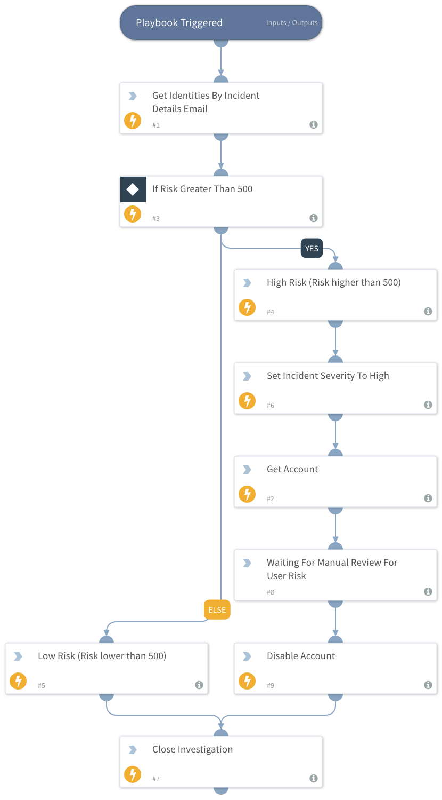

Checks if the risk score of an identity exceeds a set threshold of 500 and disables the accounts.

## Dependencies
This playbook uses the following sub-playbooks, integrations, and scripts.

### Sub-playbooks
This playbook does not use any sub-playbooks.

### Integrations
* SailPointIdentityIQ

### Scripts
This playbook does not use any scripts.

### Commands
* setIncident
* identityiq-disable-account
* identityiq-search-identities
* identityiq-get-accounts
* closeInvestigation

## Playbook Inputs
---
| **Name** | **Description** | **Default Value** | **Required** |
| --- | --- | --- | --- |
| email | Email of the identity. |  | Required |

## Playbook Outputs
---
There are no outputs for this playbook.

## Playbook Image
---
