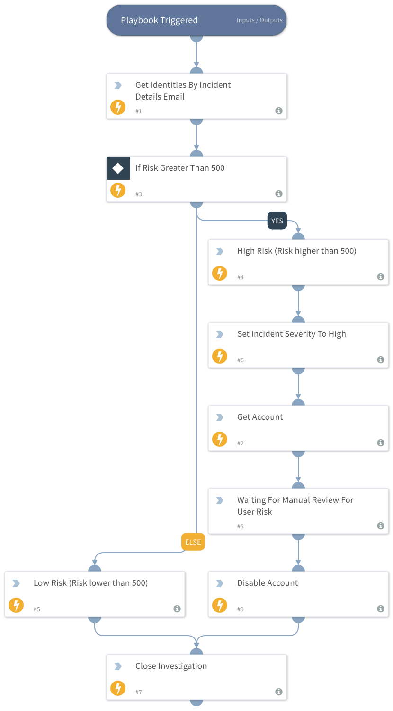
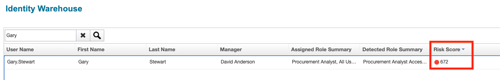
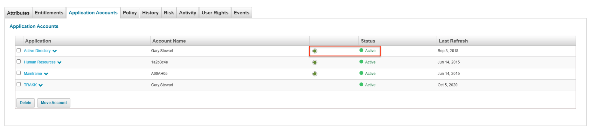
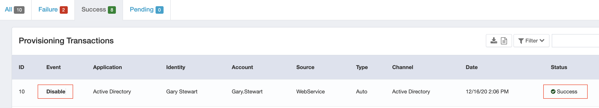
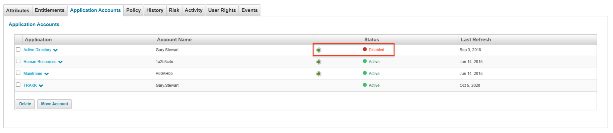

# SailPoint IdentityIQ

## Overview
Digital transformation has opened up opportunities for greater agility and growth in today’s modern enterprises. But it’s also introducing challenges. Digital transformation has introduced an explosion of cloud, applications, data, and users to manage. Being able to effectively control ‘who can have access to what’ is key and if not done properly can lead to potential risk to your business.

To address this potential risk, organizations are embracing the power and ease of SailPoint Predictive Identity. This innovative identity platform takes the complexity out of identity; making it intuitive for IT staff to configure and manage and enabling business users with the access they need to get their work done. 

The SailPoint IdentityIQ context pack enables XSOAR customers to utilize the deep, enriched contextual data and governance capabilities of the SailPoint Predictive Identity Platform to better drive identity-aware security practices.

The playbook included with this integration is designed to provide a very simple example of a governance action that can be applied to a simple triggering event.

### Requirements
This content pack is compatibility with SailPoint IdentityIQ 8.1 or higher.

### Playbooks
* SailPoint IdentityIQ Disable User Account Access

#### SailPoint IdentityIQ Disable User Account Access

This playbook helps perform the following actions:
* Retrieves Identity contextual data from the SailPoint platform, including identity risk score.
* Determines if the retrieved risk score exceeds a set threshold of 500.
* If the threshold is breached, the playbook fetches all accounts associated with the Identity that are represented in IdentityIQ.
* For each account, a provisioning request is made to disable that users access.

#### IdentityIQ Screenshots

1) Identity in IdentityIQ has SailPoint risk score higher than 500.

2) Identity has active 'Active Directory' account.

3) As a result of playbook execution, provisioning request submitted and completed to de-activate Active Directory account.

4) Identity now has inactive Active Directory account.
