<!-- HTML_DOC -->

 

<h2>Overview</h2>

Use the Salesforce integration to search, query, and add new objects (tasks, accounts, cases, and so on) to Salesforce directly from Cortex XSOAR.

The <em><strong>fetch incident</strong></em> option enables you to monitor the creation of new Salesforce cases and manage them in Cortex XSOAR.

<h2>Use cases</h2>

<strong>Search for data:</strong> !salesforce-search pattern=”1234”

This command will return all relevant objects containing the string 1234 as a part of their data.

<strong>Querying the data base:</strong> !salesforce-query query=“SELECT Subject,Description FROM User WHERE CreatedDate&gt;2018-01-01T00:00:00Z”

This command will return the subject and description of all cases that were created in 2018.

<strong>Creating Cases:</strong> !salesforce-add-case status="On Hold" subject="adding case from command add-case" type="Feature Request" priority=Low

This command will create a new Salesforce case with the given data.

<strong>Submitting Chatter message:</strong> !salesforce-push-comment oid=5003600000Smg4sAAB text="adding comment to case" link="google.com"

This command will add a new comment to the object oid and result with the following comment. 

<h2>Configure Salesforce to Work with Cortex XSOAR</h2>

<ol>
<li>Add a new connected App in Salesforce. For more information, see the <a href="https://developer.salesforce.com/docs/atlas.en-us.api_rest.meta/api_rest/intro_defining_remote_access_applications.htm">Salesforce documentation</a>.</li>
<li>If you already have a connected App, navigate to <strong>Setup</strong> &gt; <strong>App Manager</strong> and select the correct App from the list, and click <strong>View</strong>.</li>
<li>You can find the Consumer Key / Secret under <strong>API (Enable OAuth Settings).</strong> For detailed instructions see the <a href="#h_5753070501321535544438325">Credentials walkthrough</a> section.</li>
</ol>
<h2>Configure the Salesforce Integration on Cortex XSOAR</h2>

<ol>
<li>Navigate to <strong>Settings</strong> &gt; <strong>Integrations</strong> &gt; <strong>Servers `&` Services</strong>.</li>
<li>Search for Salesforce.</li>
<li>Click <strong>Add instance</strong> to create and configure a new integration instance. 
<ul>
<li>
<strong>Name</strong>: a textual name for the integration instance.</li>
<li>
<strong>Instance URL</strong>: A URL to the instance.</li>
<li>
<strong>Credentials</strong>: The username for accessing the instance</li>
<li>
<strong>Consumer Key</strong>: The Consumer Key set for this integration with Cortex XSOAR, as explained in 'Setting Salesforce'</li>
<li>
<strong>Consumer Secret</strong>: The Consumer Secret set for this integration with Cortex XSOAR, as explained in 'Setting Salesforce' above.</li>
<li><strong>Trust any certificate (not secure)</strong></li>
<li><strong>Fetch type: cases/comments (Only fetch comments when using the SalesforceAskUser automation)</strong></li>
<li><strong>Use system proxy settings</strong></li>
<li><strong>Fetch incidents</strong></li>
<li><strong>Incident type</strong></li>
</ul>
</li>
<li>Click <strong>Test</strong> to validate the URLs, token, and connection.</li>
</ol>
<h2>Fetched Incidents Data</h2>

The fetch command monitors the creation of new cases starting from the time the option was enabled.

<h2>Commands</h2>

You can execute these commands from the Cortex XSOAR CLI, as part of an automation, or in a playbook. After you successfully execute a command, a DBot message appears in the War Room with the command details.

<ol>
<li><a href="#h_50080178671536046395132">Search Salesforce records: salesforce-search</a></li>
<li><a href="#h_9372658171001536046400797">Perform a query using SOQL: salesforce-query</a></li>
<li><a href="#h_5581952191921536046406297">Get an object: salesforce-get-object</a></li>
<li><a href="#h_7065179892861536046413059">Update an object: salesforce-update-object</a></li>
<li><a href="#h_4613699273761536046418436">Create an object: salesforce-create-object</a></li>
<li><a href="#h_7581669984651536046423826">Add a comment to chatter: salesforce-push-comment</a></li>
<li><a href="#h_8016050955551536046471202">Get case information: salesforce-get-case</a></li>
<li><a href="#h_8706041276441536046477422">Create a case: salesforce-create-case</a></li>
<li><a href="#h_4819007717301536046484895">Update a case: salesforce-update-case</a></li>
<li><a href="#h_1066577298151536046491766">Get all cases: salesforce-get-cases</a></li>
<li><a href="#h_734592538971536046497970">Close a case: salesforce-close-case</a></li>
<li><a href="#h_2235322109811536046505155">Add a comment to a chatter thread: salesforce-push-comment-threads</a></li>
<li><a href="#h_33067020410621536046523776">Delete a case: salesforce-delete-case</a></li>
</ol>
<h3 id="h_50080178671536046395132">1. Search Salesforce records</h3>

Search records that contain values with pattern.

<h5>Base Command</h5>

<code>salesforce-search</code>

<h5>Input</h5>
<table style="width: 748px;" border="2" cellpadding="6">
<thead>
<tr>
<th style="width: 225.788px;"><strong>Argument Name</strong></th>
<th style="width: 347.212px;"><strong>Description</strong></th>
<th style="width: 135px;"><strong>Required</strong></th>
</tr>
</thead>
<tbody>
<tr>
<td style="width: 225.788px;">pattern</td>
<td style="width: 347.212px;">String or number to search</td>
<td style="width: 135px;">Required</td>
</tr>
</tbody>
</table>
<h5> </h5>
<h5>Context Output</h5>
<table style="width: 748px;" border="2" cellpadding="6">
<thead>
<tr>
<th style="width: 223.188px;"><strong>Path</strong></th>
<th style="width: 44.8125px;"><strong>Type</strong></th>
<th style="width: 440px;"><strong>Description</strong></th>
</tr>
</thead>
<tbody>
<tr>
<td style="width: 223.188px;">SalesForce.Case.ID</td>
<td style="width: 44.8125px;">string</td>
<td style="width: 440px;">Case Object ID</td>
</tr>
<tr>
<td style="width: 223.188px;">SalesForce.Case.CaseNumber</td>
<td style="width: 44.8125px;">string</td>
<td style="width: 440px;">Case number</td>
</tr>
<tr>
<td style="width: 223.188px;">SalesForce.Case.Subject</td>
<td style="width: 44.8125px;">string</td>
<td style="width: 440px;">Case subject</td>
</tr>
<tr>
<td style="width: 223.188px;">SalesForce.Case.Description</td>
<td style="width: 44.8125px;">string</td>
<td style="width: 440px;">Case description</td>
</tr>
<tr>
<td style="width: 223.188px;">SalesForce.Case.CreateDate</td>
<td style="width: 44.8125px;">date</td>
<td style="width: 440px;">Time the case was created</td>
</tr>
<tr>
<td style="width: 223.188px;">SalesForce.Case.ClosedDate</td>
<td style="width: 44.8125px;">date</td>
<td style="width: 440px;">Time the case was closed</td>
</tr>
<tr>
<td style="width: 223.188px;">SalesForce.Case.Owner</td>
<td style="width: 44.8125px;">string</td>
<td style="width: 440px;">Case owner</td>
</tr>
<tr>
<td style="width: 223.188px;">SalesForce.Case.Priority</td>
<td style="width: 44.8125px;">string</td>
<td style="width: 440px;">Case priority (Low, Medium, High)</td>
</tr>
<tr>
<td style="width: 223.188px;">SalesForce.Case.Origin</td>
<td style="width: 44.8125px;">string</td>
<td style="width: 440px;">How case originated (Web, Phone, Email)</td>
</tr>
<tr>
<td style="width: 223.188px;">SalesForce.Case.Status</td>
<td style="width: 44.8125px;">string</td>
<td style="width: 440px;">Case status (New, Escalated, On Hold, or Closed)</td>
</tr>
<tr>
<td style="width: 223.188px;">SalesForce.Case.Reason</td>
<td style="width: 44.8125px;">string</td>
<td style="width: 440px;">Reason the case was created</td>
</tr>
<tr>
<td style="width: 223.188px;">SalesForce.Contact.ID</td>
<td style="width: 44.8125px;">string</td>
<td style="width: 440px;">Contact ID</td>
</tr>
<tr>
<td style="width: 223.188px;">SalesForce.Contact.Name</td>
<td style="width: 44.8125px;">string</td>
<td style="width: 440px;">Contact name</td>
</tr>
<tr>
<td style="width: 223.188px;">SalesForce.Contact.Account</td>
<td style="width: 44.8125px;">string</td>
<td style="width: 440px;">Account associated with the contact information</td>
</tr>
<tr>
<td style="width: 223.188px;">SalesForce.Contact.Title</td>
<td style="width: 44.8125px;">string</td>
<td style="width: 440px;">Contact title</td>
</tr>
<tr>
<td style="width: 223.188px;">SalesForce.Contact.Phone</td>
<td style="width: 44.8125px;">string</td>
<td style="width: 440px;">Contact phone number</td>
</tr>
<tr>
<td style="width: 223.188px;">SalesForce.Contact.MobliePhone</td>
<td style="width: 44.8125px;">string</td>
<td style="width: 440px;">Contact mobile number</td>
</tr>
<tr>
<td style="width: 223.188px;">SalesForce.Contact.Email</td>
<td style="width: 44.8125px;">string</td>
<td style="width: 440px;">Contact email address</td>
</tr>
<tr>
<td style="width: 223.188px;">SalesForce.Contact.Owner</td>
<td style="width: 44.8125px;">string</td>
<td style="width: 440px;">Contact owner</td>
</tr>
<tr>
<td style="width: 223.188px;">SalesForce.Lead.ID</td>
<td style="width: 44.8125px;">string</td>
<td style="width: 440px;">Lead ID</td>
</tr>
<tr>
<td style="width: 223.188px;">SalesForce.Lead.Name</td>
<td style="width: 44.8125px;">string</td>
<td style="width: 440px;">Lead name</td>
</tr>
<tr>
<td style="width: 223.188px;">SalesForce.Lead.Title</td>
<td style="width: 44.8125px;">string</td>
<td style="width: 440px;">Lead title</td>
</tr>
<tr>
<td style="width: 223.188px;">SalesForce.Lead.Company</td>
<td style="width: 44.8125px;">string</td>
<td style="width: 440px;">Lead company</td>
</tr>
<tr>
<td style="width: 223.188px;">SalesForce.Lead.Phone</td>
<td style="width: 44.8125px;">string</td>
<td style="width: 440px;">Lead phone number</td>
</tr>
<tr>
<td style="width: 223.188px;">SalesForce.Lead.Mobile</td>
<td style="width: 44.8125px;">string</td>
<td style="width: 440px;">Lead mobile number</td>
</tr>
<tr>
<td style="width: 223.188px;">SalesForce.Lead.Email</td>
<td style="width: 44.8125px;">string</td>
<td style="width: 440px;">Lead email address</td>
</tr>
<tr>
<td style="width: 223.188px;">SalesForce.Lead.Owner</td>
<td style="width: 44.8125px;">string</td>
<td style="width: 440px;">Lead owner</td>
</tr>
<tr>
<td style="width: 223.188px;">SalesForce.Lead.Status</td>
<td style="width: 44.8125px;">string</td>
<td style="width: 440px;">Lead status (New, Nurturing, Working, Qualified, or Unqualified)</td>
</tr>
<tr>
<td style="width: 223.188px;">SalesForce.Task.ID</td>
<td style="width: 44.8125px;">string</td>
<td style="width: 440px;">Task ID</td>
</tr>
<tr>
<td style="width: 223.188px;">SalesForce.Task.Subject</td>
<td style="width: 44.8125px;">string</td>
<td style="width: 440px;">Task subject</td>
</tr>
<tr>
<td style="width: 223.188px;">SalesForce.Task.Lead</td>
<td style="width: 44.8125px;">string</td>
<td style="width: 440px;">Task leader</td>
</tr>
<tr>
<td style="width: 223.188px;">SalesForce.Task.RelatedTo</td>
<td style="width: 44.8125px;">string</td>
<td style="width: 440px;">Relevant account</td>
</tr>
<tr>
<td style="width: 223.188px;">SalesForce.Task.DueDate</td>
<td style="width: 44.8125px;">date</td>
<td style="width: 440px;">Task due date</td>
</tr>
<tr>
<td style="width: 223.188px;">SalesForce.User.ID</td>
<td style="width: 44.8125px;">string</td>
<td style="width: 440px;">User's ID</td>
</tr>
<tr>
<td style="width: 223.188px;">SalesForce.User.Name</td>
<td style="width: 44.8125px;">string</td>
<td style="width: 440px;">User's name</td>
</tr>
<tr>
<td style="width: 223.188px;">SalesForce.User.Title</td>
<td style="width: 44.8125px;">string</td>
<td style="width: 440px;">User's title</td>
</tr>
<tr>
<td style="width: 223.188px;">SalesForce.User.Phone</td>
<td style="width: 44.8125px;">string</td>
<td style="width: 440px;">User's phone number</td>
</tr>
<tr>
<td style="width: 223.188px;">SalesForce.User.Email</td>
<td style="width: 44.8125px;">string</td>
<td style="width: 440px;">User's email address</td>
</tr>
</tbody>
</table>
<h3> </h3>
<h3 id="h_9372658171001536046400797">2. Perform a query using SOQL</h3>

Query Salesforce with SOQL

<h5>Base Command</h5>

<code>salesforce-query</code>

<h5>Input</h5>
<table style="width: 748px;" border="2" cellpadding="6">
<thead>
<tr>
<th style="width: 155.587px;"><strong>Argument Name</strong></th>
<th style="width: 462.413px;"><strong>Description</strong></th>
<th style="width: 89px;"><strong>Required</strong></th>
</tr>
</thead>
<tbody>
<tr>
<td style="width: 155.587px;">query</td>
<td style="width: 462.413px;">Query in SOQL format: "SELECT name from Account"</td>
<td style="width: 89px;">Required</td>
</tr>
</tbody>
</table>
<h5> </h5>
<h5>Context Output</h5>

There is no context output for this command.

<h5>Command Example</h5>

<a href="../../doc_files/44452383-0db4db00-a5ff-11e8-8f75-6027a8a339e2.png" target="_blank" rel="noopener noreferrer">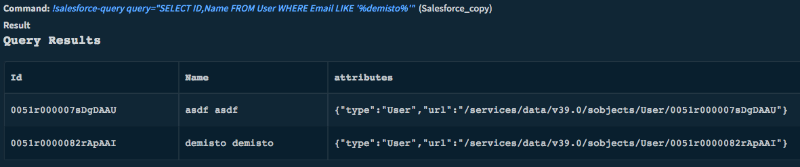</a>

<h3 id="h_5581952191921536046406297">3. Get an object</h3>

Get object by path

<h5>Base Command</h5>

<code>salesforce-get-object</code>

<h5>Input</h5>
<table style="width: 746px;" border="2" cellpadding="6">
<thead>
<tr>
<th style="width: 137px;"><strong>Argument Name</strong></th>
<th style="width: 499px;"><strong>Description</strong></th>
<th style="width: 71px;"><strong>Required</strong></th>
</tr>
</thead>
<tbody>
<tr>
<td style="width: 137px;">path</td>
<td style="width: 499px;">Object path, for example: "Case/5000Y000001EjzRQAS" for Object "Case" with ID "5000Y000001EjzRQAS"</td>
<td style="width: 71px;">Required</td>
</tr>
</tbody>
</table>
<h5> </h5>
<h5>Context Output</h5>
<table style="width: 748px;" border="2" cellpadding="6">
<thead>
<tr>
<th style="width: 224px;"><strong>Path</strong></th>
<th style="width: 45px;"><strong>Type</strong></th>
<th style="width: 439px;"><strong>Description</strong></th>
</tr>
</thead>
<tbody>
<tr>
<td style="width: 224px;">SalesForce.Case.ID</td>
<td style="width: 45px;">string</td>
<td style="width: 439px;">Case Object ID</td>
</tr>
<tr>
<td style="width: 224px;">SalesForce.Case.CaseNumber</td>
<td style="width: 45px;">string</td>
<td style="width: 439px;">Case number</td>
</tr>
<tr>
<td style="width: 224px;">SalesForce.Case.Subject</td>
<td style="width: 45px;">string</td>
<td style="width: 439px;">Case subject</td>
</tr>
<tr>
<td style="width: 224px;">SalesForce.Case.Description</td>
<td style="width: 45px;">string</td>
<td style="width: 439px;">Case description</td>
</tr>
<tr>
<td style="width: 224px;">SalesForce.Case.CreateDate</td>
<td style="width: 45px;">date</td>
<td style="width: 439px;">Time the case was created</td>
</tr>
<tr>
<td style="width: 224px;">SalesForce.Case.ClosedDate</td>
<td style="width: 45px;">date</td>
<td style="width: 439px;">Time the case was closed</td>
</tr>
<tr>
<td style="width: 224px;">SalesForce.Case.Owner</td>
<td style="width: 45px;">string</td>
<td style="width: 439px;">Case owner</td>
</tr>
<tr>
<td style="width: 224px;">SalesForce.Case.Priority</td>
<td style="width: 45px;">string</td>
<td style="width: 439px;">Case priority (Low, Medium, High)</td>
</tr>
<tr>
<td style="width: 224px;">SalesForce.Case.Origin</td>
<td style="width: 45px;">string</td>
<td style="width: 439px;">How case originated (Web, Phone, Email)</td>
</tr>
<tr>
<td style="width: 224px;">SalesForce.Case.Status</td>
<td style="width: 45px;">string</td>
<td style="width: 439px;">Case status (New, Escalated, On Hold, or Closed)</td>
</tr>
<tr>
<td style="width: 224px;">SalesForce.Case.Reason</td>
<td style="width: 45px;">string</td>
<td style="width: 439px;">Reason the case was created</td>
</tr>
<tr>
<td style="width: 224px;">SalesForce.Contact.ID</td>
<td style="width: 45px;">string</td>
<td style="width: 439px;">Contact ID</td>
</tr>
<tr>
<td style="width: 224px;">SalesForce.Contact.Name</td>
<td style="width: 45px;">string</td>
<td style="width: 439px;">Contact name</td>
</tr>
<tr>
<td style="width: 224px;">SalesForce.Contact.Account</td>
<td style="width: 45px;">string</td>
<td style="width: 439px;">Account associated with the contact information</td>
</tr>
<tr>
<td style="width: 224px;">SalesForce.Contact.Title</td>
<td style="width: 45px;">string</td>
<td style="width: 439px;">Contact title</td>
</tr>
<tr>
<td style="width: 224px;">SalesForce.Contact.Phone</td>
<td style="width: 45px;">string</td>
<td style="width: 439px;">Contact phone number</td>
</tr>
<tr>
<td style="width: 224px;">SalesForce.Contact.MobliePhone</td>
<td style="width: 45px;">string</td>
<td style="width: 439px;">Contact mobile number</td>
</tr>
<tr>
<td style="width: 224px;">SalesForce.Contact.Email</td>
<td style="width: 45px;">string</td>
<td style="width: 439px;">Contact email address</td>
</tr>
<tr>
<td style="width: 224px;">SalesForce.Contact.Owner</td>
<td style="width: 45px;">string</td>
<td style="width: 439px;">Contact owner</td>
</tr>
<tr>
<td style="width: 224px;">SalesForce.Lead.ID</td>
<td style="width: 45px;">string</td>
<td style="width: 439px;">Lead ID</td>
</tr>
<tr>
<td style="width: 224px;">SalesForce.Lead.Name</td>
<td style="width: 45px;">string</td>
<td style="width: 439px;">Lead name</td>
</tr>
<tr>
<td style="width: 224px;">SalesForce.Lead.Title</td>
<td style="width: 45px;">string</td>
<td style="width: 439px;">Lead title</td>
</tr>
<tr>
<td style="width: 224px;">SalesForce.Lead.Company</td>
<td style="width: 45px;">string</td>
<td style="width: 439px;">Lead company</td>
</tr>
<tr>
<td style="width: 224px;">SalesForce.Lead.Phone</td>
<td style="width: 45px;">string</td>
<td style="width: 439px;">Lead phone number</td>
</tr>
<tr>
<td style="width: 224px;">SalesForce.Lead.Mobile</td>
<td style="width: 45px;">string</td>
<td style="width: 439px;">Lead mobile number</td>
</tr>
<tr>
<td style="width: 224px;">SalesForce.Lead.Email</td>
<td style="width: 45px;">string</td>
<td style="width: 439px;">Lead email address</td>
</tr>
<tr>
<td style="width: 224px;">SalesForce.Lead.Owner</td>
<td style="width: 45px;">string</td>
<td style="width: 439px;">Lead owner</td>
</tr>
<tr>
<td style="width: 224px;">SalesForce.Lead.Status</td>
<td style="width: 45px;">string</td>
<td style="width: 439px;">Lead status (New, Nurturing, Working, Qualified, or Unqualified)</td>
</tr>
<tr>
<td style="width: 224px;">SalesForce.Task.ID</td>
<td style="width: 45px;">string</td>
<td style="width: 439px;">Task ID</td>
</tr>
<tr>
<td style="width: 224px;">SalesForce.Task.Subject</td>
<td style="width: 45px;">string</td>
<td style="width: 439px;">Task subject</td>
</tr>
<tr>
<td style="width: 224px;">SalesForce.Task.Lead</td>
<td style="width: 45px;">string</td>
<td style="width: 439px;">Task leader</td>
</tr>
<tr>
<td style="width: 224px;">SalesForce.Task.RelatedTo</td>
<td style="width: 45px;">string</td>
<td style="width: 439px;">Relevant account</td>
</tr>
<tr>
<td style="width: 224px;">SalesForce.Task.DueDate</td>
<td style="width: 45px;">date</td>
<td style="width: 439px;">Task due date</td>
</tr>
<tr>
<td style="width: 224px;">SalesForce.User.ID</td>
<td style="width: 45px;">string</td>
<td style="width: 439px;">User ID</td>
</tr>
<tr>
<td style="width: 224px;">SalesForce.User.Name</td>
<td style="width: 45px;">string</td>
<td style="width: 439px;">User's name</td>
</tr>
<tr>
<td style="width: 224px;">SalesForce.User.Title</td>
<td style="width: 45px;">string</td>
<td style="width: 439px;">User's title</td>
</tr>
<tr>
<td style="width: 224px;">SalesForce.User.Phone</td>
<td style="width: 45px;">string</td>
<td style="width: 439px;">User's phone number</td>
</tr>
<tr>
<td style="width: 224px;">SalesForce.User.Email</td>
<td style="width: 45px;">string</td>
<td style="width: 439px;">User's email</td>
</tr>
</tbody>
</table>
<h5> </h5>
<h5>Command Example</h5>
<h5>Context Example</h5>
<h5>Human Readable Output</h5>
<h3 id="h_7065179892861536046413059">4. Update an object</h3>

Update object fields

<h5>Base Command</h5>

<code>salesforce-update-object</code>

<h5>Input</h5>
<table style="width: 742px;" border="2" cellpadding="6">
<thead>
<tr>
<th style="width: 146px;"><strong>Argument Name</strong></th>
<th style="width: 491px;"><strong>Description</strong></th>
<th style="width: 71px;"><strong>Required</strong></th>
</tr>
</thead>
<tbody>
<tr>
<td style="width: 146px;">path</td>
<td style="width: 491px;">Object path, for example: "Case/5000Y000001EjzRQAS" for Object "Case" with ID "5000Y000001EjzRQAS"</td>
<td style="width: 71px;">Required</td>
</tr>
<tr>
<td style="width: 146px;">json</td>
<td style="width: 491px;">JSON with fields and values of the object to be updated</td>
<td style="width: 71px;">Required</td>
</tr>
</tbody>
</table>
<h5> </h5>
<h5>Context Output</h5>
<table style="width: 748px;" border="2" cellpadding="6">
<thead>
<tr>
<th style="width: 222px;"><strong>Path</strong></th>
<th style="width: 47px;"><strong>Type</strong></th>
<th style="width: 439px;"><strong>Description</strong></th>
</tr>
</thead>
<tbody>
<tr>
<td style="width: 222px;">SalesForce.Case.ID</td>
<td style="width: 47px;">string</td>
<td style="width: 439px;">Case Object ID</td>
</tr>
<tr>
<td style="width: 222px;">SalesForce.Case.CaseNumber</td>
<td style="width: 47px;">string</td>
<td style="width: 439px;">Case number</td>
</tr>
<tr>
<td style="width: 222px;">SalesForce.Case.Subject</td>
<td style="width: 47px;">string</td>
<td style="width: 439px;">Case subject</td>
</tr>
<tr>
<td style="width: 222px;">SalesForce.Case.Description</td>
<td style="width: 47px;">string</td>
<td style="width: 439px;">Case description</td>
</tr>
<tr>
<td style="width: 222px;">SalesForce.Case.CreateDate</td>
<td style="width: 47px;">date</td>
<td style="width: 439px;">Time case was created</td>
</tr>
<tr>
<td style="width: 222px;">SalesForce.Case.ClosedDate</td>
<td style="width: 47px;">date</td>
<td style="width: 439px;">Time case was closed</td>
</tr>
<tr>
<td style="width: 222px;">SalesForce.Case.Owner</td>
<td style="width: 47px;">string</td>
<td style="width: 439px;">Case owner</td>
</tr>
<tr>
<td style="width: 222px;">SalesForce.Case.Priority</td>
<td style="width: 47px;">string</td>
<td style="width: 439px;">Case priority (Low, Medium, High)</td>
</tr>
<tr>
<td style="width: 222px;">SalesForce.Case.Origin</td>
<td style="width: 47px;">string</td>
<td style="width: 439px;">How case originated (Web, Phone, Email)</td>
</tr>
<tr>
<td style="width: 222px;">SalesForce.Case.Status</td>
<td style="width: 47px;">string</td>
<td style="width: 439px;">Case status (New, Escalated, On Hold, or Closed)</td>
</tr>
<tr>
<td style="width: 222px;">SalesForce.Case.Reason</td>
<td style="width: 47px;">string</td>
<td style="width: 439px;">Reason the case was created</td>
</tr>
<tr>
<td style="width: 222px;">SalesForce.Contact.ID</td>
<td style="width: 47px;">string</td>
<td style="width: 439px;">Contact ID</td>
</tr>
<tr>
<td style="width: 222px;">SalesForce.Contact.Name</td>
<td style="width: 47px;">string</td>
<td style="width: 439px;">Contact name</td>
</tr>
<tr>
<td style="width: 222px;">SalesForce.Contact.Account</td>
<td style="width: 47px;">string</td>
<td style="width: 439px;">Account associated with the contact information</td>
</tr>
<tr>
<td style="width: 222px;">SalesForce.Contact.Title</td>
<td style="width: 47px;">string</td>
<td style="width: 439px;">Contact title</td>
</tr>
<tr>
<td style="width: 222px;">SalesForce.Contact.Phone</td>
<td style="width: 47px;">string</td>
<td style="width: 439px;">Contact phone number</td>
</tr>
<tr>
<td style="width: 222px;">SalesForce.Contact.MobliePhone</td>
<td style="width: 47px;">string</td>
<td style="width: 439px;">Contact mobile number</td>
</tr>
<tr>
<td style="width: 222px;">SalesForce.Contact.Email</td>
<td style="width: 47px;">string</td>
<td style="width: 439px;">Contact email address</td>
</tr>
<tr>
<td style="width: 222px;">SalesForce.Contact.Owner</td>
<td style="width: 47px;">string</td>
<td style="width: 439px;">Contact owner</td>
</tr>
<tr>
<td style="width: 222px;">SalesForce.Lead.ID</td>
<td style="width: 47px;">string</td>
<td style="width: 439px;">Lead ID</td>
</tr>
<tr>
<td style="width: 222px;">SalesForce.Lead.Name</td>
<td style="width: 47px;">string</td>
<td style="width: 439px;">Lead name</td>
</tr>
<tr>
<td style="width: 222px;">SalesForce.Lead.Title</td>
<td style="width: 47px;">string</td>
<td style="width: 439px;">Lead title</td>
</tr>
<tr>
<td style="width: 222px;">SalesForce.Lead.Company</td>
<td style="width: 47px;">string</td>
<td style="width: 439px;">Lead company</td>
</tr>
<tr>
<td style="width: 222px;">SalesForce.Lead.Phone</td>
<td style="width: 47px;">string</td>
<td style="width: 439px;">Lead phone number</td>
</tr>
<tr>
<td style="width: 222px;">SalesForce.Lead.Mobile</td>
<td style="width: 47px;">string</td>
<td style="width: 439px;">Lead mobile number</td>
</tr>
<tr>
<td style="width: 222px;">SalesForce.Lead.Email</td>
<td style="width: 47px;">string</td>
<td style="width: 439px;">Lead email address</td>
</tr>
<tr>
<td style="width: 222px;">SalesForce.Lead.Owner</td>
<td style="width: 47px;">string</td>
<td style="width: 439px;">Lead owner</td>
</tr>
<tr>
<td style="width: 222px;">SalesForce.Lead.Status</td>
<td style="width: 47px;">string</td>
<td style="width: 439px;">Lead status (New, Nurturing, Working, Qualified, or Unqualified)</td>
</tr>
<tr>
<td style="width: 222px;">SalesForce.Task.ID</td>
<td style="width: 47px;">string</td>
<td style="width: 439px;">Task ID</td>
</tr>
<tr>
<td style="width: 222px;">SalesForce.Task.Subject</td>
<td style="width: 47px;">string</td>
<td style="width: 439px;">Task subject</td>
</tr>
<tr>
<td style="width: 222px;">SalesForce.Task.Lead</td>
<td style="width: 47px;">string</td>
<td style="width: 439px;">Task leader</td>
</tr>
<tr>
<td style="width: 222px;">SalesForce.Task.RelatedTo</td>
<td style="width: 47px;">string</td>
<td style="width: 439px;">Relevant account</td>
</tr>
<tr>
<td style="width: 222px;">SalesForce.Task.DueDate</td>
<td style="width: 47px;">date</td>
<td style="width: 439px;">Task due date</td>
</tr>
<tr>
<td style="width: 222px;">SalesForce.User.ID</td>
<td style="width: 47px;">string</td>
<td style="width: 439px;">User's ID</td>
</tr>
<tr>
<td style="width: 222px;">SalesForce.User.Name</td>
<td style="width: 47px;">string</td>
<td style="width: 439px;">User's name</td>
</tr>
<tr>
<td style="width: 222px;">SalesForce.User.Title</td>
<td style="width: 47px;">string</td>
<td style="width: 439px;">User's title</td>
</tr>
<tr>
<td style="width: 222px;">SalesForce.User.Phone</td>
<td style="width: 47px;">string</td>
<td style="width: 439px;">User's phone number</td>
</tr>
<tr>
<td style="width: 222px;">SalesForce.User.Email</td>
<td style="width: 47px;">string</td>
<td style="width: 439px;">User's email</td>
</tr>
</tbody>
</table>
<h3> </h3>
<h3 id="h_4613699273761536046418436">5. Create an object</h3>

Create new object

<h5>Base Command</h5>

<code>salesforce-create-object</code>

<h5>Input</h5>
<table style="width: 744px;" border="2" cellpadding="6">
<thead>
<tr>
<th style="width: 158px;"><strong>Argument Name</strong></th>
<th style="width: 462px;"><strong>Description</strong></th>
<th style="width: 88px;"><strong>Required</strong></th>
</tr>
</thead>
<tbody>
<tr>
<td style="width: 158px;">path</td>
<td style="width: 462px;">Object path, for example: "Case" for Object "Case"</td>
<td style="width: 88px;">Required</td>
</tr>
<tr>
<td style="width: 158px;">json</td>
<td style="width: 462px;">JSON with fields and values of the object to be created</td>
<td style="width: 88px;">Required</td>
</tr>
</tbody>
</table>
<h5> </h5>
<h5>Context Output</h5>
<table style="width: 746px;" border="2" cellpadding="6">
<thead>
<tr>
<th style="width: 218px;"><strong>Path</strong></th>
<th style="width: 51px;"><strong>Type</strong></th>
<th style="width: 439px;"><strong>Description</strong></th>
</tr>
</thead>
<tbody>
<tr>
<td style="width: 218px;">SalesForce.Case.ID</td>
<td style="width: 51px;">string</td>
<td style="width: 439px;">Case Object ID</td>
</tr>
<tr>
<td style="width: 218px;">SalesForce.Case.CaseNumber</td>
<td style="width: 51px;">string</td>
<td style="width: 439px;">Case number</td>
</tr>
<tr>
<td style="width: 218px;">SalesForce.Case.Subject</td>
<td style="width: 51px;">string</td>
<td style="width: 439px;">Case subject</td>
</tr>
<tr>
<td style="width: 218px;">SalesForce.Case.Description</td>
<td style="width: 51px;">string</td>
<td style="width: 439px;">Case description</td>
</tr>
<tr>
<td style="width: 218px;">SalesForce.Case.CreateDate</td>
<td style="width: 51px;">date</td>
<td style="width: 439px;">Time case was created</td>
</tr>
<tr>
<td style="width: 218px;">SalesForce.Case.ClosedDate</td>
<td style="width: 51px;">date</td>
<td style="width: 439px;">Time case was closed</td>
</tr>
<tr>
<td style="width: 218px;">SalesForce.Case.Owner</td>
<td style="width: 51px;">string</td>
<td style="width: 439px;">Case owner</td>
</tr>
<tr>
<td style="width: 218px;">SalesForce.Case.Priority</td>
<td style="width: 51px;">string</td>
<td style="width: 439px;">Case priority (Low, Medium, High)</td>
</tr>
<tr>
<td style="width: 218px;">SalesForce.Case.Origin</td>
<td style="width: 51px;">string</td>
<td style="width: 439px;">How case originated (Web, Phone, Email)</td>
</tr>
<tr>
<td style="width: 218px;">SalesForce.Case.Status</td>
<td style="width: 51px;">string</td>
<td style="width: 439px;">Case status (New, Escalated, On Hold, or Closed)</td>
</tr>
<tr>
<td style="width: 218px;">SalesForce.Case.Reason</td>
<td style="width: 51px;">string</td>
<td style="width: 439px;">Reason the case was created</td>
</tr>
<tr>
<td style="width: 218px;">SalesForce.Contact.ID</td>
<td style="width: 51px;">string</td>
<td style="width: 439px;">Contact ID</td>
</tr>
<tr>
<td style="width: 218px;">SalesForce.Contact.Name</td>
<td style="width: 51px;">string</td>
<td style="width: 439px;">Contact name</td>
</tr>
<tr>
<td style="width: 218px;">SalesForce.Contact.Account</td>
<td style="width: 51px;">string</td>
<td style="width: 439px;">Account associated with the contact information</td>
</tr>
<tr>
<td style="width: 218px;">SalesForce.Contact.Title</td>
<td style="width: 51px;">string</td>
<td style="width: 439px;">Contact title</td>
</tr>
<tr>
<td style="width: 218px;">SalesForce.Contact.Phone</td>
<td style="width: 51px;">string</td>
<td style="width: 439px;">Contact phone number</td>
</tr>
<tr>
<td style="width: 218px;">SalesForce.Contact.MobliePhone</td>
<td style="width: 51px;">string</td>
<td style="width: 439px;">Contact mobile number</td>
</tr>
<tr>
<td style="width: 218px;">SalesForce.Contact.Email</td>
<td style="width: 51px;">string</td>
<td style="width: 439px;">Contact email</td>
</tr>
<tr>
<td style="width: 218px;">SalesForce.Contact.Owner</td>
<td style="width: 51px;">string</td>
<td style="width: 439px;">Contact owner</td>
</tr>
<tr>
<td style="width: 218px;">SalesForce.Lead.ID</td>
<td style="width: 51px;">string</td>
<td style="width: 439px;">Lead ID</td>
</tr>
<tr>
<td style="width: 218px;">SalesForce.Lead.Name</td>
<td style="width: 51px;">string</td>
<td style="width: 439px;">Lead name</td>
</tr>
<tr>
<td style="width: 218px;">SalesForce.Lead.Title</td>
<td style="width: 51px;">string</td>
<td style="width: 439px;">Lead title</td>
</tr>
<tr>
<td style="width: 218px;">SalesForce.Lead.Company</td>
<td style="width: 51px;">string</td>
<td style="width: 439px;">Lead company</td>
</tr>
<tr>
<td style="width: 218px;">SalesForce.Lead.Phone</td>
<td style="width: 51px;">string</td>
<td style="width: 439px;">Lead phone number</td>
</tr>
<tr>
<td style="width: 218px;">SalesForce.Lead.Mobile</td>
<td style="width: 51px;">string</td>
<td style="width: 439px;">Lead mobile number</td>
</tr>
<tr>
<td style="width: 218px;">SalesForce.Lead.Email</td>
<td style="width: 51px;">string</td>
<td style="width: 439px;">Lead email</td>
</tr>
<tr>
<td style="width: 218px;">SalesForce.Lead.Owner</td>
<td style="width: 51px;">string</td>
<td style="width: 439px;">Lead owner</td>
</tr>
<tr>
<td style="width: 218px;">SalesForce.Lead.Status</td>
<td style="width: 51px;">string</td>
<td style="width: 439px;">Lead status (New, Nurturing, Working, Qualified, or Unqualified)</td>
</tr>
<tr>
<td style="width: 218px;">SalesForce.Task.ID</td>
<td style="width: 51px;">string</td>
<td style="width: 439px;">Task ID</td>
</tr>
<tr>
<td style="width: 218px;">SalesForce.Task.Subject</td>
<td style="width: 51px;">string</td>
<td style="width: 439px;">Task subject</td>
</tr>
<tr>
<td style="width: 218px;">SalesForce.Task.Lead</td>
<td style="width: 51px;">string</td>
<td style="width: 439px;">Task leader</td>
</tr>
<tr>
<td style="width: 218px;">SalesForce.Task.RelatedTo</td>
<td style="width: 51px;">string</td>
<td style="width: 439px;">Relevant account</td>
</tr>
<tr>
<td style="width: 218px;">SalesForce.Task.DueDate</td>
<td style="width: 51px;">date</td>
<td style="width: 439px;">Task due date</td>
</tr>
<tr>
<td style="width: 218px;">SalesForce.User.ID</td>
<td style="width: 51px;">string</td>
<td style="width: 439px;">User's ID</td>
</tr>
<tr>
<td style="width: 218px;">SalesForce.User.Name</td>
<td style="width: 51px;">string</td>
<td style="width: 439px;">User's name</td>
</tr>
<tr>
<td style="width: 218px;">SalesForce.User.Title</td>
<td style="width: 51px;">string</td>
<td style="width: 439px;">User's title</td>
</tr>
<tr>
<td style="width: 218px;">SalesForce.User.Phone</td>
<td style="width: 51px;">string</td>
<td style="width: 439px;">User's hone number</td>
</tr>
<tr>
<td style="width: 218px;">SalesForce.User.Email</td>
<td style="width: 51px;">string</td>
<td style="width: 439px;">User's email address</td>
</tr>
</tbody>
</table>
<h3> </h3>
<h3 id="h_7581669984651536046423826">6. Add a comment to chatter</h3>

Add a comment to chatter

<h5>Base Command</h5>

<code>salesforce-push-comment</code>

<h5>Input</h5>
<table style="width: 746px;" border="2" cellpadding="6">
<thead>
<tr>
<th style="width: 231px;"><strong>Argument Name</strong></th>
<th style="width: 340px;"><strong>Description</strong></th>
<th style="width: 137px;"><strong>Required</strong></th>
</tr>
</thead>
<tbody>
<tr>
<td style="width: 231px;">oid</td>
<td style="width: 340px;">Object ID of subject</td>
<td style="width: 137px;">Required</td>
</tr>
<tr>
<td style="width: 231px;">text</td>
<td style="width: 340px;">Chat text</td>
<td style="width: 137px;">Required</td>
</tr>
<tr>
<td style="width: 231px;">link</td>
<td style="width: 340px;">Add a link to the message</td>
<td style="width: 137px;">Optional</td>
</tr>
</tbody>
</table>
<h5> </h5>
<h5>Context Output</h5>
<table style="width: 746px;" border="2" cellpadding="6">
<thead>
<tr>
<th style="width: 370px;"><strong>Path</strong></th>
<th style="width: 78px;"><strong>Type</strong></th>
<th style="width: 260px;"><strong>Description</strong></th>
</tr>
</thead>
<tbody>
<tr>
<td style="width: 370px;">SalesForce.Comment.Body</td>
<td style="width: 78px;">string</td>
<td style="width: 260px;">Comment body</td>
</tr>
<tr>
<td style="width: 370px;">SalesForce.Comment.CreatedDate</td>
<td style="width: 78px;">date</td>
<td style="width: 260px;">Comment created date</td>
</tr>
<tr>
<td style="width: 370px;">SalesForce.Comment.Title</td>
<td style="width: 78px;">string</td>
<td style="width: 260px;">Comment title</td>
</tr>
<tr>
<td style="width: 370px;">SalesForce.Comment.ParentType</td>
<td style="width: 78px;">string</td>
<td style="width: 260px;">Comment parent type</td>
</tr>
<tr>
<td style="width: 370px;">SalesForce.Comment.ParentName</td>
<td style="width: 78px;">string</td>
<td style="width: 260px;">Comment parent name</td>
</tr>
<tr>
<td style="width: 370px;">SalesForce.Comment.URL</td>
<td style="width: 78px;">string</td>
<td style="width: 260px;">Comment URL link</td>
</tr>
<tr>
<td style="width: 370px;">SalesForce.Comment.Visibility</td>
<td style="width: 78px;">string</td>
<td style="width: 260px;">Comment visibility</td>
</tr>
</tbody>
</table>
<h5> </h5>
<h5>Command Example</h5>

<a href="../../doc_files/44452576-874cc900-a5ff-11e8-9c5b-4ce0f75ae3f9.png" target="_blank" rel="noopener noreferrer">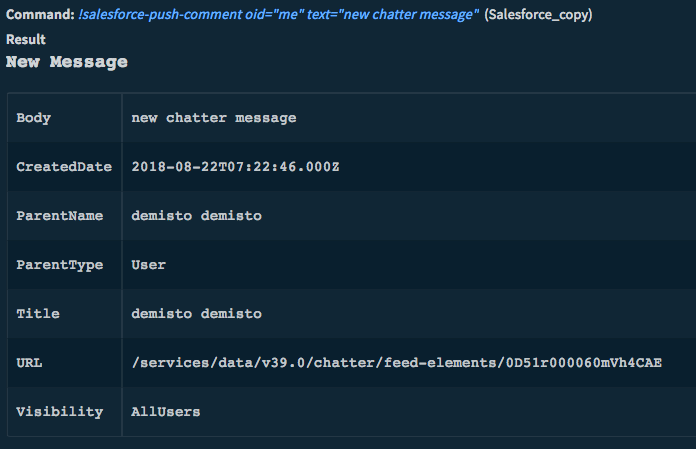</a>

<h5>Context Example</h5>

<a href="../../doc_files/44452616-a8adb500-a5ff-11e8-96d5-46069125ce64.png" target="_blank" rel="noopener noreferrer">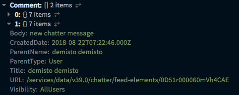</a>

<h3 id="h_8016050955551536046471202">7. Get case information</h3>

Get information for a specified on a case. All arguments are optional, but you must specify at least one for the command to execute successfully.

<h5>Base Command</h5>

<code>salesforce-get-case</code>

<h5>Input</h5>
<table style="width: 748px;" border="2" cellpadding="6">
<thead>
<tr>
<th style="width: 222px;"><strong>Argument Name</strong></th>
<th style="width: 356px;"><strong>Description</strong></th>
<th style="width: 130px;"><strong>Required</strong></th>
</tr>
</thead>
<tbody>
<tr>
<td style="width: 222px;">oid</td>
<td style="width: 356px;">Object ID of the case</td>
<td style="width: 130px;">Optional</td>
</tr>
<tr>
<td style="width: 222px;">caseNumber</td>
<td style="width: 356px;">Case number</td>
<td style="width: 130px;">Optional</td>
</tr>
</tbody>
</table>
<h5> </h5>
<h5>Context Output</h5>
<table style="width: 748px;" border="2" cellpadding="6">
<thead>
<tr>
<th style="width: 206px;"><strong>Path</strong></th>
<th style="width: 45px;"><strong>Type</strong></th>
<th style="width: 457px;"><strong>Description</strong></th>
</tr>
</thead>
<tbody>
<tr>
<td style="width: 206px;">SalesForce.Case.ID</td>
<td style="width: 45px;">string</td>
<td style="width: 457px;">Case Object ID</td>
</tr>
<tr>
<td style="width: 206px;">SalesForce.Case.CaseNumber</td>
<td style="width: 45px;">string</td>
<td style="width: 457px;">Case number</td>
</tr>
<tr>
<td style="width: 206px;">SalesForce.Case.Subject</td>
<td style="width: 45px;">string</td>
<td style="width: 457px;">Case subject</td>
</tr>
<tr>
<td style="width: 206px;">SalesForce.Case.Description</td>
<td style="width: 45px;">string</td>
<td style="width: 457px;">Case description</td>
</tr>
<tr>
<td style="width: 206px;">SalesForce.Case.CreateDate</td>
<td style="width: 45px;">date</td>
<td style="width: 457px;">Time case was created</td>
</tr>
<tr>
<td style="width: 206px;">SalesForce.Case.ClosedDate</td>
<td style="width: 45px;">date</td>
<td style="width: 457px;">Time case was closed</td>
</tr>
<tr>
<td style="width: 206px;">SalesForce.Case.Owner</td>
<td style="width: 45px;">string</td>
<td style="width: 457px;">Case owner</td>
</tr>
<tr>
<td style="width: 206px;">SalesForce.Case.Priority</td>
<td style="width: 45px;">string</td>
<td style="width: 457px;">Priority of the case (Low, Medium, High)</td>
</tr>
<tr>
<td style="width: 206px;">SalesForce.Case.Origin</td>
<td style="width: 45px;">string</td>
<td style="width: 457px;">How case originated (Web, Phone, Email)</td>
</tr>
<tr>
<td style="width: 206px;">SalesForce.Case.Status</td>
<td style="width: 45px;">string</td>
<td style="width: 457px;">Case status (New, Escalated, On Hold, or Closed)</td>
</tr>
<tr>
<td style="width: 206px;">SalesForce.Case.Reason</td>
<td style="width: 45px;">string</td>
<td style="width: 457px;">Reason the case was created</td>
</tr>
</tbody>
</table>
<h5> </h5>
<h5>Command Example</h5>

<a href="../../doc_files/44452464-43f25a80-a5ff-11e8-918a-7efb4af4ea29.png" target="_blank" rel="noopener noreferrer">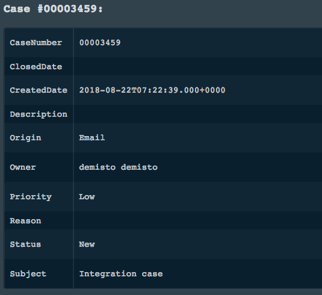</a>

<h5>Context Example</h5>

<a href="../../doc_files/44452529-66847380-a5ff-11e8-80af-32177c2479d0.png" target="_blank" rel="noopener noreferrer">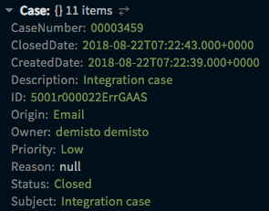</a>

<h3 id="h_8706041276441536046477422">8. Create a case</h3>

Create a new case

<h5>Base Command</h5>

<code>salesforce-create-case</code>

<h5>Input</h5>
<table style="width: 748px;" border="2" cellpadding="6">
<thead>
<tr>
<th style="width: 278px;"><strong>Argument Name</strong></th>
<th style="width: 266px;"><strong>Description</strong></th>
<th style="width: 164px;"><strong>Required</strong></th>
</tr>
</thead>
<tbody>
<tr>
<td style="width: 278px;">subject</td>
<td style="width: 266px;">Case subject</td>
<td style="width: 164px;">Required</td>
</tr>
<tr>
<td style="width: 278px;">description</td>
<td style="width: 266px;">Case description</td>
<td style="width: 164px;">Optional</td>
</tr>
<tr>
<td style="width: 278px;">status</td>
<td style="width: 266px;">Case status</td>
<td style="width: 164px;">Required</td>
</tr>
<tr>
<td style="width: 278px;">origin</td>
<td style="width: 266px;">Case origin</td>
<td style="width: 164px;">Optional</td>
</tr>
<tr>
<td style="width: 278px;">priority</td>
<td style="width: 266px;">Case priority</td>
<td style="width: 164px;">Optional</td>
</tr>
<tr>
<td style="width: 278px;">type</td>
<td style="width: 266px;">Case type</td>
<td style="width: 164px;">Optional</td>
</tr>
</tbody>
</table>
<h5> </h5>
<h5>Context Output</h5>
<table style="width: 748px;" border="2" cellpadding="6">
<thead>
<tr>
<th style="width: 206px;"><strong>Path</strong></th>
<th style="width: 45px;"><strong>Type</strong></th>
<th style="width: 457px;"><strong>Description</strong></th>
</tr>
</thead>
<tbody>
<tr>
<td style="width: 206px;">SalesForce.Case.ID</td>
<td style="width: 45px;">string</td>
<td style="width: 457px;">Case Object ID</td>
</tr>
<tr>
<td style="width: 206px;">SalesForce.Case.CaseNumber</td>
<td style="width: 45px;">string</td>
<td style="width: 457px;">Case number</td>
</tr>
<tr>
<td style="width: 206px;">SalesForce.Case.Subject</td>
<td style="width: 45px;">string</td>
<td style="width: 457px;">Case subject</td>
</tr>
<tr>
<td style="width: 206px;">SalesForce.Case.Description</td>
<td style="width: 45px;">string</td>
<td style="width: 457px;">Case description</td>
</tr>
<tr>
<td style="width: 206px;">SalesForce.Case.CreateDate</td>
<td style="width: 45px;">date</td>
<td style="width: 457px;">Time case was created</td>
</tr>
<tr>
<td style="width: 206px;">SalesForce.Case.ClosedDate</td>
<td style="width: 45px;">date</td>
<td style="width: 457px;">Time case was closed</td>
</tr>
<tr>
<td style="width: 206px;">SalesForce.Case.Owner</td>
<td style="width: 45px;">string</td>
<td style="width: 457px;">Case owner</td>
</tr>
<tr>
<td style="width: 206px;">SalesForce.Case.Priority</td>
<td style="width: 45px;">string</td>
<td style="width: 457px;">Priority of the case (Low, Medium, High)</td>
</tr>
<tr>
<td style="width: 206px;">SalesForce.Case.Origin</td>
<td style="width: 45px;">string</td>
<td style="width: 457px;">How case originated (Web, Phone, Email)</td>
</tr>
<tr>
<td style="width: 206px;">SalesForce.Case.Status</td>
<td style="width: 45px;">string</td>
<td style="width: 457px;">Case status (New, Escalated, On Hold, or Closed)</td>
</tr>
<tr>
<td style="width: 206px;">SalesForce.Case.Reason</td>
<td style="width: 45px;">string</td>
<td style="width: 457px;">Reason for case creation</td>
</tr>
</tbody>
</table>
<h3> </h3>
<h3 id="h_4819007717301536046484895">9. Update a case</h3>

Update case fields

<h5>Base Command</h5>

<code>salesforce-update-case</code>

<h5>Input</h5>
<table style="width: 748px;" border="2" cellpadding="6">
<thead>
<tr>
<th style="width: 279px;"><strong>Argument Name</strong></th>
<th style="width: 265px;"><strong>Description</strong></th>
<th style="width: 164px;"><strong>Required</strong></th>
</tr>
</thead>
<tbody>
<tr>
<td style="width: 279px;">oid</td>
<td style="width: 265px;">Case Object ID</td>
<td style="width: 164px;">Optional</td>
</tr>
<tr>
<td style="width: 279px;">caseNumber</td>
<td style="width: 265px;">Case number</td>
<td style="width: 164px;">Optional</td>
</tr>
<tr>
<td style="width: 279px;">subject</td>
<td style="width: 265px;">Case subject</td>
<td style="width: 164px;">Optional</td>
</tr>
<tr>
<td style="width: 279px;">description</td>
<td style="width: 265px;">Case description</td>
<td style="width: 164px;">Optional</td>
</tr>
<tr>
<td style="width: 279px;">status</td>
<td style="width: 265px;">Case status</td>
<td style="width: 164px;">Optional</td>
</tr>
<tr>
<td style="width: 279px;">origin</td>
<td style="width: 265px;">Case origin</td>
<td style="width: 164px;">Optional</td>
</tr>
<tr>
<td style="width: 279px;">priority</td>
<td style="width: 265px;">Case priority</td>
<td style="width: 164px;">Optional</td>
</tr>
<tr>
<td style="width: 279px;">type</td>
<td style="width: 265px;">Case type</td>
<td style="width: 164px;">Optional</td>
</tr>
</tbody>
</table>
<h5> </h5>
<h5>Context Output</h5>
<table style="width: 746px;" border="2" cellpadding="6">
<thead>
<tr>
<th style="width: 206px;"><strong>Path</strong></th>
<th style="width: 45px;"><strong>Type</strong></th>
<th style="width: 457px;"><strong>Description</strong></th>
</tr>
</thead>
<tbody>
<tr>
<td style="width: 206px;">SalesForce.Case.ID</td>
<td style="width: 45px;">string</td>
<td style="width: 457px;">Case Object ID</td>
</tr>
<tr>
<td style="width: 206px;">SalesForce.Case.CaseNumber</td>
<td style="width: 45px;">string</td>
<td style="width: 457px;">Case number</td>
</tr>
<tr>
<td style="width: 206px;">SalesForce.Case.Subject</td>
<td style="width: 45px;">string</td>
<td style="width: 457px;">Case subject</td>
</tr>
<tr>
<td style="width: 206px;">SalesForce.Case.Description</td>
<td style="width: 45px;">string</td>
<td style="width: 457px;">Case description</td>
</tr>
<tr>
<td style="width: 206px;">SalesForce.Case.CreateDate</td>
<td style="width: 45px;">date</td>
<td style="width: 457px;">Time case was created</td>
</tr>
<tr>
<td style="width: 206px;">SalesForce.Case.ClosedDate</td>
<td style="width: 45px;">date</td>
<td style="width: 457px;">Time case was closed</td>
</tr>
<tr>
<td style="width: 206px;">SalesForce.Case.Owner</td>
<td style="width: 45px;">string</td>
<td style="width: 457px;">Case owner</td>
</tr>
<tr>
<td style="width: 206px;">SalesForce.Case.Priority</td>
<td style="width: 45px;">string</td>
<td style="width: 457px;">Priority of the case (Low, Medium, High)</td>
</tr>
<tr>
<td style="width: 206px;">SalesForce.Case.Origin</td>
<td style="width: 45px;">string</td>
<td style="width: 457px;">How case originated (Web, Phone, Email)</td>
</tr>
<tr>
<td style="width: 206px;">SalesForce.Case.Status</td>
<td style="width: 45px;">string</td>
<td style="width: 457px;">Case status (New, Escalated, On Hold, or Closed)</td>
</tr>
<tr>
<td style="width: 206px;">SalesForce.Case.Reason</td>
<td style="width: 45px;">string</td>
<td style="width: 457px;">Reason the case was created</td>
</tr>
</tbody>
</table>
<h3> </h3>
<h3 id="h_1066577298151536046491766">10. Get all cases</h3>

Get all cases

<h5>Base Command</h5>

<code>salesforce-get-cases</code>

<h5>Input</h5>

There is no input for this command.

<h5>Context Output</h5>

There is no context output for this command.

<h3 id="h_734592538971536046497970">11. Close a case</h3>

Close a case

<h5>Base Command</h5>

<code>salesforce-close-case</code>

<h5>Input</h5>
<table style="width: 748px;" border="2" cellpadding="6">
<thead>
<tr>
<th style="width: 288px;"><strong>Argument Name</strong></th>
<th style="width: 250px;"><strong>Description</strong></th>
<th style="width: 170px;"><strong>Required</strong></th>
</tr>
</thead>
<tbody>
<tr>
<td style="width: 288px;">oid</td>
<td style="width: 250px;">Case Object ID</td>
<td style="width: 170px;">Optional</td>
</tr>
<tr>
<td style="width: 288px;">caseNumber</td>
<td style="width: 250px;">Case Number</td>
<td style="width: 170px;">Optional</td>
</tr>
</tbody>
</table>
<h5> </h5>
<h5>Context Output</h5>
<table style="width: 748px;" border="2" cellpadding="6">
<thead>
<tr>
<th style="width: 202px;"><strong>Path</strong></th>
<th style="width: 49px;"><strong>Type</strong></th>
<th style="width: 457px;"><strong>Description</strong></th>
</tr>
</thead>
<tbody>
<tr>
<td style="width: 202px;">SalesForce.Case.ID</td>
<td style="width: 49px;">string</td>
<td style="width: 457px;">Case Object ID</td>
</tr>
<tr>
<td style="width: 202px;">SalesForce.Case.CaseNumber</td>
<td style="width: 49px;">string</td>
<td style="width: 457px;">Case Number</td>
</tr>
<tr>
<td style="width: 202px;">SalesForce.Case.Subject</td>
<td style="width: 49px;">string</td>
<td style="width: 457px;">Case Subject</td>
</tr>
<tr>
<td style="width: 202px;">SalesForce.Case.Description</td>
<td style="width: 49px;">string</td>
<td style="width: 457px;">Case Description</td>
</tr>
<tr>
<td style="width: 202px;">SalesForce.Case.CreateDate</td>
<td style="width: 49px;">date</td>
<td style="width: 457px;">Creation Time of Case</td>
</tr>
<tr>
<td style="width: 202px;">SalesForce.Case.ClosedDate</td>
<td style="width: 49px;">date</td>
<td style="width: 457px;">Closure Time of Case</td>
</tr>
<tr>
<td style="width: 202px;">SalesForce.Case.Owner</td>
<td style="width: 49px;">string</td>
<td style="width: 457px;">Case Owner</td>
</tr>
<tr>
<td style="width: 202px;">SalesForce.Case.Priority</td>
<td style="width: 49px;">string</td>
<td style="width: 457px;">Priority of the Case. one of Low, Medium, High.</td>
</tr>
<tr>
<td style="width: 202px;">SalesForce.Case.Origin</td>
<td style="width: 49px;">string</td>
<td style="width: 457px;">Origin of the Case. one of Web, Phone, Email.</td>
</tr>
<tr>
<td style="width: 202px;">SalesForce.Case.Status</td>
<td style="width: 49px;">string</td>
<td style="width: 457px;">Case Status. one of the following: New, Escalated, On Hold or Closed.</td>
</tr>
<tr>
<td style="width: 202px;">SalesForce.Case.Reason</td>
<td style="width: 49px;">string</td>
<td style="width: 457px;">Reason for case creation</td>
</tr>
</tbody>
</table>
<h5> </h5>
<h5>Command Example</h5>

<a href="../../doc_files/44452804-1bb72b80-a600-11e8-9ab0-85b6fb631091.png" target="_blank" rel="noopener noreferrer">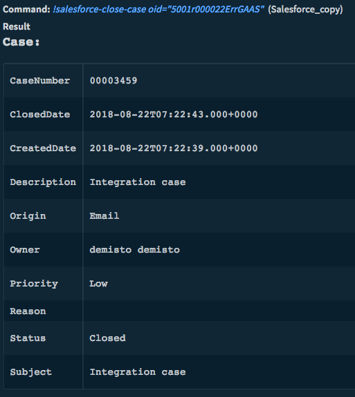</a>

<h3 id="h_2235322109811536046505155">12. Add a comment to a chatter thread</h3>

Add the comment to the chatter thread. Use this command only after salesforce-push-comment

<h5>Base Command</h5>

<code>salesforce-push-comment-threads</code>

<h5>Input</h5>
<table style="width: 748px;" border="2" cellpadding="6">
<thead>
<tr>
<th style="width: 219px;"><strong>Argument Name</strong></th>
<th style="width: 367px;"><strong>Description</strong></th>
<th style="width: 122px;"><strong>Required</strong></th>
</tr>
</thead>
<tbody>
<tr>
<td style="width: 219px;">id</td>
<td style="width: 367px;">The Chatter comment Thread ID</td>
<td style="width: 122px;">Required</td>
</tr>
<tr>
<td style="width: 219px;">text</td>
<td style="width: 367px;">The comment text</td>
<td style="width: 122px;">Required</td>
</tr>
</tbody>
</table>
<h5> </h5>
<h5>Context Output</h5>
<table style="width: 748px;" border="2" cellpadding="6">
<thead>
<tr>
<th style="width: 423px;"><strong>Path</strong></th>
<th style="width: 78px;"><strong>Type</strong></th>
<th style="width: 207px;"><strong>Description</strong></th>
</tr>
</thead>
<tbody>
<tr>
<td style="width: 423px;">SalesForce.Comment.Reply.Body</td>
<td style="width: 78px;">string</td>
<td style="width: 207px;">Reply body</td>
</tr>
<tr>
<td style="width: 423px;">SalesForce.Comment.Reply.CreatedDate</td>
<td style="width: 78px;">date</td>
<td style="width: 207px;">Reply created date</td>
</tr>
<tr>
<td style="width: 423px;">SalesForce.Comment.Reply.URL</td>
<td style="width: 78px;">string</td>
<td style="width: 207px;">Reply URL link</td>
</tr>
</tbody>
</table>

 

<h3 id="h_33067020410621536046523776">13. Delete a case</h3>

Delete a specified on a case. All arguments are optional, but you must specify at least one for the command to execute successfully.

<h5>Base Command</h5>

<code>salesforce-get-case</code>

<h5>Input</h5>
<table style="width: 748px;" border="2" cellpadding="6">
<thead>
<tr>
<th style="width: 222px;"><strong>Argument Name</strong></th>
<th style="width: 356px;"><strong>Description</strong></th>
<th style="width: 130px;"><strong>Required</strong></th>
</tr>
</thead>
<tbody>
<tr>
<td style="width: 222px;">oid</td>
<td style="width: 356px;">Object ID of the case</td>
<td style="width: 130px;">Optional</td>
</tr>
<tr>
<td style="width: 222px;">caseNumber</td>
<td style="width: 356px;">Case number</td>
<td style="width: 130px;">Optional</td>
</tr>
</tbody>
</table>
<h5> </h5>

 

<h2>Troubleshooting</h2>

<strong>Connection error</strong>:

<ul>
<li>

This error indicates that there is a problem with the credentials or the IP connection to the app (see step 6-7 in Credentials walkthrough below).

 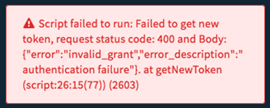  
</li>
<li>This error indicates a problem in the Costumer Key:   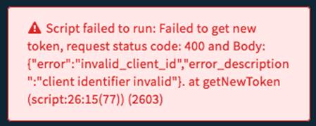  
</li>
<li>This error indicates a problem in the Costumer Secret:   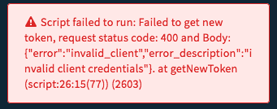  </li>
</ul>
<h3 id="h_5753070501321535544438325">Credentials walkthrough:</h3>

 1. Open <strong>Setup</strong>.   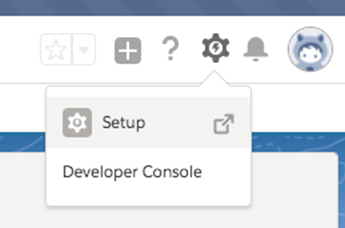

2. Go to the App manager on the left side menu (use Quick Find for faster search).  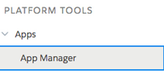

3. Click “New Connected App” on the right side of the screen.

4. Fill in the form as follows:

<ul>
<li>Mark “<strong>Enable OAuth Settings</strong>”.</li>
<li>In “<strong>Selected OAuth Scopes</strong>”, Add the following:
<ul>
<li>Access and manage your Chatter data (chatter_api)</li>
<li>Access and manage your data (api)</li>
</ul>
</li>
</ul>

5. Click “Save” at the bottom of the form.

6. In the information page on the APP that you will be forwarded to locate “<strong>API (Enable OAuth Settings)</strong>” and copy the consumer key and secret to the integration instance configuration.

6. Go to “Manage Connected Apps”. 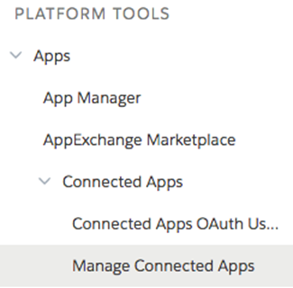

7. Edit the new application and under “OAuth Policies” enable all IP address.

 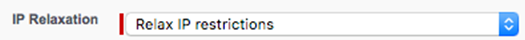 

### salesforce-get-casecomment

***
Returns a comment through the case number.

#### Base Command

`salesforce-get-casecomment`

#### Input

| **Argument Name** | **Description** | **Required** |
| --- | --- | --- |
| oid | Returns information of a case. | Optional | 
| caseNumber | The case number of the case. | Optional | 

#### Context Output

| **Path** | **Type** | **Description** |
| --- | --- | --- |
| ID | string | The ID of the case. | 
| ParentId | string | The ID of the parent case of the case comment. Required. | 
| IsPublished | boolean | Whether the case comment is visible to customers in the Self-Service portal \(true\). The label is published. This is the only CaseComment field that can be updated through the API. | 
| CommentBody | string | The text of the case body. Maximum size is 4,000 bytes. The label is Body. | 
| CreatedById | unknown | The created date by ID. | 
| CreatedDate | string | The created date. | 
| SystemModstamp | string | The SystemMod stamp. | 
| LastModifiedDate | string | The last modified date.  | 
| LastModifiedById | string | The last modified date by ID. | 
| IsDeleted | boolean | Whether the object has been moved to the Recycle Bin \(true\). Label is Deleted. | 
### salesforce-post-casecomment

***
The post comment through the case number.

#### Base Command

`salesforce-post-casecomment`

#### Input

| **Argument Name** | **Description** | **Required** |
| --- | --- | --- |
| oid | The Object ID of the case. | Optional | 
| caseNumber | The case number of the case. | Optional | 
| text | Added Text to context. | Optional | 

#### Context Output

There is no context output for this command.
### salesforce-get-user

***
Returns the UserName through the case number.

#### Base Command

`salesforce-get-user`

#### Input

| **Argument Name** | **Description** | **Required** |
| --- | --- | --- |
| oid | The Object ID of the case. | Optional | 
| caseNumber | The case number of the case. | Optional | 

#### Context Output

| **Path** | **Type** | **Description** |
| --- | --- | --- |
| ID | string | The ID of the case. | 
| Alias | string | The user’s alias. Required. For example, jsmith. | 
| CommunityNickname | string | The name used to identify the user in the Community application, which includes the ideas and answers features. | 
| CreatedById | string | Created by the ID. | 
| Email | string | The user’s email address. Required. | 
| LastLoginDate | string | The time and date when the user last successfully logged in. This value is updated if 60 seconds have elapsed since the user’s last login. | 
| LastModifiedDate | string | The last modified date. | 
| LastName | string | The user’s last name. Required. | 
| Name | string | Concatenation of FirstName and LastName. Limited to 121 characters. | 
| Username | string | Contains the name that a user enters to log in to the API or the user interface. Required. Must be in the form of an email address, all characters should be lowercase, and unique across all organizations. Each added user counts as a license. Every organization has a maximum number of licenses. If you attempt to exceed the maximum number of licenses by inserting user records, the attempt to create a user is rejected. | 
| UserRoleId | string | The ID of the user’s UserRole. Label is Role ID. | 
### salesforce-get-org

***
Returns organization details from the case number. 

#### Base Command

`salesforce-get-org`

#### Input

| **Argument Name** | **Description** | **Required** |
| --- | --- | --- |
| caseNumber | The case number of the case. | Optional | 

#### Context Output

| **Path** | **Type** | **Description** |
| --- | --- | --- |
| ID | string | The unique ID of the case. | 
| Name | string | Name of the account. Required. Label is Account Name. Maximum size is 255 characters. If the account has a record type of Person Account, this value is the concatenation of the FirstName, MiddleName, LastName, and Suffix of the associated person contact. You cannot modify this value. | 
