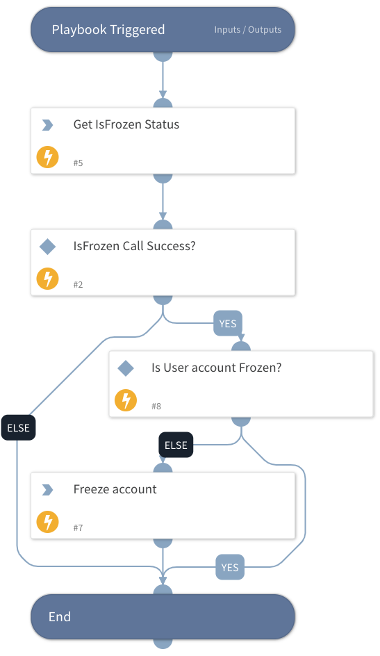

Freezes a Salesforce account.

## Dependencies
This playbook uses the following sub-playbooks, integrations, and scripts.

### Sub-playbooks
This playbook does not use any sub-playbooks.

### Integrations
* Salesforce_IAM

### Scripts
This playbook does not use any scripts.

### Commands
* salesforce-freeze-user-account
* salesforce-get-user-isfrozen-status

## Playbook Inputs
---

| **Name** | **Description** | **Default Value** | **Required** |
| --- | --- | --- | --- |
| salesforceId | Salesforce Unique ID |  | Required |

## Playbook Outputs
---

| **Path** | **Description** | **Type** |
| --- | --- | --- |
| IAM.Vendor | The Salesforce IAM commands' results. | unknown |

## Playbook Image
---
