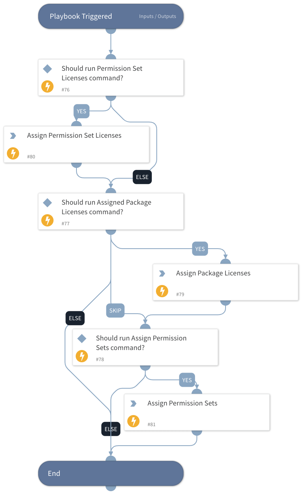

Assignes permission sets, permission set licenses and package licenses to a Salesforce account.

## Dependencies
This playbook uses the following sub-playbooks, integrations, and scripts.

### Sub-playbooks
This playbook does not use any sub-playbooks.

### Integrations
* Salesforce_IAM

### Scripts
This playbook does not use any scripts.

### Commands
* salesforce-assign-package-license
* salesforce-assign-permission-set-license
* salesforce-assign-permission-set

## Playbook Inputs
---

| **Name** | **Description** | **Default Value** | **Required** |
| --- | --- | --- | --- |
| salesforceId | salesforce Id |  | Required |
| permissionSetLicences | permissionSetLicences |  | Optional |
| permissionSets | permissionSets |  | Optional |
| packageLicences | packageLicences |  | Optional |
| ITNotificationEmail | Email to notify about errors in the provisioning process. |  | Required |
| PreviousRun | A list of vendors that ran previously. |  | Optional |

## Playbook Outputs
---

| **Path** | **Description** | **Type** |
| --- | --- | --- |
| IAM.Vendor | The Salesforce IAM commands' results. | unknown |

## Playbook Image
---
