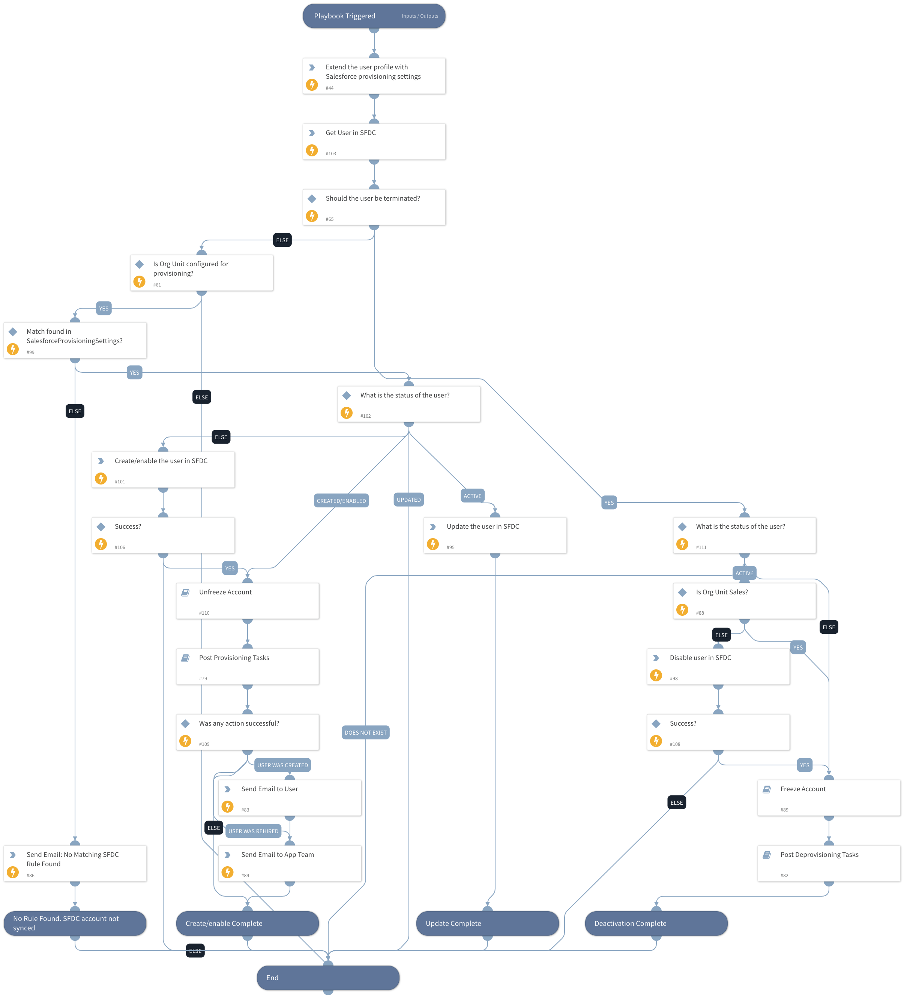

Based on based on the User Profile's Org Level 1/2/3 fields and other fields, syncs the extended user information, permission sets, permission sets licenses, package licenses and freeze statuses.

## Dependencies
This playbook uses the following sub-playbooks, integrations, and scripts.

### Sub-playbooks
* Salesforce IAM - Post Deprovisioning
* Salesforce IAM - Freeze Account
* Salesforce IAM - Unfreeze Account
* Salesforce IAM - Post Provisioning

### Integrations
* Salesforce_IAM

### Scripts
* SalesforceIAMExtendUserProfileData

### Commands
* iam-update-user
* iam-create-user
* iam-get-user
* send-mail
* iam-disable-user

## Playbook Inputs
---

| **Name** | **Description** | **Default Value** | **Required** |
| --- | --- | --- | --- |
| salesforceInstance | Salesforce app instance name | lists.app-provisioning-settings | Required |
| ITNotificationEmail | Email to notify about errors in the provisioning process. |  | Required |
| welcomeEmailBody |  | Hi,   Your Salesforce account has been created successfully. To login into Salesforce, enter your network credentials.   Please feel free to create a ticket with IT Services if you have any questions or issues.   Regards,  Salesforce Admin Team  | Optional |
| PreviousRun | Provisioning results from previous run. |  | Optional |

## Playbook Outputs
---

| **Path** | **Description** | **Type** |
| --- | --- | --- |
| IAM.Vendor | Salesforce Provisioning Details | unknown |

## Playbook Image
---
