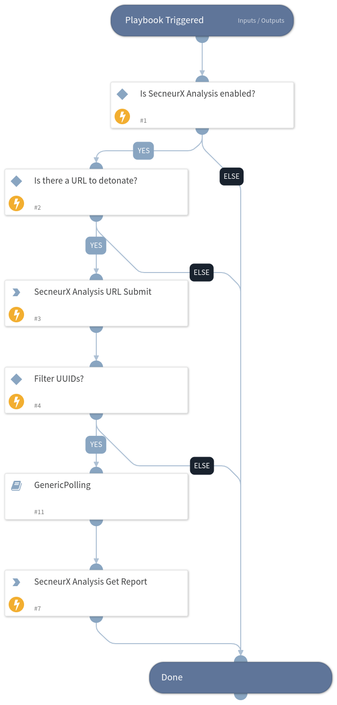

Detonates a URL using the SecneurX Analysis integration. Returns relevant reports to the War Room and file reputations to the context data.

## Dependencies
This playbook uses the following sub-playbooks, integrations, and scripts.

### Sub-playbooks
* GenericPolling

### Integrations
* Secneurx Analysis

### Scripts
This playbook does not use any scripts.

### Commands
* snx-analysis-get-report
* snx-analysis-submit-url
* snx-analysis-get-verdict

## Playbook Inputs
---

| **Name** | **Description** | **Default Value** | **Required** |
| --- | --- | --- | --- |
| URL | URL to detonate. | URL | Optional |
| Priority | Analysis priority. Possible values are "High" or "Normal". | Normal | Optional |
| Duration | Analysis duration in seconds. | 120 | Optional |
| Reboot | Reboot the system during analysis. The value should be "True" or "False". | False | Optional |
| ReportFormat | The resource type to download. Supported values are: ["json", "html"]. | json | Optional |
| PollingInterval | Duration for executing the pooling (in minutes). | 1 | Optional |
| Timeout | The duration after which to stop pooling and to resume the playbook (in minutes). | 15 | Optional |

## Playbook Outputs
---

| **Path** | **Description** | **Type** |
| --- | --- | --- |
| SecneurXAnalysis.Report.SHA256 | SHA256 value of the analyzed sample | string |
| SecneurXAnalysis.Report.Platform | Platform of the analyzed sample | String |
| SecneurXAnalysis.Report.Verdict | Summary result of the analyzed sample | string |
| SecneurXAnalysis.Report.Tags | More details of the analyzed sample | string |
| SecneurXAnalysis.Report.DnsRequests | List of DNS data observed in the analyzed sample | string |
| SecneurXAnalysis.Report.HttpRequests | List of HTTP data observed in the analyzed sample | string |
| SecneurXAnalysis.Report.JA3Digests | List of JA3 data observed in the analyzed sample | string |
| SecneurXAnalysis.Report.ProcessCreated | Process behaviour data observed in the analyzed sample | string |
| SecneurXAnalysis.Report.RegistrySet | List of Registry creations observed in the analyzed sample | string |
| SecneurXAnalysis.Report.RegistryDeleted | List of Registry deletions observed in the analyzed sample | string |
| SecneurXAnalysis.Report.FileCreated | List of File creations observed in the analyzed sample | string |
| SecneurXAnalysis.Report.FileDropped | List of File drops observed in the analyzed sample | string |
| SecneurXAnalysis.Report.FileDeleted | List of File deletions observed in the analyzed sample | string |
| SecneurXAnalysis.Report.FileModified | List of File changes observed in the analyzed sample | string |
| SecneurXAnalysis.Report.IOC | List of IOC's observed in the analyzed sample | string |
| SecneurXAnalysis.Report.Status | Analysis queued sample state | string |

## Playbook Image
---
