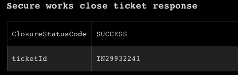

<!-- HTML_DOC -->
<h2> </h2>

The Secureworks CTP Ticketing system is used to respond to security changes, requests, security incidents, network problems, and other issues reported by external and  internal end-users.

In Cortex XSOAR, the integration provides access to the Secureworks CTP ticketing system and enables managing tickets, which includes viewing, editing, creating and closing operations, in accordance with the Secureworks Ticketing API guide.

<h2>Use cases</h2>

The integration allows managing CTP tickets with support for parameters (e.g whether to retrieve worklogs for a ticket), with the ability of fetching newly created tickets.

<h2>Prerequisites</h2>

To use the Secureworks integration, the following is required:

<ul>
<li>A Secureworks account with API User role</li>
<li>A persistent API key with the Security Roles permission</li>
<li>For more information about setting up the API, see the SecureWorks <a href="https://portal.secureworks.com/portal/">ticketing API guide</a>.</li>
<li>For tickets to be fetched, they first need to be updated as acknowledged.</li>
</ul>
<h2>Configure Dell Secureworks on Cortex XSOAR</h2>
<ol>
<li>Navigate to <strong>Settings</strong> &gt; <strong>Integrations</strong> &gt; <strong>Servers &amp; Services</strong>.</li>
<li>Search for Dell Secureworks.</li>
<li>Click <strong>Add instance</strong> to create and configure a new integration instance. 
<ul>
<li>
<strong>Name</strong>: a textual name for the integration instance.</li>
<li><strong>Server URL (e.g. https://api.secureworks.com)</strong></li>
<li><strong>Username</strong></li>
<li><strong>Trust any certificate (not secure)</strong></li>
<li><strong>Use system proxy settings</strong></li>
<li><strong>Fetch incidents</strong></li>
<li><strong>Fetch tickets matching to one of SERVICE_REQUEST, INCIDENT or CHANGE</strong></li>
<li><strong>Limit tickets to one of REQUEST, CHANGE, HEALTH or SECURITY</strong></li>
<li><strong>Fetch tickets by status(comma separated): New,Active,Queued,Pending,Resolved</strong></li>
<li><strong>Whether to return worklogs - If "ALL," all worklogs are returned for each ticket. If "UPDATED", all worklogs added since last acknowledgement are returned. If "NONE," the path returns no worklogs. Default is "ALL."</strong></li>
<li><strong>Incident type</strong></li>
<li><strong>Whether to get attachments for the fetched tickets</strong></li>
</ul>
</li>
<li>Click <strong>Test</strong> to validate the URLs, token, and connection.</li>
</ol>
<h2>Fetched Incidents Data</h2>

The integration fetches newly created tickets. Tickets that are fetched for the first time are marked using a designated custom field - <code>customerMiscellaneous4</code> which will be set with the value <code>MARKED</code>, and at the next time tickets are fetched, the designated field will be checked for the <code>MARKED</code> value. Tickets which were marked will be excluded and will not be fetched again, even if they are updated. Tickets of type <code>Health</code> will not be retrieved - tickets with <code>eventSource</code> of value <code>CTP_HEALTH</code> and with <code>categorizationClass</code> of value <code>Health</code> This can be further filtered by configuring the instance parameters <code>ticketType</code>, <code>groupingType</code>, <code>status</code> and <code>worklogs</code>, as seen above.

A maximum amount of 10 ticket updates can be fetched in each interval (sorted in ascending order of ticket update time in the past 24 hours).

<h2>Commands</h2>

You can execute these commands from the Cortex XSOAR CLI, as part of an automation, or in a playbook. After you successfully execute a command, a DBot message appears in the War Room with the command details.

<ol>
<li><a href="#h_17023983171541591852162">Create a ticket: secure-works-create-ticket</a></li>
<li><a href="#h_9085029801081541591856856">Update a ticket: secure-works-update-ticket</a></li>
<li><a href="#h_1546949482081541591862045">Close a ticket: secure-works-close-ticket</a></li>
<li><a href="#h_501830193971541591872743">Add worklogs to a ticket: secure-works-add-worklogs-ticket</a></li>
<li><a href="#h_2886968124941541591878149">Get ticket information: secure-works-get-ticket</a></li>
<li><a href="#h_5362456495891541591882972">Assign a ticket: secure-works-assign-ticket</a></li>
<li><a href="#h_7882869456841541591888341">Retrieve tickets from the previous 24 hours: secure-works-get-tickets-updates</a></li>
<li><a href="#h_5594867877791541591893275">Get close codes for a ticket: secure-works-get-close-codes</a></li>
<li><a href="#h_1879153928731541591898364">Get a list of ticket IDs: secure-works-get-tickets-ids</a></li>
<li><a href="#h_6997498989661541591904498">Get the count of updated tickets: secure-works-get-ticket-count</a></li>
</ol>
<h3 id="h_17023983171541591852162">1. Create a ticket</h3>

Creates a new ticket.

<h5>Base Command</h5>

<code>secure-works-create-ticket</code>

<h5>Input</h5>
<table style="width: 748px;" border="2" cellpadding="6">
<thead>
<tr>
<th style="width: 261px;"><strong>Argument Name</strong></th>
<th style="width: 332px;"><strong>Description</strong></th>
<th style="width: 115px;"><strong>Required</strong></th>
</tr>
</thead>
<tbody>
<tr>
<td style="width: 261px;">clientRef</td>
<td style="width: 332px;">Client reference</td>
<td style="width: 115px;">Required</td>
</tr>
<tr>
<td style="width: 261px;">clientLocationRef</td>
<td style="width: 332px;">Client location reference</td>
<td style="width: 115px;">Optional</td>
</tr>
<tr>
<td style="width: 261px;">requestType</td>
<td style="width: 332px;">Request type</td>
<td style="width: 115px;">Required</td>
</tr>
<tr>
<td style="width: 261px;">title</td>
<td style="width: 332px;">Ticket title</td>
<td style="width: 115px;">Required</td>
</tr>
<tr>
<td style="width: 261px;">externalTicket</td>
<td style="width: 332px;">External ticket</td>
<td style="width: 115px;">Optional</td>
</tr>
<tr>
<td style="width: 261px;">deviceRef</td>
<td style="width: 332px;">Device reference</td>
<td style="width: 115px;">Optional</td>
</tr>
<tr>
<td style="width: 261px;">detail</td>
<td style="width: 332px;">Ticket details</td>
<td style="width: 115px;">Required</td>
</tr>
<tr>
<td style="width: 261px;">pocContactRef</td>
<td style="width: 332px;">Ticket POC contact reference</td>
<td style="width: 115px;">Required</td>
</tr>
<tr>
<td style="width: 261px;">watchers</td>
<td style="width: 332px;">Ticket watchers</td>
<td style="width: 115px;">Optional</td>
</tr>
<tr>
<td style="width: 261px;">attachments</td>
<td style="width: 332px;">Ticket attachments</td>
<td style="width: 115px;">Optional</td>
</tr>
<tr>
<td style="width: 261px;">source</td>
<td style="width: 332px;">Ticket source</td>
<td style="width: 115px;">Optional</td>
</tr>
<tr>
<td style="width: 261px;">assignedGroupId</td>
<td style="width: 332px;">Ticket assigned group ID</td>
<td style="width: 115px;">Optional</td>
</tr>
<tr>
<td style="width: 261px;">assignedTicket2</td>
<td style="width: 332px;">Ticket assigned ticket 2</td>
<td style="width: 115px;">Optional</td>
</tr>
<tr>
<td style="width: 261px;">partner</td>
<td style="width: 332px;">Ticket partner</td>
<td style="width: 115px;">Optional</td>
</tr>
<tr>
<td style="width: 261px;">vendor</td>
<td style="width: 332px;">Ticket vendor</td>
<td style="width: 115px;">Optional</td>
</tr>
<tr>
<td style="width: 261px;">riskAssessment</td>
<td style="width: 332px;">Ticket risk assessment</td>
<td style="width: 115px;">Optional</td>
</tr>
<tr>
<td style="width: 261px;">changeSlo</td>
<td style="width: 332px;">Ticket change slo</td>
<td style="width: 115px;">Optional</td>
</tr>
<tr>
<td style="width: 261px;">changeWindowStart</td>
<td style="width: 332px;">Ticket change window start</td>
<td style="width: 115px;">Optional</td>
</tr>
<tr>
<td style="width: 261px;">changeWindowEnd</td>
<td style="width: 332px;">Ticket change window end</td>
<td style="width: 115px;">Optional</td>
</tr>
<tr>
<td style="width: 261px;">impact</td>
<td style="width: 332px;">Ticket impact</td>
<td style="width: 115px;">Optional</td>
</tr>
<tr>
<td style="width: 261px;">urgency</td>
<td style="width: 332px;">Ticket urgency</td>
<td style="width: 115px;">Optional</td>
</tr>
<tr>
<td style="width: 261px;">priority</td>
<td style="width: 332px;">Ticket priority</td>
<td style="width: 115px;">Optional</td>
</tr>
<tr>
<td style="width: 261px;">customerMiscellaneous1</td>
<td style="width: 332px;">Ticket custom field 1</td>
<td style="width: 115px;">Optional</td>
</tr>
<tr>
<td style="width: 261px;">customerMiscellaneous2</td>
<td style="width: 332px;">Ticket custom field 2</td>
<td style="width: 115px;">Optional</td>
</tr>
<tr>
<td style="width: 261px;">customerMiscellaneous3</td>
<td style="width: 332px;">Ticket custom field 3</td>
<td style="width: 115px;">Optional</td>
</tr>
<tr>
<td style="width: 261px;">customerMiscellaneous4</td>
<td style="width: 332px;">Ticket custom field 4</td>
<td style="width: 115px;">Optional</td>
</tr>
<tr>
<td style="width: 261px;">categorizationClass</td>
<td style="width: 332px;">Ticket categorization class</td>
<td style="width: 115px;">Optional</td>
</tr>
<tr>
<td style="width: 261px;">categorizationCategory</td>
<td style="width: 332px;">Ticket categorization category</td>
<td style="width: 115px;">Optional</td>
</tr>
<tr>
<td style="width: 261px;">categorizationType</td>
<td style="width: 332px;">Ticket categorization type</td>
<td style="width: 115px;">Optional</td>
</tr>
<tr>
<td style="width: 261px;">categorizationItem</td>
<td style="width: 332px;">Ticket categorization item</td>
<td style="width: 115px;">Optional</td>
</tr>
</tbody>
</table>

 

<h5>Context Output</h5>
<table style="width: 748px;" border="2" cellpadding="6">
<thead>
<tr>
<th style="width: 380px;"><strong>Path</strong></th>
<th style="width: 66px;"><strong>Type</strong></th>
<th style="width: 262px;"><strong>Description</strong></th>
</tr>
</thead>
<tbody>
<tr>
<td style="width: 380px;">SecureWorks.Ticket.ticketId</td>
<td style="width: 66px;">string</td>
<td style="width: 262px;">Ticket ID in Secureworks</td>
</tr>
<tr>
<td style="width: 380px;">SecureWorks.Ticket.CreationStatusCode</td>
<td style="width: 66px;">string</td>
<td style="width: 262px;">Ticket creation status code</td>
</tr>
</tbody>
</table>
<h5> </h5>
<h5>Command Example</h5>
<pre>!secure-works-create-ticket clientRef=https://prov.core.ctp.secureworks.net/prov/clients/1234567 clientLocationRef=https://prov.core.ctp.secureworks.net/prov/client-locations/654321 requestType="API support" title="test create" detail="testing" pocContactRef=https://prov.core.ctp.secureworks.net/prov/contacts/9876543</pre>
<h5>Context Example</h5>
<pre>"SecureWorks": {
    "Ticket": {
        "code": "SUCCESS",
        "ticketID": "SR11537985"
     }
}
</pre>
<h5>Human Readable Output</h5>

<h3 id="h_9085029801081541591856856">2. Update a ticket</h3>

Updates an existing ticket.

<h5>Base Command</h5>

<code>secure-works-update-ticket</code>

<h5>Input</h5>
<table style="width: 748px;" border="2" cellpadding="6">
<thead>
<tr>
<th style="width: 280px;"><strong>Argument Name</strong></th>
<th style="width: 303px;"><strong>Description</strong></th>
<th style="width: 125px;"><strong>Required</strong></th>
</tr>
</thead>
<tbody>
<tr>
<td style="width: 280px;">id</td>
<td style="width: 303px;">ID of the ticket to update</td>
<td style="width: 125px;">Required</td>
</tr>
<tr>
<td style="width: 280px;">externalTicketNum</td>
<td style="width: 303px;">External ticket number</td>
<td style="width: 125px;">Optional</td>
</tr>
<tr>
<td style="width: 280px;">externalTicketNum2</td>
<td style="width: 303px;">External ticket number 2</td>
<td style="width: 125px;">Optional</td>
</tr>
<tr>
<td style="width: 280px;">externalGroupName</td>
<td style="width: 303px;">External group name</td>
<td style="width: 125px;">Optional</td>
</tr>
<tr>
<td style="width: 280px;">watchers</td>
<td style="width: 303px;">Ticket watchers</td>
<td style="width: 125px;">Optional</td>
</tr>
<tr>
<td style="width: 280px;">vendor</td>
<td style="width: 303px;">Ticket vendor</td>
<td style="width: 125px;">Optional</td>
</tr>
<tr>
<td style="width: 280px;">customerMiscellaneous1</td>
<td style="width: 303px;">Ticket custom field 1</td>
<td style="width: 125px;">Optional</td>
</tr>
<tr>
<td style="width: 280px;">customerMiscellaneous2</td>
<td style="width: 303px;">Ticket custom field 2</td>
<td style="width: 125px;">Optional</td>
</tr>
<tr>
<td style="width: 280px;">customerMiscellaneous3</td>
<td style="width: 303px;">Ticket custom field 3</td>
<td style="width: 125px;">Optional</td>
</tr>
<tr>
<td style="width: 280px;">customerMiscellaneous4</td>
<td style="width: 303px;">Ticket custom field 4</td>
<td style="width: 125px;">Optional</td>
</tr>
</tbody>
</table>

 

<h5>Context Output</h5>
<table style="width: 748px;" border="2" cellpadding="6">
<thead>
<tr>
<th style="width: 380px;"><strong>Path</strong></th>
<th style="width: 69px;"><strong>Type</strong></th>
<th style="width: 259px;"><strong>Description</strong></th>
</tr>
</thead>
<tbody>
<tr>
<td style="width: 380px;">SecureWorks.Ticket.ticketId</td>
<td style="width: 69px;">string</td>
<td style="width: 259px;">Ticket ID in Secureworks</td>
</tr>
<tr>
<td style="width: 380px;">SecureWorks.Ticket.UpdateStatusCode</td>
<td style="width: 69px;">string</td>
<td style="width: 259px;">Ticket update status code</td>
</tr>
</tbody>
</table>

 

<h5>Command Example</h5>
<pre>!secure-works-update-ticket id=IN29959685 customerMiscellaneous1=abc</pre>
<h5>Context Example</h5>
<pre>{
    "SecureWorks": {
        "Ticket": {
            "UpdateStatusCode": "SUCCESS",
            "ticketId": "IN29959685"
        }
    }
}
</pre>
<h5>Human Readable Output</h5>

<h3 id="h_1546949482081541591862045">3. Close a ticket</h3>

Closes a ticket.

<h5>Base Command</h5>

<code>secure-works-close-ticket</code>

<h5>Input</h5>
<table style="width: 748px;" border="2" cellpadding="6">
<thead>
<tr>
<th style="width: 136px;"><strong>Argument Name</strong></th>
<th style="width: 493px;"><strong>Description</strong></th>
<th style="width: 79px;"><strong>Required</strong></th>
</tr>
</thead>
<tbody>
<tr>
<td style="width: 136px;">id</td>
<td style="width: 493px;">The ticket ID of the ticket that you want the details for</td>
<td style="width: 79px;">Required</td>
</tr>
<tr>
<td style="width: 136px;">worklogContent</td>
<td style="width: 493px;">The work log message describing why you are closing the ticket</td>
<td style="width: 79px;">Optional</td>
</tr>
<tr>
<td style="width: 136px;">closeCode</td>
<td style="width: 493px;">The reason code to use when closing the ticket</td>
<td style="width: 79px;">Required</td>
</tr>
</tbody>
</table>

 

<h5>Context Output</h5>
<table style="width: 748px;" border="2" cellpadding="6">
<thead>
<tr>
<th style="width: 380px;"><strong>Path</strong></th>
<th style="width: 68px;"><strong>Type</strong></th>
<th style="width: 260px;"><strong>Description</strong></th>
</tr>
</thead>
<tbody>
<tr>
<td style="width: 380px;">SecureWorks.Ticket.ticketId</td>
<td style="width: 68px;">string</td>
<td style="width: 260px;">Ticket ID in Secureworks</td>
</tr>
<tr>
<td style="width: 380px;">SecureWorks.Ticket.ClosureStatusCode</td>
<td style="width: 68px;">string</td>
<td style="width: 260px;">Ticket closure status code</td>
</tr>
</tbody>
</table>

 

<h5>Command Example</h5>
<pre>!secure-works-close-ticket closeCode="Work Completed" id=IN29932241</pre>
<h5>Context Example</h5>
<pre>{
    "SecureWorks": {
        "Ticket": {
            "ClosureStatusCode": "SUCCESS",
            "ticketId": "IN29932241"
        }
    }
}
</pre>
<h5>Human Readable Output</h5>

<h3 id="h_501830193971541591872743">4. Add worklogs to a ticket</h3>

Adds worklogs to a ticket.

<h5>Base Command</h5>

<code>secure-works-add-worklogs-ticket</code>

<h5>Input</h5>
<table style="width: 746px;" border="2" cellpadding="6">
<thead>
<tr>
<th style="width: 196px;"><strong>Argument Name</strong></th>
<th style="width: 394px;"><strong>Description</strong></th>
<th style="width: 118px;"><strong>Required</strong></th>
</tr>
</thead>
<tbody>
<tr>
<td style="width: 196px;">content</td>
<td style="width: 394px;">The work log message</td>
<td style="width: 118px;">Required</td>
</tr>
<tr>
<td style="width: 196px;">id</td>
<td style="width: 394px;">ID of the ticket to add work logs to</td>
<td style="width: 118px;">Required</td>
</tr>
</tbody>
</table>

 

<h5>Context Output</h5>
<table style="width: 748px;" border="2" cellpadding="6">
<thead>
<tr>
<th style="width: 375px;"><strong>Path</strong></th>
<th style="width: 52px;"><strong>Type</strong></th>
<th style="width: 281px;"><strong>Description</strong></th>
</tr>
</thead>
<tbody>
<tr>
<td style="width: 375px;">SecureWorks.Ticket.ticketId</td>
<td style="width: 52px;">string</td>
<td style="width: 281px;">Ticket ID in Secureworks</td>
</tr>
<tr>
<td style="width: 375px;">SecureWorks.Ticket.WorklogAdditionStatusCode</td>
<td style="width: 52px;">string</td>
<td style="width: 281px;">Ticket worklog addition status code</td>
</tr>
</tbody>
</table>

 

<h5>Command Example</h5>
<pre>!secure-works-add-worklogs-ticket content="worklog" id="SR11525106"</pre>
<h5>Human Readable Output</h5>

<h3 id="h_2886968124941541591878149">5. Get ticket details</h3>

Returns the details of a specific ticket, by  ticket ID.

<h5>Base Command</h5>

<code>secure-works-get-ticket</code>

<h5>Input</h5>
<table style="width: 748px;" border="2" cellpadding="6">
<thead>
<tr>
<th style="width: 149px;"><strong>Argument Name</strong></th>
<th style="width: 473px;"><strong>Description</strong></th>
<th style="width: 86px;"><strong>Required</strong></th>
</tr>
</thead>
<tbody>
<tr>
<td style="width: 149px;">id</td>
<td style="width: 473px;">The ticket ID of the ticket that you want the details for.</td>
<td style="width: 86px;">Required</td>
</tr>
<tr>
<td style="width: 149px;">includeWorklogs</td>
<td style="width: 473px;">Whether or not to include ticket worklogs, default is <em>true</em>
</td>
<td style="width: 86px;">Optional</td>
</tr>
<tr>
<td style="width: 149px;">getAttachments</td>
<td style="width: 473px;">Whether or not to get ticket attachments</td>
<td style="width: 86px;">Optional</td>
</tr>
</tbody>
</table>

 

<h5>Context Output</h5>
<table style="width: 748px;" border="2" cellpadding="6">
<thead>
<tr>
<th style="width: 334px;"><strong>Path</strong></th>
<th style="width: 79px;"><strong>Type</strong></th>
<th style="width: 295px;"><strong>Description</strong></th>
</tr>
</thead>
<tbody>
<tr>
<td style="width: 334px;">SecureWorks.Ticket.changeApproval</td>
<td style="width: 79px;">string</td>
<td style="width: 295px;">Ticket change approval</td>
</tr>
<tr>
<td style="width: 334px;">SecureWorks.Ticket.attachmentInfo.id</td>
<td style="width: 79px;">string</td>
<td style="width: 295px;">Ticket attachment info ID</td>
</tr>
<tr>
<td style="width: 334px;">SecureWorks.Ticket.changeSlo</td>
<td style="width: 79px;">string</td>
<td style="width: 295px;">Ticket change service level objective</td>
</tr>
<tr>
<td style="width: 334px;">SecureWorks.Ticket.changeWindowStart</td>
<td style="width: 79px;">number</td>
<td style="width: 295px;">Ticket change window start</td>
</tr>
<tr>
<td style="width: 334px;">SecureWorks.Ticket.changeWindowEnd</td>
<td style="width: 79px;">number</td>
<td style="width: 295px;">Ticket change window end</td>
</tr>
<tr>
<td style="width: 334px;">SecureWorks.Ticket.client.id</td>
<td style="width: 79px;">string</td>
<td style="width: 295px;">Ticket client ID</td>
</tr>
<tr>
<td style="width: 334px;">SecureWorks.Ticket.client.name</td>
<td style="width: 79px;">string</td>
<td style="width: 295px;">Ticket client name</td>
</tr>
<tr>
<td style="width: 334px;">SecureWorks.Ticket.contact.id</td>
<td style="width: 79px;">string</td>
<td style="width: 295px;">Ticket contact ID</td>
</tr>
<tr>
<td style="width: 334px;">SecureWorks.Ticket.contact.name</td>
<td style="width: 79px;">string</td>
<td style="width: 295px;">Ticket contact name</td>
</tr>
<tr>
<td style="width: 334px;">SecureWorks.Ticket.dateCreated</td>
<td style="width: 79px;">number</td>
<td style="width: 295px;">Ticket creation time</td>
</tr>
<tr>
<td style="width: 334px;">SecureWorks.Ticket.dateClosed</td>
<td style="width: 79px;">number</td>
<td style="width: 295px;">Ticket closing time</td>
</tr>
<tr>
<td style="width: 334px;">SecureWorks.Ticket.dateModified</td>
<td style="width: 79px;">number</td>
<td style="width: 295px;">Ticket modified</td>
</tr>
<tr>
<td style="width: 334px;">SecureWorks.Ticket.detailedDescription</td>
<td style="width: 79px;">string</td>
<td style="width: 295px;">Ticket detailed description</td>
</tr>
<tr>
<td style="width: 334px;">SecureWorks.Ticket.devices.id</td>
<td style="width: 79px;">string</td>
<td style="width: 295px;">Ticket device ID</td>
</tr>
<tr>
<td style="width: 334px;">SecureWorks.Ticket.devices.name</td>
<td style="width: 79px;">string</td>
<td style="width: 295px;">Ticket device name</td>
</tr>
<tr>
<td style="width: 334px;">SecureWorks.Ticket.impact</td>
<td style="width: 79px;">string</td>
<td style="width: 295px;">Ticket impact</td>
</tr>
<tr>
<td style="width: 334px;">SecureWorks.Ticket.clientLocation.id</td>
<td style="width: 79px;">string</td>
<td style="width: 295px;">Ticket client location ID</td>
</tr>
<tr>
<td style="width: 334px;">SecureWorks.Ticket.partner</td>
<td style="width: 79px;">string</td>
<td style="width: 295px;">Ticket partner</td>
</tr>
<tr>
<td style="width: 334px;">SecureWorks.Ticket.priority</td>
<td style="width: 79px;">string</td>
<td style="width: 295px;">Ticket priority</td>
</tr>
<tr>
<td style="width: 334px;">SecureWorks.Ticket.reason</td>
<td style="width: 79px;">string</td>
<td style="width: 295px;">Ticket closure reason</td>
</tr>
<tr>
<td style="width: 334px;">SecureWorks.Ticket.requestType</td>
<td style="width: 79px;">string</td>
<td style="width: 295px;">Ticket request type</td>
</tr>
<tr>
<td style="width: 334px;">SecureWorks.Ticket.riskAssessment</td>
<td style="width: 79px;">string</td>
<td style="width: 295px;">Ticket risk assessment</td>
</tr>
<tr>
<td style="width: 334px;">SecureWorks.Ticket.service</td>
<td style="width: 79px;">string</td>
<td style="width: 295px;">Ticket service</td>
</tr>
<tr>
<td style="width: 334px;">SecureWorks.Ticket.status</td>
<td style="width: 79px;">string</td>
<td style="width: 295px;">Ticket status</td>
</tr>
<tr>
<td style="width: 334px;">SecureWorks.Ticket.symptomDescription</td>
<td style="width: 79px;">string</td>
<td style="width: 295px;">Ticket symptom description</td>
</tr>
<tr>
<td style="width: 334px;">SecureWorks.Ticket.ticketId</td>
<td style="width: 79px;">string</td>
<td style="width: 295px;">Ticket ID</td>
</tr>
<tr>
<td style="width: 334px;">SecureWorks.Ticket.type</td>
<td style="width: 79px;">string</td>
<td style="width: 295px;">Ticket type</td>
</tr>
<tr>
<td style="width: 334px;">SecureWorks.Ticket.urgency</td>
<td style="width: 79px;">string</td>
<td style="width: 295px;">Ticket urgency</td>
</tr>
<tr>
<td style="width: 334px;">SecureWorks.Ticket.watchers</td>
<td style="width: 79px;">unknown</td>
<td style="width: 295px;">Ticket watchers</td>
</tr>
<tr>
<td style="width: 334px;">SecureWorks.Ticket.category</td>
<td style="width: 79px;">string</td>
<td style="width: 295px;">Ticket category</td>
</tr>
<tr>
<td style="width: 334px;">SecureWorks.Ticket.categoryClass</td>
<td style="width: 79px;">string</td>
<td style="width: 295px;">Ticket category class</td>
</tr>
<tr>
<td style="width: 334px;">SecureWorks.Ticket.categoryType</td>
<td style="width: 79px;">string</td>
<td style="width: 295px;">Ticket category class</td>
</tr>
<tr>
<td style="width: 334px;">SecureWorks.Ticket.categoryItem</td>
<td style="width: 79px;">string</td>
<td style="width: 295px;">Ticket category item</td>
</tr>
<tr>
<td style="width: 334px;">SecureWorks.Ticket.attachmentInfo.name</td>
<td style="width: 79px;">string</td>
<td style="width: 295px;">Ticket attachment name</td>
</tr>
<tr>
<td style="width: 334px;">SecureWorks.Ticket.clientLocation.name</td>
<td style="width: 79px;">string</td>
<td style="width: 295px;">Ticket client location name</td>
</tr>
<tr>
<td style="width: 334px;">SecureWorks.Ticket.worklogs.createdBy</td>
<td style="width: 79px;">string</td>
<td style="width: 295px;">Ticket worklog creator</td>
</tr>
<tr>
<td style="width: 334px;">SecureWorks.Ticket.worklogs.dateCreated</td>
<td style="width: 79px;">number</td>
<td style="width: 295px;">Ticket worklog creation date</td>
</tr>
<tr>
<td style="width: 334px;">SecureWorks.Ticket.worklogs.description</td>
<td style="width: 79px;">string</td>
<td style="width: 295px;">Ticket worklog description</td>
</tr>
<tr>
<td style="width: 334px;">SecureWorks.Ticket.worklogs.type</td>
<td style="width: 79px;">string</td>
<td style="width: 295px;">Ticket worklog type</td>
</tr>
<tr>
<td style="width: 334px;">SecureWorks.Ticket.closeCodes</td>
<td style="width: 79px;">unknown</td>
<td style="width: 295px;">Ticket close codes</td>
</tr>
<tr>
<td style="width: 334px;">File.Info</td>
<td style="width: 79px;">unknown</td>
<td style="width: 295px;">Attachment file info</td>
</tr>
<tr>
<td style="width: 334px;">File.Name</td>
<td style="width: 79px;">string</td>
<td style="width: 295px;">Attachment file name</td>
</tr>
<tr>
<td style="width: 334px;">File.Size</td>
<td style="width: 79px;">number</td>
<td style="width: 295px;">Attachment file size</td>
</tr>
<tr>
<td style="width: 334px;">File.SHA1</td>
<td style="width: 79px;">string</td>
<td style="width: 295px;">Attachment file SHA-1</td>
</tr>
<tr>
<td style="width: 334px;">File.SHA256</td>
<td style="width: 79px;">string</td>
<td style="width: 295px;">Attachment file SHA-256</td>
</tr>
<tr>
<td style="width: 334px;">File.EntryID</td>
<td style="width: 79px;">string</td>
<td style="width: 295px;">Attachment file entry ID</td>
</tr>
<tr>
<td style="width: 334px;">File.Type</td>
<td style="width: 79px;">string</td>
<td style="width: 295px;">Attachment file type</td>
</tr>
<tr>
<td style="width: 334px;">File.MD5</td>
<td style="width: 79px;">string</td>
<td style="width: 295px;">Attachment file MD5</td>
</tr>
</tbody>
</table>

 

<h5>Context Example</h5>
<pre>{
    "File": [
        {
            "EntryID": "4041@cc00e449-9e7b-4609-8a68-1c8c01114562",
            "Info": "text/plain",
            "MD5": "70cde715b629831f2201909dcba55665",
            "Name": "test",
            "SHA1": "0e0a61f147707340d6113f5216be3c055bea8d25",
            "SHA256": "41481152869507cff739f38cb9a9583aa3f0db970dafceb62a2530f71f731194",
            "SSDeep": "3:hMCEpFk:hurk",
            "Size": 17,
            "Type": "ASCII text, with no line terminators\n"
        },
        {
            "EntryID": "4042@cc00e449-9e7b-4609-8a68-1c8c01114562",
            "Info": "text/plain",
            "MD5": "68dbf17be30baac0befd462601b8448d",
            "Name": "test2",
            "SHA1": "0eb7383773bd1c9d214a3b3fb63109373c78f2c7",
            "SHA256": "68818fa780a5d88a5d53018926b83bc9b6accc2f57256a1c1aa9bdce9abfa1c7",
            "SSDeep": "3:hMCECREn:hu3",
            "Size": 20,
            "Type": "ASCII text, with no line terminators\n"
        }
    ],
    "SecureWorks": {
        "Ticket": {
            "assignedGroup": "ESC - OpIntel",
            "attachmentInfo": [
                {
                    "id": "1728318",
                    "name": "test"
                },
                {
                    "id": "1729835",
                    "name": "test2"
                }
            ],
            "availableActions": {
                "addAttachment": {
                    "available": "true"
                },
                "addNote": {
                    "available": "true"
                },
                "assignToPoc": {
                    "available": "true"
                },
                "assignToSoc": {
                    "available": "true"
                },
                "close": {
                    "available": "true",
                    "closeCode": [
                        "Mitigated by Security Controls",
                        "Authorized/Expected",
                        "Inconclusive",
                        "True Positive",
                        "False Positive",
                        "Not Relevant",
                        "Duplicate - Previously Escalated",
                        "Work Completed"
                    ]
                }
            },
            "client": {
                "id": "3016296",
                "name": "Client1"
            },
            "clientLocation": {
                "id": "752373",
                "name": "Client1 - API Testing"
            },
            "contact": {
                "id": "2215505",
                "name": "John Doe"
            },
            "customerMiscellaneous1": "abc",
            "customerMiscellaneous4": "MARKED",
            "dateClosed": "",
            "dateCreated": "Thu Oct 04 2018 13:34:04 GMT+0300 (IDT)",
            "dateModified": "Mon Oct 15 2018 18:31:21 GMT+0300 (IDT)",
            "detailedDescription": "Secureworks API testing",
            "devices": [],
            "groupingType": "REQUEST",
            "isGlobalChild": false,
            "isGlobalParent": false,
            "priority": "MEDIUM",
            "reason": "Cust. Feedback-Auto-Close",
            "relatedTickets": [
                {
                    "ticketRef": [
                        {
                            "$": {
                                "href": "/tkt/tickets/SR11595508",
                                "relationship-owner": "SOC",
                                "relationship-type": "Spawn"
                            }
                        }
                    ]
                }
            ],
            "requestType": "SCWX API Support",
            "responsibleParty": "CLIENT",
            "status": "Pending",
            "symptomDescription": "API testing",
            "ticketId": "IN29959685",
            "ticketType": "INCIDENT",
            "version": "b2a010fa9b20e7c1b27741a527038a8619c7a11b84ba50de2276b73c3dbc6c5e6844f09d790e3df0b84fd9d033ecea3d472bc2",
            "watchers": [],
            "worklogs": [
                {
                    "createdBy": "John Doe",
                    "dateClosed": "",
                    "dateCreated": "Mon Oct 15 2018 12:28:46 GMT+0300 (IDT)",
                    "dateModified": "",
                    "description": "last note",
                    "type": "Customer Comment"
                },
                {
                    "createdBy": "John Doe",
                    "dateClosed": "",
                    "dateCreated": "Mon Oct 15 2018 12:24:15 GMT+0300 (IDT)",
                    "dateModified": "",
                    "description": "note",
                    "type": "Customer Comment"
                },
                {
                    "createdBy": "John Doe",
                    "dateClosed": "",
                    "dateCreated": "Mon Oct 15 2018 12:21:49 GMT+0300 (IDT)",
                    "dateModified": "",
                    "description": "note",
                    "type": "Customer Comment"
                },
                {
                    "createdBy": "John Doe",
                    "dateClosed": "",
                    "dateCreated": "Mon Oct 15 2018 11:13:27 GMT+0300 (IDT)",
                    "dateModified": "",
                    "description": "Customer added an attachment to the ticket",
                    "type": "Client Note"
                },
                {
                    "createdBy": "John Doe",
                    "dateClosed": "",
                    "dateCreated": "Mon Oct 15 2018 11:13:26 GMT+0300 (IDT)",
                    "dateModified": "",
                    "description": "Attachment added to ticket: test2\n.",
                    "type": "Attachment"
                },
                {
                    "createdBy": "John Smith",
                    "dateClosed": "",
                    "dateCreated": "Thu Oct 11 2018 17:37:42 GMT+0300 (IDT)",
                    "dateModified": "",
                    "description": "Communication Message:\nSend To: John Doe\nSubject: Secureworks Ticket #IN29959685 | Correspondence Added by SOC | API testing\nClient Portal: https://portal.secureworks.com/portal/incidents/IN29959685\n\nLocation: Client1 - API Testing\nTicket Summary: API testing\nCustomer's Internal Ticket #\n\nGreetings,\n\nSecureworks has received your attachment and notes via testing ticket IN29959685 (SR11595508). We are now pending this ticket back to the client side for your testing and integration purpose.\n\nThank you,\n\nDarrell Bessent\nSecureworks\n877-838-7960",
                    "type": "Client Notification"
                },
                {
                    "createdBy": "John Doe",
                    "dateClosed": "",
                    "dateCreated": "Thu Oct 11 2018 17:05:39 GMT+0300 (IDT)",
                    "dateModified": "",
                    "description": "This is a note",
                    "type": "Client Note"
                },
                {
                    "createdBy": "John Doe",
                    "dateClosed": "",
                    "dateCreated": "Thu Oct 11 2018 17:05:38 GMT+0300 (IDT)",
                    "dateModified": "",
                    "description": "Attachment added to ticket: test\n.",
                    "type": "Attachment"
                },
                {
                    "dateClosed": "",
                    "dateCreated": "Thu Oct 04 2018 13:34:04 GMT+0300 (IDT)",
                    "dateModified": "",
                    "description": "Communication Message:\nSend To: john@domain.com;{Watchers}\nSubject: Secureworks Ticket#11595508 | Service Request Received\nYour request has been submitted and assigned ticket #11595508.\n\nSOC personnel will review your request. They will then convert this ticket into an Incident or Change Ticket. This conversion will modify the ticket number. You will receive correspondence via the Incident or Change Ticket containing the new ticket number.\n\nRequest Details:\nSecureworks API testing\n\n\nThank you for contacting Secureworks.  We will process your request shortly.",
                    "type": "Client Notification"
                }
            ]
        }
    }
}
</pre>
<h5>Human Readable Output</h5>

<h3 id="h_5362456495891541591882972">6. Assign a ticket</h3>

Assigns a ticket to the Secureworks Security Operations Center (SOC).

<h5>Base Command</h5>

<code>secure-works-assign-ticket</code>

<h5>Input</h5>
<table style="width: 748px;" border="2" cellpadding="6">
<thead>
<tr>
<th style="width: 153px;"><strong>Argument Name</strong></th>
<th style="width: 467px;"><strong>Description</strong></th>
<th style="width: 88px;"><strong>Required</strong></th>
</tr>
</thead>
<tbody>
<tr>
<td style="width: 153px;">id</td>
<td style="width: 467px;">The ID of the ticket that you want to assign to the SOC</td>
<td style="width: 88px;">Required</td>
</tr>
<tr>
<td style="width: 153px;">worklog</td>
<td style="width: 467px;">Ticket worklog</td>
<td style="width: 88px;">Required</td>
</tr>
<tr>
<td style="width: 153px;">riskAssessment</td>
<td style="width: 467px;">Valid for Change tickets only</td>
<td style="width: 88px;">Optional</td>
</tr>
<tr>
<td style="width: 153px;">changeApproval</td>
<td style="width: 467px;">Valid for Change tickets only</td>
<td style="width: 88px;">Optional</td>
</tr>
</tbody>
</table>

 

<h5>Context Output</h5>
<table style="width: 748px;" border="2" cellpadding="6">
<thead>
<tr>
<th style="width: 427px;"><strong>Path</strong></th>
<th style="width: 294px;"><strong>Description</strong></th>
</tr>
</thead>
<tbody>
<tr>
<td style="width: 427px;">SecureWorks.Ticket.ticketId</td>
<td style="width: 294px;">Ticket ID in Secureworks</td>
</tr>
<tr>
<td style="width: 427px;">SecureWorks.Ticket.AssignStatusCode</td>
<td style="width: 294px;">Ticket assign status code</td>
</tr>
</tbody>
</table>

 

<h5>Command Example</h5>
<pre>!secure-works-assign-ticket id="SR11525106" worklog="test"</pre>
<h5>Human Readable Output</h5>

<h3 id="h_7882869456841541591888341">7. Retrieve tickets from previous 24 hours</h3>

Retrieves tickets from the 24 hours prior to when the updates command is executed. If a limit is specified, it will retrieve up to that many tickets (max is 500 tickets). Tickets must be updated within the last 24 hours to be visible in the command results. When executing this command you also receive the ticket worklogs. In order to view the attachment information of a specific ticket, you must use the get-ticket command. This command will return the list of attachments available for that particular ticket. Use acknowledge to confirm the updates.

<h5>Base Command</h5>

<code>secure-works-get-tickets-updates</code>

<h5>Input</h5>
<table style="width: 744px;" border="2" cellpadding="6">
<thead>
<tr>
<th style="width: 140px;"><strong>Argument Name</strong></th>
<th style="width: 497px;"><strong>Description</strong></th>
<th style="width: 71px;"><strong>Required</strong></th>
</tr>
</thead>
<tbody>
<tr>
<td style="width: 140px;">limit</td>
<td style="width: 497px;">Maximum number of tickets to return (1-500), default is 10</td>
<td style="width: 71px;">Optional</td>
</tr>
<tr>
<td style="width: 140px;">ticketType</td>
<td style="width: 497px;">Tickets that match the ticketType. If not specified, the path returns all ticket types.</td>
<td style="width: 71px;">Optional</td>
</tr>
<tr>
<td style="width: 140px;">worklogs</td>
<td style="width: 497px;">If "ALL," all worklogs are returned for each ticket. If "UPDATED", all worklogs added since last acknowledgement are returned. If "NONE," the path returns no worklogs. Default is "ALL."</td>
<td style="width: 71px;">Optional</td>
</tr>
<tr>
<td style="width: 140px;">groupingType</td>
<td style="width: 497px;">If provided, limit response to tickets matching the grouping type(s) identified</td>
<td style="width: 71px;">Optional</td>
</tr>
<tr>
<td style="width: 140px;">acknowledge</td>
<td style="width: 497px;">Whether to acknowledge the received tickets, default false</td>
<td style="width: 71px;">Optional</td>
</tr>
</tbody>
</table>

 

<h5>Context Output</h5>
<table style="width: 748px;" border="2" cellpadding="6">
<thead>
<tr>
<th style="width: 382px;"><strong>Path</strong></th>
<th style="width: 339px;"><strong>Description</strong></th>
</tr>
</thead>
<tbody>
<tr>
<td style="width: 382px;">SecureWorks.Ticket.changeApproval</td>
<td style="width: 339px;">Ticket change approval</td>
</tr>
<tr>
<td style="width: 382px;">SecureWorks.Ticket.attachmentInfo.id</td>
<td style="width: 339px;">Ticket attachment info ID</td>
</tr>
<tr>
<td style="width: 382px;">SecureWorks.Ticket.changeSlo</td>
<td style="width: 339px;">Ticket change service level objective</td>
</tr>
<tr>
<td style="width: 382px;">SecureWorks.Ticket.changeWindowStart</td>
<td style="width: 339px;">Ticket change window start</td>
</tr>
<tr>
<td style="width: 382px;">SecureWorks.Ticket.changeWindowEnd</td>
<td style="width: 339px;">Ticket change window end</td>
</tr>
<tr>
<td style="width: 382px;">SecureWorks.Ticket.client.id</td>
<td style="width: 339px;">Ticket client ID</td>
</tr>
<tr>
<td style="width: 382px;">SecureWorks.Ticket.client.name</td>
<td style="width: 339px;">Ticket client name</td>
</tr>
<tr>
<td style="width: 382px;">SecureWorks.Ticket.contact.id</td>
<td style="width: 339px;">Ticket contact ID</td>
</tr>
<tr>
<td style="width: 382px;">SecureWorks.Ticket.contact.name</td>
<td style="width: 339px;">Ticket contact name</td>
</tr>
<tr>
<td style="width: 382px;">SecureWorks.Ticket.dateCreated</td>
<td style="width: 339px;">Ticket creation time</td>
</tr>
<tr>
<td style="width: 382px;">SecureWorks.Ticket.dateClosed</td>
<td style="width: 339px;">Ticket closing time</td>
</tr>
<tr>
<td style="width: 382px;">SecureWorks.Ticket.dateModified</td>
<td style="width: 339px;">Ticket modified</td>
</tr>
<tr>
<td style="width: 382px;">SecureWorks.Ticket.detailedDescription</td>
<td style="width: 339px;">Ticket detailed description</td>
</tr>
<tr>
<td style="width: 382px;">SecureWorks.Ticket.devices.id</td>
<td style="width: 339px;">Ticket device ID</td>
</tr>
<tr>
<td style="width: 382px;">SecureWorks.Ticket.devices.name</td>
<td style="width: 339px;">Ticket device name</td>
</tr>
<tr>
<td style="width: 382px;">SecureWorks.Ticket.impact</td>
<td style="width: 339px;">Ticket impact</td>
</tr>
<tr>
<td style="width: 382px;">SecureWorks.Ticket.clientLocation.id</td>
<td style="width: 339px;">Ticket client location ID</td>
</tr>
<tr>
<td style="width: 382px;">SecureWorks.Ticket.partner</td>
<td style="width: 339px;">Ticket partner</td>
</tr>
<tr>
<td style="width: 382px;">SecureWorks.Ticket.priority</td>
<td style="width: 339px;">Ticket priority</td>
</tr>
<tr>
<td style="width: 382px;">SecureWorks.Ticket.reason</td>
<td style="width: 339px;">Ticket closure reason</td>
</tr>
<tr>
<td style="width: 382px;">SecureWorks.Ticket.requestType</td>
<td style="width: 339px;">Ticket request type</td>
</tr>
<tr>
<td style="width: 382px;">SecureWorks.Ticket.riskAssessment</td>
<td style="width: 339px;">Ticket risk assessment</td>
</tr>
<tr>
<td style="width: 382px;">SecureWorks.Ticket.service</td>
<td style="width: 339px;">Ticket service</td>
</tr>
<tr>
<td style="width: 382px;">SecureWorks.Ticket.status</td>
<td style="width: 339px;">Ticket status</td>
</tr>
<tr>
<td style="width: 382px;">SecureWorks.Ticket.symptomDescription</td>
<td style="width: 339px;">Ticket symptom description</td>
</tr>
<tr>
<td style="width: 382px;">SecureWorks.Ticket.ticketId</td>
<td style="width: 339px;">Ticket ID</td>
</tr>
<tr>
<td style="width: 382px;">SecureWorks.Ticket.type</td>
<td style="width: 339px;">Ticket type</td>
</tr>
<tr>
<td style="width: 382px;">SecureWorks.Ticket.urgency</td>
<td style="width: 339px;">Ticket urgency</td>
</tr>
<tr>
<td style="width: 382px;">SecureWorks.Ticket.watchers</td>
<td style="width: 339px;">Ticket watchers</td>
</tr>
<tr>
<td style="width: 382px;">SecureWorks.Ticket.category</td>
<td style="width: 339px;">Ticket category</td>
</tr>
<tr>
<td style="width: 382px;">SecureWorks.Ticket.categoryClass</td>
<td style="width: 339px;">Ticket category class</td>
</tr>
<tr>
<td style="width: 382px;">SecureWorks.Ticket.categoryType</td>
<td style="width: 339px;">Ticket category class</td>
</tr>
<tr>
<td style="width: 382px;">SecureWorks.Ticket.categoryItem</td>
<td style="width: 339px;">Ticket category item</td>
</tr>
<tr>
<td style="width: 382px;">SecureWorks.Ticket.attachmentInfo.name</td>
<td style="width: 339px;">Ticket attachment name</td>
</tr>
<tr>
<td style="width: 382px;">SecureWorks.Ticket.clientLocation.name</td>
<td style="width: 339px;">Ticket client location name</td>
</tr>
<tr>
<td style="width: 382px;">SecureWorks.Ticket.worklogs.createdBy</td>
<td style="width: 339px;">Ticket worklog creator</td>
</tr>
<tr>
<td style="width: 382px;">SecureWorks.Ticket.worklogs.dateCreated</td>
<td style="width: 339px;">Ticket worklog creation date</td>
</tr>
<tr>
<td style="width: 382px;">SecureWorks.Ticket.worklogs.description</td>
<td style="width: 339px;">Ticket worklog description</td>
</tr>
<tr>
<td style="width: 382px;">SecureWorks.Ticket.worklogs.type</td>
<td style="width: 339px;">Ticket worklog type</td>
</tr>
<tr>
<td style="width: 382px;">SecureWorks.Ticket.closeCodes</td>
<td style="width: 339px;">Ticket close codes</td>
</tr>
</tbody>
</table>

 

<h5>Command Example</h5>
<pre>!secure-works-get-tickets-updates acknowledge="false</pre>
<h5>Context Example</h5>
<pre>{
    "SecureWorks": {
        "Ticket": [
            {
                "assignedGroup": "ESC - OpIntel",
                "attachmentInfo": [
                    {
                        "id": "1728318",
                        "name": "test"
                    },
                    {
                        "id": "1729835",
                        "name": "test2"
                    }
                ],
                "availableActions": {
                    "addAttachment": {
                        "available": "true"
                    },
                    "addNote": {
                        "available": "true"
                    },
                    "assignToPoc": {
                        "available": "true"
                    },
                    "assignToSoc": {
                        "available": "true"
                    },
                    "close": {
                        "available": "true",
                        "closeCode": [
                            "Mitigated by Security Controls",
                            "Authorized/Expected",
                            "Inconclusive",
                            "True Positive",
                            "False Positive",
                            "Not Relevant",
                            "Duplicate - Previously Escalated",
                            "Work Completed"
                        ]
                    }
                },
                "client": {
                    "id": "3016296",
                    "name": "Client1"
                },
                "clientLocation": {
                    "id": "752373",
                    "name": "Client1 - API Testing"
                },
                "contact": {
                    "id": "2215505",
                    "name": "John Doe"
                },
                "customerMiscellaneous1": "abc",
                "customerMiscellaneous4": "MARKED",
                "dateClosed": "",
                "dateCreated": "Thu Oct 04 2018 13:34:04 GMT+0300 (IDT)",
                "dateModified": "Mon Oct 15 2018 18:31:21 GMT+0300 (IDT)",
                "detailedDescription": "Secureworks API testing",
                "devices": [],
                "groupingType": "REQUEST",
                "isGlobalChild": false,
                "isGlobalParent": false,
                "priority": "MEDIUM",
                "reason": "Cust. Feedback-Auto-Close",
                "relatedTickets": [
                    {
                        "ticketRef": [
                            {
                                "$": {
                                    "href": "/tkt/tickets/SR11595508",
                                    "relationship-owner": "SOC",
                                    "relationship-type": "Spawn"
                                }
                            }
                        ]
                    }
                ],
                "requestType": "SCWX API Support",
                "responsibleParty": "CLIENT",
                "status": "Pending",
                "symptomDescription": "API testing",
                "ticketId": "IN29959685",
                "ticketType": "INCIDENT",
                "version": "ab8ae00b2fc8a3c4126ac188bd7769fcda00550f39edca07e83cb1cb04ca3f72aa889056d18f5bc09ccdf07b281efa8df7fab0",
                "watchers": [],
                "worklogs": [
                    {
                        "createdBy": "John Doe",
                        "dateCreated": 1539595726000,
                        "description": "last note",
                        "type": "Customer Comment"
                    },
                    {
                        "createdBy": "John Doe",
                        "dateCreated": 1539595455000,
                        "description": "note",
                        "type": "Customer Comment"
                    },
                    {
                        "createdBy": "John Doe",
                        "dateCreated": 1539595309000,
                        "description": "note",
                        "type": "Customer Comment"
                    },
                    {
                        "createdBy": "John Doe",
                        "dateCreated": 1539591207000,
                        "description": "Customer added an attachment to the ticket",
                        "type": "Client Note"
                    },
                    {
                        "createdBy": "John Doe",
                        "dateCreated": 1539591206000,
                        "description": "Attachment added to ticket: test2\n.",
                        "type": "Attachment"
                    },
                    {
                        "createdBy": "Darrell Bessent",
                        "dateCreated": 1539268662000,
                        "description": "Communication Message:\nSend To: John Doe\nSubject: Secureworks Ticket #IN29959685 | Correspondence Added by SOC | API testing\nClient Portal: https://portal.secureworks.com/portal/incidents/IN29959685\n\nLocation: Client1 - API Testing\nTicket Summary: API testing\nCustomer's Internal Ticket #\n\nGreetings,\n\nSecureworks has received your attachment and notes via testing ticket IN29959685 (SR11595508). We are now pending this ticket back to the client side for your testing and integration purpose.\n\nThank you,\n\nDarrell Bessent\nSecureworks\n877-838-7960",
                        "type": "Client Notification"
                    },
                    {
                        "createdBy": "John Doe",
                        "dateCreated": 1539266739000,
                        "description": "This is a note",
                        "type": "Client Note"
                    },
                    {
                        "createdBy": "John Doe",
                        "dateCreated": 1539266738000,
                        "description": "Attachment added to ticket: test\n.",
                        "type": "Attachment"
                    },
                    {
                        "dateCreated": 1538649244000,
                        "description": "Communication Message:\nSend To: john@domain.com;{Watchers}\nSubject: Secureworks Ticket#11595508 | Service Request Received\nYour request has been submitted and assigned ticket #11595508.\n\nSOC personnel will review your request. They will then convert this ticket into an Incident or Change Ticket. This conversion will modify the ticket number. You will receive correspondence via the Incident or Change Ticket containing the new ticket number.\n\nRequest Details:\nSecureworks API testing\n\n\nThank you for contacting Secureworks.  We will process your request shortly.",
                        "type": "Client Notification"
                    }
                ]
            },
            {
                "assignedGroup": "ESC - OpIntel",
                "attachmentInfo": [],
                "availableActions": {
                    "addAttachment": {
                        "available": "false"
                    },
                    "addNote": {
                        "available": "true"
                    },
                    "assignToPoc": {
                        "available": "false"
                    },
                    "assignToSoc": {
                        "available": "false"
                    },
                    "close": {
                        "available": "false"
                    }
                },
                "client": {
                    "id": "3016296",
                    "name": "Client1"
                },
                "clientLocation": {
                    "id": "752373",
                    "name": "Client1 - API Testing"
                },
                "contact": {
                    "id": "2215505",
                    "name": "John Doe"
                },
                "dateClosed": "Tue Oct 16 2018 10:35:17 GMT+0300 (IDT)",
                "dateCreated": "Tue Oct 02 2018 12:40:25 GMT+0300 (IDT)",
                "dateModified": "Tue Oct 16 2018 10:35:17 GMT+0300 (IDT)",
                "detailedDescription": "API Testing",
                "devices": [],
                "groupingType": "REQUEST",
                "isGlobalChild": false,
                "isGlobalParent": false,
                "priority": "MEDIUM",
                "reason": "Work Completed",
                "relatedTickets": [
                    {
                        "ticketRef": [
                            {
                                "$": {
                                    "href": "/tkt/tickets/SR11594198",
                                    "relationship-owner": "SOC",
                                    "relationship-type": "Spawn"
                                }
                            }
                        ]
                    }
                ],
                "requestType": "SCWX API Support",
                "responsibleParty": "SOC",
                "status": "Closed",
                "symptomDescription": "Testing",
                "ticketId": "IN29932241",
                "ticketType": "INCIDENT",
                "version": "396d4353afa46d40a7912056a116f86d2fdaa69046840a9c38496accfa95edd9f17cb309568f11602c34613726f4439710bbdf",
                "watchers": [],
                "worklogs": [
                    {
                        "dateCreated": 1538473225000,
                        "description": "Communication Message:\nSend To: john@domain.com;{Watchers}\nSubject: Secureworks Ticket#11594198 | Service Request Received\nYour request has been submitted and assigned ticket #11594198.\n\nSOC personnel will review your request. They will then convert this ticket into an Incident or Change Ticket. This conversion will modify the ticket number. You will receive correspondence via the Incident or Change Ticket containing the new ticket number.\n\nRequest Details:\nAPI Testing\n\n\nThank you for contacting Secureworks.  We will process your request shortly.",
                        "type": "Client Notification"
                    }
                ]
            }
        ]
    }
}
</pre>
<h5>Human Readable Output</h5>

<h3 id="h_5594867877791541591893275">8. Get close codes for a ticket</h3>

Returns a list of close codes for a ticket.

<h5>Base Command</h5>

<code>secure-works-get-close-codes</code>

<h5>Input</h5>
<table style="width: 748px;" border="2" cellpadding="6">
<thead>
<tr>
<th style="width: 262px;"><strong>Argument Name</strong></th>
<th style="width: 291px;"><strong>Description</strong></th>
<th style="width: 155px;"><strong>Required</strong></th>
</tr>
</thead>
<tbody>
<tr>
<td style="width: 262px;">id</td>
<td style="width: 291px;">The ID of the ticket</td>
<td style="width: 155px;">Required</td>
</tr>
</tbody>
</table>

 

<h5>Context Output</h5>
<table style="width: 748px;" border="2" cellpadding="6">
<thead>
<tr>
<th style="width: 366px;"><strong>Path</strong></th>
<th style="width: 121px;"><strong>Type</strong></th>
<th style="width: 221px;"><strong>Description</strong></th>
</tr>
</thead>
<tbody>
<tr>
<td style="width: 366px;">SecureWorks.Ticket.ticketID</td>
<td style="width: 121px;">string</td>
<td style="width: 221px;">Ticket ID</td>
</tr>
<tr>
<td style="width: 366px;">SecureWorks.Ticket.closeCodes</td>
<td style="width: 121px;">unknown</td>
<td style="width: 221px;">Ticket close codes</td>
</tr>
</tbody>
</table>

 

<h5>Command Example</h5>
<pre>!secure-works-get-close-codes id="IN28468487"</pre>
<h5>Context Example</h5>
<pre>{
    "SecureWorks": {
        "Ticket": {
            "closeCodes": [
                "Mitigated by Security Controls",
                "Authorized/Expected",
                "Inconclusive",
                "True Positive",
                "False Positive",
                "Not Relevant",
                "Duplicate - Previously Escalated",
                "Work Completed"
            ],
            "ticketID": "IN29959685"
        }
    }
}
</pre>
<h5>Human Readable Output</h5>

<h3 id="h_1879153928731541591898364">9. Get a list of ticket IDs</h3>

Returns a list of ticket IDs in the same order as the tickets returned by the GET /tickets/updates command.

<h5>Base Command</h5>

<code>secure-works-get-tickets-ids</code>

<h5>Input</h5>
<table style="width: 746px;" border="2" cellpadding="6">
<thead>
<tr>
<th style="width: 136px;"><strong>Argument Name</strong></th>
<th style="width: 501px;"><strong>Description</strong></th>
<th style="width: 71px;"><strong>Required</strong></th>
</tr>
</thead>
<tbody>
<tr>
<td style="width: 136px;">ticketType</td>
<td style="width: 501px;">Tickets that match the ticketType. If not specified, the path returns all ticket types.</td>
<td style="width: 71px;">Optional</td>
</tr>
<tr>
<td style="width: 136px;">limit</td>
<td style="width: 501px;">If provided, limits the response to that number of tickets. If not provided, a maximum of 10 tickets are returned.</td>
<td style="width: 71px;">Optional</td>
</tr>
<tr>
<td style="width: 136px;">groupingType</td>
<td style="width: 501px;">If provided, limits the response to tickets that match the grouping type identified</td>
<td style="width: 71px;">Optional</td>
</tr>
</tbody>
</table>

 

<h5>Context Output</h5>
<table style="width: 748px;" border="2" cellpadding="6">
<thead>
<tr>
<th style="width: 385px;"><strong>Path</strong></th>
<th style="width: 336px;"><strong>Description</strong></th>
</tr>
</thead>
<tbody>
<tr>
<td style="width: 385px;">SecureWorks.IDs</td>
<td style="width: 336px;">The ticket IDs</td>
</tr>
</tbody>
</table>

 

<h5>Command Example</h5>
<pre>!secure-works-get-tickets-ids</pre>
<h5>Context Example</h5>
<pre>{
    "SecureWorks": {
        "IDs": [
            "SR11536914",
            "SR11536642"
        ]
    }
}
</pre>
<h5>Human Readable Output</h5>

<h3 id="h_6997498989661541591904498">10. Get the count of updated tickets</h3>

Retrieves a count of tickets that have been updated, but are not yet acknowledged.

<h5>Base Command</h5>

<code>secure-works-get-ticket-count</code>

<h5>Input</h5>
<table style="width: 748px;" border="2" cellpadding="6">
<thead>
<tr>
<th style="width: 245px;"><strong>Argument Name</strong></th>
<th style="width: 318px;"><strong>Description</strong></th>
<th style="width: 145px;"><strong>Required</strong></th>
</tr>
</thead>
<tbody>
<tr>
<td style="width: 245px;">ticketType</td>
<td style="width: 318px;">The ticket type to filter by</td>
<td style="width: 145px;">Optional</td>
</tr>
</tbody>
</table>

 

<h5>Context Output</h5>
<table style="width: 748px;" border="2" cellpadding="6">
<thead>
<tr>
<th style="width: 351px;"><strong>Path</strong></th>
<th style="width: 124px;"><strong>Type</strong></th>
<th style="width: 233px;"><strong>Description</strong></th>
</tr>
</thead>
<tbody>
<tr>
<td style="width: 351px;">SecureWorks.TicketCount</td>
<td style="width: 124px;">number</td>
<td style="width: 233px;">The ticket count</td>
</tr>
</tbody>
</table>

 

<h5>Context Example</h5>
<pre>{
    "SecureWorks": {
        "TicketCount": 2
    }
}
</pre>
<h5>Human Readable Output</h5>

<h2>Error Codes</h2>

If you receive an error code, refer to this table for the potential cause of the error.

<table style="height: 95px; width: 780px;" border="2" cellpadding="6">
<tbody>
<tr>
<td style="width: 116px;"><strong>Error Code</strong></td>
<td style="width: 395px;"><strong>Reason</strong></td>
</tr>
<tr>
<td style="width: 116px;">400 Bad Request</td>
<td style="width: 395px;">Invalid argument used in a command.</td>
</tr>
<tr>
<td style="width: 116px;">401 Unauthorized</td>
<td style="width: 395px;">API key or user credentials are incorrect.</td>
</tr>
<tr>
<td style="width: 116px;">403 Forbidden</td>
<td style="width: 395px;">Insufficient credentials for the operation.</td>
</tr>
</tbody>
</table>