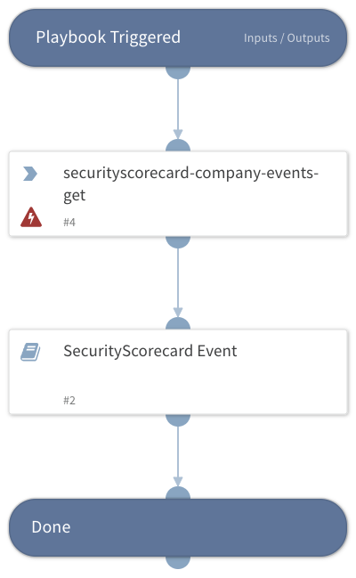

## Dependencies

This playbook uses the following sub-playbooks, integrations, and scripts.

### Sub-playbooks

* SecurityScorecard Event

### Integrations

* SecurityScorecard

### Scripts

This playbook does not use any scripts.

### Commands

* securityscorecard-company-events-get

## Playbook Inputs

---

| **Name** | **Description** | **Default Value** | **Required** |
| --- | --- | --- | --- |
| domain |  | .com | Required |
| date |  | 2023-06-01T00:00:00.000Z | Required |

## Playbook Outputs

---
There are no outputs for this playbook.

## Playbook Image

---

