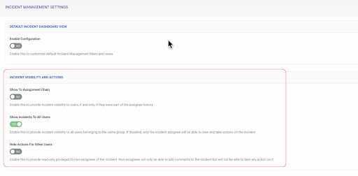

## Overview
Use the Securonix integration to manage incidents, threats, lookup tables, whitelists and watchlists. Integration was built and tested with SNYPR Versions: 6.4 (Nov 2024 R2 release).

This integration supports both cloud and on-prem instances of Securonix.
To configure a cloud base instance use the *Tenant* parameter only.
To configure an on-prem instance, use both the *Host* and *Tenant* parameters.

## Use cases
1. Fetch newly created incidents from Securonix.
2. Fetch newly created threats from Securonix.
3. Get, update and create Securonix incidents, add comments and perform actions on the Securonix incidents.
4. Get, update, create and delete records from the whitelist.
5. Get, update, create and delete records from the lookup table.
6. Get, update, and create records from the watchlist.

## Pre-Requisites
### On Securonix:
Ensure the integration user satisfies below mentioned pre-requisites:
1. A role "ROLE_CASE_ADMIN" must be assigned
2. For the target Securonix platform, enable the "Show Incidents To All Users" option under "INCIDENT MANAGEMENT SETTINGS" as shown below:<br/>


## Configure Securonix on Cortex XSOAR
1. Navigate to **Settings** > **Integrations** > **Instances**.
2. Search for Securonix.
3. Click **Add instance** to create and configure a new integration instance.
4. To fetch Securonix Incidents refer to the section "Configuration for fetching Securonix Incident as an XSOAR Incident".
5. To fetch Securonix Threats refer to the section "Configuration for fetching Securonix Threat as an XSOAR Incident".

### Configuration Parameters

| **Parameter Name** | **Help Text** | **Required (Yes / No)** |
| --- | --- | --- |
| Host (Overrides the default hostname: `https://{tenant}.net/Snypr`) | | No |
| Tenant | | Yes |
| Username | | Yes |
| Password | | Yes |
| Type of entity to fetch | The type of Securonix entity to fetch. Supported entities are "Incident" and "Threat". | No |
| Tenant Name | Name of the tenant to fetch threats from. This parameter is optional for Non MSSP users. | No |
| Incidents to fetch | Selecting "all" will fetch incidents updated in the given time range.<br/>Selecting "opened" will fetch incidents opened in the given time range.<br/>Selecting "closed" will fetch incidents closed in the given time range.| No |
| Set the default incident severity | | No |
| First fetch time range | The date or relative timestamp from where to start fetching incidents.<br/><br/>Supported formats: &lt;number&gt; &lt;time unit&gt;, e.g., 1 hour, 30 minutes, 7 days, 3 months, 1 year. Default is 1 hour. | No |
| The maximum number of incidents to fetch each time. | If the value is greater than 200, it will be considered as 200. The maximum is 200. | No |
| Incident Mirroring Direction | The mirroring direction in which to mirror the incidents. You can mirror "Incoming" (from Securonix to XSOAR), "Outgoing" (from XSOAR to Securonix), or in both directions. | No |
| Close respective Securonix incident after fetching | If enabled, the integration will close the respective Securonix incident after fetching it in XSOAR. Following fields will be required for this functionality:<br/><br/>1. Securonix action name to map with XSOAR's active state for Outgoing mirroring<br/>2. Securonix status to map with XSOAR's active state for Outgoing mirroring<br/>3. Securonix action name to map with XSOAR's closed state for Outgoing mirroring<br/>4. Securonix status to map with XSOAR's closed state for Outgoing mirroring | No |
| Securonix workflow state(s) that can be considered as Close state in XSOAR for Incoming mirroring | If the Securonix incident is in any one of the state mentioned here, then the incident will be Closed on XSOAR. Supports comma-separated values. | No |
| Securonix action name to map with XSOAR's active state for Outgoing mirroring | Provide an action name to map with XSOAR's active state. E.g. IN PROGRESS. | No |
| Securonix status to map with XSOAR's active state for Outgoing mirroring | Provide a workflow status to map with XSOAR's active state. E.g. In Progress. | No |
| Securonix action name to map with XSOAR's closed state for Outgoing mirroring | Provide an action name to map with XSOAR's Closed state. E.g. CLOSED | No |
| Securonix status to map with XSOAR's closed state for Outgoing mirroring | Provide a workflow status to map with XSOAR's closed state. E.g. Completed | No |
| Comment Entry Tag | Choose the tag to add to an entry to mirror it as a comment in Securonix. | No |
| Securonix Retry Count | Numbers of retries to be performed. (Recommended is 3) | No |
| Securonix Retry Delay(In Seconds) | The delay between two retries. Range in 30 to 300 Seconds (5 minutes). Anything less than 30 seconds is considered 30 seconds, and anything more than 300 seconds is considered 300 seconds. (Recommended is 30 seconds) | No |
| Securonix Retry Delay Type | Delay type of retry mechanism. (Recommended is Exponential) | No |
| Trust any certificate (not secure) | Indicates whether to allow connections without verifying SSL certificate's validity. | No |
| Use system proxy settings | Indicates whether to use XSOAR's system proxy settings to connect to the API. | No |

4. Click **Test** to validate the URLs, token, and connection.

## Configuration for fetching Securonix Incident as an XSOAR Incident
To fetch Securonix Incident follow the next steps:<br/>
1. Select Fetches incidents.
2. Under Classifier, select "N/A".
3. Under Incident type, select "Securonix Incident".
4. Under Mapper (incoming), select "Securonix Incident - Incoming Mapper" for default mapping.
5. Enter the connection parameters. (Host, Tenant, Username & Password)
6. Under the Type of entity to fetch, select "Incident".
7. Select the "Incidents to fetch":
    - all - This will fetch incidents updated in the given time range.
    - opened - This will fetch incidents created in the given time range.
    - closed - This will fetch incidents closed in the given time range.
8. Update "Set default incident severity", "First Fetch time range" & "Max Fetch Count" based on your requirement.
9. Select the Incident Mirroring Direction:
    - Incoming - Mirrors changes from the Securonix incident into the Cortex XSOAR incident.
    - Outgoing - Mirrors changes from the Cortex XSOAR incident to the Securonix incident.
    - Incoming And Outgoing - Mirrors changes both Incoming and Outgoing directions on incidents.
    - None - Turns off incident mirroring.
10. Enter the relevant values for "State" & "Action" values for mirroring.
     - Below table indicates which fields are required for the respective mirroring type.

| **Mirroring Type** | **Securonix workflow States for Incoming mirroring** | **Securonix State for XSOAR Active State** | **Securonix Action for XSOAR Active Action** | **Securonix State for XSOAR Closed State** | **Securonix Action for XSOAR Closed Action** | 
| --- | --- | --- | --- | --- | --- | 
| Incoming | Yes | No | No | No | No | 
| Outgoing | No | Yes | Yes | Yes | Yes | 
| Incoming and Outgoing | Yes | Yes | Yes | Yes | Yes |

10. Enter the relevant Comment Entry Tag.  
**Note**: This value is mapped to the **dbotMirrorTags** incident field in Cortex XSOAR, which defines how Cortex XSOAR handles comments when you tag them in the War Room. This is required for mirroring comments from Cortex XSOAR to Securonix.
11. Optional: Check the "Close respective Securonix incident after fetching" parameter, if you want to close the Securonix Incident once it is fetched in the XSOAR.
Below Parameters are required if this option is checked:
    - Securonix action name for XSOAR's active state for Outgoing
    - Securonix status for XSOAR's active state for Outgoing
    - Securonix action name for XSOAR's close state for Outgoing
    - Securonix status for XSOAR's close state for Outgoing
12. Enter the relevant values for Securonix Retry parameters "Count", "Delay" & "Delay Type".

**Notes for mirroring:**
* This feature is compliant with XSOAR version 6.0 and above.
* When mirroring incidents, you can make changes in Securonix that will be reflected in Cortex XSOAR, or vice versa. You can also attach files in Securonix Incident which will then be available in the XSOAR incident.
* The mirroring settings apply only for incidents that are fetched after applying the settings. Pre-existing comments are not fetched/mirrored at the time of incident creation.
* For mirroring to work flawlessly, a three-state workflow(similar to XSOAR) must be configured on the Securonix Incident side.
* The mirroring is strictly tied to Incident type "Securonix Incident" & Incoming mapper "Securonix Incident - Incoming Mapper" if you want to change or use your custom incident type/mapper then make sure changes related to these are present.
* If you want to use the mirror mechanism and you're using custom mappers, then the incoming mapper must contain the following fields: dbotMirrorDirection, dbotMirrorId, dbotMirrorInstance, dbotMirrorTags and securonixcloseincident.
* To use a custom mapper, you must first duplicate the mapper and update the fields in the copy of the mapper. (Refer to the "Create a custom mapper consisting of the default Securonix mapper" section for more information.)
* Following new fields are introduced in the response of the incident to enable the mirroring:
  * **mirror_direction**: This field determines the mirroring direction for the incident. It is a required field for XSOAR to enable mirroring support.
  * **mirror_tags**: This field determines what would be the tag needed to mirror the XSOAR entry out to Securonix. It is a required field for XSOAR to enable mirroring support.
  * **mirror_instance**: This field determines from which instance the XSOAR incident was created. It is a required field for XSOAR to enable mirroring support.
  * **close_sx_incident**: This field determines whether to close the respective Securonix incident once fetched in the XSOAR based on the instance configuration. It is required for closing the respective incident on Securonix. This will be used in the playbook to close the securonix incident.

## Configuration for fetching Securonix Threat as an XSOAR Incident
To fetch Securonix Threat follow the next steps:
1. Select Fetches incidents.
2. Under Classifier, select "N/A".
3. Under Incident type, select Securonix Threat.
4. Under Mapper (incoming), select Securonix Threat - Incoming Mapper for default mapping.
5. Under Type of entity to fetch, select Threat.
6. Enter the Tenant Name in case of MSSP user.
7. Enter the connection parameters. (Host, Tenant, Username & Password)
8. Enter the "The maximum number of incidents to fetch each time". The recommended number of threats to fetch is 100 considering the API implications, although 200 is allowed.
9. Enter the relevant values for Securonix Retry parameters "Count", "Delay" & "Delay Type".

## Create a custom mapper consisting of the default Securonix mapper
1. Go to the settings -> Object setup -> Incidents.
2. Navigate to the "Classification and Mapping" tab.
3. Select the Mapper "Securonix incident - Incoming Mapper".
4. Create a copy of that mapper and click on it. (You can rename the mapper.)
5. Under the Incident Type dropdown, verify that the type of Mapper is "Securonix Incident".
6. Click on "Choose data path" and map it to the custom field:
    - Find the context field you want to map to this incident field on the right side and click on its value.
    - Then you will see the path you've selected under your newly added field.
    - Note: You can also type the path manually.
7. Click "Save Version".
8. Created mapper will appear in the drop-down for the "Mapper (incoming)" integration instance settings fields.
9. Select the newly added mapper at the time of instance configuration.

## Create a custom layout consisting of the default Securonix layout
1. Go to the settings -> Object setup -> Incidents
2. Navigate to the "Layouts" tab.
3. Select the layout "Securonix Incident Information".
4. Create a copy of that layout and click on it. (You can rename the layout.)
5. Select the newly created layout and click on edit.
    - To create a new section, drag and drop the "New Section" widget into the layout.
    - To add a new field to the layout, navigate to the "Fields and Buttons" section and search for the field. Drag and drop the field widget in the layout.
6. Once done, select "Save Version".
7. Navigate to the "Incident Type" tab and select "Securonix Incident" type and detach it.
8. Attach the newly created layout.
9. Reattach the same "Incident Type" again else this incident type will not receive any new updates.

**Note:** It is recommended to use out-of-the-box mappers, layout & incident types for better visualization and meaningful mappings. If you are changing any out-of-the-box mappers/layout then it might not render all the fields as per the expectation.

## Troubleshooting

### Receive Notification on an Incident Fetch Error
The administrator and Cortex XSOAR users on the recipient's list receive a notification when an integration experiences an incident fetch error. Cortex XSOAR users can select their notification method, such as email, from their user preferences. Refer to [Cortex XSOAR 6.13 documentation](https://docs-cortex.paloaltonetworks.com/r/Cortex-XSOAR/6.13/Cortex-XSOAR-Administrator-Guide/Receive-Notification-on-an-Incident-Fetch-Error) or [Cortex XSOAR 8 Cloud documentation](https://docs-cortex.paloaltonetworks.com/r/Cortex-XSOAR/8/Cortex-XSOAR-Cloud-Documentation/Receive-notifications-on-an-incident-fetch-error) or [Cortex XSOAR 8.7 On-prem documentation](https://docs-cortex.paloaltonetworks.com/r/Cortex-XSOAR/8.7/Cortex-XSOAR-On-prem-Documentation/Receive-notifications-on-an-incident-fetch-error) for more information.

### Input and output entries of the playbook are not visible in the war room.
Follow the below steps and add a new server configuration:
1. Go to Settings > About > Troubleshooting.
2. Add new server configuration as "task.auto.quiet.mode.enabled" and enter the value as "false" and save. Refer to [this XSOAR documentation](https://knowledgebase.paloaltonetworks.com/KCSArticleDetail?id=kA14u0000001V4oCAE&lang=en_US%E2%80%A9)
3. After this configuration, all the output entries for the execution of the playbook gets displayed in the war room.

The following are tips for handling issues with mirroring incidents between Securonix and Cortex XSOAR.

| **Issue** | **Recommendation** |
| --- | --- |
| Mirroring is not working. | Open Context Data and search for dbot. Confirm the dbot fields are configured correctly either through the mapper for that specific incident type or using setIncident. Specifically, make sure the integration instance is configured correctly for the mirroring direction (Incoming, Outgoing, Both) - dbotMirrorId, dbotMirrorDirection, dbotMirrorInstance, dbotMirrorTags |
| Comments from before incident creation are not fetched/mirrored. | Mirroring settings apply only for incidents that are fetched after applying the settings.<br/>For example, if a user creates a Securonix incident with added comments and then defines a Securonix integration instance with mirroring in Cortex XSOAR, those comments are not fetched with the incident in Cortex XSOAR. |
| Incident is not closing. | Verify the integration instance is configured correctly for the Mirrored Securonix action and state fields. |
| Required fields are not getting sent or not visible in UI. | This may be a mapping issue, specifically if you have used a custom mapper make sure you've covered all the out of box mapper fields. |
| Comments from XSOAR have not been mirrored in Securonix | Tag is required for mirroring comments from Cortex XSOAR to Securonix. There might be a reason the comment is not tagged as tag needs to be added manually.<br/><br/>Click Actions > Tags and add the "comments" tag (OR the specific tag name which was set up on Instance Configuration). |
| Viewing masked data on the XSOAR application | If you observe masked data, it is highly likely that 'Masking' is enabled on your Securonix tenant. Please check with your Securonix Administrator for further details. |


### The `securonix-list-violation-data` command not returning the violations

1. Check the `from` and `to` arguments provided to the command. It should be ranging in the violations' generation time.

> Note: The following steps are compatible with the Securonix Build version 6.4_Apr2024_R1.

2. If the `query` arguments contain the special characters, then check and follow the below steps:
   1. Use the XSOAR automation browser to run the command.
   2. Don't add the extra backslashes for the `*`, `?` and `\` characters. This is handled by the command itself. Before upgrading, revert any temporary backslash solutions that may have been provided.
3. If the `Securonix Policy Type` incident field is one of these (Land Speed, DIRECTIVE, BEACONING, TIER2) then try to execute command again with the additional '`policy_type`' argument. The value for the `policy_type` argument should be the same as the value for the `Securonix Policy Type` incident field.


### The `securonix-list-activity-data` command not returning the activity data

1. Check the `from` and `to` arguments provided to the command. It should be ranging in the activity data generation time.

> Note: The following steps are compatible with the Securonix Build version 6.4_Apr2024_R1.

2. If the `query` arguments contain the special characters, then check and follow the below steps:
   1. Use the XSOAR automation browser to run the command.
   2. Don't add the extra backslashes for the `*`, `?` and `\` characters. This is handled by the command itself. Before upgrading, revert any temporary backslash solutions that may have been provided.


### Command HR or War room entries are breaking in the table view

1. There might be some special characters (restricted by Markdown viewer i.e, \\\*\_\{\}\[\]\(\)\#\+\-\!\`\|) in the value of field which is breaking the view.
2. Impact is in only on the HR output, however user can get exact values from the command context for such fields if any.


## Commands
You can execute these commands from the Cortex XSOAR CLI, as part of an automation, or in a playbook.
After you successfully execute a command, a DBot message appears in the War Room with the command details.
### securonix-list-workflows
***
Gets a list of all available workflows.


##### Base Command

`securonix-list-workflows`
##### Input

There are no input arguments for this command.

##### Context Output

| **Path** | **Type** | **Description** |
| --- | --- | --- |
| Securonix.Workflows.Workflow | String | Workflow name. | 
| Securonix.Workflows.Type | String | Workflow type. | 
| Securonix.Workflows.Value | String | Workflow value. | 


##### Command Example
```!securonix-list-workflows```

##### Context Example
```json
{
    "Securonix": {
        "Workflows": [
            {
                "Type": "USER",
                "Value": "admin",
                "Workflow": "SOCTeamReview"
            },
            {
                "Type": "USER",
                "Value": "admin",
                "Workflow": "ActivityOutlierWorkflow"
            },
            {
                "Type": "USER",
                "Value": "admin",
                "Workflow": "AccessCertificationWorkflow"
            },
            {
                "Type": "USER",
                "Value": "admin",
                "Workflow": "test"
            }
        ]
    }
}
```

##### Human Readable Output
>### Available workflows:
>|Workflow|Type|Value|
>|---|---|---|
>| SOCTeamReview | USER | admin |
>| ActivityOutlierWorkflow | USER | admin |
>| AccessCertificationWorkflow | USER | admin |
>| test | USER | admin |


### securonix-get-default-assignee-for-workflow
***
Gets the default assignee for the specified workflow.


##### Base Command

`securonix-get-default-assignee-for-workflow`
##### Input

| **Argument Name** | **Description** | **Required** |
| --- | --- | --- |
| workflow | Workflow name. | Required | 


##### Context Output

| **Path** | **Type** | **Description** |
| --- | --- | --- |
| Securonix.Workflows.Workflow | String | Workflow name. | 
| Securonix.Workflows.Type | String | Workflow type. | 
| Securonix.Workflows.Value | String | Workflow value. | 


##### Command Example
```!securonix-get-default-assignee-for-workflow workflow=SOCTeamReview```

##### Context Example
```json
{
    "Securonix": {
        "Workflows": {
            "Type": "USER",
            "Value": "admin",
            "Workflow": "SOCTeamReview"
        }
    }
}
```

##### Human Readable Output
>Default assignee for the workflow SOCTeamReview is: admin.

### securonix-list-possible-threat-actions
***
Gets a list available threat actions.


##### Base Command

`securonix-list-possible-threat-actions`
##### Input

There are no input arguments for this command.

##### Context Output

| **Path** | **Type** | **Description** |
| --- | --- | --- |
| Securonix.ThreatActions | String | A list of threat actions. | 


##### Command Example
```!securonix-list-possible-threat-actions```

##### Context Example
```json
{
    "Securonix": {
        "ThreatActions": [
            "Mark as concern and create incident",
            "Non-Concern",
            "Mark in progress (still investigating)"
        ]
    }
}
```

##### Human Readable Output
>Possible threat actions are: Mark as concern and create incident, Non-Concern, Mark in progress (still investigating).

### securonix-list-policies
***
Gets a list of all policies.


##### Base Command

`securonix-list-policies`
##### Input

There are no input arguments for this command.

##### Context Output

| **Path** | **Type** | **Description** |
| --- | --- | --- |
| Securonix.Policies.CreatedBy | String | Creator of the policy. | 
| Securonix.Policies.CreatedOn | Date | Policy created date. | 
| Securonix.Policies.Criticality | String | Policy criticality. | 
| Securonix.Policies.Description | String | Policy description. | 
| Securonix.Policies.Hql | String | Policy Hibernate Query Language. | 
| Securonix.Policies.ID | String | Policy ID. | 
| Securonix.Policies.Name | String | Policy name. | 


##### Command Example
```!securonix-list-policies```

##### Context Example
```json
{
    "Securonix": {
        "Policies": [
            {
                "CreatedBy": "admin",
                "CreatedOn": "2013-11-09T16:13:23Z",
                "Criticality": "Low",
                "Description": null,
                "Hql": "FROM AccessAccount AS accessaccount, Resources AS resources, AccessAccountUser AS accessaccountuser WHERE ((accessaccount.resourceid  = resources.id  AND accessaccountuser.id.accountid  = accessaccount.id )) AND ((accessaccountuser.id.userid  = '-1'))",
                "ID": "1",
                "Name": "Accounts that dont have Users"
            },
            {
                "CreatedBy": "admin",
                "CreatedOn": "2013-11-09T16:31:09Z",
                "Criticality": "Medium",
                "Description": null,
                "Hql": "FROM Users AS users, AccessAccountUser AS accessaccountuser, AccessAccount AS accessaccount, Resources AS resources WHERE ((users.id  = accessaccountuser.id.userid  AND accessaccountuser.id.accountid  = accessaccount.id  AND accessaccount.resourceid  = resources.id )) AND ((users.status  = '0'))",
                "ID": "2",
                "Name": "Accounts that belong to terminated user"
            },
           
        ]
    }
}
```

##### Human Readable Output
>### Policies:
>|ID|Name|Criticality|Created On|Created By|Description|
>|---|---|---|---|---|---|
>| 1 | Accounts that dont have Users | Low | 2013-11-09T16:13:23Z | admin |  |
>| 2 | Accounts that belong to terminated user | Medium | 2013-11-09T16:31:09Z | admin |  |


### securonix-list-resource-groups
***
Gets a list of resource groups.


##### Base Command

`securonix-list-resource-groups`
##### Input

There are no input arguments for this command.

##### Context Output

| **Path** | **Type** | **Description** |
| --- | --- | --- |
| Securonix.ResourceGroups.Name | String | Resource group name. | 
| Securonix.ResourceGroups.Type | String | Resource group type. | 


##### Command Example
```!securonix-list-resource-groups```

##### Context Example
```json
{
    "Securonix": {
        "ResourceGroups": [
            {
                "Name": "Windows-CST1",
                "Type": "Microsoft Windows SNARE"
            },
            {
                "Name": "Websense Proxy",
                "Type": "Websense Proxy Server"
            },
            {
                "Name": "Palo Alto",
                "Type": "Palo Alto Next-Generation Firewall"
            },
            {
                "Name": "CDS1",
                "Type": "ControlsDS1"
            },
            {
                "Name": "Bluecoat",
                "Type": "Bluecoat Proxy"
            },
            {
                "Name": "Symantec-Email",
                "Type": "Symantec Message Security Gateway"
            },
            {
                "Name": "Proofpoint Email Gateway",
                "Type": "Proofpoint Email Gateway"
            },
            {
                "Name": "CiscoASA",
                "Type": "Cisco ASA"
            },
            {
                "Name": "CiscoAMP",
                "Type": "Cisco FireAMP"
            },
            {
                "Name": "PA800-adam",
                "Type": "Palo Alto Next-Generation Firewall"
            },
            {
                "Name": "CrowdStrike-PartnerAPI",
                "Type": "Crowdstrike Alerts Streaming"
            },
            {
                "Name": "squid-partners",
                "Type": "Squid Proxy"
            },
            {
                "Name": "Bluecoat_OP",
                "Type": "Bluecat_DHCP"
            },
            {
                "Name": "Bluecoat - Test",
                "Type": "Bluecoat Proxy"
            },
            {
                "Name": "Bluecoat_New",
                "Type": "Bluecoat Proxy"
            }
        ]
    }
}
```

##### Human Readable Output
>### Resource groups:
>|Name|Type|
>|---|---|
>| Windows-CST1 | Microsoft Windows SNARE |
>| Websense Proxy | Websense Proxy Server |
>| Palo Alto | Palo Alto Next-Generation Firewall |
>| CDS1 | ControlsDS1 |
>| Bluecoat | Bluecoat Proxy |
>| Symantec-Email | Symantec Message Security Gateway |
>| Proofpoint Email Gateway | Proofpoint Email Gateway |
>| CiscoASA | Cisco ASA |
>| CiscoAMP | Cisco FireAMP |
>| PA800-adam | Palo Alto Next-Generation Firewall |
>| CrowdStrike-PartnerAPI | Crowdstrike Alerts Streaming |
>| squid-partners | Squid Proxy |
>| Bluecoat_OP | Bluecat_DHCP |
>| Bluecoat - Test | Bluecoat Proxy |
>| Bluecoat_New | Bluecoat Proxy |


### securonix-list-users
***
Gets a list of users.


##### Base Command

`securonix-list-users`
##### Input

There are no input arguments for this command.

##### Context Output

| **Path** | **Type** | **Description** |
| --- | --- | --- |
| Securonix.Users.LastName | String | User last name. | 
| Securonix.Users.SkipEncryption | String | Whether user encryption was skipped. | 
| Securonix.Users.Riskscore | String | User risk score. | 
| Securonix.Users.EmployeeID | String | User Employee ID. | 
| Securonix.Users.Masked | String | Whether the user is masked. | 
| Securonix.Users.Division | String | User division. | 
| Securonix.Users.Criticality | String | User criticality. | 
| Securonix.Users.Status | String | User status. | 
| Securonix.Users.Department | String | User department. | 
| Securonix.Users.Title | String | User title. | 
| Securonix.Users.FirstName | String | User first name. | 
| Securonix.Users.Email | String | User email address. | 


##### Command Example
```!securonix-list-users```

##### Context Example
```json
{
    "Securonix": {
        "Users": [
            {
                "ContractEndDate": "2020-01-14T00:40:44Z",
                "Criticality": "Low",
                "Department": "Data Services",
                "Division": "Global Technology",
                "Email": "jon.doe@test.com",
                "EmployeeID": "1001",
                "FirstName": "jon",
                "LastName": "doe",
                "Masked": "false",
                "Riskscore": "0.0",
                "SkipEncryption": "false",
                "Status": "1",
                "Title": "Associate-Data Services"
            }
        ]
    }
}
```

##### Human Readable Output
>### Resource groups:
>|First Name|Last Name|Criticality|Title|Email|
>|---|---|---|---|---|
>| jon | doe | Low | Associate-Data Services | jon.doe@test.com |


### securonix-list-activity-data
***
Gets a list of activity data for the specified resource group.


##### Base Command

`securonix-list-activity-data`
##### Input

| **Argument Name** | **Description** | **Required** |
| --- | --- | --- |
| from | Start date/time for which to retrieve activity data (in the format MM/dd/yyyy HH:mm:ss). | Required | 
| to | End date/time for which to retrieve activity data (in the format MM/dd/yyyy HH:mm:ss). | Required | 
| query | Free-text query. For example, query="resourcegroupname=WindowsSnare and policyname=Possible Privilege Escalation - Self Escalation".<br/>Note: Use the XSOAR automation browser to run the command if the "query" argument contains the special characters. | Optional | 


##### Context Output

| **Path** | **Type** | **Description** |
| --- | --- | --- |
| Securonix.ActivityData.Accountname | String | Account name. | 
| Securonix.ActivityData.Accountresourcekey | String | Account source key. | 
| Securonix.ActivityData.Agentfilename | String | Agent file name. | 
| Securonix.ActivityData.Baseeventid | String | Base event ID. | 
| Securonix.ActivityData.Categorizedtime | String | Categorized time. | 
| Securonix.ActivityData.Categorybehavior | String | Category behavior. | 
| Securonix.ActivityData.Categoryobject | String | Category object. | 
| Securonix.ActivityData.Categoryseverity | String | Category severity. | 
| Securonix.ActivityData.Collectionmethod | String | Collection method. | 
| Securonix.ActivityData.Collectiontimestamp | String | Collection timestamp. | 
| Securonix.ActivityData.Customnumber1 | Number | Custom number. | 
| Securonix.ActivityData.Customstring13 | String | Custom string. | 
| Securonix.ActivityData.Customstring17 | String | Custom string. | 
| Securonix.ActivityData.Customtime1 | String | Custom time. | 
| Securonix.ActivityData.Customtime2 | String | Custom time. | 
| Securonix.ActivityData.Datetime | String | Date time. | 
| Securonix.ActivityData.Dayofmonth | String | Day of month. | 
| Securonix.ActivityData.Dayofweek | String | Day of week. | 
| Securonix.ActivityData.Dayofyear | String | Day of year. | 
| Securonix.ActivityData.Destinationntdomain | String | Destination NT domain. | 
| Securonix.ActivityData.Destinationprocessname | String | Destination process name. | 
| Securonix.ActivityData.Destinationservicename | String | Destination service name. | 
| Securonix.ActivityData.Destinationuserid | String | Destination user ID. | 
| Securonix.ActivityData.Destinationusername | String | Destination username. | 
| Securonix.ActivityData.Deviceaddress | String | Device address. | 
| Securonix.ActivityData.Destinationuserprivileges | String | Destination user privileges. | 
| Securonix.ActivityData.Devicecustomstring4 | String | Device custom string. | 
| Securonix.ActivityData.Deviceeventcategory | String | Device event category. | 
| Securonix.ActivityData.Deviceexternalid | String | Device external ID. | 
| Securonix.ActivityData.Devicehostname | String | Device hostname. | 
| Securonix.ActivityData.Ehash | String | Event hash. | 
| Securonix.ActivityData.EventID | String | Event ID. | 
| Securonix.ActivityData.Eventoutcome | String | Event outcome. | 
| Securonix.ActivityData.Eventtime | String | Time the event occurred. | 
| Securonix.ActivityData.Filepath | String | File path. | 
| Securonix.ActivityData.Filepermission | String | File permission. | 
| Securonix.ActivityData.Hour | String | Date time hour. | 
| Securonix.ActivityData.ID | String | Activity ID. | 
| Securonix.ActivityData.Ingestionnodeid | String | Ingestion node ID. | 
| Securonix.ActivityData.Ipaddress | String | IP address. | 
| Securonix.ActivityData.Ipaddress_Long | String | IP address long. | 
| Securonix.ActivityData.JobID | String | Deprecated. Use the Securonix.ActivityData.Jobid field. | 
| Securonix.ActivityData.Jobid | String | Job ID. | 
| Securonix.ActivityData.Jobstarttime | String | Job start time. | 
| Securonix.ActivityData.Message | String | Message. | 
| Securonix.ActivityData.Minute | String | Date time minute. | 
| Securonix.ActivityData.Month | String | Month. | 
| Securonix.ActivityData.Oldfileid | String | Old file ID. | 
| Securonix.ActivityData.Oldfilepath | String | Old file path. | 
| Securonix.ActivityData.Others | String | Others. | 
| Securonix.ActivityData.Poprocessedtime | String | PO processed time. | 
| Securonix.ActivityData.Publishedtime | String | Published time. | 
| Securonix.ActivityData.Rawevent | String | Raw event. | 
| Securonix.ActivityData.Raweventsize | String | Raw event size. | 
| Securonix.ActivityData.Receivedtime | String | Received time. | 
| Securonix.ActivityData.Resourcename | String | Resource name. | 
| Securonix.ActivityData.ResourceGroupCategory | String | Resource group category. | 
| Securonix.ActivityData.ResourceGroupFunctionality | String | Resource group functionality. | 
| Securonix.ActivityData.ResourceGroupID | String | Resource group ID. | 
| Securonix.ActivityData.ResourceGroupName | String | Resource group name. | 
| Securonix.ActivityData.ResourceGroupTimezoneoffset | String | Resource Group Timezone offset. | 
| Securonix.ActivityData.ResourceGroupTypeID | String | Resource group resource type ID. | 
| Securonix.ActivityData.ResourceGroupVendor | String | Resource group vendor. | 
| Securonix.ActivityData.Resourcegroupid | String | Resource Group ID. | 
| Securonix.ActivityData.Resourcegroupname | String | Resource Group Name. | 
| Securonix.ActivityData.Resourcehostname | String | Resource host name. | 
| Securonix.ActivityData.Resourcehostname_Long | String | Resource host name long. | 
| Securonix.ActivityData.Resourcename | String | Resource name. | 
| Securonix.ActivityData.Resourcetype | String | Resource type. | 
| Securonix.ActivityData.Sessionid | String | Session ID. | 
| Securonix.ActivityData.Sourceaddress | String | Source address. | 
| Securonix.ActivityData.Sourceaddress_Long | String | Source address long. | 
| Securonix.ActivityData.Sourcehostname | String | Source hostname. | 
| Securonix.ActivityData.Sourcentdomain | String | Source domain. | 
| Securonix.ActivityData.Sourceport | String | Source port. | 
| Securonix.ActivityData.Sourceprocessname | String | Source process name. | 
| Securonix.ActivityData.Sourceuserid | String | Source user ID. | 
| Securonix.ActivityData.Sourceusername | String | Source username. | 
| Securonix.ActivityData.TenantID | String | Tenant ID. | 
| Securonix.ActivityData.Tenantname | String | Tenant name. | 
| Securonix.ActivityData.Timeline | String | Time when the activity occurred, in Epoch time. | 
| Securonix.ActivityData.Timeline_By_Hour | String | Timeline by hour. | 
| Securonix.ActivityData.Timeline_By_Minute | String | Timeline by minute. | 
| Securonix.ActivityData.Timeline_By_Month | String | Timeline by month. | 
| Securonix.ActivityData.Timeline_By_Week | String | Timeline by week. | 
| Securonix.ActivityData.Timestamp | String | Timestamp. | 
| Securonix.ActivityData.Transactionstring1 | String | Transaction string 1. | 
| Securonix.ActivityData.Userid | String | User ID. | 
| Securonix.ActivityData.Week | String | Week. | 
| Securonix.ActivityData.Year | String | Year. | 
| Securonix.ActivityData._Indexed_At_Tdt | String | Indexed at TDT. | 
| Securonix.ActivityData._Version_ | String | Activity version. | 
| Securonix.Activity.totalDocuments | Number | Total number of events. | 
| Securonix.Activity.message | String | Message from the API. | 
| Securonix.Activity.queryId | String | Query Id for the pagination. | 
| Securonix.Activity.command_name | String | The command name. | 

##### Command example
```!securonix-list-activity-data from="01/12/2024 10:00:00" to="01/15/2024 12:01:00"```
##### Context Example
```json
{
    "Securonix": {
        "Activity": {
            "queryId": "spotter_web_service_00000000-0000-0000-0000-000000000001",
            "totalDocuments": 1182,
            "command_name": "securonix-list-activity-data"
        },
        "ActivityData": [
            {
                "Accountname": "ACCOUNT_001",
                "Accountresourcekey": "00000000000~000000000.0000.com~pipe_line_test~0000~-1",
                "Agentfilename": "test.txt",
                "Categorybehavior": "Account Create",
                "Categoryobject": "Account Management",
                "Categoryseverity": "0",
                "Collectionmethod": "file",
                "Collectiontimestamp": "1690803374000",
                "Destinationusername": "TEST134044",
                "Devicehostname": "HOST.com",
                "EventID": "00000000-0000-0000-0000-000000000001",
                "Eventoutcome": "Success",
                "Filepath": "N/A",
                "Ingestionnodeid": "CONSOLE",
                "Jobstarttime": "1690803374000",
                "Message": "A user account was created.",
                "Publishedtime": "1690803374572",
                "Receivedtime": "1690803420706",
                "Resourcename": "HOST.com",
                "Sourceusername": "USER",
                "TenantID": "2",
                "Tenantname": "Response-Automation",
                "Timeline": "1670911200000"
            },
            {
                "Accountname": "ACCOUNT_002",
                "Accountresourcekey": "00000000000~000000000.0000.com~pipe_line_test~0000~-2",
                "Agentfilename": "test.txt",
                "Categorybehavior": "Account Create",
                "Categoryobject": "Account Management",
                "Categoryseverity": "0",
                "Collectionmethod": "file",
                "Collectiontimestamp": "1690803374000",
                "Destinationusername": "TEST134044",
                "Devicehostname": "HOST.com",
                "EventID": "00000000-0000-0000-0000-000000000002",
                "Eventoutcome": "Success",
                "Filepath": "N/A",
                "Ingestionnodeid": "CONSOLE",
                "Jobstarttime": "1690803374000",
                "Message": "A user account was created.",
                "Publishedtime": "1690803374572",
                "Receivedtime": "1690803420500",
                "Resourcename": "HOST.com",
                "Sourceusername": "USER",
                "TenantID": "2",
                "Tenantname": "Response-Automation",
                "Timeline": "1670911200000"
            }
        ]
    }
}
```

##### Human Readable Output

>### Activity data:
>|EventID|Message|Accountname|Timeline|Devicehostname|Accountresourcekey|
>|---|---|---|---|---|---|
>| 00000000-0000-0000-0000-000000000001 | A user account was created. | ACCOUNT_001 | 2024-01-13T06:00:00.000Z | HOST.com | 00000000000~000000000.0000.com~pipe_line_test~0000~-1 |
>| 00000000-0000-0000-0000-000000000002 | A user account was created. | ACCOUNT_002 | 2024-01-13T06:00:00.000Z | HOST.com | 00000000000~000000000.0000.com~pipe_line_test~0000~-2 |


### securonix-list-violation-data
***
Gets a list activity data for an account name.


##### Base Command

`securonix-list-violation-data`
##### Input

| **Argument Name** | **Description** | **Required** |
| --- | --- | --- |
| from | Start date/time for which to retrieve activity data (in the format MM/dd/yyyy HH:mm:ss). | Required | 
| to | End date/time for which to retrieve activity data (in the format MM/dd/yyyy HH:mm:ss). | Required | 
| query | Free-text query. For example, query="resourcegroupname=WindowsSnare and policyname=Possible Privilege Escalation - Self Escalation".<br/>Note: Use the XSOAR automation browser to run the command if the "query" argument contains the special characters. | Optional | 
| query_id | Paginate next set of results. | Optional | 
| policy_type | Provide the policy type for retrying if the violations are not found in the initial attempt. The types of policies that can be retried are: "Land Speed", "TIER2", "DIRECTIVE", "BEACONING". | Optional | 


##### Context Output

| **Path** | **Type** | **Description** |
| --- | --- | --- |
| Securonix.ViolationData.Accountname | String | Account name. | 
| Securonix.ViolationData.Agentfilename | String | Agent file name. | 
| Securonix.ViolationData.Baseeventid | String | Base event ID. | 
| Securonix.ViolationData.Categorybehavior | String | Category behavior. | 
| Securonix.ViolationData.Category | String | Violation category. | 
| Securonix.ViolationData.Categoryobject | String | Category object. | 
| Securonix.ViolationData.Categoryseverity | String | Category severity. | 
| Securonix.ViolationData.Destinationaddress | String | Destination address. | 
| Securonix.ViolationData.Destinationntdomain | String | Destination nt domain. | 
| Securonix.ViolationData.Destinationuserid | String | Destination user ID. | 
| Securonix.ViolationData.Gestinationusername | String | Destination username. | 
| Securonix.ViolationData.Deviceaddress | String | Device address. | 
| Securonix.ViolationData.Deviceeventcategory | String | Device event category. | 
| Securonix.ViolationData.Deviceexternalid | String | Device external ID. | 
| Securonix.ViolationData.Devicehostname | String | Device hostname. | 
| Securonix.ViolationData.EventID | String | Event ID. | 
| Securonix.ViolationData.Eventoutcome | String | Event outcome. | 
| Securonix.ViolationData.Eventtime | String | Time the event occurred. | 
| Securonix.ViolationData.Generationtime | String | Time that the violation was generated in Securonix. | 
| Securonix.ViolationData.Invalid | String | Whether the violation is valid. | 
| Securonix.ViolationData.JobID | String | Job ID. | 
| Securonix.ViolationData.Jobstarttime | String | Job start time. | 
| Securonix.ViolationData.Policyname | String | Policy name. | 
| Securonix.ViolationData.Resourcename | String | Resource name. | 
| Securonix.ViolationData.ResourceGroupID | String | Resource group ID. | 
| Securonix.ViolationData.ResourceGroupName | String | Resource group name. | 
| Securonix.ViolationData.Riskscore | String | Risk score. | 
| Securonix.ViolationData.Riskthreatname | String | Risk threat name. | 
| Securonix.ViolationData.Sessionid | String | Session ID. | 
| Securonix.ViolationData.Sourcehostname | String | Source hostname. | 
| Securonix.ViolationData.Sourcentdomain | String | Source nt domain. | 
| Securonix.ViolationData.Sourceuserid | String | Source user ID. | 
| Securonix.ViolationData.Sourceusername | String | Source username. | 
| Securonix.ViolationData.Sourceuserprivileges | String | Source user privileges. | 
| Securonix.ViolationData.TenantID | String | Tenant ID. | 
| Securonix.ViolationData.Tenantname | String | Tenant name. | 
| Securonix.ViolationData.Timeline | String | Time when the activity occurred, in Epoch time. | 
| Securonix.ViolationData.Createdate | String | Create date. | 
| Securonix.ViolationData.Criticality | String | Violation criticality. | 
| Securonix.ViolationData.DataSourceID | String | Data source ID. | 
| Securonix.ViolationData.Department | String | Department affected by the violation. | 
| Securonix.ViolationData.EmployeeID | String | Employee ID. | 
| Securonix.ViolationData.Encrypted | String | Whether the violation is encrypted. | 
| Securonix.ViolationData.Firstname | String | First name of the user that violated the policy. | 
| Securonix.ViolationData.Fullname | String | Full name of the user that violated the policy. | 
| Securonix.ViolationData.ID | String | ID of the user that violated the policy. | 
| Securonix.ViolationData.LanID | String | LAN ID associated with the policy violation. | 
| Securonix.ViolationData.Lastname | String | Last name of the user that violated the policy. | 
| Securonix.ViolationData.Lastsynctime | String | Last sync time, in Epoch time. | 
| Securonix.ViolationData.Masked | String | Whether the violation is masked. | 
| Securonix.ViolationData.Mergeuniquecode | String | Merge unique code. | 
| Securonix.ViolationData.Riskscore | String | Risk score. | 
| Securonix.ViolationData.Skipencryption | String | Skip encryption. | 
| Securonix.ViolationData.Status | String | Status of the policy violation. | 
| Securonix.ViolationData.Timezoneoffset | String | Timezone offset. | 
| Securonix.ViolationData.Title | String | Title. | 
| Securonix.ViolationData.Uniquecode | String | Unique code. | 
| Securonix.ViolationData.UserID | String | Last sync time, in Epoch time. | 
| Securonix.ViolationData.Workemail | String | Work email address of the user that violated the policy. | 
| Securonix.ViolationData.Violator | String | Violator. | 
| Securonix.Violation.totalDocuments | Number | Total number of events. | 
| Securonix.Violation.message | String | Message from the API. | 
| Securonix.Violation.queryId | String | Query Id for the pagination. | 


##### Command Example
```!securonix-list-violation-data from="01/01/2023 00:00:00" to="03/10/2023 00:00:00"```

##### Context Example
```json
{
    "Securonix": {
        "ViolationData": [
        {
            "Accountname": "TESTDPB30",
            "Categorizedtime": "Morning",
            "Category": "Account Compromise",
            "Categoryseverity": "0",
            "Datetime": "1676960205747",
            "Dayofmonth": "21",
            "Dayofweek": "3",
            "Dayofyear": "52",
            "Eventid": "test_event",
            "GenerationTime": "02/21/2023 00:17:19",
            "Hour": "0",
            "ID": "-1",
            "Invalid": "false",
            "Ipaddress": "IP Address",
            "Jobid": "140",
            "Jobstarttime": "1676960199000",
            "Month": "1",
            "Policyname": "Policy1",
            "Resourcecomments": "ingestion_2.0",
            "Resourcegroupid": "6",
            "Resourcegroupname": "test",
            "Resourcename": "mac30",
            "Resourcetype": "mvk",
            "Riskthreatname": "Abnormal amount of data egressed compared to peer",
            "TenantID": "2",
            "Tenantname": "test_tenant",
            "Timeline": "1676959200000",
            "Timeline_By_Hour": "1676980800000",
            "Timeline_By_Minute": "1676960100000",
            "Timeline_By_Month": "1675231200000",
            "Timeline_By_Week": "1676786400000",
            "Transactionstring1": "Logon failure 30",
            "Userid": "-1",
            "Violator": "RTActivityAccount",
            "Week": "8",
            "Year": "2023"
        },
        {
            "Accountname": "TESTDPB30",
            "Categorizedtime": "Morning",
            "Category": "Account Compromise",
            "Categoryseverity": "0",
            "Datetime": "1676960205747",
            "Dayofmonth": "21",
            "Dayofweek": "3",
            "Dayofyear": "52",
            "Eventid": "Event ID",
            "GenerationTime": "02/21/2023 00:17:19",
            "Hour": "0",
            "ID": "-1",
            "Invalid": "false",
            "Ipaddress": "IP Address",
            "Jobid": "140",
            "Jobstarttime": "1676960199000",
            "Month": "1",
            "Policyname": "Policy2",
            "Resourcecomments": "ingestion_2.0",
            "Resourcegroupid": "6",
            "Resourcegroupname": "tets",
            "Resourcename": "mac30",
            "Resourcetype": "mvk",
            "Riskthreatname": "Abnormal attempts to reset domain admin password",
            "TenantID": "2",
            "Tenantname": "test_tenant",
            "Timeline": "1676959200000",
            "Timeline_By_Hour": "1676980800000",
            "Timeline_By_Minute": "1676960100000",
            "Timeline_By_Month": "1675231200000",
            "Timeline_By_Week": "1676786400000",
            "Transactionstring1": "Logon failure 30",
            "Userid": "-1",
            "Violator": "RTActivityAccount",
            "Week": "8",
            "Year": "2023"
        }
        ],
        "Violation": {
            "totalDocuments": 2,
            "message": "",
            "queryId": "abcd1234"
        }
    }
}
```

##### Human Readable Output
>### Activity data:
>|Policyname|Accountname|
>|---|---|
>| Policy1 | TESTDPB30 |
>| Policy2 | TESTDPB30 |
>#### Next page query id: abcd1234

### securonix-list-incidents
***
Gets a list of incidents.


##### Base Command

`securonix-list-incidents`
##### Input

| **Argument Name** | **Description** | **Required** |
| --- | --- | --- |
| from |  Start time range for which to return incidents (`<number> <time unit>`, e.g., 1 hour, 30 minutes) | Required | 
| to | End date/time for which to retrieve incidents (in the format MM/dd/yyyy HH:mm:ss) Default is current time. | Optional | 
| incident_types | The incident type. Can be "updated", "opened", or "closed". Supports multiple selections. | Optional | 


##### Context Output

| **Path** | **Type** | **Description** |
| --- | --- | --- |
| Securonix.Incidents.ViolatorID | String | Incident Violator ID. | 
| Securonix.Incidents.Entity | String | Incident entity. | 
| Securonix.Incidents.Riskscore | Number | Incident risk score. | 
| Securonix.Incidents.Priority | String | Incident priority. | 
| Securonix.Incidents.Reason | String | Reason for the incident. Usually includes policy name and/or possible threat name. | 
| Securonix.Incidents.IncidentStatus | String | Incident status. | 
| Securonix.Incidents.WorkflowName | String | Incident workflow name. | 
| Securonix.Incidents.Watchlisted | Boolean | Whether the incident is in a watchlist. | 
| Securonix.Incidents.IncidentType | String | Incident type. | 
| Securonix.Incidents.IncidentID | String | Incident ID. | 
| Securonix.Incidents.LastUpdateDate | Number | Last update date of the incident in Epoch time. | 
| Securonix.Incidents.Url | String | URL that links to the incident on Securonix. | 
| Securonix.Incidents.ViolatorText | String | Incident violator text. | 
| Securonix.Incidents.AssignedUser | String | User assigned to the incident. | 
| Securonix.Incidents.IsWhitelisted | Boolean | Whether the incident is added to allow list. | 
| Securonix.Incidents.Policystarttime | Number | Epoch time when the policy is first violated. | 
| Securonix.Incidents.Policyendtime | Number | Epoch time when the policy is last violated. | 
| Securonix.Incidents.Solrquery | String | Spotter query to fetch the related violations. | 


##### Command Example
```!securonix-list-incidents from="5 days" incident_types=opened```

##### Context Example

```json
{
    "Securonix": {
        "Incidents": [
            {
                "AssignedUser": "Admin Admin",
                "Bulkactionallowed": true,
                "CaseEventEndTime": 1675849673983,
                "CaseEventStartTime": 1675845486324,
                "Casecreatetime": 1675849649900,
                "Entity": "RTActivityAccount",
                "IncidentID": "30107",
                "IncidentStatus": "COMPLETED",
                "IncidentType": "HighRiskRTActivityAccount",
                "IsWhitelisted": false,
                "LastUpdateDate": 1675849674032,
                "ParentCaseId": "",
                "Priority": "None",
                "Reason": [
                    "ResourceType: mvk",
                    "Policy: SandboxFeb8",
                    "Threat: Abnormal attempts to reset domain admin password"
                ],
                "Riskscore": 0,
                "SandBoxPolicy": true,
                "StatusCompleted": true,
                "TenantInfo": {
                "tenantid": 2,
                "tenantname": "test_tenant"
                },
                "Type": "HighRiskRTActivityAccount",
                "Url": "url",
                "ViolatorID": "TESTING2",
                "ViolatorText": "TESTING2",
                "Watchlisted": false,
                "WorkflowName": "SOCTeamReview",
                "Policystarttime": 1692950376801,
                "Policyendtime": 1695613655539,
                "Solrquery": "index = violation and ( ( @policyname = \"Response-PB-Resources-AutoPlay\" and @resourcename=\"Activityres17-Resource-549829\" )  ) AND @tenantname=\"Response-Automation\" AND datetime between \"02/07/2023 15:52:12\" \"02/07/2023 15:52:13\""
            },
            {
                "AssignedUser": "Admin Admin",
                "Bulkactionallowed": true,
                "CaseEventEndTime": 1675851019318,
                "CaseEventStartTime": 1675850440699,
                "Casecreatetime": 1675850942351,
                "Entity": "RTActivityAccount",
                "IncidentID": "30108",
                "IncidentStatus": "COMPLETED",
                "IncidentType": "HighRiskRTActivityAccount",
                "IsWhitelisted": true,
                "LastUpdateDate": 1675851019367,
                "ParentCaseId": "",
                "Priority": "None",
                "Reason": [
                    "ResourceType: mvk",
                    "Policy: SandboxFeb8",
                    "Threat: Abnormal attempts to reset domain admin password"
                ],
                "Riskscore": 0,
                "SandBoxPolicy": true,
                "StatusCompleted": true,
                "TenantInfo": {
                "tenantid": 2,
                "tenantname": "test_tenant"
                },
                "Type": "HighRiskRTActivityAccount",
                "Url": "url",
                "ViolatorID": "TESTING4",
                "ViolatorText": "TESTING4",
                "Watchlisted": false,
                "WorkflowName": "SOCTeamReview",
                "Policystarttime": 1692950376801,
                "Policyendtime": 1695613655539,
                "Solrquery": "index = violation and ( ( @policyname = \"Response-PB-Resources-AutoPlay\" and @resourcename=\"Activityres17-Resource-549829\" )  ) AND @tenantname=\"Response-Automation\" AND datetime between \"02/07/2023 15:52:12\" \"02/07/2023 15:52:13\""
            }
        ]
    }
}
```

##### Human Readable Output
>### Incidents:
>|IncidentID|Incident Status|Incident Type|Priority|Reason|
>|---|---|---|---|---|
>| 30107 | COMPLETED | HighRiskRTActivityAccount | None | ResourceType: mvk,<br/>Policy: SandboxFeb8,<br/>Threat: Abnormal attempts to reset domain admin password |
>| 30108 | COMPLETED | HighRiskRTActivityAccount | None | ResourceType: mvk,<br/>Policy: SandboxFeb8,<br/>Threat: Abnormal attempts to reset domain admin password |

### securonix-get-incident
***
Gets details of the specified incident.


##### Base Command

`securonix-get-incident`
##### Input

| **Argument Name** | **Description** | **Required** |
| --- | --- | --- |
| incident_id | Incident ID. | Required | 


##### Context Output

| **Path** | **Type** | **Description** |
| --- | --- | --- |
| Securonix.Incidents.ViolatorID | String | Incident violator ID. | 
| Securonix.Incidents.Entity | String | Incident entity. | 
| Securonix.Incidents.Riskscore | Number | Incident risk score. | 
| Securonix.Incidents.Priority | String | Incident priority. | 
| Securonix.Incidents.Reason | String | Reason for the incident. Usually includes policy name and/or possible threat name. | 
| Securonix.Incidents.IncidentStatus | String | Incident status. | 
| Securonix.Incidents.WorkflowName | String | Incident workflow name. | 
| Securonix.Incidents.Watchlisted | Boolean | Whether the incident is in a watchlist. | 
| Securonix.Incidents.IncidentType | String | Incident type. | 
| Securonix.Incidents.IncidentID | String | Incident ID. | 
| Securonix.Incidents.LastUpdateDate | Number | The time when the incident was last updated, in Epoch time. | 
| Securonix.Incidents.Url | String | URL that links to the incident on Securonix. | 
| Securonix.Incidents.ViolatorText | String | Incident violator text. | 
| Securonix.Incidents.AssignedUser | String | User assigned to the incident. | 
| Securonix.Incidents.IsWhitelisted | Boolean | Whether the incident is added to allow list. | 
| Securonix.Incidents.Policystarttime | Number | Epoch time when the policy is first violated. | 
| Securonix.Incidents.Policyendtime | Number | Epoch time when the policy is last violated. | 
| Securonix.Incidents.Solrquery | String | Spotter query to fetch the related violations. | 


##### Command Example
```!securonix-get-incident incident_id=30107```

##### Context Example
```json
{
    "Securonix": {
        "Incidents": {
            "AssignedUser": "Admin Admin",
            "Casecreatetime": 1579687173702,
            "Entity": "Users",
            "IncidentID": "30107",
            "IncidentStatus": "Open",
            "IncidentType": "Policy",
            "IsWhitelisted": false,
            "LastUpdateDate": 1579687173702,
            "ParentCaseId": "",
            "Priority": "Critical",
            "Reason": [
                "Resource: BLUECOAT",
                "Policy: Uploads to personal websites",
                "Threat: Data egress via network uploads"
            ],
            "Riskscore": 0,
            "SandBoxPolicy": false,
            "StatusCompleted": false,
            "TenantInfo": {
                "tenantcolor": "#000000",
                "tenantid": 1,
                "tenantname": "Securonix",
                "tenantshortcode": "SE"
            },
            "Url": "url",
            "ViolatorID": "9",
            "ViolatorSubText": "1009",
            "ViolatorText": "Judi Mcabee",
            "Watchlisted": false,
            "WorkflowName": "SOCTeamReview",
            "Policystarttime": 1692950376801,
            "Policyendtime": 1695613655539,
            "Solrquery": "index = violation and ( ( @policyname = \"Response-PB-Resources-AutoPlay\" and @resourcename=\"Activityres17-Resource-549829\" )  ) AND @tenantname=\"Response-Automation\" AND datetime between \"02/07/2023 15:52:12\" \"02/07/2023 15:52:13\""
        }
    }
}
```

##### Human Readable Output
>### Incident:
>|Assigned User|Casecreatetime|Entity|Incident Status|Incident Type|IncidentID|Is Whitelisted|Last Update Date|Priority|Reason|Riskscore|Sand Box Policy|Status Completed|Tenant Info|Url|Violator Sub Text|Violator Text|ViolatorID|Watchlisted|Workflow Name|Policystarttime|Policyendtime|Solrquery|
>|---|---|---|---|---|---|---|---|---|---|---|---|---|---|---|---|---|---|---|---|---|---|---|
>| Admin Admin | 1579687173702 | Users | Open | Policy | 30107 | false | 1579687173702 | Critical | Resource: BLUECOAT,Policy: Uploads to personal websites,Threat: Data egress via network uploads | 0.0 | false | false | tenantid: 1 tenantname: {name} | url | 1009 | john smith | 9 | false | SOCTeamReview | 1692950376801 | 1695613655539 | index = violation and ( ( @policyname = \"Response-PB-Resources-AutoPlay\" and @resourcename=\"Activityres17-Resource-549829\" )  ) AND @tenantname=\"Response-Automation\" AND datetime between \"02/07/2023 15:52:12\" \"02/07/2023 15:52:13\" |


### securonix-get-incident-status
***
Gets the status of the specified incident.


##### Base Command

`securonix-get-incident-status`
##### Input

| **Argument Name** | **Description** | **Required** |
| --- | --- | --- |
| incident_id | Incident ID. | Required | 


##### Context Output

| **Path** | **Type** | **Description** |
| --- | --- | --- |
| Securonix.Incidents.IncidentStatus | String | Incident status. | 
| Securonix.Incidents.IncidentID | String | Incident ID. | 


##### Command Example
```!securonix-get-incident-status incident_id=30107```

##### Context Example
```json
{
    "Securonix": {
        "Incidents": {
            "IncidentID": "30107",
            "IncidentStatus": "Open"
        }
    }
}
```

##### Human Readable Output
>Incident 30107 status is Open.

### securonix-get-incident-workflow
***
Gets the workflow of the specified incident.


##### Base Command

`securonix-get-incident-workflow`
##### Input

| **Argument Name** | **Description** | **Required** |
| --- | --- | --- |
| incident_id | Incident ID. | Required | 


##### Context Output

| **Path** | **Type** | **Description** |
| --- | --- | --- |
| Securonix.Incidents.Workflow | String | Incident workflow. | 
| Securonix.Incidents.IncidentID | String | Incident ID. | 


##### Command Example
```!securonix-get-incident-workflow incident_id=30107```

##### Context Example
```json
{
    "Securonix": {
        "Incidents": {
            "IncidentID": "30107",
            "WorkflowName": "SOCTeamReview"
        }
    }
}
```

##### Human Readable Output
>Incident 30107 workflow is SOCTeamReview.

### securonix-get-incident-available-actions
***
Gets a list of available actions for the specified incident.


##### Base Command

`securonix-get-incident-available-actions`
##### Input

| **Argument Name** | **Description** | **Required** |
| --- | --- | --- |
| incident_id | Incident ID. | Required | 


##### Context Output

There is no context output for this command.

##### Command Example
```!securonix-get-incident-available-actions incident_id=30107```

##### Context Example
```json
{
    "Securonix": {
        "Incidents": {
            "AvailableActions": [
                "CLAIM",
                "ASSIGN TO ANALYST",
                "ASSIGN TO SECOPS"
            ],
            "IncidentID": "30107"
        }
    }
}
```

##### Human Readable Output
>Incident 30107 available actions: ['CLAIM', 'ASSIGN TO ANALYST', 'ASSIGN TO SECOPS'].

### securonix-perform-action-on-incident
***
Performs an action on the specified incident.


##### Base Command

`securonix-perform-action-on-incident`
##### Input

| **Argument Name** | **Description** | **Required** |
| --- | --- | --- |
| incident_id | Incident ID. | Required | 
| action | Action to perform on the incident. You can see them using securonix-get-incident-available-actions. e.g: "CLAIM", "ASSIGN TO SECOPS", "ASSIGN TO ANALYST", "RELEASE", or "COMMENT". | Required | 
| action_parameters | The parameters, if needed, to perform the action. e.g, For the ASSIGN TO ANALYST action: assigntouserid={user_id},assignedTo=USER. | Optional | 


##### Context Output

There is no context output for this command.

##### Command Example
```!securonix-perform-action-on-incident action="Close Incident" incident_id=330365```

##### Context Example
```json
{}
```

##### Human Readable Output
>Action Close Incident was performed on incident 330365.

### securonix-add-comment-to-incident
***
Adds a comment to the specified incident.


##### Base Command

`securonix-add-comment-to-incident`
##### Input

| **Argument Name** | **Description** | **Required** |
| --- | --- | --- |
| incident_id | Incident ID. | Required | 
| comment | Comment to add to the incident. | Required | 


##### Context Output

There is no context output for this command.

##### Command Example
```!securonix-add-comment-to-incident incident_id=30107 comment="Just a comment"```

##### Context Example
```json
{}
```

##### Human Readable Output
>Comment was added to the incident 30107 successfully.

### securonix-list-watchlists
***
Gets a list of watchlists.


##### Base Command

`securonix-list-watchlists`
##### Input

There are no input arguments for this command.

##### Context Output

| **Path** | **Type** | **Description** |
| --- | --- | --- |
| Securonix.WatchlistsNames | String | Watchlist names. | 


##### Command Example
```!securonix-list-watchlists```

##### Context Example
```json
{
    "Securonix": {
        "WatchlistsNames": {
            "Bad_Performance_Review": "0",
            "Contractors-UpComing_Termination": "0",
            "Domain_Admin": "0",
            "Employees-UpComing_Terminations": "0",
            "Exiting_Behavior_Watchlist": "0",
            "Flight_Risk_Users_Watchlist": "0",
            "Privileged_Accounts": "0",
            "Privileged_Users": "0",
            "Recent_Hires": "0",
            "Recent_Transfers": "0",
            "Terminated_Contractors": "0",
            "Terminated_Employees": "0",
            "Test_watchlist": "0",
            "Test_watchlist2": "0"
        }
    }
}
```

##### Human Readable Output
>Watchlists: Domain_Admin, Flight_Risk_Users_Watchlist, Recent_Transfers, Exiting_Behavior_Watchlist, Test_watchlist2, Bad_Performance_Review, Terminated_Contractors, Contractors-UpComing_Termination, Privileged_Accounts, Terminated_Employees, Test_watchlist, Privileged_Users, Recent_Hires, Employees-UpComing_Terminations.

### securonix-get-watchlist
***
Gets information for the specified watchlist.


##### Base Command

`securonix-get-watchlist`
##### Input

| **Argument Name** | **Description** | **Required** |
| --- | --- | --- |
| watchlist_name | Watchlist name. | Required | 


##### Context Output

| **Path** | **Type** | **Description** |
| --- | --- | --- |
| Securonix.Watchlists.TenantID | String | Watchlist tenant ID. | 
| Securonix.Watchlists.Tenantname | String | Watchlist tenant name. | 
| Securonix.Watchlists.Type | String | Watchlist type. | 
| Securonix.Watchlists.Watchlistname | String | Watchlist name. | 
| Securonix.Watchlists.Events.ExpiryDate | String | Expiration date of the entity in the watchlist, in Epoch time. | 
| Securonix.Watchlists.Events.Workemail | String | Work email address of the entity in the watchlist. | 
| Securonix.Watchlists.Events.Fullname | String | Full name of the entity in the watchlist. | 
| Securonix.Watchlists.Events.Reason | String | Reason that the entity is in the watchlist. | 
| Securonix.Watchlists.Events.LanID | String | Lan ID of the entity in the watchlist. | 
| Securonix.Watchlists.Events.Lastname | String | Last name of the entity in the watchlist. | 
| Securonix.Watchlists.Events.EntityName | String | Entity name of the entity in the watchlist. | 
| Securonix.Watchlists.Events.Title | String | Title of the entity in the watchlist. | 
| Securonix.Watchlists.Events.Firstname | String | First name of the entity in the watchlist. | 
| Securonix.Watchlists.Events.EmployeeID | String | Employee ID of the entity in the watchlist. | 
| Securonix.Watchlists.Events.Masked | String | Whether the entity in the watchlist is masked. | 
| Securonix.Watchlists.Events.Division | String | Division of the entity in the watchlist. | 
| Securonix.Watchlists.Events.Departmant | String | Department of the entity in the watchlist. | 
| Securonix.Watchlists.Events.Status | String | Status of the entity in the watchlist. | 


##### Command Example
```!securonix-get-watchlist watchlist_name="test_watchlist"```

##### Context Example
```json
{
    "Securonix": {
        "Watchlists": {
            "Events": [{
                "Createdate": "1678438310720",
                "Entityname": "123",
                "Expired": "false",
                "Expirydate": "1681084799000",
                "Reason": "Added from web service..!",
                "Resourcegroupid": "-1",
                "Resourcename": "123",
                "Uniqueid": "2^~R^~-1|123",
                "Updatedate": "1678438310720"
            }],
            "TenantID": "2",
            "TenantName": "test_tenant",
            "Type": "Resources",
            "Watchlistname": "test_watchlist"
          }
    }
}
```

##### Human Readable Output
>### Watchlist test_watchlist of type Resources:
>|Entityname|Expired|
>|---|---|
>| 123 | false |

### securonix-create-watchlist
***
Creates a watchlist in Securonix.


##### Base Command

`securonix-create-watchlist`
##### Input

| **Argument Name** | **Description** | **Required** |
| --- | --- | --- |
| watchlist_name | The name of the watchlist. | Required | 
| tenant_name | Name of the tenant the watchlist belongs to.<br/><br/>The tenant name parameter is required for MSSP users. | Optional | 


##### Context Output
| **Path** | **Type** | **Description** |
| --- | --- | --- |
| Securonix.Watchlists.Watchlistname | String | Name of the Watchlist. | 
| Securonix.Watchlists.TenantName | String | Tenant Name. | 

##### Command Example
```!securonix-create-watchlist watchlist_name=test_watchlist```

##### Context Example
```json
{
    "Securonix": {
        "Watchlists": "test_watchlist"
    }
}
```

##### Human Readable Output
>Watchlist test_watchlist was created successfully.

### securonix-check-entity-in-watchlist
***
Checks if the specified entity is in a watchlist.


##### Base Command

`securonix-check-entity-in-watchlist`
##### Input

| **Argument Name** | **Description** | **Required** |
| --- | --- | --- |
| entity_name | The name of the entity to check. For example: 1002. | Required | 
| watchlist_name | The name of the watchlist in which to check the entity. | Required | 


##### Context Output

| **Path** | **Type** | **Description** |
| --- | --- | --- |
| Securonix.EntityInWatchlist.Watchlistnames | String | The names of the watchlists in which the entity appears. | 
| Securonix.EntityInWatchlist.EntityID | String | The entity ID. | 


##### Command Example
```!securonix-check-entity-in-watchlist entity_name=1002 watchlist_name=test_watchlist```

##### Context Example
```json
{
    "Securonix": {
        "EntityInWatchlist": {
            "Entityname": "1002"
        }
    }
}
```

##### Human Readable Output
>Entity unique identifier 1002 provided is not in the watchlist: test_watchlist.

### securonix-add-entity-to-watchlist
***
Adds an entity to a watchlist.


##### Base Command

`securonix-add-entity-to-watchlist`
##### Input

| **Argument Name** | **Description** | **Required** |
| --- | --- | --- |
| watchlist_name | The name of the watchlist to which to add the entity. | Required | 
| entity_type | The entity type. Can be "Users", "Activityaccount", "RGActivityaccount", "Resources", or "Activityip". | Required | 
| entity_name | The name of the entity to add to the watchlist. For example: 1022. | Required | 
| expiry_days | The number of days after which the entity will be removed from the watchlist. The default value is "30". | Optional | 


##### Context Output

There is no context output for this command.

##### Command Example
```!securonix-add-entity-to-watchlist entity_type=Resources entity_name=123 watchlist_name=test_watchlist ```

##### Context Example
```json
{}
```

##### Human Readable Output
>Added successfully the entity 123 to the watchlist test_watchlist.

### securonix-create-incident
***
Creates an incident. For more information about the required arguments, see the Securonix documentation.


##### Base Command

`securonix-create-incident`
##### Input

| **Argument Name** | **Description** | **Required** |
| --- | --- | --- |
| violation_name | The violation name or policy name. For example: "Uploads to personal Websites". | Required | 
| resource_group | The resource group name. For example: "BLUECOAT", "Palo Alto Firewall". | Required | 
| entity_type | The entity type. Can be "Users", "Activityaccount", "RGActivityaccount", "Resources", or "Activityip". | Required | 
| entity_name | The entity name associated with the violation. Can be "LanID" or "Workemail". For more information, see the Securonix documentation. | Required | 
| action_name | The action name. Can be "Mark as concern and create incident", "Non-Concern", or "Mark in progress (still investigating)". | Required | 
| resource_name | The resource name. For example: "BLUECOAT", "Palo Alto Firewall". | Required | 
| criticality | The incident severity (criticality) for the new incident. Can be "Low", "High", or "Critical". | Optional | 
| comment | A comment for the new incident. | Optional | 
| workflow | The workflow name. This argument is optional, but required when the action_name argument is set to "Mark as concern and create incident". Can be "SOCTeamReview", "ActivityOutlierWorkflow", or "AccessCertificationWorkflow". | Optional | 


##### Context Output

| **Path** | **Type** | **Description** |
| --- | --- | --- |
| Securonix.Incidents.ViolatorID | String | The ID of the incident violator. | 
| Securonix.Incidents.Entity | String | The incident entity. | 
| Securonix.Incidents.Riskscore | Number | The incident risk score. | 
| Securonix.Incidents.Priority | String | The incident priority. | 
| Securonix.Incidents.Reason | String | The reason that the incident was created. Usually includes the policy name and/or possible threat name. | 
| Securonix.Incidents.IncidentStatus | String | The incident status. | 
| Securonix.Incidents.WorkflowName | String | The incident workflow name. | 
| Securonix.Incidents.Watchlisted | Boolean | Whether the incident is in a watchlist. | 
| Securonix.Incidents.IncidentType | String | The incident type. | 
| Securonix.Incidents.IncidentID | String | The incident ID. | 
| Securonix.Incidents.LastUpdateDate | Number | The time when the incident was last updated, in Epoch time. | 
| Securonix.Incidents.Url | String | The URL that links to the incident on Securonix. | 
| Securonix.Incidents.ViolatorText | String | Text of the incident violator. | 
| Securonix.Incidents.AssignedUser | String | The user assigned to the incident. | 
| Securonix.Incidents.IsWhitelisted | Boolean | Whether the incident is added to allow list. | 


##### Command Example
```!securonix-create-incident action_name="Mark as concern and create incident" entity_name=MH1014 entity_type=Users resource_group="BLUECOAT" resource_name="BLUECOAT" violation_name="Uploads to personal Websites" workflow=SOCTeamReview  comment=bgdfs criticality=Critical```

##### Context Example
```json
{
    "Securonix": {
        "Incidents": {
            "AssignedUser": "Admin Admin",
            "Casecreatetime": 1579687771677,
            "Entity": "Users",
            "IncidentID": "30134",
            "IncidentStatus": "Open",
            "IncidentType": "Policy",
            "IsWhitelisted": false,
            "LastUpdateDate": 1579687771677,
            "ParentCaseId": "",
            "Priority": "Critical",
            "Reason": [
                "Resource: BLUECOAT",
                "Policy: Uploads to personal websites",
                "Threat: Data egress via network uploads"
            ],
            "Riskscore": 0,
            "SandBoxPolicy": false,
            "StatusCompleted": false,
            "TenantInfo": {
                "tenantcolor": "#000000",
                "tenantid": 1,
                "tenantname": "Securonix",
                "tenantshortcode": "SE"
            },
            "Url": "{url}",
            "ViolatorID": "14",
            "ViolatorSubText": "1014",
            "ViolatorText": "john doe",
            "Watchlisted": false,
            "WorkflowName": "SOCTeamReview"
        }
    }
}
```

##### Human Readable Output
>### Incident was created successfully
>|Entity|Incident Status|Incident Type|IncidentID|Priority|Reason|Url|
>|---|---|---|---|---|---|---|
>| Users | Open | Policy | 30134 | Critical | Resource: BLUECOAT,Policy: Uploads to personal websites,Threat: Data egress via network uploads | url |


### securonix-threats-list
***
Retrieve a list of threats violated within a specified time range and get details about
the threat models and policies violated.

##### Base Command

`securonix-threats-list`
##### Input

| **Argument Name** | **Description** | **Required** |
| --- | --- | --- |
| date_from | Start time range for which to return threats (Supported formats: 2 minutes, 2 hours, 2 days, 2 weeks, 2 months, 2 years, yyyy-mm-dd, yyyy-mm-ddTHH:MM:SSZ For example: 01 Jan 2023, 01 Feb 2023 04:45:33, 2023-01-26T14:05:44Z) | Required | 
| date_to | End date/time for which to retrieve threats (Supported formats: 2 minutes, 2 hours, 2 days, 2 weeks, 2 months, 2 years, yyyy-mm-dd, yyyy-mm-ddTHH:MM:SSZ For example: 01 Jan 2023, 01 Feb 2023 04:45:33, 2023-01-26T14:05:44Z) Default is current time. | Optional | 
| page_size | The number of results to retrieve. Default is 10. | Optional | 
| tenant_name | Name of the tenant to fetch threats from. This parameter is optional for Non MSSP users. | Optional | 
| offset | Sets the starting index for the returned results. | Optional | 


##### Context Output

| **Path** | **Type** | **Description** |
| --- | --- | --- |
| Securonix.Threat.TenantID | Number | Tenant ID. | 
| Securonix.Threat.Tenantname | String | Tenant Name. | 
| Securonix.Threat.Violator | String | Violator of threat. | 
| Securonix.Threat.EntityID | String | Threat entity ID. | 
| Securonix.Threat.Resourcegroupname | String | Name of the resource group. | 
| Securonix.Threat.ThreatName | String | Threat Name. | 
| Securonix.Threat.Category | String | Category of threat. | 
| Securonix.Threat.Resourcename | String | Name of the resource. | 
| Securonix.Threat.Resourcetype | String | Type of the resource. | 
| Securonix.Threat.GenerationTime | Date | Date and Time when the threat is generated. | 
| Securonix.Threat.GenerationTime_Epoch | Number | Epoch time when the threat is generated. | 
| Securonix.Threat.Policies | Unknown | List of policies violated. | 
| Securonix.Threat.Policystarttime | Number | Epoch time when the policy is first violated. | 
| Securonix.Threat.Policyendtime | Number | Epoch time when the policy is last violated. | 
| Securonix.Threat.Solrquery | String | Spotter query to fetch the related violations. | 


##### Command Example
```!securonix-threats-list date_from="1 day"```

##### Context Example
```json
{
    "Securonix": {
        "Threats": {
            "TenantID": 2,
            "Tenantname": "Response-Automation",
            "Violator": "Activityaccount",
            "EntityID": "VIOLATOR5-1673852881421",
            "Resourcegroupname": "RES-PLAYBOOK-DS-AUTOMATION",
            "ThreatName": "TM_Response-PB-ActivityAccount-Manual",
            "Category": "NONE",
            "Resourcename": "RES10-RESOURCE-302184",
            "Resourcetype": "Res-Playbook",
            "GenerationTime": "Mon, 16 Jan 2023 @ 01:53:31 AM",
            "GenerationTime_Epoch": 1673855611090,
            "Policies": [
                "Response-PB-ActivityAccount-Manual"
            ],
            "policystarttime": 1661161072000,
            "policyendtime": 1661161072000,
            "solrquery": "index = violation and ( ( @policyname = \"Response-PB-ActivityAccount-Manual\" and @ipaddress=\"127.0.0.1\" )  ) AND @tenantname=\"Response-Automation\" AND datetime between \"08/22/2022 04:37:52\" \"08/22/2022 04:37:53\""
        }
    }
}
```

##### Human Readable Output
>### Threats:
>|ThreatName|EntityID|Violator|Category|Resourcegroupname|Resourcename|Resourcetype|GenerationTime|Policies|TenantID|Tenantname|
>|---|---|---|---|---|---|---|---|---|---|---|
>| TM_Response-PB-ActivityAccount-Manual | VIOLATOR5-1673852881421 | Activityaccount | NONE | RES-PLAYBOOK-DS-AUTOMATION | RES10-RESOURCE-302184 | Res-Playbook | Mon, 16 Jan 2023 @ 01:53:31 AM | Response-PB-ActivityAccount-Manual | 2 | Response-Automation |


### securonix-incident-activity-history-get
***
Retrieves incident activity history for a specified incident.


#### Base Command

`securonix-incident-activity-history-get`
#### Input

| **Argument Name** | **Description** | **Required** |
| --- | --- | --- |
| incident_id | Incident ID for which to retrieve the activity history. | Required | 


#### Context Output

| **Path** | **Type** | **Description** |
| --- | --- | --- |
| Securonix.IncidentHistory.caseid | Number | Incident ID. | 
| Securonix.IncidentHistory.actiontaken | String | The type of action taken. | 
| Securonix.IncidentHistory.status | String | The status of the incident. | 
| Securonix.IncidentHistory.comment.Comments | String | Comment text. | 
| Securonix.IncidentHistory.eventTime | Number | Timestamp in epoch when the action is taken. | 
| Securonix.IncidentHistory.username | String | Username of the person who carried out the action. | 
| Securonix.IncidentHistory.currentassignee | String | The current assignee of the incident. | 
| Securonix.IncidentHistory.commentType | String | The type of the comment. | 
| Securonix.IncidentHistory.currWorkflow | String | The current workflow of the incident. | 
| Securonix.IncidentHistory.isPlayBookOutAvailable | Boolean | Whether or not the playbook is available. | 
| Securonix.IncidentHistory.creator | String | The creator of the activity. | 
| Securonix.IncidentHistory.lastStatus | String | The previous status of the incident. | 
| Securonix.IncidentHistory.pastassignee | String | The previous assignee of the incident. | 
| Securonix.IncidentHistory.prevWorkflow | String | The previous workflow of the incident. | 
| Securonix.IncidentHistory.attachment | String | The name of the attached file. | 
| Securonix.IncidentHistory.attachmentType | String | The type of the attachment. | 
| Securonix.IncidentHistory.playBookOutput.playBookId | Number | The ID of the playbook. | 
| Securonix.IncidentHistory.playBookOutput.playBookName | String | The name of the playbook. | 
| Securonix.IncidentHistory.playBookOutput.playRunId | String | The playbook run ID. | 
| Securonix.IncidentHistory.playBookOutput.executorId | Number | The ID of the executor. | 
| Securonix.IncidentHistory.playBookOutput.executor | String | The name of the executor. | 
| Securonix.IncidentHistory.playBookOutput.tasksForParticularRun.taskName | String | The name of the playbook task. | 
| Securonix.IncidentHistory.playBookOutput.tasksForParticularRun.description | String | The description of the playbook task. | 
| Securonix.IncidentHistory.playBookOutput.tasksForParticularRun.icon | String | Playbook icon. | 
| Securonix.IncidentHistory.playBookOutput.tasksForParticularRun.taskId | Number | The ID of the playbook task. | 
| Securonix.IncidentHistory.playBookOutput.tasksForParticularRun.lastExecutedTime | Date | The last execution time in epoch. | 
| Securonix.IncidentHistory.playBookOutput.tasksForParticularRun.lastStatus | String | The last status of the playbook. | 
| Securonix.IncidentHistory.playBookOutput.tasksForParticularRun.executedTask.executionId | String | The execution ID of the playbook. | 
| Securonix.IncidentHistory.playBookOutput.tasksForParticularRun.executedTask.taskStartTime | Date | The start time of the task. | 
| Securonix.IncidentHistory.playBookOutput.tasksForParticularRun.executedTask.taskEndTime | Date | The end time of the task. | 
| Securonix.IncidentHistory.playBookOutput.tasksForParticularRun.executedTask.status | String | The status of the task. | 
| Securonix.IncidentHistory.playBookOutput.tasksForParticularRun.connectionMetadata | String | Connection metadata. | 

#### Command example
```!securonix-incident-activity-history-get incident_id=3235505```

#### Context Example
```json
{
    "Securonix": {
        "IncidentHistory": [
            {
                "caseid": "3235505",
                "eventTime": "Jan 18, 2023 2:34:21 AM",
                "isPlayBookOutAvailable": true,
                "playBookOutput": {
                    "executor": "Admin Admin",
                    "executorId": 41,
                    "playBookId": 104,
                    "playBookName": "Create Security Incident",
                    "playRunId": "Playbook Run ID",
                    "tasksForParticularRun": [
                        {
                            "connectionMetadata": "{\"source\":\"test\"}",
                            "description": "Create Security incidents",
                            "executedTask": {
                                "executionId": "104-c08be5e4-480d-4105-9ed7-232cf902fa83",
                                "status": "FINISHED",
                                "taskEndTime": 1674009264968,
                                "taskInfo": {
                                    "Incident created": [
                                        {
                                            "highlight": false,
                                            "isurl": false,
                                            "key": "INCIDENT NUMBER",
                                            "showonui": true,
                                            "value": "0724324"
                                        },
                                        {
                                            "highlight": false,
                                            "isurl": false,
                                            "key": "sys_id",
                                            "showonui": false,
                                            "value": "61a6b780dbeca910dabd266e13961933"
                                        },
                                        {
                                            "highlight": false,
                                            "isurl": false,
                                            "key": "lastViolationTime",
                                            "showonui": false,
                                            "value": "1674009261355"
                                        },
                                        {
                                            "highlight": false,
                                            "isurl": true,
                                            "key": "INCIDENT URL",
                                            "showonui": true,
                                            "value": "<URL of Securonix platform>"
                                        },
                                        {
                                            "highlight": false,
                                            "isurl": false,
                                            "key": "VIOLATION_COUNT",
                                            "showonui": true,
                                            "value": "15"
                                        }
                                    ]
                                },
                                "taskStartTime": 1674009261396
                            },
                            "icon": "test",
                            "lastExecutedTime": 1674009261396,
                            "lastStatus": "FINISHED",
                            "taskId": 104,
                            "taskName": "Create Security Incident"
                        }
                    ]
                }
            },
            {
                "actiontaken": "CREATED",
                "caseid": "3235505",
                "comment": [
                    {
                        "Comments": "Incident created while executing playbook - Create Security Incident"
                    }
                ],
                "commentType": [
                    "text"
                ],
                "creator": "admin",
                "currWorkflow": "SOCTeamReview",
                "currentassignee": "API_TEST_SS",
                "eventTime": "Jan 18, 2023 2:34:22 AM",
                "isPlayBookOutAvailable": false,
                "status": "Open",
                "username": "Admin Admin"
            },
            {
                "actiontaken": "CLOSE AS FIXED",
                "caseid": "3235505",
                "comment": [
                    {
                        "Comments": "Incident closed as part of AutoClosure"
                    }
                ],
                "commentType": [
                    "text"
                ],
                "creator": "admin",
                "currWorkflow": "DEFAULTWORKFLOW",
                "currentassignee": "API_TEST_SS",
                "eventTime": "Jan 20, 2023 5:08:42 AM",
                "isPlayBookOutAvailable": false,
                "lastStatus": "Open",
                "pastassignee": "API_TEST_SS",
                "prevWorkflow": "SOCTeamReview",
                "status": "COMPLETED",
                "username": "Admin Admin"
            }
        ]
    }
}
```

#### Human Readable Output

>### Incident activity history for ID: 3235505
>|Action Taken|Username|Event Time|Status|Last Status|Comment|Playbook ID|Playbook Name|Playbook Executor|
>|---|---|---|---|---|---|---|---|---|
>| CLOSE AS FIXED | Admin Admin | Jan 20, 2023 5:08:42 AM | COMPLETED | Open | Incident closed as part of AutoClosure |  |  |  |
>| CREATED | Admin Admin | Jan 18, 2023 2:34:22 AM | Open |  | Incident created while executing playbook - Create Security Incident |  |  |  |
>|  |  | Jan 18, 2023 2:34:21 AM |  |  |  | 104 | Create Security Incident | Admin Admin |


### securonix-incident-attachment-get
***
Retrieves the attachments available on the Securonix platform.


#### Base Command

`securonix-incident-attachment-get`
#### Input

| **Argument Name** | **Description** | **Required** |
| --- | --- | --- |
| incident_id | Incident ID for which to retrieve the attachments. | Required | 
| attachment_type | The type of attachment to retrieve. Supported options are csv, pdf, and txt. Comma-separated values are supported. | Optional |
| from | Start time for which to retrieve attachments.(Supported formats: 2 minutes, 2 hours, 2 days, 2 weeks, 2 months, 2 years, yyyy-mm-dd, yyyy-mm-ddTHH:MM:SSZ, yyyy-MM-ddTHH:mm:ss.SSSZ. For example: 01 Jan 2023, 01 Feb 2023 04:45:33, 2023-01-26T14:05:44Z, 2023-01-26T14:05:44.000Z) | Optional |
| to | End time for which to retrieve attachments.(Supported formats: 2 minutes, 2 hours, 2 days, 2 weeks, 2 months, 2 years, yyyy-mm-dd, yyyy-mm-ddTHH:MM:SSZ, yyyy-MM-ddTHH:mm:ss.SSSZ. For example: 01 Jan 2023, 01 Feb 2023 04:45:33, 2023-01-26T14:05:44Z, 2023-01-26T14:05:44.000Z) | Optional |


#### Context Output

| **Path** | **Type** | **Description** |
| --- | --- | --- |
| File.Size | Number | The size of the file in bytes. | 
| File.SHA1 | String | The SHA1 hash of the file. | 
| File.SHA256 | String | The SHA256 hash of the file. | 
| File.SHA512 | String | The SHA512 hash of the file. | 
| File.Name | String | The name of the file. | 
| File.SSDeep | String | The SSDeep hash of the file. | 
| File.EntryID | String | The entry ID of the file. | 
| File.Info | String | File information. | 
| File.Type | String | The file type. | 
| File.MD5 | String | The MD5 hash of the file. | 
| File.Extension | String | The file extension. |
| Securonix.Incidents.Attachments.IncidentID | String | Attachment Incident ID.  |
| Securonix.Incidents.Attachments.Files | Unknown | Attachment File names.  |

#### Command example
```!securonix-incident-attachment-get incident_id=12345678 from=2023-01-27T07:25:00Z to=2023-01-27T08:25:00Z```

#### Context Example
```json
{
    "Securonix": {
        "Incidents": {
            "Attachments": [
                {
                    "Files": "REST_API_Categories___SNYPR_6.4.pdf",
                    "IncidentID": 3422464053
                }
            ]
        }
    },
    "File": {
        "Type": "application/pdf",
        "Size": "6,157,973 bytes",
        "Info": "PDF document, version 1.4",
        "MD5": "ee0e57a311beb1c9a326b921625d31e4",
        "SHA1": "e60bb6364981039bca21285a5c35a41afcbcdbb",
        "SHA256": "b1c383bb218218b5a816841a7a91f1dcab08c1034d434fcefab70b4d804b7cc",
        "SHA512": "0c2208f9dd5c65b18fb88dc8dec81c412e2b22b6122f837827079c7dad9b27c5d691a4d09edf3583a8313fae2a7a620c86ff4a186e46273970e542d42ca4bb0",
        "SSDeep": "98304:EIkHaH04jKTu8dEp/i6fVm+RG9de2VaqhEIrST6k2WLcJVHvLx4jO1mzPyX:BYgjfyE46fbRGze2gTILk+VHvLx719",
    }
}
```

#### Human Readable Output

>### Incident ID: 3235505
>Uploaded file: REST_API_Categories___SNYPR_6.4.pdfDownload
>|Property|Type|Size|Info|MD5|SHA1|SHA256|SHA512|SSDeep|
>|---|---|---|---|---|---|---|---|---|
>| Value | application/pdf | 6,157,973 bytes | PDF document, version 1.4 | ee0e57a311beb1c9a326b921625d31e4 | ae60bb6364981039bca21285a5c35a41afcbcdbb | 8b1c383bb218218b5a816841a7a91f1dcab08c1034d434fcefab70b4d804b7cc | 60c2208f9dd5c65b18fb88dc8dec81c412e2b22b6122f837827079c7dad9b27c5d691a4d09edf3583a8313fae2a7a620c86ff4a186e46273970e542d42ca4bb0 | 98304:EIkHaH04jKTu8dEp/i6fVm+RG9de2VaqhEIrST6k2WLcJVHvLx4jO1mzPyX:BYgjfyE46fbRGze2gTILk+VHvLx719 |


### securonix-whitelists-get
***
Gets a list of whitelists.

#### Base Command
`securonix-whitelists-get`

#### Input
| **Argument Name** | **Description** | **Required** |
| --- | --- | --- |
| tenant_name | Name of the tenant the whitelist belongs to.<br/><br/>The tenant name parameter is required for MSSP users. | Optional | 

#### Context Output
| **Path** | **Type** | **Description** |
| --- | --- | --- |
| Securonix.Whitelist.WhitelistName | String | Name of the Whitelist. | 
| Securonix.Whitelist.TenantName | String | Tenant Name. | 
| Securonix.Whitelist.WhitelistType | String | Type of the Whitelist. | 

#### Command example
```!securonix-whitelists-get```

#### Context Example
```json
{
    "Securonix": {
        "Whitelist": [{
        "WhitelistName": "Dummy Whitelist 1",
        "WhitelistType": "Automated",
        "TenantName": "test_tenant"
      },
      {
        "WhitelistName": "Dummy Whitelist 2",
        "WhitelistType": "Automated",
        "TenantName": "test_tenant"
      }]
    }
}
```
#### Human Readable Output
>### Whitelists:
>|WhitelistName|WhitelistType|TenantName|
>|---|---|---|
>| Dummy Whitelist 1 | Automated | test_tenant |
>| Dummy Whitelist 2 | Automated | test_tenant |


### securonix-whitelist-entry-list
***
Gets information for the specified whitelist.


#### Base Command

`securonix-whitelist-entry-list`
#### Input

| **Argument Name** | **Description** | **Required** |
| --- | --- | --- |
| tenant_name | Name of the tenant the whitelist belongs to.<br/><br/>The tenant name parameter is required for MSSP users. | Optional | 
| whitelist_name | Name of the whitelist that the user wants to list. | Required | 


#### Context Output

| **Path** | **Type** | **Description** |
| --- | --- | --- |
| Securonix.Whitelist.WhitelistName | String | Name of the Whitelist. | 
| Securonix.Whitelist.TenantName | String | Tenant Name. | 
| Securonix.Whitelist.Entries.Entity/Attribute | String | Entity/Attribute which is whitelisted. | 
| Securonix.Whitelist.Entries.ExpiryDate | Date | The date when the entity will be removed from the whitelist. | 

#### Command example
```!securonix-whitelist-entry-list whitelist_name="test_whitelist"```

#### Context Example
```json
{
    "Securonix": {
        "Whitelist": {
            "Entries": [
              {
                "Entity/Attribute": "TEST123",
                "ExpiryDate": "09/28/2035 21:21:19"
              }
            ],
            "TenantName": "TenantAug02",
            "Whitelistname": "test_whitelist"
        }
    }
}
```

#### Human Readable Output
>### Whitelist: Dummy Threat Model MM
>|Entity/Attribute|ExpiryDate|
>|---|---|
>| TEST123 | 09/28/2035 21:21:19 |


### securonix-xsoar-state-mapping-get
***
Returns the state mapping of XSOAR with Securonix.


#### Base Command

`securonix-xsoar-state-mapping-get`
#### Input

This command does not have any arguments.


#### Context Output

| **Path** | **Type** | **Description** |
| --- | --- | --- |
| Securonix.StateMapping.ACTIVE.action | String | Securonix action name to map with XSOAR's active state. | 
| Securonix.StateMapping.ACTIVE.status | String | Securonix status to map with XSOAR's active state. | 
| Securonix.StateMapping.DONE.action | String | Securonix action name to map with XSOAR's closed state. | 
| Securonix.StateMapping.DONE.status | String | Securonix status to map with XSOAR's closed state. | 

#### Command example
```!securonix-xsoar-state-mapping-get```

#### Context Example
```json
{
  "Securonix": {
    "StateMapping": {
      "ACTIVE": {
        "action": "Start Investigation",
        "status": "in progress"
      },
      "DONE": {
        "action": "Close Incident",
        "status": "completed"
      }
    }
  }
}
```

#### Human Readable Output

>### State Mapping:
>|XSOAR Status|Securonix Status|Securonix Action Name|
>|---|---|---|
>| Active | in progress | Start Investigation |
>| Closed | completed | Close Incident |

### securonix-whitelist-create
***
Creates a whitelist in Securonix.


#### Base Command

`securonix-whitelist-create`
#### Input

| **Argument Name** | **Description** | **Required** |
| --- | --- | --- |
| tenant_name | Name of the tenant the whitelist belongs to.<br/><br/>The tenant name parameter is required for MSSP users. | Optional | 
| whitelist_name | Name of the whitelist that the user wants to create. | Required | 
| entity_type | Type of entity that the whitelist is intended to hold. | Optional | 


##### Context Output

There is no context output for this command.

##### Command Example
```!securonix-whitelist-create whitelistname="test_whitelist" entity_type="Users"```

##### Context Example
```json
{}
```

##### Human Readable Output
>Whitelist test_whitelist was created successfully.


### securonix-whitelist-entry-add
***
Add entity or attribute to the specified whitelist entry.


#### Base Command

`securonix-whitelist-entry-add`
#### Input

| **Argument Name** | **Description** | **Required** |
| --- | --- | --- |
| tenant_name | Name of the tenant the whitelist belongs to.<br/><br/>The tenant name parameter is required for MSSP users. | Optional | 
| whitelist_name | The name of the whitelist to which data is being added.<br/><br/>If whitelist_type is Attribute, then whitelist_name and violation_name should be the same. | Required | 
| whitelist_type | The type of the whitelist to which data is being added. (Supported Values are Global and Attribute.) | Required | 
| entity_type | The type of entity being added. (Supported values are Users, Activityaccount, Activityip, Resources).<br/><br/>This parameter is required if whitelist_type is Global. | Optional | 
| entity_id | ID of the entity being added.<br/><br/>This parameter is required if whitelist_type is Global. | Optional | 
| expiry_date | The date when the entity will be removed from the whitelist.(In MM/DD/YYYY format) | Optional | 
| resource_name | The resource name to which the account belongs.<br/><br/>This parameter is required if whitelist_type is Global and entity_type is Activityaccount. | Optional | 
| resource_group_id | The resource group id to which the account belongs.<br/><br/>This parameter is required if whitelist_type is Global and entity_type is Activityaccount. | Optional | 
| attribute_name | Name of the attribute being added. (Supported values are source ip, resourcetype,transactionstring)<br/><br/>This parameter is required if whitelist_type is Attribute. | Optional | 
| attribute_value | The attribute value being added.<br/><br/>This parameter is required if whitelist_type is Attribute. | Optional | 
| violation_type | Type of the violation. (Supported Values are Policy,ThreatModel,Functionality.)<br/><br/>This parameter is required if whitelist_type is Attribute. | Optional | 
| violation_name | Name of the violations. (Supported values are Policy names, ThreatModel names, Functionality names)<br/><br/>This parameter is required if whitelist_type is set to Attribute, and is the same as the whitelist name parameter.  | Optional | 

#### Context Output

There is no context output for this command. 

#### Command example
```!securonix-whitelist-entry-add whitelist_name=whitelistdemo_Activityip whitelist_type=Global tenant_name=test_tenant entity_type=Activityip entity_id=0.0.0.1 expiry_date=04/02/2023```

#### Context example
```json
{}
```

#### Human Readable Output
>Entity added to global whitelist Successfully.


### securonix-lookup-table-create
***
Creates a lookup table.

#### Base Command

`securonix-lookup-table-create`
#### Input

| **Argument Name** | **Description** | **Required** |
| --- | --- | --- |
| name | Name of the lookup table to create. | Required | 
| scope | Scope of the lookup table. This argument is mandatory for MSSP users. | Optional | 
| tenant_name | Name of the tenant in which to create a lookup table. This argument is mandatory for MSSP users. | Optional | 
| field_names | A comma-separated string of column names. | Required | 
| encrypt | A comma-separated string of column names for which data needs to be encrypted. | Optional | 
| key | A comma-separated string of column names to be used as key | Required | 

##### Context Output

There is no context output for this command.

##### Command Example
```!securonix-lookup-table-create name=test_lookup_table field_names="samplefield,samplefield2" key="samplefield" tenant_name=test_tenant scope=Global```

##### Context Example
```json
{}
```

##### Human Readable Output
>Lookup Table test_lookup_table created successfully


### securonix-lookup-table-config-and-data-delete
***
Deletes the data and configuration of the provided lookup table.


#### Base Command

`securonix-lookup-table-config-and-data-delete`
#### Input

| **Argument Name** | **Description** | **Required** |
| --- | --- | --- |
| name | Name of the lookup table to delete. | Required | 


#### Context Output

| **Path** | **Type** | **Description** |
| --- | --- | --- |
| Securonix.LookupTable.lookupTableName | String | Name of the lookup table. | 
| Securonix.LookupTable.isDeleted | Boolean | True, if the lookup table data and configuration deleted successfully. | 


##### Command Example
```!securonix-lookup-table-config-and-data-delete name="test"```

##### Context Example
```json
{
  "Securonix": {
    "LookupTable": {
      "lookupTableName": "test",
      "isDeleted": true
    }
  }    
}
```

##### Human Readable Output
>test and data deleted successfully


### securonix-lookup-tables-list
***
Retrieves a list of lookup tables available within the Securonix platform.


#### Base Command

`securonix-lookup-tables-list`
#### Input

| **Argument Name** | **Description** | **Required** |
| --- | --- | --- |
| max | Number of records to return. | Optional | 
| offset | Specify from which record the data should be returned. | Optional | 


#### Context Output

| **Path** | **Type** | **Description** |
| --- | --- | --- |
| Securonix.LookupTable.tenantName | String | Name of the tenant. | 
| Securonix.LookupTable.lookupTableName | String | Name of the lookup table. | 
| Securonix.LookupTable.totalRecords | Number | Number of records in the lookup table. | 
| Securonix.LookupTable.scope | String | Scope of the lookup table. | 
| Securonix.LookupTable.type | String | Type of the lookup table. | 

#### Command example
```!securonix-lookup-tables-list max=2 offset=0```
#### Context Example
```json
{
    "Securonix": {
        "LookupTable": [
            {
                "lookupTableName": "NonBusinessDomains",
                "scope": "global",
                "tenantName": "All Tenants",
                "totalRecords": 2213,
                "type": "system"
            },
            {
                "lookupTableName": "CompressedFileExtensions",
                "scope": "meta",
                "tenantName": "All Tenants",
                "totalRecords": 240,
                "type": "system"
            }
        ]
    }
}
```

#### Human Readable Output

>### Lookup Tables:
>|Tenant Name|Lookup Table Name|Total Records|Scope|Type of Lookup Table|
>|---|---|---|---|---|
>| All Tenants | NonBusinessDomains | 2213 | global | system |
>| All Tenants | CompressedFileExtensions | 240 | meta | system |


### securonix-whitelist-entry-delete
***
Remove entity or attribute from the specified whitelist entry.


#### Base Command

`securonix-whitelist-entry-delete`
#### Input

| **Argument Name** | **Description** | **Required** |
| --- | --- | --- |
| tenant_name | Name of the tenant the whitelist belongs to. | Required | 
| whitelist_name | Name of the whitelist the user wants to delete the value from. | Required | 
| whitelist_type | Type of whitelist that user wants to delete from. Possible values are: Global, Attribute. | Optional | 
| entity_id | Entity ID value that needs to be removed from the whitelist.<br/><br/>This parameter is required if whitelist_type is set to "Global".<br/><br/>Example:<br/>- employeeId for type User<br/>- accountname for type ActivityAccount<br/>- resourcename for type Resources<br/>- ipadress for type IpAddress. | Optional | 
| attribute_name | Name of the attribute being removed.<br/><br/>This parameter is required if whitelist_type is set to "Attribute".<br/><br/>Example:<br/>- accountname<br/>- transactionstring<br/>- sourcetype. | Optional | 
| attribute_value | The value of the attribute being removed.<br/><br/>This parameter is required if whitelist_type is "Attribute". | Optional | 


#### Context Output

There is no context output for this command.

##### Command Example
```!securonix-whitelist-entry-delete whitelistname="test_whitelist" entity_id="test_user"```

##### Context Example
```json
{}
```

##### Human Readable Output
>test_user Item removed from whitelist Successfully.


### securonix-lookup-table-entries-list
***
Retrieves the entries stored in a specified lookup table.


#### Base Command

`securonix-lookup-table-entries-list`
#### Input

| **Argument Name** | **Description** | **Required** |
| --- | --- | --- |
| name | Lookup Table name. | Required | 
| query | Use to filter the records. By default it will filter the records on key. To filter on other column use attribute argument. | Optional | 
| attribute | Column name on which to filter the data. Default is key. | Optional | 
| max | Number of records to retrieve. Default is 15. | Optional | 
| offset | Specify from which record the data should be returned. Default is 0. | Optional | 
| page_num | Specify a value to retrieve records from a specific page. Default is 1. | Optional | 
| sort | Name of the column on which to sort the data. By default the data will be sorted on the key. | Optional | 
| order | The order in which to sort the data. By default the data will be sorted in ascending order. Possible values are: asc, desc. Default is asc. | Optional | 


#### Context Output

| **Path** | **Type** | **Description** |
| --- | --- | --- |
| Securonix.LookupTableEntries.lookupname | String | Name of the lookup table. | 
| Securonix.LookupTableEntries.tenantid | Number | ID of the tenant. | 
| Securonix.LookupTableEntries.lookupuniquekey | String | Unique key of the entry. | 
| Securonix.LookupTableEntries.timestamp | String | The UTC timestamp indicates when the entry was added. | 
| Securonix.LookupTableEntries.key | String | The value of the key field. | 
| Securonix.LookupTableEntries.defaultenrichedevent | Unknown | Entry data. | 
| Securonix.LookupTableEntries.tenantname | String | Name of the tenant. | 
| Securonix.LookupTableEntries.entry.key | String | Key of the entry. | 
| Securonix.LookupTableEntries.entry.value | String | Value of the entry. | 

#### Command example
```!securonix-lookup-table-entries-list name="TEST_M" max=2 sort="ip" order=desc```
#### Context Example
```json
{
    "Securonix": {
        "LookupTableEntries": [
            {
                "defaultenrichedevent": [
                    "127.0.0.9",
                    "B5E3195FB4E1EB3BE797077CEE398C04",
                    "bad"
                ],
                "entry": [
                    {
                        "key": "reputation",
                        "value": "bad"
                    },
                    {
                        "key": "ip",
                        "value": "127.0.0.9"
                    },
                    {
                        "key": "id",
                        "value": "B5E3195FB4E1EB3BE797077CEE398C04"
                    }
                ],
                "key": "B5E3195FB4E1EB3BE797077CEE398C04",
                "lookupname": "TEST_M",
                "lookupuniquekey": "2^~TEST_M|B5E3195FB4E1EB3BE797077CEE398C04",
                "tenantid": 2,
                "tenantname": "novr3nonmssp",
                "timestamp": "Feb 18, 2023 5:50:16 AM"
            },
            {
                "defaultenrichedevent": [
                    "127.0.0.8",
                    "497B9EC67354A28D62A98E82299871CC",
                    "good"
                ],
                "entry": [
                    {
                        "key": "reputation",
                        "value": "good"
                    },
                    {
                        "key": "ip",
                        "value": "127.0.0.8"
                    },
                    {
                        "key": "id",
                        "value": "497B9EC67354A28D62A98E82299871CC"
                    }
                ],
                "key": "497B9EC67354A28D62A98E82299871CC",
                "lookupname": "TEST_M",
                "lookupuniquekey": "2^~TEST_M|497B9EC67354A28D62A98E82299871CC",
                "tenantid": 2,
                "tenantname": "novr3nonmssp",
                "timestamp": "Feb 18, 2023 5:50:16 AM"
            }
        ]
    }
}
```

#### Human Readable Output

>### Entries:
>|Key|Lookup Unique Key|Tenant Name|Timestamp|id|ip|reputation|
>|---|---|---|---|---|---|---|
>| B5E3195FB4E1EB3BE797077CEE398C04 | 2^~TEST_M\|B5E3195FB4E1EB3BE797077CEE398C04 | novr3nonmssp | Feb 18, 2023 5:50:16 AM | B5E3195FB4E1EB3BE797077CEE398C04 | 127.0.0.9 | bad |
>| 497B9EC67354A28D62A98E82299871CC | 2^~TEST_M\|497B9EC67354A28D62A98E82299871CC | novr3nonmssp | Feb 18, 2023 5:50:16 AM | 497B9EC67354A28D62A98E82299871CC | 127.0.0.8 | good |


### securonix-lookup-table-entries-delete
***
Deletes the entries from the lookup table.


#### Base Command

`securonix-lookup-table-entries-delete`
#### Input

| **Argument Name** | **Description** | **Required** |
| --- | --- | --- |
| lookup_unique_keys | Comma-separated list of lookup unique keys to delete. | Required | 
| name | Name of the lookup table from which to delete the entries. | Required | 


#### Context Output

There is no context output for this command.

#### Command example
```!securonix-lookup-table-entries-delete name=TEST_M lookup_unique_keys=2^~TEST_M|158267F0BC6E7484E3C0F5964ABE9D2B,2^~TEST_M|175A9FFD55480ED376C992AC86ABE3D7```

##### Context Example
```json
{}
```

#### Human Readable Output

>Successfully deleted following entries from TEST_M: 2^~TEST_M|158267F0BC6E7484E3C0F5964ABE9D2B, 2^~TEST_M|175A9FFD55480ED376C992AC86ABE3D7.

### securonix-lookup-table-entry-add
***
Add entries to the provided lookup table.


#### Base Command

`securonix-lookup-table-entry-add`
#### Input

| **Argument Name** | **Description** | **Required** |
| --- | --- | --- |
| name | Lookup Table name to which the data needs to be added. | Required | 
| tenant_name | Name of the tenant to which the lookup table belongs. This argument is required for MSSP users and if the scope of the lookup table is "Meta". | Optional | 
| json_data | JSON formatted string containing the field names and values in the below format. To specify an expiration date for an entry, add "expiryDate" key (in the format of "MM/DD/YYYY") in the respective JSON object.<br/><br/>E.g. [{"field1": "Value1", "field2": "Value2"}, {"field1": "Value3", "field2": "Value4"}]. | Optional | 
| file_entry_id | War room entry of the file. To specify an expiration date for an entry, add "expiryDate" key (in the format of "MM/DD/YYYY") in the respective JSON object. | Optional | 


#### Context Output

There is no context output for this command.
#### Command example
```!securonix-lookup-table-entry-add name="TEST_TABLE" json_data="[{\"id\": \"1\",\"ip\": \"127.0.0.1\",\"reputation\": \"bad\",\"expiryDate\":\"02/13/2023\"},{\"id\": \"2\",\"ip\": \"127.0.0.2\",\"reputation\": \"good\"}]"```
#### Human Readable Output

>Entries added to  TEST_TABLE successfully
