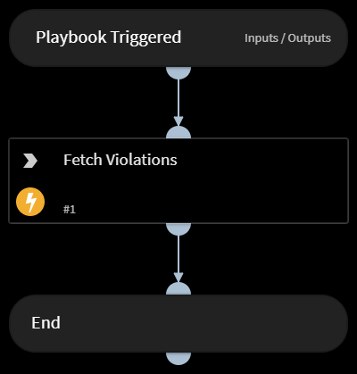

Gets a list of violation data.

## Dependencies
This playbook uses the following sub-playbooks, integrations, and scripts.

### Sub-playbooks
This playbook does not use any sub-playbooks.

### Integrations
This playbook does not use any integrations.

### Scripts
This playbook does not use any scripts.

### Commands
* securonix-list-violation-data

## Playbook Inputs
---

| **Name** | **Description** | **Default Value** | **Required** |
| --- | --- | --- | --- |
| from | Start date/time for which to retrieve activity data \(in the format MM/dd/yyyy HH:mm:ss\). |  | Optional |
| to | End date/time for which to retrieve activity data \(in the format MM/dd/yyyy HH:mm:ss\). |  | Optional |
| query | Free-text query. For example, query="resourcegroupname=WindowsSnare and policyname=Possible Privilege Escalation - Self Escalation". |  | Optional |

## Playbook Outputs
---
There are no outputs for this playbook.

## Playbook Image
---
