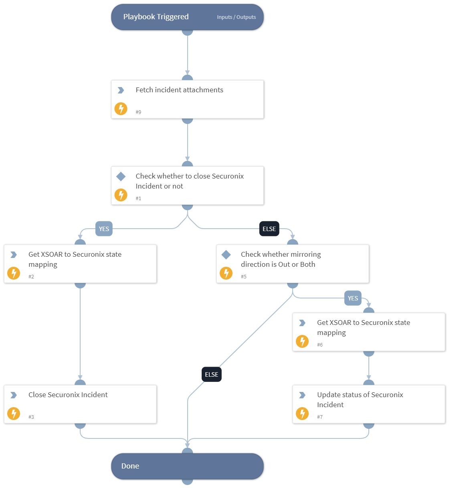

This playbook fetches the attachments for the incident. Also, it updates the state of the Securonix incident based on the configuration provided in integration configuration.

## Dependencies
This playbook uses the following sub-playbooks, integrations, and scripts.

### Sub-playbooks
This playbook does not use any sub-playbooks.

### Integrations
This playbook does not use any integrations.

### Scripts
* UpdateSecuronixIncidentStatus

### Commands
* securonix-incident-attachment-get
* securonix-xsoar-state-mapping-get

## Playbook Inputs
---
There are no inputs for this playbook.

## Playbook Outputs
---
There are no outputs for this playbook.

## Playbook Image
---
