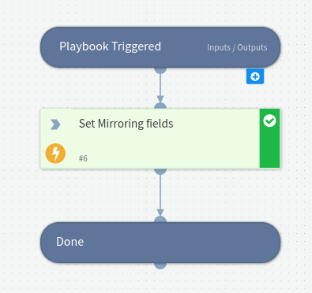

Mirror SentinelOne Ticket is designed to serve as a playbook, which enables ticket mirroring with SentinelOne.
It enables you to manage SentinelOne tickets in Cortex xSOAR while data is continuously synced between SentinelOne and Cortex xSOAR, including SentinelOne schema, fields.

To enable mirroring, use the SentinelOne Incident  - common mappers for incoming and outgoing mirroring by enabling mirroring direction.

In Addition to the playbook, we recommend that you use the included layout for SentinelOne Incident, which helps visualize SentinelOne incident information in Cortex xSOAR.
You can add the new layout as a tab to existing layouts using the Edit Layout page.

## Dependencies
This playbook uses the following sub-playbooks, integrations, and scripts.

### Sub-playbooks
This playbook does not use any sub-playbooks.

### Integrations
This playbook does not use any integrations.

### Scripts
This playbook does not use any scripts.

### Commands
* setIncident

## Playbook Inputs
---

| **Name** | **Description** | **Default Value** | **Required** |
| --- | --- | --- | --- |
| IncidentID | SentinelOne Incident ID to mirror. |  | Optional |
| MirrorInstanceName | Set the mirror instance name to enable mirroring with SentinelOne. |  | Optional |
| MirrorDirection | Set the mirror direction, should be one of the following:  1. In 2. Out 3. Both | Both | Optional |

## Playbook Outputs
---
There are no outputs for this playbook.

## Playbook Image
---
