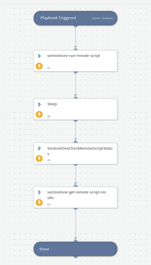

## Dependencies

This playbook uses the following sub-playbooks, integrations, and scripts.

### Sub-playbooks

This playbook does not use any sub-playbooks.

### Integrations

* SentinelOne V2

### Scripts

* Sleep
* SentinelOneCheckRemoteScriptStatus

### Commands

* sentinelone-get-remote-script-results
* sentinelone-run-remote-script

## Playbook Inputs

---
There are no inputs for this playbook.

## Playbook Outputs

---
There are no outputs for this playbook.

## Playbook Image

---

